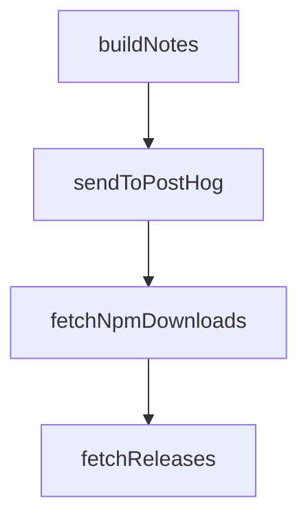

# Chapter 3: Modes, Prompts, and Approval Workflow

Welcome to **Chapter 3: Modes, Prompts, and Approval Workflow**. In this part of **Kilo Code Tutorial: Agentic Engineering from IDE and CLI Surfaces**, you will build an intuitive mental model first, then move into concrete implementation details and practical production tradeoffs.


Kilo supports different run modes and approval paths that balance autonomy with safety.

## Practical Controls

- mode selection (code/architect/debug variants)
- non-interactive auto-approval mode where appropriate
- ask routing for commands, tools, and followup decisions

## Source References

- [CLI usage in apps/cli README](https://github.com/Kilo-Org/kilocode/blob/main/apps/cli/README.md)
- [Ask dispatcher and prompt manager](https://github.com/Kilo-Org/kilocode/tree/main/apps/cli/src/agent)

## Summary

You now have a mode-selection and approval strategy for safer Kilo sessions.

Next: [Chapter 4: Authentication and Provider Routing](04-authentication-and-provider-routing.md)

## Depth Expansion Playbook

## Source Code Walkthrough

### `script/changelog.ts`

The `buildNotes` function in [`script/changelog.ts`](https://github.com/Kilo-Org/kilocode/blob/HEAD/script/changelog.ts) handles a key part of this chapter's functionality:

```ts
}

export async function buildNotes(from: string, to: string) {
  const commits = await getCommits(from, to)

  if (commits.length === 0) {
    return []
  }

  console.log("generating changelog since " + from)

  const opencode = await createKilo({ port: 0 })
  const notes: string[] = []

  try {
    const lines = await generateChangelog(commits, opencode)
    notes.push(...lines)
    console.log("---- Generated Changelog ----")
    console.log(notes.join("\n"))
    console.log("-----------------------------")
  } catch (error) {
    if (error instanceof Error && error.name === "TimeoutError") {
      console.log("Changelog generation timed out, using raw commits")
      for (const commit of commits) {
        const attribution = commit.author && !Script.team.includes(commit.author) ? ` (@${commit.author})` : ""
        notes.push(`- ${commit.message}${attribution}`)
      }
    } else {
      throw error
    }
  } finally {
    await opencode.server.close()
```

This function is important because it defines how Kilo Code Tutorial: Agentic Engineering from IDE and CLI Surfaces implements the patterns covered in this chapter.

### `script/stats.ts`

The `sendToPostHog` function in [`script/stats.ts`](https://github.com/Kilo-Org/kilocode/blob/HEAD/script/stats.ts) handles a key part of this chapter's functionality:

```ts
#!/usr/bin/env bun

async function sendToPostHog(event: string, properties: Record<string, any>) {
  const key = process.env["POSTHOG_KEY"]

  if (!key) {
    console.warn("POSTHOG_API_KEY not set, skipping PostHog event")
    return
  }

  const response = await fetch("https://us.i.posthog.com/i/v0/e/", {
    method: "POST",
    headers: {
      "Content-Type": "application/json",
    },
    body: JSON.stringify({
      distinct_id: "download",
      api_key: key,
      event,
      properties: {
        ...properties,
      },
    }),
  }).catch(() => null)

  if (response && !response.ok) {
    console.warn(`PostHog API error: ${response.status}`)
  }
}

interface Asset {
  name: string
```

This function is important because it defines how Kilo Code Tutorial: Agentic Engineering from IDE and CLI Surfaces implements the patterns covered in this chapter.

### `script/stats.ts`

The `fetchNpmDownloads` function in [`script/stats.ts`](https://github.com/Kilo-Org/kilocode/blob/HEAD/script/stats.ts) handles a key part of this chapter's functionality:

```ts
}

async function fetchNpmDownloads(packageName: string): Promise<number> {
  try {
    // Use a range from 2020 to current year + 5 years to ensure it works forever
    const currentYear = new Date().getFullYear()
    const endYear = currentYear + 5
    const response = await fetch(`https://api.npmjs.org/downloads/range/2020-01-01:${endYear}-12-31/${packageName}`)
    if (!response.ok) {
      console.warn(`Failed to fetch npm downloads for ${packageName}: ${response.status}`)
      return 0
    }
    const data: NpmDownloadsRange = await response.json()
    return data.downloads.reduce((total, day) => total + day.downloads, 0)
  } catch (error) {
    console.warn(`Error fetching npm downloads for ${packageName}:`, error)
    return 0
  }
}

async function fetchReleases(): Promise<Release[]> {
  const releases: Release[] = []
  let page = 1
  const per = 100

  while (true) {
    const url = `https://api.github.com/repos/Kilo-Org/kilocode/releases?page=${page}&per_page=${per}`

    const response = await fetch(url)
    if (!response.ok) {
      throw new Error(`GitHub API error: ${response.status} ${response.statusText}`)
    }
```

This function is important because it defines how Kilo Code Tutorial: Agentic Engineering from IDE and CLI Surfaces implements the patterns covered in this chapter.

### `script/stats.ts`

The `fetchReleases` function in [`script/stats.ts`](https://github.com/Kilo-Org/kilocode/blob/HEAD/script/stats.ts) handles a key part of this chapter's functionality:

```ts
}

async function fetchReleases(): Promise<Release[]> {
  const releases: Release[] = []
  let page = 1
  const per = 100

  while (true) {
    const url = `https://api.github.com/repos/Kilo-Org/kilocode/releases?page=${page}&per_page=${per}`

    const response = await fetch(url)
    if (!response.ok) {
      throw new Error(`GitHub API error: ${response.status} ${response.statusText}`)
    }

    const batch: Release[] = await response.json()
    if (batch.length === 0) break

    releases.push(...batch)
    console.log(`Fetched page ${page} with ${batch.length} releases`)

    if (batch.length < per) break
    page++
    await new Promise((resolve) => setTimeout(resolve, 1000))
  }

  return releases
}

function calculate(releases: Release[]) {
  let total = 0
  const stats = []
```

This function is important because it defines how Kilo Code Tutorial: Agentic Engineering from IDE and CLI Surfaces implements the patterns covered in this chapter.


## How These Components Connect


