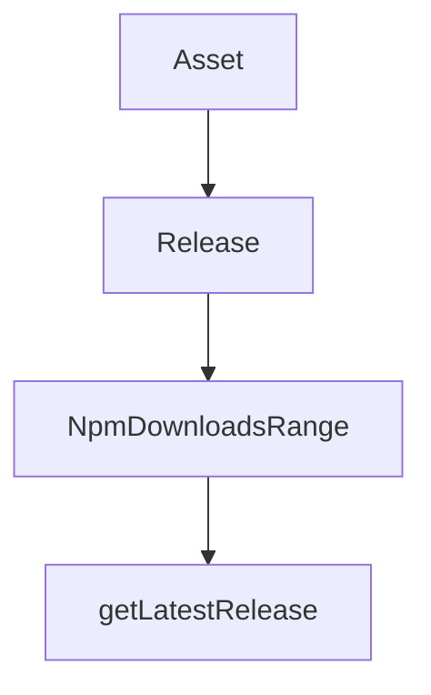

# Chapter 4: Authentication and Provider Routing

Welcome to **Chapter 4: Authentication and Provider Routing**. In this part of **Kilo Code Tutorial: Agentic Engineering from IDE and CLI Surfaces**, you will build an intuitive mental model first, then move into concrete implementation details and practical production tradeoffs.


Authentication and provider selection govern model access, usage limits, and runtime behavior.

## Key Flows

- browser-based login callback flow
- token persistence for future sessions
- provider/api-key routing through settings and environment

## Source References

- [Auth login command implementation](https://github.com/Kilo-Org/kilocode/blob/main/apps/cli/src/commands/auth/login.ts)
- [CLI run command provider setup](https://github.com/Kilo-Org/kilocode/blob/main/apps/cli/src/commands/cli/run.ts)

## Summary

You now understand how Kilo handles auth and provider initialization end-to-end.

Next: [Chapter 5: Session, History, and Context Persistence](05-session-history-and-context-persistence.md)

## Source Code Walkthrough

### `script/stats.ts`

The `Asset` interface in [`script/stats.ts`](https://github.com/Kilo-Org/kilocode/blob/HEAD/script/stats.ts) handles a key part of this chapter's functionality:

```ts
}

interface Asset {
  name: string
  download_count: number
}

interface Release {
  tag_name: string
  name: string
  assets: Asset[]
}

interface NpmDownloadsRange {
  start: string
  end: string
  package: string
  downloads: Array<{
    downloads: number
    day: string
  }>
}

async function fetchNpmDownloads(packageName: string): Promise<number> {
  try {
    // Use a range from 2020 to current year + 5 years to ensure it works forever
    const currentYear = new Date().getFullYear()
    const endYear = currentYear + 5
    const response = await fetch(`https://api.npmjs.org/downloads/range/2020-01-01:${endYear}-12-31/${packageName}`)
    if (!response.ok) {
      console.warn(`Failed to fetch npm downloads for ${packageName}: ${response.status}`)
      return 0
```

This interface is important because it defines how Kilo Code Tutorial: Agentic Engineering from IDE and CLI Surfaces implements the patterns covered in this chapter.

### `script/stats.ts`

The `Release` interface in [`script/stats.ts`](https://github.com/Kilo-Org/kilocode/blob/HEAD/script/stats.ts) handles a key part of this chapter's functionality:

```ts
}

interface Release {
  tag_name: string
  name: string
  assets: Asset[]
}

interface NpmDownloadsRange {
  start: string
  end: string
  package: string
  downloads: Array<{
    downloads: number
    day: string
  }>
}

async function fetchNpmDownloads(packageName: string): Promise<number> {
  try {
    // Use a range from 2020 to current year + 5 years to ensure it works forever
    const currentYear = new Date().getFullYear()
    const endYear = currentYear + 5
    const response = await fetch(`https://api.npmjs.org/downloads/range/2020-01-01:${endYear}-12-31/${packageName}`)
    if (!response.ok) {
      console.warn(`Failed to fetch npm downloads for ${packageName}: ${response.status}`)
      return 0
    }
    const data: NpmDownloadsRange = await response.json()
    return data.downloads.reduce((total, day) => total + day.downloads, 0)
  } catch (error) {
    console.warn(`Error fetching npm downloads for ${packageName}:`, error)
```

This interface is important because it defines how Kilo Code Tutorial: Agentic Engineering from IDE and CLI Surfaces implements the patterns covered in this chapter.

### `script/stats.ts`

The `NpmDownloadsRange` interface in [`script/stats.ts`](https://github.com/Kilo-Org/kilocode/blob/HEAD/script/stats.ts) handles a key part of this chapter's functionality:

```ts
}

interface NpmDownloadsRange {
  start: string
  end: string
  package: string
  downloads: Array<{
    downloads: number
    day: string
  }>
}

async function fetchNpmDownloads(packageName: string): Promise<number> {
  try {
    // Use a range from 2020 to current year + 5 years to ensure it works forever
    const currentYear = new Date().getFullYear()
    const endYear = currentYear + 5
    const response = await fetch(`https://api.npmjs.org/downloads/range/2020-01-01:${endYear}-12-31/${packageName}`)
    if (!response.ok) {
      console.warn(`Failed to fetch npm downloads for ${packageName}: ${response.status}`)
      return 0
    }
    const data: NpmDownloadsRange = await response.json()
    return data.downloads.reduce((total, day) => total + day.downloads, 0)
  } catch (error) {
    console.warn(`Error fetching npm downloads for ${packageName}:`, error)
    return 0
  }
}

async function fetchReleases(): Promise<Release[]> {
  const releases: Release[] = []
```

This interface is important because it defines how Kilo Code Tutorial: Agentic Engineering from IDE and CLI Surfaces implements the patterns covered in this chapter.

### `script/changelog.ts`

The `getLatestRelease` function in [`script/changelog.ts`](https://github.com/Kilo-Org/kilocode/blob/HEAD/script/changelog.ts) handles a key part of this chapter's functionality:

```ts
}

export async function getLatestRelease(skip?: string) {
  const data = await fetch("https://api.github.com/repos/Kilo-Org/kilocode/releases?per_page=100").then((res) => {
    if (!res.ok) throw new Error(res.statusText)
    return res.json()
  })

  const releases = data as Release[]
  const target = skip?.replace(/^v/, "")

  for (const release of releases) {
    if (release.draft) continue
    const tag = release.tag_name.replace(/^v/, "")
    if (target && tag === target) continue
    return tag
  }

  throw new Error("No releases found")
}

type Commit = {
  hash: string
  author: string | null
  message: string
  areas: Set<string>
}

export async function getCommits(from: string, to: string): Promise<Commit[]> {
  const fromRef = from.startsWith("v") ? from : `v${from}`
  const toRef = to === "HEAD" ? to : to.startsWith("v") ? to : `v${to}`

```

This function is important because it defines how Kilo Code Tutorial: Agentic Engineering from IDE and CLI Surfaces implements the patterns covered in this chapter.


## How These Components Connect


