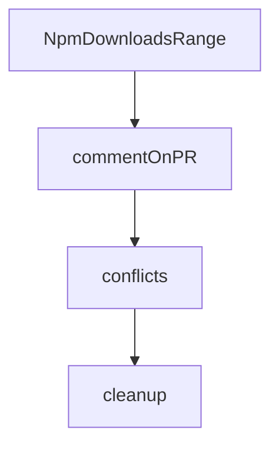

# Chapter 5: Session, History, and Context Persistence

Welcome to **Chapter 5: Session, History, and Context Persistence**. In this part of **Kilo Code Tutorial: Agentic Engineering from IDE and CLI Surfaces**, you will build an intuitive mental model first, then move into concrete implementation details and practical production tradeoffs.


Kilo persists CLI state such as history and settings to maintain continuity across runs.

## Persistence Artifacts

| Artifact | Purpose |
|:---------|:--------|
| settings | onboarding/provider mode preferences |
| history | prompt/input recall across sessions |
| credentials | authentication tokens/session identity |

## Source References

- [Storage settings module](https://github.com/Kilo-Org/kilocode/blob/main/apps/cli/src/lib/storage/settings.ts)
- [History persistence module](https://github.com/Kilo-Org/kilocode/blob/main/apps/cli/src/lib/storage/history.ts)

## Summary

You now have a clear model for how Kilo preserves user context over time.

Next: [Chapter 6: Extensions, MCP, and Custom Modes](06-extensions-mcp-and-custom-modes.md)

## Depth Expansion Playbook

## Source Code Walkthrough

### `script/stats.ts`

The `NpmDownloadsRange` interface in [`script/stats.ts`](https://github.com/Kilo-Org/kilocode/blob/HEAD/script/stats.ts) handles a key part of this chapter's functionality:

```ts
}

interface NpmDownloadsRange {
  start: string
  end: string
  package: string
  downloads: Array<{
    downloads: number
    day: string
  }>
}

async function fetchNpmDownloads(packageName: string): Promise<number> {
  try {
    // Use a range from 2020 to current year + 5 years to ensure it works forever
    const currentYear = new Date().getFullYear()
    const endYear = currentYear + 5
    const response = await fetch(`https://api.npmjs.org/downloads/range/2020-01-01:${endYear}-12-31/${packageName}`)
    if (!response.ok) {
      console.warn(`Failed to fetch npm downloads for ${packageName}: ${response.status}`)
      return 0
    }
    const data: NpmDownloadsRange = await response.json()
    return data.downloads.reduce((total, day) => total + day.downloads, 0)
  } catch (error) {
    console.warn(`Error fetching npm downloads for ${packageName}:`, error)
    return 0
  }
}

async function fetchReleases(): Promise<Release[]> {
  const releases: Release[] = []
```

This interface is important because it defines how Kilo Code Tutorial: Agentic Engineering from IDE and CLI Surfaces implements the patterns covered in this chapter.

### `script/beta.ts`

The `commentOnPR` function in [`script/beta.ts`](https://github.com/Kilo-Org/kilocode/blob/HEAD/script/beta.ts) handles a key part of this chapter's functionality:

```ts
}

async function commentOnPR(prNumber: number, reason: string) {
  const body = `⚠️ **Blocking Beta Release**

This PR cannot be merged into the beta branch due to: **${reason}**

Please resolve this issue to include this PR in the next beta release.`

  try {
    await $`gh pr comment ${prNumber} --body ${body}`
    console.log(`  Posted comment on PR #${prNumber}`)
  } catch (err) {
    console.log(`  Failed to post comment on PR #${prNumber}: ${err}`)
  }
}

async function conflicts() {
  const out = await $`git diff --name-only --diff-filter=U`.text().catch(() => "")
  return out
    .split("\n")
    .map((x) => x.trim())
    .filter(Boolean)
}

async function cleanup() {
  try {
    await $`git merge --abort`
  } catch {}
  try {
    await $`git checkout -- .`
  } catch {}
```

This function is important because it defines how Kilo Code Tutorial: Agentic Engineering from IDE and CLI Surfaces implements the patterns covered in this chapter.

### `script/beta.ts`

The `conflicts` function in [`script/beta.ts`](https://github.com/Kilo-Org/kilocode/blob/HEAD/script/beta.ts) handles a key part of this chapter's functionality:

```ts
}

async function conflicts() {
  const out = await $`git diff --name-only --diff-filter=U`.text().catch(() => "")
  return out
    .split("\n")
    .map((x) => x.trim())
    .filter(Boolean)
}

async function cleanup() {
  try {
    await $`git merge --abort`
  } catch {}
  try {
    await $`git checkout -- .`
  } catch {}
  try {
    await $`git clean -fd`
  } catch {}
}

async function fix(pr: PR, files: string[]) {
  console.log(`  Trying to auto-resolve ${files.length} conflict(s) with opencode...`)
  const prompt = [
    `Resolve the current git merge conflicts while merging PR #${pr.number} into the beta branch.`,
    `Only touch these files: ${files.join(", ")}.`,
    "Keep the merge in progress, do not abort the merge, and do not create a commit.",
    "When done, leave the working tree with no unmerged files.",
  ].join("\n")

  try {
```

This function is important because it defines how Kilo Code Tutorial: Agentic Engineering from IDE and CLI Surfaces implements the patterns covered in this chapter.

### `script/beta.ts`

The `cleanup` function in [`script/beta.ts`](https://github.com/Kilo-Org/kilocode/blob/HEAD/script/beta.ts) handles a key part of this chapter's functionality:

```ts
}

async function cleanup() {
  try {
    await $`git merge --abort`
  } catch {}
  try {
    await $`git checkout -- .`
  } catch {}
  try {
    await $`git clean -fd`
  } catch {}
}

async function fix(pr: PR, files: string[]) {
  console.log(`  Trying to auto-resolve ${files.length} conflict(s) with opencode...`)
  const prompt = [
    `Resolve the current git merge conflicts while merging PR #${pr.number} into the beta branch.`,
    `Only touch these files: ${files.join(", ")}.`,
    "Keep the merge in progress, do not abort the merge, and do not create a commit.",
    "When done, leave the working tree with no unmerged files.",
  ].join("\n")

  try {
    await $`opencode run -m opencode/gpt-5.3-codex ${prompt}`
  } catch (err) {
    console.log(`  opencode failed: ${err}`)
    return false
  }

  const left = await conflicts()
  if (left.length > 0) {
```

This function is important because it defines how Kilo Code Tutorial: Agentic Engineering from IDE and CLI Surfaces implements the patterns covered in this chapter.


## How These Components Connect


