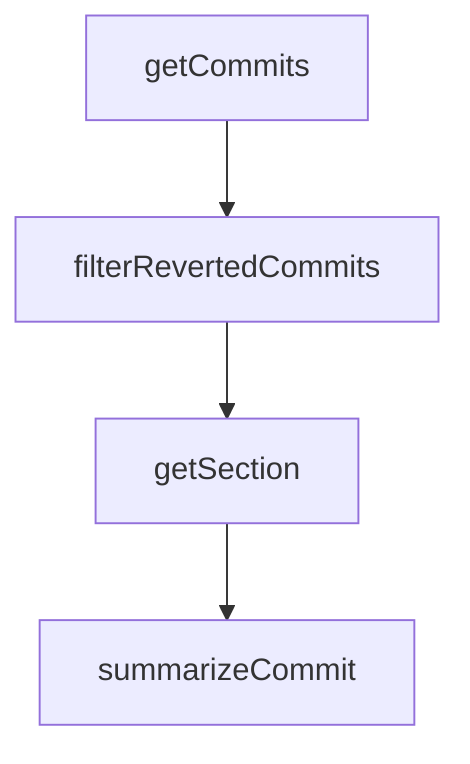

# Chapter 5: Session, History, and Context Persistence

Welcome to **Chapter 5: Session, History, and Context Persistence**. In this part of **Kilo Code Tutorial: Agentic Engineering from IDE and CLI Surfaces**, you will build an intuitive mental model first, then move into concrete implementation details and practical production tradeoffs.


Kilo persists CLI state such as history and settings to maintain continuity across runs.

## Persistence Artifacts

| Artifact | Purpose |
|:---------|:--------|
| settings | onboarding/provider mode preferences |
| history | prompt/input recall across sessions |
| credentials | authentication tokens/session identity |

## Source References

- [Storage settings module](https://github.com/Kilo-Org/kilocode/blob/main/apps/cli/src/lib/storage/settings.ts)
- [History persistence module](https://github.com/Kilo-Org/kilocode/blob/main/apps/cli/src/lib/storage/history.ts)

## Summary

You now have a clear model for how Kilo preserves user context over time.

Next: [Chapter 6: Extensions, MCP, and Custom Modes](06-extensions-mcp-and-custom-modes.md)

## Source Code Walkthrough

### `script/changelog.ts`

The `getCommits` function in [`script/changelog.ts`](https://github.com/Kilo-Org/kilocode/blob/HEAD/script/changelog.ts) handles a key part of this chapter's functionality:

```ts
}

export async function getCommits(from: string, to: string): Promise<Commit[]> {
  const fromRef = from.startsWith("v") ? from : `v${from}`
  const toRef = to === "HEAD" ? to : to.startsWith("v") ? to : `v${to}`

  // Get commit data with GitHub usernames from the API
  const compare =
    await $`gh api "/repos/Kilo-Org/kilocode/compare/${fromRef}...${toRef}" --jq '.commits[] | {sha: .sha, login: .author.login, message: .commit.message}'`.text()

  const commitData = new Map<string, { login: string | null; message: string }>()
  for (const line of compare.split("\n").filter(Boolean)) {
    const data = JSON.parse(line) as { sha: string; login: string | null; message: string }
    commitData.set(data.sha, { login: data.login, message: data.message.split("\n")[0] ?? "" })
  }

  // Get commits that touch the relevant packages
  const log =
    await $`git log ${fromRef}..${toRef} --oneline --format="%H" -- packages/opencode packages/sdk packages/plugin packages/desktop packages/app sdks/vscode packages/extensions github`.text()
  const hashes = log.split("\n").filter(Boolean)

  const commits: Commit[] = []
  for (const hash of hashes) {
    const data = commitData.get(hash)
    if (!data) continue

    const message = data.message
    if (message.match(/^(ignore:|test:|chore:|ci:|release:)/i)) continue

    const files = await $`git diff-tree --no-commit-id --name-only -r ${hash}`.text()
    const areas = new Set<string>()

```

This function is important because it defines how Kilo Code Tutorial: Agentic Engineering from IDE and CLI Surfaces implements the patterns covered in this chapter.

### `script/changelog.ts`

The `filterRevertedCommits` function in [`script/changelog.ts`](https://github.com/Kilo-Org/kilocode/blob/HEAD/script/changelog.ts) handles a key part of this chapter's functionality:

```ts
  }

  return filterRevertedCommits(commits)
}

function filterRevertedCommits(commits: Commit[]): Commit[] {
  const revertPattern = /^Revert "(.+)"$/
  const seen = new Map<string, Commit>()

  for (const commit of commits) {
    const match = commit.message.match(revertPattern)
    if (match) {
      // It's a revert - remove the original if we've seen it
      const original = match[1]!
      if (seen.has(original)) seen.delete(original)
      else seen.set(commit.message, commit) // Keep revert if original not in range
    } else {
      // Regular commit - remove if its revert exists, otherwise add
      const revertMsg = `Revert "${commit.message}"`
      if (seen.has(revertMsg)) seen.delete(revertMsg)
      else seen.set(commit.message, commit)
    }
  }

  return [...seen.values()]
}

const sections = {
  core: "Core",
  tui: "TUI",
  app: "Desktop",
  tauri: "Desktop",
```

This function is important because it defines how Kilo Code Tutorial: Agentic Engineering from IDE and CLI Surfaces implements the patterns covered in this chapter.

### `script/changelog.ts`

The `getSection` function in [`script/changelog.ts`](https://github.com/Kilo-Org/kilocode/blob/HEAD/script/changelog.ts) handles a key part of this chapter's functionality:

```ts
} as const

function getSection(areas: Set<string>): string {
  // Priority order for multi-area commits
  const priority = ["core", "tui", "app", "tauri", "sdk", "plugin", "extensions/zed", "extensions/vscode", "github"]
  for (const area of priority) {
    if (areas.has(area)) return sections[area as keyof typeof sections]
  }
  return "Core"
}

async function summarizeCommit(opencode: Awaited<ReturnType<typeof createKilo>>, message: string): Promise<string> {
  console.log("summarizing commit:", message)
  const session = await opencode.client.session.create()
  const result = await opencode.client.session
    .prompt(
      {
        sessionID: session.data!.id,
        model: { providerID: "kilo", modelID: "anthropic/claude-sonnet-4.5" }, // kilocode_change
        tools: {
          "*": false,
        },
        parts: [
          {
            type: "text",
            text: `Summarize this commit message for a changelog entry. Return ONLY a single line summary starting with a capital letter. Be concise but specific. If the commit message is already well-written, just clean it up (capitalize, fix typos, proper grammar). Do not include any prefixes like "fix:" or "feat:".

Commit: ${message}`,
          },
        ],
      },
      {
```

This function is important because it defines how Kilo Code Tutorial: Agentic Engineering from IDE and CLI Surfaces implements the patterns covered in this chapter.

### `script/changelog.ts`

The `summarizeCommit` function in [`script/changelog.ts`](https://github.com/Kilo-Org/kilocode/blob/HEAD/script/changelog.ts) handles a key part of this chapter's functionality:

```ts
}

async function summarizeCommit(opencode: Awaited<ReturnType<typeof createKilo>>, message: string): Promise<string> {
  console.log("summarizing commit:", message)
  const session = await opencode.client.session.create()
  const result = await opencode.client.session
    .prompt(
      {
        sessionID: session.data!.id,
        model: { providerID: "kilo", modelID: "anthropic/claude-sonnet-4.5" }, // kilocode_change
        tools: {
          "*": false,
        },
        parts: [
          {
            type: "text",
            text: `Summarize this commit message for a changelog entry. Return ONLY a single line summary starting with a capital letter. Be concise but specific. If the commit message is already well-written, just clean it up (capitalize, fix typos, proper grammar). Do not include any prefixes like "fix:" or "feat:".

Commit: ${message}`,
          },
        ],
      },
      {
        signal: AbortSignal.timeout(120_000),
      },
    )
    .then((x) => x.data?.parts?.find((y) => y.type === "text")?.text ?? message)
  return result.trim()
}

export async function generateChangelog(commits: Commit[], opencode: Awaited<ReturnType<typeof createKilo>>) {
  // Summarize commits in parallel with max 10 concurrent requests
```

This function is important because it defines how Kilo Code Tutorial: Agentic Engineering from IDE and CLI Surfaces implements the patterns covered in this chapter.


## How These Components Connect


