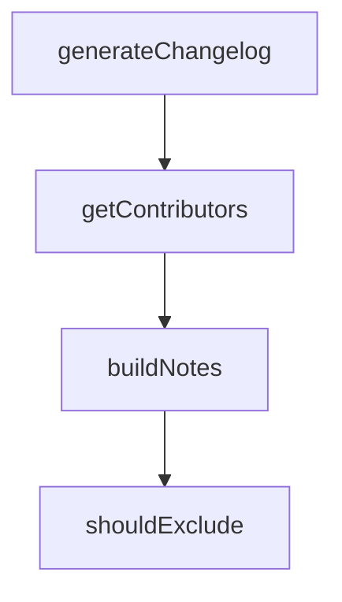

# Chapter 6: Extensions, MCP, and Custom Modes

Welcome to **Chapter 6: Extensions, MCP, and Custom Modes**. In this part of **Kilo Code Tutorial: Agentic Engineering from IDE and CLI Surfaces**, you will build an intuitive mental model first, then move into concrete implementation details and practical production tradeoffs.


Kilo exposes extension points for custom modes, MCP integrations, and workflow specialization.

## Extension Areas

- MCP server usage and marketplaces
- custom mode definitions and command surfaces
- external integrations via extension APIs

## Source References

- [Kilo README feature set](https://github.com/Kilo-Org/kilocode/blob/main/README.md)
- [CLI source tree for commands and agent integrations](https://github.com/Kilo-Org/kilocode/tree/main/apps/cli/src)

## Summary

You now understand where Kilo can be extended for project-specific or team-specific workflows.

Next: [Chapter 7: CLI/TUI Architecture for Contributors](07-cli-tui-architecture-for-contributors.md)

## Source Code Walkthrough

### `script/changelog.ts`

The `generateChangelog` function in [`script/changelog.ts`](https://github.com/Kilo-Org/kilocode/blob/HEAD/script/changelog.ts) handles a key part of this chapter's functionality:

```ts
}

export async function generateChangelog(commits: Commit[], opencode: Awaited<ReturnType<typeof createKilo>>) {
  // Summarize commits in parallel with max 10 concurrent requests
  const BATCH_SIZE = 10
  const summaries: string[] = []
  for (let i = 0; i < commits.length; i += BATCH_SIZE) {
    const batch = commits.slice(i, i + BATCH_SIZE)
    const results = await Promise.all(batch.map((c) => summarizeCommit(opencode, c.message)))
    summaries.push(...results)
  }

  const grouped = new Map<string, string[]>()
  for (let i = 0; i < commits.length; i++) {
    const commit = commits[i]!
    const section = getSection(commit.areas)
    const attribution = commit.author && !Script.team.includes(commit.author) ? ` (@${commit.author})` : ""
    const entry = `- ${summaries[i]}${attribution}`

    if (!grouped.has(section)) grouped.set(section, [])
    grouped.get(section)!.push(entry)
  }

  const sectionOrder = ["Core", "TUI", "Desktop", "SDK", "Extensions"]
  const lines: string[] = []
  for (const section of sectionOrder) {
    const entries = grouped.get(section)
    if (!entries || entries.length === 0) continue
    lines.push(`## ${section}`)
    lines.push(...entries)
  }

```

This function is important because it defines how Kilo Code Tutorial: Agentic Engineering from IDE and CLI Surfaces implements the patterns covered in this chapter.

### `script/changelog.ts`

The `getContributors` function in [`script/changelog.ts`](https://github.com/Kilo-Org/kilocode/blob/HEAD/script/changelog.ts) handles a key part of this chapter's functionality:

```ts
}

export async function getContributors(from: string, to: string) {
  const fromRef = from.startsWith("v") ? from : `v${from}`
  const toRef = to === "HEAD" ? to : to.startsWith("v") ? to : `v${to}`
  const compare =
    await $`gh api "/repos/Kilo-Org/kilocode/compare/${fromRef}...${toRef}" --jq '.commits[] | {login: .author.login, message: .commit.message}'`.text()
  const contributors = new Map<string, Set<string>>()

  for (const line of compare.split("\n").filter(Boolean)) {
    const { login, message } = JSON.parse(line) as { login: string | null; message: string }
    const title = message.split("\n")[0] ?? ""
    if (title.match(/^(ignore:|test:|chore:|ci:|release:)/i)) continue

    if (login && !Script.team.includes(login)) {
      if (!contributors.has(login)) contributors.set(login, new Set())
      contributors.get(login)!.add(title)
    }
  }

  return contributors
}

export async function buildNotes(from: string, to: string) {
  const commits = await getCommits(from, to)

  if (commits.length === 0) {
    return []
  }

  console.log("generating changelog since " + from)

```

This function is important because it defines how Kilo Code Tutorial: Agentic Engineering from IDE and CLI Surfaces implements the patterns covered in this chapter.

### `script/changelog.ts`

The `buildNotes` function in [`script/changelog.ts`](https://github.com/Kilo-Org/kilocode/blob/HEAD/script/changelog.ts) handles a key part of this chapter's functionality:

```ts
}

export async function buildNotes(from: string, to: string) {
  const commits = await getCommits(from, to)

  if (commits.length === 0) {
    return []
  }

  console.log("generating changelog since " + from)

  const opencode = await createKilo({ port: 0 })
  const notes: string[] = []

  try {
    const lines = await generateChangelog(commits, opencode)
    notes.push(...lines)
    console.log("---- Generated Changelog ----")
    console.log(notes.join("\n"))
    console.log("-----------------------------")
  } catch (error) {
    if (error instanceof Error && error.name === "TimeoutError") {
      console.log("Changelog generation timed out, using raw commits")
      for (const commit of commits) {
        const attribution = commit.author && !Script.team.includes(commit.author) ? ` (@${commit.author})` : ""
        notes.push(`- ${commit.message}${attribution}`)
      }
    } else {
      throw error
    }
  } finally {
    await opencode.server.close()
```

This function is important because it defines how Kilo Code Tutorial: Agentic Engineering from IDE and CLI Surfaces implements the patterns covered in this chapter.

### `script/extract-source-links.ts`

The `shouldExclude` function in [`script/extract-source-links.ts`](https://github.com/Kilo-Org/kilocode/blob/HEAD/script/extract-source-links.ts) handles a key part of this chapter's functionality:

```ts
const SKIP_FILES = ["models-snapshot.ts"]

function shouldExclude(url: string): boolean {
  return EXCLUDE_PATTERNS.some((re) => re.test(url))
}

function shouldSkipFile(filepath: string): boolean {
  const rel = path.relative(ROOT, filepath)
  const parts = rel.split(path.sep)
  if (parts.some((p) => SKIP_DIRS.includes(p))) return true
  if (SKIP_PATH_SEGMENTS.some((seg) => rel.includes(seg))) return true
  if (/\.test\.[jt]sx?$/.test(filepath)) return true
  if (/\.spec\.[jt]sx?$/.test(filepath)) return true
  if (/\.stories\.[jt]sx?$/.test(filepath)) return true
  if (/\/i18n\//.test(filepath) && !filepath.endsWith("en.ts")) return true
  const basename = path.basename(filepath)
  if (SKIP_FILES.includes(basename)) return true
  return false
}

function clean(url: string): string {
  return url.replace(/[.),:;]+$/, "").replace(/<\/?\w+>$/, "")
}

async function extract(): Promise<Map<string, Set<string>>> {
  const links = new Map<string, Set<string>>()

  for (const dir of DIRS) {
    for (const ext of EXTENSIONS) {
      const glob = new Glob(`**/*.${ext}`)
      for await (const entry of glob.scan({ cwd: dir, absolute: true })) {
        if (shouldSkipFile(entry)) continue
```

This function is important because it defines how Kilo Code Tutorial: Agentic Engineering from IDE and CLI Surfaces implements the patterns covered in this chapter.


## How These Components Connect


