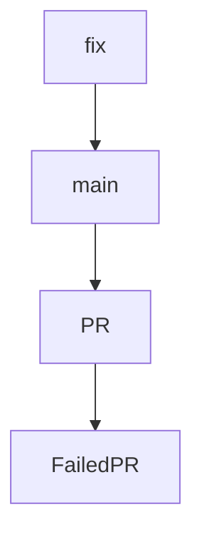

# Chapter 6: Extensions, MCP, and Custom Modes

Welcome to **Chapter 6: Extensions, MCP, and Custom Modes**. In this part of **Kilo Code Tutorial: Agentic Engineering from IDE and CLI Surfaces**, you will build an intuitive mental model first, then move into concrete implementation details and practical production tradeoffs.


Kilo exposes extension points for custom modes, MCP integrations, and workflow specialization.

## Extension Areas

- MCP server usage and marketplaces
- custom mode definitions and command surfaces
- external integrations via extension APIs

## Source References

- [Kilo README feature set](https://github.com/Kilo-Org/kilocode/blob/main/README.md)
- [CLI source tree for commands and agent integrations](https://github.com/Kilo-Org/kilocode/tree/main/apps/cli/src)

## Summary

You now understand where Kilo can be extended for project-specific or team-specific workflows.

Next: [Chapter 7: CLI/TUI Architecture for Contributors](07-cli-tui-architecture-for-contributors.md)

## Depth Expansion Playbook

## Source Code Walkthrough

### `script/beta.ts`

The `fix` function in [`script/beta.ts`](https://github.com/Kilo-Org/kilocode/blob/HEAD/script/beta.ts) handles a key part of this chapter's functionality:

```ts
}

async function fix(pr: PR, files: string[]) {
  console.log(`  Trying to auto-resolve ${files.length} conflict(s) with opencode...`)
  const prompt = [
    `Resolve the current git merge conflicts while merging PR #${pr.number} into the beta branch.`,
    `Only touch these files: ${files.join(", ")}.`,
    "Keep the merge in progress, do not abort the merge, and do not create a commit.",
    "When done, leave the working tree with no unmerged files.",
  ].join("\n")

  try {
    await $`opencode run -m opencode/gpt-5.3-codex ${prompt}`
  } catch (err) {
    console.log(`  opencode failed: ${err}`)
    return false
  }

  const left = await conflicts()
  if (left.length > 0) {
    console.log(`  Conflicts remain: ${left.join(", ")}`)
    return false
  }

  console.log("  Conflicts resolved with opencode")
  return true
}

async function main() {
  console.log("Fetching open PRs with beta label...")

  const stdout = await $`gh pr list --state open --label beta --json number,title,author,labels --limit 100`.text()
```

This function is important because it defines how Kilo Code Tutorial: Agentic Engineering from IDE and CLI Surfaces implements the patterns covered in this chapter.

### `script/beta.ts`

The `main` function in [`script/beta.ts`](https://github.com/Kilo-Org/kilocode/blob/HEAD/script/beta.ts) handles a key part of this chapter's functionality:

```ts
  const left = await conflicts()
  if (left.length > 0) {
    console.log(`  Conflicts remain: ${left.join(", ")}`)
    return false
  }

  console.log("  Conflicts resolved with opencode")
  return true
}

async function main() {
  console.log("Fetching open PRs with beta label...")

  const stdout = await $`gh pr list --state open --label beta --json number,title,author,labels --limit 100`.text()
  const prs: PR[] = JSON.parse(stdout).sort((a: PR, b: PR) => a.number - b.number)

  console.log(`Found ${prs.length} open PRs with beta label`)

  if (prs.length === 0) {
    console.log("No team PRs to merge")
    return
  }

  console.log("Fetching latest main branch...")
  await $`git fetch origin main`

  console.log("Checking out main branch...")
  await $`git checkout -B beta origin/main`

  const applied: number[] = []
  const failed: FailedPR[] = []

```

This function is important because it defines how Kilo Code Tutorial: Agentic Engineering from IDE and CLI Surfaces implements the patterns covered in this chapter.

### `script/beta.ts`

The `PR` interface in [`script/beta.ts`](https://github.com/Kilo-Org/kilocode/blob/HEAD/script/beta.ts) handles a key part of this chapter's functionality:

```ts
import { $ } from "bun"

interface PR {
  number: number
  title: string
  author: { login: string }
  labels: Array<{ name: string }>
}

interface FailedPR {
  number: number
  title: string
  reason: string
}

async function commentOnPR(prNumber: number, reason: string) {
  const body = `⚠️ **Blocking Beta Release**

This PR cannot be merged into the beta branch due to: **${reason}**

Please resolve this issue to include this PR in the next beta release.`

  try {
    await $`gh pr comment ${prNumber} --body ${body}`
    console.log(`  Posted comment on PR #${prNumber}`)
  } catch (err) {
    console.log(`  Failed to post comment on PR #${prNumber}: ${err}`)
  }
}

async function conflicts() {
  const out = await $`git diff --name-only --diff-filter=U`.text().catch(() => "")
```

This interface is important because it defines how Kilo Code Tutorial: Agentic Engineering from IDE and CLI Surfaces implements the patterns covered in this chapter.

### `script/beta.ts`

The `FailedPR` interface in [`script/beta.ts`](https://github.com/Kilo-Org/kilocode/blob/HEAD/script/beta.ts) handles a key part of this chapter's functionality:

```ts
}

interface FailedPR {
  number: number
  title: string
  reason: string
}

async function commentOnPR(prNumber: number, reason: string) {
  const body = `⚠️ **Blocking Beta Release**

This PR cannot be merged into the beta branch due to: **${reason}**

Please resolve this issue to include this PR in the next beta release.`

  try {
    await $`gh pr comment ${prNumber} --body ${body}`
    console.log(`  Posted comment on PR #${prNumber}`)
  } catch (err) {
    console.log(`  Failed to post comment on PR #${prNumber}: ${err}`)
  }
}

async function conflicts() {
  const out = await $`git diff --name-only --diff-filter=U`.text().catch(() => "")
  return out
    .split("\n")
    .map((x) => x.trim())
    .filter(Boolean)
}

async function cleanup() {
```

This interface is important because it defines how Kilo Code Tutorial: Agentic Engineering from IDE and CLI Surfaces implements the patterns covered in this chapter.


## How These Components Connect


