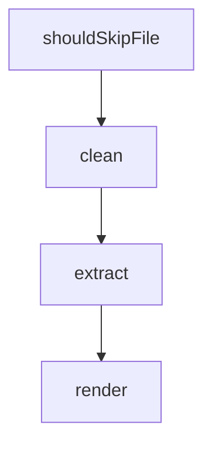

# Chapter 7: CLI/TUI Architecture for Contributors

Welcome to **Chapter 7: CLI/TUI Architecture for Contributors**. In this part of **Kilo Code Tutorial: Agentic Engineering from IDE and CLI Surfaces**, you will build an intuitive mental model first, then move into concrete implementation details and practical production tradeoffs.


Kilo's CLI stack separates extension-host runtime, state client, ask dispatch, and UI rendering concerns.

## Architecture Blocks

| Component | Responsibility |
|:----------|:---------------|
| extension host | load/activate extension runtime |
| extension client | single source of truth for agent state |
| ask dispatcher | route interactive asks and approvals |
| output/prompt managers | terminal output and input orchestration |

## Source References

- [Extension host implementation](https://github.com/Kilo-Org/kilocode/blob/main/apps/cli/src/agent/extension-host.ts)
- [Agent module tree](https://github.com/Kilo-Org/kilocode/tree/main/apps/cli/src/agent)

## Summary

You now have a contributor-level map for Kilo CLI internals.

Next: [Chapter 8: Production Operations and Governance](08-production-operations-and-governance.md)

## Source Code Walkthrough

### `script/extract-source-links.ts`

The `shouldSkipFile` function in [`script/extract-source-links.ts`](https://github.com/Kilo-Org/kilocode/blob/HEAD/script/extract-source-links.ts) handles a key part of this chapter's functionality:

```ts
}

function shouldSkipFile(filepath: string): boolean {
  const rel = path.relative(ROOT, filepath)
  const parts = rel.split(path.sep)
  if (parts.some((p) => SKIP_DIRS.includes(p))) return true
  if (SKIP_PATH_SEGMENTS.some((seg) => rel.includes(seg))) return true
  if (/\.test\.[jt]sx?$/.test(filepath)) return true
  if (/\.spec\.[jt]sx?$/.test(filepath)) return true
  if (/\.stories\.[jt]sx?$/.test(filepath)) return true
  if (/\/i18n\//.test(filepath) && !filepath.endsWith("en.ts")) return true
  const basename = path.basename(filepath)
  if (SKIP_FILES.includes(basename)) return true
  return false
}

function clean(url: string): string {
  return url.replace(/[.),:;]+$/, "").replace(/<\/?\w+>$/, "")
}

async function extract(): Promise<Map<string, Set<string>>> {
  const links = new Map<string, Set<string>>()

  for (const dir of DIRS) {
    for (const ext of EXTENSIONS) {
      const glob = new Glob(`**/*.${ext}`)
      for await (const entry of glob.scan({ cwd: dir, absolute: true })) {
        if (shouldSkipFile(entry)) continue
        const content = await Bun.file(entry).text()
        for (const line of content.split("\n")) {
          for (const match of line.matchAll(URL_RE)) {
            const url = clean(match[0])
```

This function is important because it defines how Kilo Code Tutorial: Agentic Engineering from IDE and CLI Surfaces implements the patterns covered in this chapter.

### `script/extract-source-links.ts`

The `clean` function in [`script/extract-source-links.ts`](https://github.com/Kilo-Org/kilocode/blob/HEAD/script/extract-source-links.ts) handles a key part of this chapter's functionality:

```ts
}

function clean(url: string): string {
  return url.replace(/[.),:;]+$/, "").replace(/<\/?\w+>$/, "")
}

async function extract(): Promise<Map<string, Set<string>>> {
  const links = new Map<string, Set<string>>()

  for (const dir of DIRS) {
    for (const ext of EXTENSIONS) {
      const glob = new Glob(`**/*.${ext}`)
      for await (const entry of glob.scan({ cwd: dir, absolute: true })) {
        if (shouldSkipFile(entry)) continue
        const content = await Bun.file(entry).text()
        for (const line of content.split("\n")) {
          for (const match of line.matchAll(URL_RE)) {
            const url = clean(match[0])
            if (shouldExclude(url)) continue
            if (!links.has(url)) links.set(url, new Set())
            links.get(url)!.add(path.relative(ROOT, entry))
          }
        }
      }
    }
  }

  return links
}

function render(sorted: [string, Set<string>][]): string {
  const parts = [
```

This function is important because it defines how Kilo Code Tutorial: Agentic Engineering from IDE and CLI Surfaces implements the patterns covered in this chapter.

### `script/extract-source-links.ts`

The `extract` function in [`script/extract-source-links.ts`](https://github.com/Kilo-Org/kilocode/blob/HEAD/script/extract-source-links.ts) handles a key part of this chapter's functionality:

```ts
 *
 * Usage:
 *   bun run script/extract-source-links.ts          # Generate / update the committed file
 *   bun run script/extract-source-links.ts --check   # CI mode — exit 1 if the file is stale
 */

import { Glob } from "bun"
import path from "path"

const ROOT = path.resolve(import.meta.dir, "..")
const OUTPUT = path.join(ROOT, "packages/kilo-docs/source-links.md")

const check = process.argv.includes("--check")

const DIRS = [
  path.join(ROOT, "packages/kilo-vscode/src"),
  path.join(ROOT, "packages/kilo-vscode/webview-ui"),
  path.join(ROOT, "packages/opencode/src"),
]

const EXTENSIONS = ["ts", "tsx", "js", "jsx"]

// Matches http:// and https:// URLs in string literals or comments
const URL_RE = /https?:\/\/[^\s"'`)\]},;*\\<>]+/g

// URLs to exclude — only genuinely non-checkable URLs (API endpoints, localhost,
// examples, dynamic templates, namespaces). Real external URLs should be extracted
// and validated by lychee; add lychee.toml exclusions for sites that block bots.
const EXCLUDE_PATTERNS = [
  // Localhost and internal
  /^https?:\/\/(localhost|127\.0\.0\.1|0\.0\.0\.0)/,
  /^https?:\/\/kilo\.internal/,
```

This function is important because it defines how Kilo Code Tutorial: Agentic Engineering from IDE and CLI Surfaces implements the patterns covered in this chapter.

### `script/extract-source-links.ts`

The `render` function in [`script/extract-source-links.ts`](https://github.com/Kilo-Org/kilocode/blob/HEAD/script/extract-source-links.ts) handles a key part of this chapter's functionality:

```ts
}

function render(sorted: [string, Set<string>][]): string {
  const parts = [
    "# Source Code Links",
    "",
    "<!-- Auto-generated by script/extract-source-links.ts — DO NOT EDIT -->",
    `<!-- ${sorted.length} unique URLs extracted from extension and CLI source -->`,
    "",
  ]

  for (const [url, files] of sorted) {
    parts.push(`- <${url}>`)
    for (const file of [...files].sort()) {
      parts.push(`  <!-- ${file} -->`)
    }
  }

  parts.push("")
  return parts.join("\n")
}

const links = await extract()
const sorted = [...links.entries()].sort(([a], [b]) => a.localeCompare(b))
const output = render(sorted)

if (check) {
  const committed = await Bun.file(OUTPUT)
    .text()
    .catch(() => "")
  if (committed === output) {
    console.log("packages/kilo-docs/source-links.md is up to date.")
```

This function is important because it defines how Kilo Code Tutorial: Agentic Engineering from IDE and CLI Surfaces implements the patterns covered in this chapter.


## How These Components Connect


