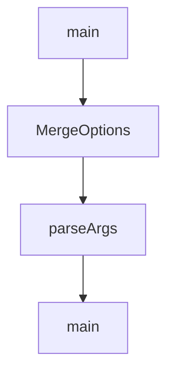

# Chapter 8: Production Operations and Governance

Welcome to **Chapter 8: Production Operations and Governance**. In this part of **Kilo Code Tutorial: Agentic Engineering from IDE and CLI Surfaces**, you will build an intuitive mental model first, then move into concrete implementation details and practical production tradeoffs.


Production Kilo adoption requires clear policy around auth, approvals, extension usage, and rollout controls.

## Governance Checklist

1. standardize provider/auth onboarding for all users
2. define allowed auto-approval conditions
3. review extension/MCP additions before team-wide rollout
4. pin versions and test release upgrades
5. monitor session behavior and failures through support logs

## Source References

- [Kilo README](https://github.com/Kilo-Org/kilocode/blob/main/README.md)
- [Release notes](https://github.com/Kilo-Org/kilocode/releases)

## Summary

You now have a team-ready operational baseline for Kilo deployment and governance.

## Depth Expansion Playbook

## Source Code Walkthrough

### `script/upstream/merge.ts`

The `main` function in [`script/upstream/merge.ts`](https://github.com/Kilo-Org/kilocode/blob/HEAD/script/upstream/merge.ts) handles a key part of this chapter's functionality:

```ts
 *   --version <version>  Target upstream version (e.g., v1.1.49)
 *   --commit <hash>      Target upstream commit hash
 *   --base-branch <name> Base branch to merge into (default: main)
 *   --dry-run            Preview changes without applying them
 *   --no-push            Don't push branches to remote
 *   --report-only        Only generate conflict report, don't merge
 *   --verbose            Enable verbose logging
 *   --author <name>      Author name for branch prefix (default: from git config)
 */

import { $ } from "bun"
import * as git from "./utils/git"
import * as logger from "./utils/logger"
import * as version from "./utils/version"
import * as report from "./utils/report"
import { defaultConfig, loadConfig, type MergeConfig } from "./utils/config"
import { transformAll as transformPackageNames } from "./transforms/package-names"
import { preserveAllVersions } from "./transforms/preserve-versions"
import { keepOursFiles, resetToOurs } from "./transforms/keep-ours"
import { skipFiles, skipSpecificFiles } from "./transforms/skip-files"
import { transformConflictedI18n, transformAllI18n } from "./transforms/transform-i18n"
// New transforms for auto-resolving more conflict types
import {
  transformConflictedTakeTheirs,
  shouldTakeTheirs,
  transformAllTakeTheirs,
} from "./transforms/transform-take-theirs"
import { transformConflictedTauri, isTauriFile, transformAllTauri } from "./transforms/transform-tauri"
import {
  transformConflictedPackageJson,
  isPackageJson,
  transformAllPackageJson,
```

This function is important because it defines how Kilo Code Tutorial: Agentic Engineering from IDE and CLI Surfaces implements the patterns covered in this chapter.

### `script/upstream/merge.ts`

The `MergeOptions` interface in [`script/upstream/merge.ts`](https://github.com/Kilo-Org/kilocode/blob/HEAD/script/upstream/merge.ts) handles a key part of this chapter's functionality:

```ts
import { resolveLockFileConflicts, regenerateLockFiles } from "./transforms/lock-files"

interface MergeOptions {
  version?: string
  commit?: string
  baseBranch?: string
  dryRun: boolean
  push: boolean
  reportOnly: boolean
  verbose: boolean
  author?: string
}

function parseArgs(): MergeOptions {
  const args = process.argv.slice(2)

  const options: MergeOptions = {
    dryRun: args.includes("--dry-run"),
    push: !args.includes("--no-push"),
    reportOnly: args.includes("--report-only"),
    verbose: args.includes("--verbose"),
  }

  const versionIdx = args.indexOf("--version")
  if (versionIdx !== -1 && args[versionIdx + 1]) {
    options.version = args[versionIdx + 1]
  }

  const commitIdx = args.indexOf("--commit")
  if (commitIdx !== -1 && args[commitIdx + 1]) {
    options.commit = args[commitIdx + 1]
  }
```

This interface is important because it defines how Kilo Code Tutorial: Agentic Engineering from IDE and CLI Surfaces implements the patterns covered in this chapter.

### `script/upstream/analyze.ts`

The `parseArgs` function in [`script/upstream/analyze.ts`](https://github.com/Kilo-Org/kilocode/blob/HEAD/script/upstream/analyze.ts) handles a key part of this chapter's functionality:

```ts
}

function parseArgs(): AnalyzeOptions {
  const args = process.argv.slice(2)
  const options: AnalyzeOptions = {}

  const versionIdx = args.indexOf("--version")
  if (versionIdx !== -1 && args[versionIdx + 1]) {
    options.version = args[versionIdx + 1]
  }

  const commitIdx = args.indexOf("--commit")
  if (commitIdx !== -1 && args[commitIdx + 1]) {
    options.commit = args[commitIdx + 1]
  }

  const outputIdx = args.indexOf("--output")
  if (outputIdx !== -1 && args[outputIdx + 1]) {
    options.output = args[outputIdx + 1]
  }

  const baseBranchIdx = args.indexOf("--base-branch")
  if (baseBranchIdx !== -1 && args[baseBranchIdx + 1]) {
    options.baseBranch = args[baseBranchIdx + 1]
  }

  return options
}

async function main() {
  const options = parseArgs()
  const config = loadConfig(options.baseBranch ? { baseBranch: options.baseBranch } : undefined)
```

This function is important because it defines how Kilo Code Tutorial: Agentic Engineering from IDE and CLI Surfaces implements the patterns covered in this chapter.

### `script/upstream/analyze.ts`

The `main` function in [`script/upstream/analyze.ts`](https://github.com/Kilo-Org/kilocode/blob/HEAD/script/upstream/analyze.ts) handles a key part of this chapter's functionality:

```ts
}

async function main() {
  const options = parseArgs()
  const config = loadConfig(options.baseBranch ? { baseBranch: options.baseBranch } : undefined)

  header("Upstream Change Analysis")

  // Check upstream remote
  if (!(await git.hasUpstreamRemote())) {
    error("No 'upstream' remote found. Please add it:")
    info("  git remote add upstream git@github.com:anomalyco/opencode.git")
    process.exit(1)
  }

  // Fetch upstream
  info("Fetching upstream...")
  await git.fetchUpstream()

  // Determine target
  let target: version.VersionInfo | null = null

  if (options.commit) {
    target = await version.getVersionForCommit(options.commit)
    if (!target) {
      target = { version: "unknown", tag: "unknown", commit: options.commit }
    }
  } else if (options.version) {
    const versions = await version.getAvailableUpstreamVersions()
    target = versions.find((v) => v.version === options.version || v.tag === options.version) || null

    if (!target) {
```

This function is important because it defines how Kilo Code Tutorial: Agentic Engineering from IDE and CLI Surfaces implements the patterns covered in this chapter.


## How These Components Connect


