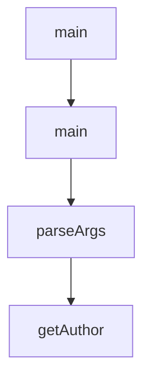

# Chapter 8: Production Operations and Governance

Welcome to **Chapter 8: Production Operations and Governance**. In this part of **Kilo Code Tutorial: Agentic Engineering from IDE and CLI Surfaces**, you will build an intuitive mental model first, then move into concrete implementation details and practical production tradeoffs.


Production Kilo adoption requires clear policy around auth, approvals, extension usage, and rollout controls.

## Governance Checklist

1. standardize provider/auth onboarding for all users
2. define allowed auto-approval conditions
3. review extension/MCP additions before team-wide rollout
4. pin versions and test release upgrades
5. monitor session behavior and failures through support logs

## Source References

- [Kilo README](https://github.com/Kilo-Org/kilocode/blob/main/README.md)
- [Release notes](https://github.com/Kilo-Org/kilocode/releases)

## Summary

You now have a team-ready operational baseline for Kilo deployment and governance.

## Source Code Walkthrough

### `script/sync-zed.ts`

The `main` function in [`script/sync-zed.ts`](https://github.com/Kilo-Org/kilocode/blob/HEAD/script/sync-zed.ts) handles a key part of this chapter's functionality:

```ts
const EXTENSION_NAME = "opencode"

async function main() {
  const version = process.argv[2]
  if (!version) throw new Error("Version argument required, ex: bun script/sync-zed.ts v1.0.52")

  const token = process.env.ZED_EXTENSIONS_PAT
  if (!token) throw new Error("ZED_EXTENSIONS_PAT environment variable required")

  const prToken = process.env.ZED_PR_PAT
  if (!prToken) throw new Error("ZED_PR_PAT environment variable required")

  const cleanVersion = version.replace(/^v/, "")
  console.log(`📦 Syncing Zed extension for version ${cleanVersion}`)

  const commitSha = await $`git rev-parse ${version}`.text()
  const sha = commitSha.trim()
  console.log(`🔍 Found commit SHA: ${sha}`)

  const extensionToml = await $`git show ${version}:packages/extensions/zed/extension.toml`.text()
  const parsed = Bun.TOML.parse(extensionToml) as { version: string }
  const extensionVersion = parsed.version

  if (extensionVersion !== cleanVersion) {
    throw new Error(`Version mismatch: extension.toml has ${extensionVersion} but tag is ${cleanVersion}`)
  }
  console.log(`✅ Version ${extensionVersion} matches tag`)

  // Clone the fork to a temp directory
  const workDir = join(tmpdir(), `zed-extensions-${Date.now()}`)
  console.log(`📁 Working in ${workDir}`)

```

This function is important because it defines how Kilo Code Tutorial: Agentic Engineering from IDE and CLI Surfaces implements the patterns covered in this chapter.

### `script/duplicate-pr.ts`

The `main` function in [`script/duplicate-pr.ts`](https://github.com/Kilo-Org/kilocode/blob/HEAD/script/duplicate-pr.ts) handles a key part of this chapter's functionality:

```ts
import { parseArgs } from "util"

async function main() {
  const { values, positionals } = parseArgs({
    args: Bun.argv.slice(2),
    options: {
      file: { type: "string", short: "f" },
      help: { type: "boolean", short: "h", default: false },
    },
    allowPositionals: true,
  })

  if (values.help) {
    console.log(`
Usage: bun script/duplicate-pr.ts [options] <message>

Options:
  -f, --file <path>   File to attach to the prompt
  -h, --help          Show this help message

Examples:
  bun script/duplicate-pr.ts -f pr_info.txt "Check the attached file for PR details"
`)
    process.exit(0)
  }

  const message = positionals.join(" ")
  if (!message) {
    console.error("Error: message is required")
    process.exit(1)
  }

```

This function is important because it defines how Kilo Code Tutorial: Agentic Engineering from IDE and CLI Surfaces implements the patterns covered in this chapter.

### `script/upstream/merge.ts`

The `parseArgs` function in [`script/upstream/merge.ts`](https://github.com/Kilo-Org/kilocode/blob/HEAD/script/upstream/merge.ts) handles a key part of this chapter's functionality:

```ts
}

function parseArgs(): MergeOptions {
  const args = process.argv.slice(2)

  const options: MergeOptions = {
    dryRun: args.includes("--dry-run"),
    push: !args.includes("--no-push"),
    reportOnly: args.includes("--report-only"),
    verbose: args.includes("--verbose"),
  }

  const versionIdx = args.indexOf("--version")
  if (versionIdx !== -1 && args[versionIdx + 1]) {
    options.version = args[versionIdx + 1]
  }

  const commitIdx = args.indexOf("--commit")
  if (commitIdx !== -1 && args[commitIdx + 1]) {
    options.commit = args[commitIdx + 1]
  }

  const authorIdx = args.indexOf("--author")
  if (authorIdx !== -1 && args[authorIdx + 1]) {
    options.author = args[authorIdx + 1]
  }

  const baseBranchIdx = args.indexOf("--base-branch")
  if (baseBranchIdx !== -1 && args[baseBranchIdx + 1]) {
    options.baseBranch = args[baseBranchIdx + 1]
  }

```

This function is important because it defines how Kilo Code Tutorial: Agentic Engineering from IDE and CLI Surfaces implements the patterns covered in this chapter.

### `script/upstream/merge.ts`

The `getAuthor` function in [`script/upstream/merge.ts`](https://github.com/Kilo-Org/kilocode/blob/HEAD/script/upstream/merge.ts) handles a key part of this chapter's functionality:

```ts
}

async function getAuthor(): Promise<string> {
  const result = await $`git config user.name`.text()
  return result
    .trim()
    .normalize("NFD")
    .replace(/[\u0300-\u036f]/g, "")
    .toLowerCase()
    .replace(/\s+/g, "")
}

async function createBackupBranch(baseBranch: string): Promise<string> {
  const timestamp = new Date().toISOString().replace(/[:.]/g, "-").slice(0, 19)
  const backupName = `backup/${baseBranch}-${timestamp}`

  await git.createBranch(backupName, baseBranch)
  await git.checkout(baseBranch)

  return backupName
}

async function main() {
  const options = parseArgs()
  const config = loadConfig(options.baseBranch ? { baseBranch: options.baseBranch } : undefined)

  if (options.verbose) {
    logger.setVerbose(true)
  }

  logger.header("Kilo Upstream Merge Tool")

```

This function is important because it defines how Kilo Code Tutorial: Agentic Engineering from IDE and CLI Surfaces implements the patterns covered in this chapter.


## How These Components Connect


