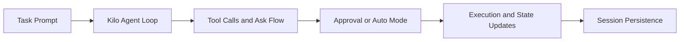

# Kilo Code Tutorial: Agentic Engineering from IDE and CLI Surfaces

> Learn how to use `Kilo-Org/kilocode` for high-throughput coding workflows with multi-mode operation, agent-loop controls, and extensible CLI/IDE integration.

## Why This Track Matters

Kilo is one of the fastest-growing coding-agent stacks and combines IDE-centric workflows with a CLI architecture designed for agent orchestration and extension.

This track focuses on:

- installation and first-run operational baseline
- agent loop state handling and user-interaction checkpoints
- mode, onboarding, and provider selection
- extensibility and contributor architecture patterns

## Current Snapshot (auto-updated)

- repository: [`Kilo-Org/kilocode`](https://github.com/Kilo-Org/kilocode)
- stars: about **15.2k**
- latest release: [`v5.7.0`](https://github.com/Kilo-Org/kilocode/releases/tag/v5.7.0)
- recent activity: updates on **February 11, 2026**
- project positioning: all-in-one agentic engineering platform

## Mental Model

## Chapter Guide

| Chapter | Key Question | Outcome |
|:--------|:-------------|:--------|
| [01 - Getting Started](01-getting-started.md) | How do I install and run Kilo quickly? | Working baseline |
| [02 - Agent Loop and State Model](02-agent-loop-and-state-model.md) | How does Kilo track running/streaming/waiting states? | Strong runtime mental model |
| [03 - Modes, Prompts, and Approval Workflow](03-modes-prompts-and-approval-workflow.md) | How do execution modes and ask handling influence reliability? | Better execution control |
| [04 - Authentication and Provider Routing](04-authentication-and-provider-routing.md) | How do login and provider settings affect operation? | Stable onboarding path |
| [05 - Session, History, and Context Persistence](05-session-history-and-context-persistence.md) | How does Kilo persist and restore CLI context? | Durable workflow continuity |
| [06 - Extensions, MCP, and Custom Modes](06-extensions-mcp-and-custom-modes.md) | How do I extend Kilo capabilities safely? | Extensibility strategy |
| [07 - CLI/TUI Architecture for Contributors](07-cli-tui-architecture-for-contributors.md) | What are the key architecture components for advanced customization? | Contributor-level understanding |
| [08 - Production Operations and Governance](08-production-operations-and-governance.md) | How should teams standardize Kilo usage at scale? | Governance baseline |

## What You Will Learn

- how to run Kilo across interactive and automated workflows
- how to reason about loop state and ask/approval transitions
- how to configure onboarding/auth/provider behavior for teams
- how to extend and operate Kilo in production environments

## Source References

- [Kilo Repository](https://github.com/Kilo-Org/kilocode)
- [Kilo README](https://github.com/Kilo-Org/kilocode/blob/main/README.md)
- [CLI agent loop docs](https://github.com/Kilo-Org/kilocode/blob/main/apps/cli/docs/AGENT_LOOP.md)
- [CLI auth login flow](https://github.com/Kilo-Org/kilocode/blob/main/apps/cli/src/commands/auth/login.ts)
- [Extension host](https://github.com/Kilo-Org/kilocode/blob/main/apps/cli/src/agent/extension-host.ts)

## Related Tutorials

- [Kimi CLI Tutorial](../kimi-cli-tutorial/)
- [Mistral Vibe Tutorial](../mistral-vibe-tutorial/)
- [OpenCode Tutorial](../opencode-tutorial/)
- [Superset Terminal Tutorial](../superset-terminal-tutorial/)

---

Start with [Chapter 1: Getting Started](01-getting-started.md).

## Navigation & Backlinks

- [Start Here: Chapter 1: Getting Started](01-getting-started.md)
- [Back to Main Catalog](../../README.md#-tutorial-catalog)
- [Browse A-Z Tutorial Directory](../../discoverability/tutorial-directory.md)
- [Search by Intent](../../discoverability/query-hub.md)
- [Explore Category Hubs](../../README.md#category-hubs)

## Full Chapter Map

1. [Chapter 1: Getting Started](01-getting-started.md)
2. [Chapter 2: Agent Loop and State Model](02-agent-loop-and-state-model.md)
3. [Chapter 3: Modes, Prompts, and Approval Workflow](03-modes-prompts-and-approval-workflow.md)
4. [Chapter 4: Authentication and Provider Routing](04-authentication-and-provider-routing.md)
5. [Chapter 5: Session, History, and Context Persistence](05-session-history-and-context-persistence.md)
6. [Chapter 6: Extensions, MCP, and Custom Modes](06-extensions-mcp-and-custom-modes.md)
7. [Chapter 7: CLI/TUI Architecture for Contributors](07-cli-tui-architecture-for-contributors.md)
8. [Chapter 8: Production Operations and Governance](08-production-operations-and-governance.md)

*Generated by [AI Codebase Knowledge Builder](https://github.com/The-Pocket/Tutorial-Codebase-Knowledge)*
