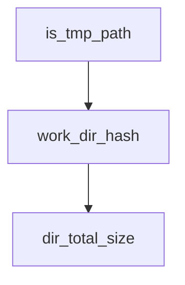

# Chapter 1: Getting Started

Welcome to **Chapter 1: Getting Started**. In this part of **Kimi CLI Tutorial: Multi-Mode Terminal Agent with MCP and ACP**, you will build an intuitive mental model first, then move into concrete implementation details and practical production tradeoffs.


This chapter gets Kimi CLI installed, configured, and running in a project directory.

## Quick Install

```bash
# Linux / macOS
curl -LsSf https://code.kimi.com/install.sh | bash

# Verify
kimi --version
```

Alternative install with `uv`:

```bash
uv tool install --python 3.13 kimi-cli
```

## First Run

```bash
cd your-project
kimi
```

Then run `/login` to configure provider access.

## Source References

- [Kimi Getting Started](https://github.com/MoonshotAI/kimi-cli/blob/main/docs/en/guides/getting-started.md)

## Summary

You now have Kimi CLI running with authenticated provider access.

Next: [Chapter 2: Command Surface and Session Controls](02-command-surface-and-session-controls.md)

## Source Code Walkthrough

### `scripts/cleanup_tmp_sessions.py`

The `is_tmp_path` function in [`scripts/cleanup_tmp_sessions.py`](https://github.com/MoonshotAI/kimi-cli/blob/HEAD/scripts/cleanup_tmp_sessions.py) handles a key part of this chapter's functionality:

```py


def is_tmp_path(path: str) -> bool:
    """Return True if *path* looks like a temporary directory."""
    if path in ("/tmp", "/private/tmp"):
        return True
    return any(path.startswith(p) for p in TMP_PREFIXES)


def work_dir_hash(path: str, kaos: str = "local") -> str:
    h = md5(path.encode("utf-8")).hexdigest()
    return h if kaos == "local" else f"{kaos}_{h}"


def dir_total_size(d: Path) -> int:
    return sum(f.stat().st_size for f in d.rglob("*") if f.is_file())


def main() -> None:
    parser = argparse.ArgumentParser(
        description=__doc__,
        formatter_class=argparse.RawDescriptionHelpFormatter,
    )
    parser.add_argument("--apply", action="store_true", help="Actually delete (default is dry-run)")
    args = parser.parse_args()

    if not METADATA_FILE.exists():
        print(f"Metadata file not found: {METADATA_FILE}")
        sys.exit(1)

    with open(METADATA_FILE, encoding="utf-8") as f:
        metadata = json.load(f)
```

This function is important because it defines how Kimi CLI Tutorial: Multi-Mode Terminal Agent with MCP and ACP implements the patterns covered in this chapter.

### `scripts/cleanup_tmp_sessions.py`

The `work_dir_hash` function in [`scripts/cleanup_tmp_sessions.py`](https://github.com/MoonshotAI/kimi-cli/blob/HEAD/scripts/cleanup_tmp_sessions.py) handles a key part of this chapter's functionality:

```py


def work_dir_hash(path: str, kaos: str = "local") -> str:
    h = md5(path.encode("utf-8")).hexdigest()
    return h if kaos == "local" else f"{kaos}_{h}"


def dir_total_size(d: Path) -> int:
    return sum(f.stat().st_size for f in d.rglob("*") if f.is_file())


def main() -> None:
    parser = argparse.ArgumentParser(
        description=__doc__,
        formatter_class=argparse.RawDescriptionHelpFormatter,
    )
    parser.add_argument("--apply", action="store_true", help="Actually delete (default is dry-run)")
    args = parser.parse_args()

    if not METADATA_FILE.exists():
        print(f"Metadata file not found: {METADATA_FILE}")
        sys.exit(1)

    with open(METADATA_FILE, encoding="utf-8") as f:
        metadata = json.load(f)

    work_dirs: list[dict] = metadata.get("work_dirs", [])

    # --- Phase 1: tmp entries in kimi.json ---
    tmp_entries: list[dict] = []
    keep_entries: list[dict] = []
    keep_hashes: set[str] = set()
```

This function is important because it defines how Kimi CLI Tutorial: Multi-Mode Terminal Agent with MCP and ACP implements the patterns covered in this chapter.

### `scripts/cleanup_tmp_sessions.py`

The `dir_total_size` function in [`scripts/cleanup_tmp_sessions.py`](https://github.com/MoonshotAI/kimi-cli/blob/HEAD/scripts/cleanup_tmp_sessions.py) handles a key part of this chapter's functionality:

```py


def dir_total_size(d: Path) -> int:
    return sum(f.stat().st_size for f in d.rglob("*") if f.is_file())


def main() -> None:
    parser = argparse.ArgumentParser(
        description=__doc__,
        formatter_class=argparse.RawDescriptionHelpFormatter,
    )
    parser.add_argument("--apply", action="store_true", help="Actually delete (default is dry-run)")
    args = parser.parse_args()

    if not METADATA_FILE.exists():
        print(f"Metadata file not found: {METADATA_FILE}")
        sys.exit(1)

    with open(METADATA_FILE, encoding="utf-8") as f:
        metadata = json.load(f)

    work_dirs: list[dict] = metadata.get("work_dirs", [])

    # --- Phase 1: tmp entries in kimi.json ---
    tmp_entries: list[dict] = []
    keep_entries: list[dict] = []
    keep_hashes: set[str] = set()
    for wd in work_dirs:
        if is_tmp_path(wd.get("path", "")):
            tmp_entries.append(wd)
        else:
            keep_entries.append(wd)
```

This function is important because it defines how Kimi CLI Tutorial: Multi-Mode Terminal Agent with MCP and ACP implements the patterns covered in this chapter.


## How These Components Connect


