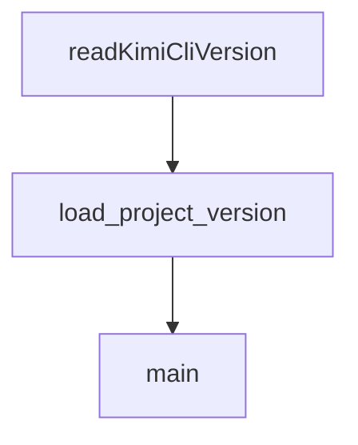

# Chapter 1: Getting Started

Welcome to **Chapter 1: Getting Started**. In this part of **Kimi CLI Tutorial: Multi-Mode Terminal Agent with MCP and ACP**, you will build an intuitive mental model first, then move into concrete implementation details and practical production tradeoffs.


This chapter gets Kimi CLI installed, configured, and running in a project directory.

## Quick Install

```bash
# Linux / macOS
curl -LsSf https://code.kimi.com/install.sh | bash

# Verify
kimi --version
```

Alternative install with `uv`:

```bash
uv tool install --python 3.13 kimi-cli
```

## First Run

```bash
cd your-project
kimi
```

Then run `/login` to configure provider access.

## Source References

- [Kimi Getting Started](https://github.com/MoonshotAI/kimi-cli/blob/main/docs/en/guides/getting-started.md)

## Summary

You now have Kimi CLI running with authenticated provider access.

Next: [Chapter 2: Command Surface and Session Controls](02-command-surface-and-session-controls.md)

## Depth Expansion Playbook

## Source Code Walkthrough

### `web/vite.config.ts`

The `readKimiCliVersion` function in [`web/vite.config.ts`](https://github.com/MoonshotAI/kimi-cli/blob/HEAD/web/vite.config.ts) handles a key part of this chapter's functionality:

```ts
const PYPROJECT_VERSION_REGEX = /^\s*version\s*=\s*"([^"]+)"/m;

function readKimiCliVersion(): string {
  const fallback = process.env.KIMI_CLI_VERSION ?? "dev";
  const pyprojectPath = path.resolve(__dirname, "../pyproject.toml");

  try {
    const pyproject = fs.readFileSync(pyprojectPath, "utf8");
    const match = pyproject.match(PYPROJECT_VERSION_REGEX);
    if (match?.[1]) {
      return match[1];
    }
  } catch (error) {
    console.warn("[vite] Unable to read version", pyprojectPath, error);
  }

  return fallback;
}

const kimiCliVersion = readKimiCliVersion();
const shouldAnalyze = process.env.ANALYZE === "true";

// https://vite.dev/config/
export default defineConfig({
  // Use relative paths so assets work under any base path.
  base: "./",
  plugins: [
    nodePolyfills({
      include: ["path", "url"],
    }),
    react(),
    tailwindcss(),
```

This function is important because it defines how Kimi CLI Tutorial: Multi-Mode Terminal Agent with MCP and ACP implements the patterns covered in this chapter.

### `scripts/check_version_tag.py`

The `load_project_version` function in [`scripts/check_version_tag.py`](https://github.com/MoonshotAI/kimi-cli/blob/HEAD/scripts/check_version_tag.py) handles a key part of this chapter's functionality:

```py


def load_project_version(pyproject_path: Path) -> str:
    with pyproject_path.open("rb") as handle:
        data = tomllib.load(handle)

    project = data.get("project")
    if not isinstance(project, dict):
        raise ValueError(f"Missing [project] table in {pyproject_path}")

    version = project.get("version")
    if not isinstance(version, str) or not version:
        raise ValueError(f"Missing project.version in {pyproject_path}")

    return version


def main() -> int:
    parser = argparse.ArgumentParser(description="Validate tag version against pyproject.")
    parser.add_argument("--pyproject", type=Path, required=True)
    parser.add_argument("--expected-version", required=True)
    args = parser.parse_args()

    semver_re = re.compile(r"^\d+\.\d+\.\d+$")
    if not semver_re.match(args.expected_version):
        print(
            f"error: expected version must include patch (x.y.z): {args.expected_version}",
            file=sys.stderr,
        )
        return 1

    try:
```

This function is important because it defines how Kimi CLI Tutorial: Multi-Mode Terminal Agent with MCP and ACP implements the patterns covered in this chapter.

### `scripts/check_version_tag.py`

The `main` function in [`scripts/check_version_tag.py`](https://github.com/MoonshotAI/kimi-cli/blob/HEAD/scripts/check_version_tag.py) handles a key part of this chapter's functionality:

```py


def main() -> int:
    parser = argparse.ArgumentParser(description="Validate tag version against pyproject.")
    parser.add_argument("--pyproject", type=Path, required=True)
    parser.add_argument("--expected-version", required=True)
    args = parser.parse_args()

    semver_re = re.compile(r"^\d+\.\d+\.\d+$")
    if not semver_re.match(args.expected_version):
        print(
            f"error: expected version must include patch (x.y.z): {args.expected_version}",
            file=sys.stderr,
        )
        return 1

    try:
        project_version = load_project_version(args.pyproject)
    except ValueError as exc:
        print(f"error: {exc}", file=sys.stderr)
        return 1

    if not semver_re.match(project_version):
        print(
            "error: project version must include patch (x.y.z): "
            f"{args.pyproject} has {project_version}",
            file=sys.stderr,
        )
        return 1

    if project_version != args.expected_version:
        print(
```

This function is important because it defines how Kimi CLI Tutorial: Multi-Mode Terminal Agent with MCP and ACP implements the patterns covered in this chapter.


## How These Components Connect


