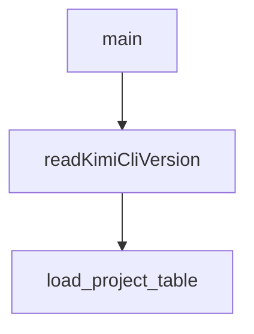

# Chapter 2: Command Surface and Session Controls

Welcome to **Chapter 2: Command Surface and Session Controls**. In this part of **Kimi CLI Tutorial: Multi-Mode Terminal Agent with MCP and ACP**, you will build an intuitive mental model first, then move into concrete implementation details and practical production tradeoffs.


Kimi CLI exposes rich command-line controls for model selection, directories, sessions, and execution boundaries.

## High-Value Flags

| Flag | Purpose |
|:-----|:--------|
| `--model` | select active model |
| `--work-dir` | set workspace root |
| `--continue` / `--session` | resume prior sessions |
| `--max-steps-per-turn` | cap per-turn execution length |
| `--max-retries-per-step` | control retry behavior |
| `--yolo` | auto-approve operations |

## Session Control Basics

- resume most recent with `--continue`
- resume specific with `--session <id>`
- manage in runtime with `/sessions` or `/resume`

## Source References

- [Kimi command reference](https://github.com/MoonshotAI/kimi-cli/blob/main/docs/en/reference/kimi-command.md)
- [Sessions and context guide](https://github.com/MoonshotAI/kimi-cli/blob/main/docs/en/guides/sessions.md)

## Summary

You now understand the core startup/session controls for predictable Kimi workflows.

Next: [Chapter 3: Agents, Subagents, and Skills](03-agents-subagents-and-skills.md)

## Source Code Walkthrough

### `scripts/cleanup_tmp_sessions.py`

The `main` function in [`scripts/cleanup_tmp_sessions.py`](https://github.com/MoonshotAI/kimi-cli/blob/HEAD/scripts/cleanup_tmp_sessions.py) handles a key part of this chapter's functionality:

```py


def main() -> None:
    parser = argparse.ArgumentParser(
        description=__doc__,
        formatter_class=argparse.RawDescriptionHelpFormatter,
    )
    parser.add_argument("--apply", action="store_true", help="Actually delete (default is dry-run)")
    args = parser.parse_args()

    if not METADATA_FILE.exists():
        print(f"Metadata file not found: {METADATA_FILE}")
        sys.exit(1)

    with open(METADATA_FILE, encoding="utf-8") as f:
        metadata = json.load(f)

    work_dirs: list[dict] = metadata.get("work_dirs", [])

    # --- Phase 1: tmp entries in kimi.json ---
    tmp_entries: list[dict] = []
    keep_entries: list[dict] = []
    keep_hashes: set[str] = set()
    for wd in work_dirs:
        if is_tmp_path(wd.get("path", "")):
            tmp_entries.append(wd)
        else:
            keep_entries.append(wd)
            keep_hashes.add(work_dir_hash(wd["path"], wd.get("kaos", "local")))

    tmp_dirs: list[Path] = []
    for wd in tmp_entries:
```

This function is important because it defines how Kimi CLI Tutorial: Multi-Mode Terminal Agent with MCP and ACP implements the patterns covered in this chapter.

### `web/vite.config.ts`

The `readKimiCliVersion` function in [`web/vite.config.ts`](https://github.com/MoonshotAI/kimi-cli/blob/HEAD/web/vite.config.ts) handles a key part of this chapter's functionality:

```ts
const PYPROJECT_VERSION_REGEX = /^\s*version\s*=\s*"([^"]+)"/m;

function readKimiCliVersion(): string {
  const fallback = process.env.KIMI_CLI_VERSION ?? "dev";
  const pyprojectPath = path.resolve(__dirname, "../pyproject.toml");

  try {
    const pyproject = fs.readFileSync(pyprojectPath, "utf8");
    const match = pyproject.match(PYPROJECT_VERSION_REGEX);
    if (match?.[1]) {
      return match[1];
    }
  } catch (error) {
    console.warn("[vite] Unable to read version", pyprojectPath, error);
  }

  return fallback;
}

const kimiCliVersion = readKimiCliVersion();
const shouldAnalyze = process.env.ANALYZE === "true";

// https://vite.dev/config/
export default defineConfig({
  // Use relative paths so assets work under any base path.
  base: "./",
  plugins: [
    nodePolyfills({
      include: ["path", "url"],
    }),
    react(),
    tailwindcss(),
```

This function is important because it defines how Kimi CLI Tutorial: Multi-Mode Terminal Agent with MCP and ACP implements the patterns covered in this chapter.

### `scripts/check_kimi_dependency_versions.py`

The `load_project_table` function in [`scripts/check_kimi_dependency_versions.py`](https://github.com/MoonshotAI/kimi-cli/blob/HEAD/scripts/check_kimi_dependency_versions.py) handles a key part of this chapter's functionality:

```py


def load_project_table(pyproject_path: Path) -> dict:
    with pyproject_path.open("rb") as handle:
        data = tomllib.load(handle)

    project = data.get("project")
    if not isinstance(project, dict):
        raise ValueError(f"Missing [project] table in {pyproject_path}")

    return project


def load_project_version(pyproject_path: Path) -> str:
    project = load_project_table(pyproject_path)
    version = project.get("version")
    if not isinstance(version, str) or not version:
        raise ValueError(f"Missing project.version in {pyproject_path}")
    return version


def find_pinned_dependency(deps: list[str], name: str) -> str | None:
    pattern = re.compile(rf"^{re.escape(name)}(?:\[[^\]]+\])?(.+)$")
    for dep in deps:
        match = pattern.match(dep)
        if not match:
            continue
        spec = match.group(1)
        pinned = re.match(r"^==(.+)$", spec)
        if pinned:
            return pinned.group(1)
        return None
```

This function is important because it defines how Kimi CLI Tutorial: Multi-Mode Terminal Agent with MCP and ACP implements the patterns covered in this chapter.


## How These Components Connect


