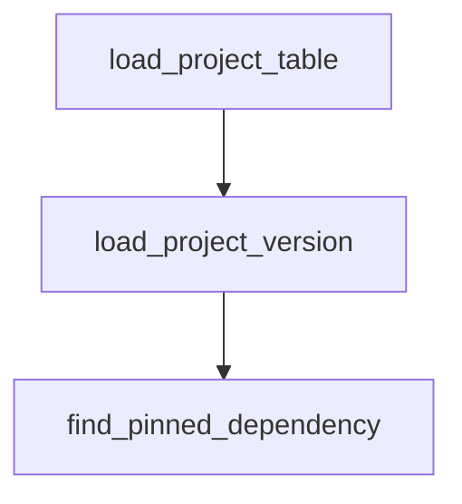

# Chapter 2: Command Surface and Session Controls

Welcome to **Chapter 2: Command Surface and Session Controls**. In this part of **Kimi CLI Tutorial: Multi-Mode Terminal Agent with MCP and ACP**, you will build an intuitive mental model first, then move into concrete implementation details and practical production tradeoffs.


Kimi CLI exposes rich command-line controls for model selection, directories, sessions, and execution boundaries.

## High-Value Flags

| Flag | Purpose |
|:-----|:--------|
| `--model` | select active model |
| `--work-dir` | set workspace root |
| `--continue` / `--session` | resume prior sessions |
| `--max-steps-per-turn` | cap per-turn execution length |
| `--max-retries-per-step` | control retry behavior |
| `--yolo` | auto-approve operations |

## Session Control Basics

- resume most recent with `--continue`
- resume specific with `--session <id>`
- manage in runtime with `/sessions` or `/resume`

## Source References

- [Kimi command reference](https://github.com/MoonshotAI/kimi-cli/blob/main/docs/en/reference/kimi-command.md)
- [Sessions and context guide](https://github.com/MoonshotAI/kimi-cli/blob/main/docs/en/guides/sessions.md)

## Summary

You now understand the core startup/session controls for predictable Kimi workflows.

Next: [Chapter 3: Agents, Subagents, and Skills](03-agents-subagents-and-skills.md)

## Depth Expansion Playbook

## Source Code Walkthrough

### `scripts/check_kimi_dependency_versions.py`

The `load_project_table` function in [`scripts/check_kimi_dependency_versions.py`](https://github.com/MoonshotAI/kimi-cli/blob/HEAD/scripts/check_kimi_dependency_versions.py) handles a key part of this chapter's functionality:

```py


def load_project_table(pyproject_path: Path) -> dict:
    with pyproject_path.open("rb") as handle:
        data = tomllib.load(handle)

    project = data.get("project")
    if not isinstance(project, dict):
        raise ValueError(f"Missing [project] table in {pyproject_path}")

    return project


def load_project_version(pyproject_path: Path) -> str:
    project = load_project_table(pyproject_path)
    version = project.get("version")
    if not isinstance(version, str) or not version:
        raise ValueError(f"Missing project.version in {pyproject_path}")
    return version


def find_pinned_dependency(deps: list[str], name: str) -> str | None:
    pattern = re.compile(rf"^{re.escape(name)}(?:\[[^\]]+\])?(.+)$")
    for dep in deps:
        match = pattern.match(dep)
        if not match:
            continue
        spec = match.group(1)
        pinned = re.match(r"^==(.+)$", spec)
        if pinned:
            return pinned.group(1)
        return None
```

This function is important because it defines how Kimi CLI Tutorial: Multi-Mode Terminal Agent with MCP and ACP implements the patterns covered in this chapter.

### `scripts/check_kimi_dependency_versions.py`

The `load_project_version` function in [`scripts/check_kimi_dependency_versions.py`](https://github.com/MoonshotAI/kimi-cli/blob/HEAD/scripts/check_kimi_dependency_versions.py) handles a key part of this chapter's functionality:

```py


def load_project_version(pyproject_path: Path) -> str:
    project = load_project_table(pyproject_path)
    version = project.get("version")
    if not isinstance(version, str) or not version:
        raise ValueError(f"Missing project.version in {pyproject_path}")
    return version


def find_pinned_dependency(deps: list[str], name: str) -> str | None:
    pattern = re.compile(rf"^{re.escape(name)}(?:\[[^\]]+\])?(.+)$")
    for dep in deps:
        match = pattern.match(dep)
        if not match:
            continue
        spec = match.group(1)
        pinned = re.match(r"^==(.+)$", spec)
        if pinned:
            return pinned.group(1)
        return None
    return None


def main() -> int:
    parser = argparse.ArgumentParser(description="Validate kimi-cli dependency versions.")
    parser.add_argument("--root-pyproject", type=Path, required=True)
    parser.add_argument("--kosong-pyproject", type=Path, required=True)
    parser.add_argument("--pykaos-pyproject", type=Path, required=True)
    args = parser.parse_args()

    try:
```

This function is important because it defines how Kimi CLI Tutorial: Multi-Mode Terminal Agent with MCP and ACP implements the patterns covered in this chapter.

### `scripts/check_kimi_dependency_versions.py`

The `find_pinned_dependency` function in [`scripts/check_kimi_dependency_versions.py`](https://github.com/MoonshotAI/kimi-cli/blob/HEAD/scripts/check_kimi_dependency_versions.py) handles a key part of this chapter's functionality:

```py


def find_pinned_dependency(deps: list[str], name: str) -> str | None:
    pattern = re.compile(rf"^{re.escape(name)}(?:\[[^\]]+\])?(.+)$")
    for dep in deps:
        match = pattern.match(dep)
        if not match:
            continue
        spec = match.group(1)
        pinned = re.match(r"^==(.+)$", spec)
        if pinned:
            return pinned.group(1)
        return None
    return None


def main() -> int:
    parser = argparse.ArgumentParser(description="Validate kimi-cli dependency versions.")
    parser.add_argument("--root-pyproject", type=Path, required=True)
    parser.add_argument("--kosong-pyproject", type=Path, required=True)
    parser.add_argument("--pykaos-pyproject", type=Path, required=True)
    args = parser.parse_args()

    try:
        root_project = load_project_table(args.root_pyproject)
    except ValueError as exc:
        print(f"error: {exc}", file=sys.stderr)
        return 1

    deps = root_project.get("dependencies", [])
    if not isinstance(deps, list):
        print(
```

This function is important because it defines how Kimi CLI Tutorial: Multi-Mode Terminal Agent with MCP and ACP implements the patterns covered in this chapter.


## How These Components Connect


