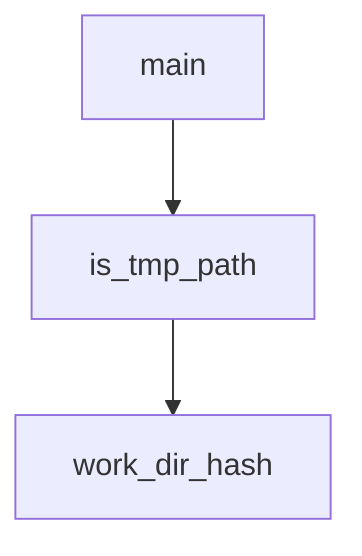

# Chapter 3: Agents, Subagents, and Skills

Welcome to **Chapter 3: Agents, Subagents, and Skills**. In this part of **Kimi CLI Tutorial: Multi-Mode Terminal Agent with MCP and ACP**, you will build an intuitive mental model first, then move into concrete implementation details and practical production tradeoffs.


Kimi CLI supports behavior customization through built-in/custom agents, subagents, and layered skills.

## Customization Layers

| Layer | Purpose |
|:------|:--------|
| built-in agents | default behavior presets |
| custom agent files | YAML-defined prompt/tool/subagent customization |
| skills | reusable domain instructions discoverable by agent |

## Practical Pattern

1. keep default agent for broad tasks
2. add custom agent file for project-specific controls
3. add team skills in shared directories (`.agents/skills`) for consistent conventions

## Source References

- [Agents and subagents](https://github.com/MoonshotAI/kimi-cli/blob/main/docs/en/customization/agents.md)
- [Agent skills](https://github.com/MoonshotAI/kimi-cli/blob/main/docs/en/customization/skills.md)

## Summary

You now have a strategy for standardized yet flexible Kimi behavior customization.

Next: [Chapter 4: MCP Tooling and Security Model](04-mcp-tooling-and-security-model.md)

## Depth Expansion Playbook

## Source Code Walkthrough

### `scripts/check_kimi_dependency_versions.py`

The `main` function in [`scripts/check_kimi_dependency_versions.py`](https://github.com/MoonshotAI/kimi-cli/blob/HEAD/scripts/check_kimi_dependency_versions.py) handles a key part of this chapter's functionality:

```py


def main() -> int:
    parser = argparse.ArgumentParser(description="Validate kimi-cli dependency versions.")
    parser.add_argument("--root-pyproject", type=Path, required=True)
    parser.add_argument("--kosong-pyproject", type=Path, required=True)
    parser.add_argument("--pykaos-pyproject", type=Path, required=True)
    args = parser.parse_args()

    try:
        root_project = load_project_table(args.root_pyproject)
    except ValueError as exc:
        print(f"error: {exc}", file=sys.stderr)
        return 1

    deps = root_project.get("dependencies", [])
    if not isinstance(deps, list):
        print(
            f"error: project.dependencies must be a list in {args.root_pyproject}",
            file=sys.stderr,
        )
        return 1

    errors: list[str] = []
    for name, pyproject_path in (
        ("kosong", args.kosong_pyproject),
        ("pykaos", args.pykaos_pyproject),
    ):
        try:
            package_version = load_project_version(pyproject_path)
        except ValueError as exc:
            errors.append(str(exc))
```

This function is important because it defines how Kimi CLI Tutorial: Multi-Mode Terminal Agent with MCP and ACP implements the patterns covered in this chapter.

### `scripts/cleanup_tmp_sessions.py`

The `is_tmp_path` function in [`scripts/cleanup_tmp_sessions.py`](https://github.com/MoonshotAI/kimi-cli/blob/HEAD/scripts/cleanup_tmp_sessions.py) handles a key part of this chapter's functionality:

```py


def is_tmp_path(path: str) -> bool:
    """Return True if *path* looks like a temporary directory."""
    if path in ("/tmp", "/private/tmp"):
        return True
    return any(path.startswith(p) for p in TMP_PREFIXES)


def work_dir_hash(path: str, kaos: str = "local") -> str:
    h = md5(path.encode("utf-8")).hexdigest()
    return h if kaos == "local" else f"{kaos}_{h}"


def dir_total_size(d: Path) -> int:
    return sum(f.stat().st_size for f in d.rglob("*") if f.is_file())


def main() -> None:
    parser = argparse.ArgumentParser(
        description=__doc__,
        formatter_class=argparse.RawDescriptionHelpFormatter,
    )
    parser.add_argument("--apply", action="store_true", help="Actually delete (default is dry-run)")
    args = parser.parse_args()

    if not METADATA_FILE.exists():
        print(f"Metadata file not found: {METADATA_FILE}")
        sys.exit(1)

    with open(METADATA_FILE, encoding="utf-8") as f:
        metadata = json.load(f)
```

This function is important because it defines how Kimi CLI Tutorial: Multi-Mode Terminal Agent with MCP and ACP implements the patterns covered in this chapter.

### `scripts/cleanup_tmp_sessions.py`

The `work_dir_hash` function in [`scripts/cleanup_tmp_sessions.py`](https://github.com/MoonshotAI/kimi-cli/blob/HEAD/scripts/cleanup_tmp_sessions.py) handles a key part of this chapter's functionality:

```py


def work_dir_hash(path: str, kaos: str = "local") -> str:
    h = md5(path.encode("utf-8")).hexdigest()
    return h if kaos == "local" else f"{kaos}_{h}"


def dir_total_size(d: Path) -> int:
    return sum(f.stat().st_size for f in d.rglob("*") if f.is_file())


def main() -> None:
    parser = argparse.ArgumentParser(
        description=__doc__,
        formatter_class=argparse.RawDescriptionHelpFormatter,
    )
    parser.add_argument("--apply", action="store_true", help="Actually delete (default is dry-run)")
    args = parser.parse_args()

    if not METADATA_FILE.exists():
        print(f"Metadata file not found: {METADATA_FILE}")
        sys.exit(1)

    with open(METADATA_FILE, encoding="utf-8") as f:
        metadata = json.load(f)

    work_dirs: list[dict] = metadata.get("work_dirs", [])

    # --- Phase 1: tmp entries in kimi.json ---
    tmp_entries: list[dict] = []
    keep_entries: list[dict] = []
    keep_hashes: set[str] = set()
```

This function is important because it defines how Kimi CLI Tutorial: Multi-Mode Terminal Agent with MCP and ACP implements the patterns covered in this chapter.


## How These Components Connect


