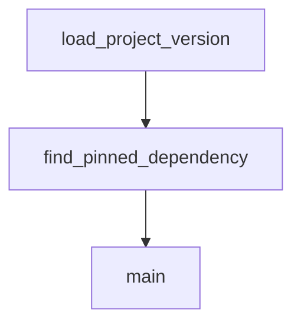

# Chapter 3: Agents, Subagents, and Skills

Welcome to **Chapter 3: Agents, Subagents, and Skills**. In this part of **Kimi CLI Tutorial: Multi-Mode Terminal Agent with MCP and ACP**, you will build an intuitive mental model first, then move into concrete implementation details and practical production tradeoffs.


Kimi CLI supports behavior customization through built-in/custom agents, subagents, and layered skills.

## Customization Layers

| Layer | Purpose |
|:------|:--------|
| built-in agents | default behavior presets |
| custom agent files | YAML-defined prompt/tool/subagent customization |
| skills | reusable domain instructions discoverable by agent |

## Practical Pattern

1. keep default agent for broad tasks
2. add custom agent file for project-specific controls
3. add team skills in shared directories (`.agents/skills`) for consistent conventions

## Source References

- [Agents and subagents](https://github.com/MoonshotAI/kimi-cli/blob/main/docs/en/customization/agents.md)
- [Agent skills](https://github.com/MoonshotAI/kimi-cli/blob/main/docs/en/customization/skills.md)

## Summary

You now have a strategy for standardized yet flexible Kimi behavior customization.

Next: [Chapter 4: MCP Tooling and Security Model](04-mcp-tooling-and-security-model.md)

## Source Code Walkthrough

### `scripts/check_kimi_dependency_versions.py`

The `load_project_version` function in [`scripts/check_kimi_dependency_versions.py`](https://github.com/MoonshotAI/kimi-cli/blob/HEAD/scripts/check_kimi_dependency_versions.py) handles a key part of this chapter's functionality:

```py


def load_project_version(pyproject_path: Path) -> str:
    project = load_project_table(pyproject_path)
    version = project.get("version")
    if not isinstance(version, str) or not version:
        raise ValueError(f"Missing project.version in {pyproject_path}")
    return version


def find_pinned_dependency(deps: list[str], name: str) -> str | None:
    pattern = re.compile(rf"^{re.escape(name)}(?:\[[^\]]+\])?(.+)$")
    for dep in deps:
        match = pattern.match(dep)
        if not match:
            continue
        spec = match.group(1)
        pinned = re.match(r"^==(.+)$", spec)
        if pinned:
            return pinned.group(1)
        return None
    return None


def main() -> int:
    parser = argparse.ArgumentParser(description="Validate kimi-cli dependency versions.")
    parser.add_argument("--root-pyproject", type=Path, required=True)
    parser.add_argument("--kosong-pyproject", type=Path, required=True)
    parser.add_argument("--pykaos-pyproject", type=Path, required=True)
    args = parser.parse_args()

    try:
```

This function is important because it defines how Kimi CLI Tutorial: Multi-Mode Terminal Agent with MCP and ACP implements the patterns covered in this chapter.

### `scripts/check_kimi_dependency_versions.py`

The `find_pinned_dependency` function in [`scripts/check_kimi_dependency_versions.py`](https://github.com/MoonshotAI/kimi-cli/blob/HEAD/scripts/check_kimi_dependency_versions.py) handles a key part of this chapter's functionality:

```py


def find_pinned_dependency(deps: list[str], name: str) -> str | None:
    pattern = re.compile(rf"^{re.escape(name)}(?:\[[^\]]+\])?(.+)$")
    for dep in deps:
        match = pattern.match(dep)
        if not match:
            continue
        spec = match.group(1)
        pinned = re.match(r"^==(.+)$", spec)
        if pinned:
            return pinned.group(1)
        return None
    return None


def main() -> int:
    parser = argparse.ArgumentParser(description="Validate kimi-cli dependency versions.")
    parser.add_argument("--root-pyproject", type=Path, required=True)
    parser.add_argument("--kosong-pyproject", type=Path, required=True)
    parser.add_argument("--pykaos-pyproject", type=Path, required=True)
    args = parser.parse_args()

    try:
        root_project = load_project_table(args.root_pyproject)
    except ValueError as exc:
        print(f"error: {exc}", file=sys.stderr)
        return 1

    deps = root_project.get("dependencies", [])
    if not isinstance(deps, list):
        print(
```

This function is important because it defines how Kimi CLI Tutorial: Multi-Mode Terminal Agent with MCP and ACP implements the patterns covered in this chapter.

### `scripts/check_kimi_dependency_versions.py`

The `main` function in [`scripts/check_kimi_dependency_versions.py`](https://github.com/MoonshotAI/kimi-cli/blob/HEAD/scripts/check_kimi_dependency_versions.py) handles a key part of this chapter's functionality:

```py


def main() -> int:
    parser = argparse.ArgumentParser(description="Validate kimi-cli dependency versions.")
    parser.add_argument("--root-pyproject", type=Path, required=True)
    parser.add_argument("--kosong-pyproject", type=Path, required=True)
    parser.add_argument("--pykaos-pyproject", type=Path, required=True)
    args = parser.parse_args()

    try:
        root_project = load_project_table(args.root_pyproject)
    except ValueError as exc:
        print(f"error: {exc}", file=sys.stderr)
        return 1

    deps = root_project.get("dependencies", [])
    if not isinstance(deps, list):
        print(
            f"error: project.dependencies must be a list in {args.root_pyproject}",
            file=sys.stderr,
        )
        return 1

    errors: list[str] = []
    for name, pyproject_path in (
        ("kosong", args.kosong_pyproject),
        ("pykaos", args.pykaos_pyproject),
    ):
        try:
            package_version = load_project_version(pyproject_path)
        except ValueError as exc:
            errors.append(str(exc))
```

This function is important because it defines how Kimi CLI Tutorial: Multi-Mode Terminal Agent with MCP and ACP implements the patterns covered in this chapter.


## How These Components Connect


