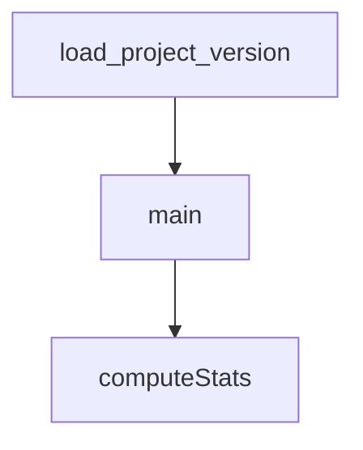

# Chapter 4: MCP Tooling and Security Model

Welcome to **Chapter 4: MCP Tooling and Security Model**. In this part of **Kimi CLI Tutorial: Multi-Mode Terminal Agent with MCP and ACP**, you will build an intuitive mental model first, then move into concrete implementation details and practical production tradeoffs.


Kimi CLI can connect to external MCP servers to extend tool capabilities beyond built-ins.

## Core MCP Operations

```bash
kimi mcp add --transport http context7 https://mcp.context7.com/mcp
kimi mcp list
kimi mcp test context7
kimi mcp remove context7
```

## Security Model

- MCP tool calls follow the same approval system as other sensitive operations.
- OAuth flows are supported for compatible servers.
- YOLO mode auto-approves MCP actions and should be used with caution.

## Source References

- [MCP customization docs](https://github.com/MoonshotAI/kimi-cli/blob/main/docs/en/customization/mcp.md)
- [MCP command reference](https://github.com/MoonshotAI/kimi-cli/blob/main/docs/en/reference/kimi-mcp.md)

## Summary

You now know how to add MCP capabilities while preserving operator control.

Next: [Chapter 5: ACP and IDE Integrations](05-acp-and-ide-integrations.md)

## Source Code Walkthrough

### `scripts/check_version_tag.py`

The `load_project_version` function in [`scripts/check_version_tag.py`](https://github.com/MoonshotAI/kimi-cli/blob/HEAD/scripts/check_version_tag.py) handles a key part of this chapter's functionality:

```py


def load_project_version(pyproject_path: Path) -> str:
    with pyproject_path.open("rb") as handle:
        data = tomllib.load(handle)

    project = data.get("project")
    if not isinstance(project, dict):
        raise ValueError(f"Missing [project] table in {pyproject_path}")

    version = project.get("version")
    if not isinstance(version, str) or not version:
        raise ValueError(f"Missing project.version in {pyproject_path}")

    return version


def main() -> int:
    parser = argparse.ArgumentParser(description="Validate tag version against pyproject.")
    parser.add_argument("--pyproject", type=Path, required=True)
    parser.add_argument("--expected-version", required=True)
    args = parser.parse_args()

    semver_re = re.compile(r"^\d+\.\d+\.\d+$")
    if not semver_re.match(args.expected_version):
        print(
            f"error: expected version must include patch (x.y.z): {args.expected_version}",
            file=sys.stderr,
        )
        return 1

    try:
```

This function is important because it defines how Kimi CLI Tutorial: Multi-Mode Terminal Agent with MCP and ACP implements the patterns covered in this chapter.

### `scripts/check_version_tag.py`

The `main` function in [`scripts/check_version_tag.py`](https://github.com/MoonshotAI/kimi-cli/blob/HEAD/scripts/check_version_tag.py) handles a key part of this chapter's functionality:

```py


def main() -> int:
    parser = argparse.ArgumentParser(description="Validate tag version against pyproject.")
    parser.add_argument("--pyproject", type=Path, required=True)
    parser.add_argument("--expected-version", required=True)
    args = parser.parse_args()

    semver_re = re.compile(r"^\d+\.\d+\.\d+$")
    if not semver_re.match(args.expected_version):
        print(
            f"error: expected version must include patch (x.y.z): {args.expected_version}",
            file=sys.stderr,
        )
        return 1

    try:
        project_version = load_project_version(args.pyproject)
    except ValueError as exc:
        print(f"error: {exc}", file=sys.stderr)
        return 1

    if not semver_re.match(project_version):
        print(
            "error: project version must include patch (x.y.z): "
            f"{args.pyproject} has {project_version}",
            file=sys.stderr,
        )
        return 1

    if project_version != args.expected_version:
        print(
```

This function is important because it defines how Kimi CLI Tutorial: Multi-Mode Terminal Agent with MCP and ACP implements the patterns covered in this chapter.

### `vis/src/App.tsx`

The `computeStats` function in [`vis/src/App.tsx`](https://github.com/MoonshotAI/kimi-cli/blob/HEAD/vis/src/App.tsx) handles a key part of this chapter's functionality:

```tsx
}

function computeStats(events: WireEvent[]): SessionStatsData {
  let turns = 0;
  let steps = 0;
  let toolCalls = 0;
  let errors = 0;
  let compactions = 0;
  let inputTokens = 0;
  let outputTokens = 0;
  let totalCacheRead = 0;
  let totalInputOther = 0;
  let totalCacheCreation = 0;

  for (const e of events) {
    if (e.type === "TurnBegin") turns++;
    if (e.type === "StepBegin") steps++;
    if (e.type === "ToolCall") toolCalls++;
    if (e.type === "CompactionBegin") compactions++;
    if (isErrorEvent(e)) errors++;
    if (e.type === "StatusUpdate") {
      const tu = e.payload.token_usage as Record<string, number> | undefined;
      if (tu) {
        inputTokens += (tu.input_other ?? 0) + (tu.input_cache_read ?? 0) + (tu.input_cache_creation ?? 0);
        outputTokens += tu.output ?? 0;
        totalCacheRead += tu.input_cache_read ?? 0;
        totalInputOther += tu.input_other ?? 0;
        totalCacheCreation += tu.input_cache_creation ?? 0;
      }
    }
    // Count tokens from SubagentEvent-wrapped StatusUpdate
    if (e.type === "SubagentEvent") {
```

This function is important because it defines how Kimi CLI Tutorial: Multi-Mode Terminal Agent with MCP and ACP implements the patterns covered in this chapter.


## How These Components Connect


