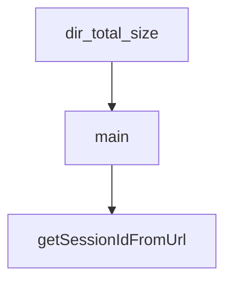

# Chapter 4: MCP Tooling and Security Model

Welcome to **Chapter 4: MCP Tooling and Security Model**. In this part of **Kimi CLI Tutorial: Multi-Mode Terminal Agent with MCP and ACP**, you will build an intuitive mental model first, then move into concrete implementation details and practical production tradeoffs.


Kimi CLI can connect to external MCP servers to extend tool capabilities beyond built-ins.

## Core MCP Operations

```bash
kimi mcp add --transport http context7 https://mcp.context7.com/mcp
kimi mcp list
kimi mcp test context7
kimi mcp remove context7
```

## Security Model

- MCP tool calls follow the same approval system as other sensitive operations.
- OAuth flows are supported for compatible servers.
- YOLO mode auto-approves MCP actions and should be used with caution.

## Source References

- [MCP customization docs](https://github.com/MoonshotAI/kimi-cli/blob/main/docs/en/customization/mcp.md)
- [MCP command reference](https://github.com/MoonshotAI/kimi-cli/blob/main/docs/en/reference/kimi-mcp.md)

## Summary

You now know how to add MCP capabilities while preserving operator control.

Next: [Chapter 5: ACP and IDE Integrations](05-acp-and-ide-integrations.md)

## Depth Expansion Playbook

## Source Code Walkthrough

### `scripts/cleanup_tmp_sessions.py`

The `dir_total_size` function in [`scripts/cleanup_tmp_sessions.py`](https://github.com/MoonshotAI/kimi-cli/blob/HEAD/scripts/cleanup_tmp_sessions.py) handles a key part of this chapter's functionality:

```py


def dir_total_size(d: Path) -> int:
    return sum(f.stat().st_size for f in d.rglob("*") if f.is_file())


def main() -> None:
    parser = argparse.ArgumentParser(
        description=__doc__,
        formatter_class=argparse.RawDescriptionHelpFormatter,
    )
    parser.add_argument("--apply", action="store_true", help="Actually delete (default is dry-run)")
    args = parser.parse_args()

    if not METADATA_FILE.exists():
        print(f"Metadata file not found: {METADATA_FILE}")
        sys.exit(1)

    with open(METADATA_FILE, encoding="utf-8") as f:
        metadata = json.load(f)

    work_dirs: list[dict] = metadata.get("work_dirs", [])

    # --- Phase 1: tmp entries in kimi.json ---
    tmp_entries: list[dict] = []
    keep_entries: list[dict] = []
    keep_hashes: set[str] = set()
    for wd in work_dirs:
        if is_tmp_path(wd.get("path", "")):
            tmp_entries.append(wd)
        else:
            keep_entries.append(wd)
```

This function is important because it defines how Kimi CLI Tutorial: Multi-Mode Terminal Agent with MCP and ACP implements the patterns covered in this chapter.

### `scripts/cleanup_tmp_sessions.py`

The `main` function in [`scripts/cleanup_tmp_sessions.py`](https://github.com/MoonshotAI/kimi-cli/blob/HEAD/scripts/cleanup_tmp_sessions.py) handles a key part of this chapter's functionality:

```py


def main() -> None:
    parser = argparse.ArgumentParser(
        description=__doc__,
        formatter_class=argparse.RawDescriptionHelpFormatter,
    )
    parser.add_argument("--apply", action="store_true", help="Actually delete (default is dry-run)")
    args = parser.parse_args()

    if not METADATA_FILE.exists():
        print(f"Metadata file not found: {METADATA_FILE}")
        sys.exit(1)

    with open(METADATA_FILE, encoding="utf-8") as f:
        metadata = json.load(f)

    work_dirs: list[dict] = metadata.get("work_dirs", [])

    # --- Phase 1: tmp entries in kimi.json ---
    tmp_entries: list[dict] = []
    keep_entries: list[dict] = []
    keep_hashes: set[str] = set()
    for wd in work_dirs:
        if is_tmp_path(wd.get("path", "")):
            tmp_entries.append(wd)
        else:
            keep_entries.append(wd)
            keep_hashes.add(work_dir_hash(wd["path"], wd.get("kaos", "local")))

    tmp_dirs: list[Path] = []
    for wd in tmp_entries:
```

This function is important because it defines how Kimi CLI Tutorial: Multi-Mode Terminal Agent with MCP and ACP implements the patterns covered in this chapter.

### `web/src/App.tsx`

The `getSessionIdFromUrl` function in [`web/src/App.tsx`](https://github.com/MoonshotAI/kimi-cli/blob/HEAD/web/src/App.tsx) handles a key part of this chapter's functionality:

```tsx
 * Get session ID from URL search params
 */
function getSessionIdFromUrl(): string | null {
  const params = new URLSearchParams(window.location.search);
  return params.get("session");
}

/**
 * Update URL with session ID without triggering page reload
 */
function updateUrlWithSession(sessionId: string | null): void {
  const url = new URL(window.location.href);
  if (sessionId) {
    url.searchParams.set("session", sessionId);
  } else {
    url.searchParams.delete("session");
  }
  window.history.replaceState({}, "", url.toString());
}

const SIDEBAR_COLLAPSED_SIZE = 48;
const SIDEBAR_MIN_SIZE = 200;
const SIDEBAR_DEFAULT_SIZE = 260;
const SIDEBAR_ANIMATION_MS = 250;

function App() {
  // Initialize theme on app startup
  useTheme();

  const sidebarElementRef = useRef<HTMLDivElement | null>(null);
  const sidebarPanelRef = useRef<PanelImperativeHandle | null>(null);
  const sessionsHook = useSessions();
```

This function is important because it defines how Kimi CLI Tutorial: Multi-Mode Terminal Agent with MCP and ACP implements the patterns covered in this chapter.


## How These Components Connect


