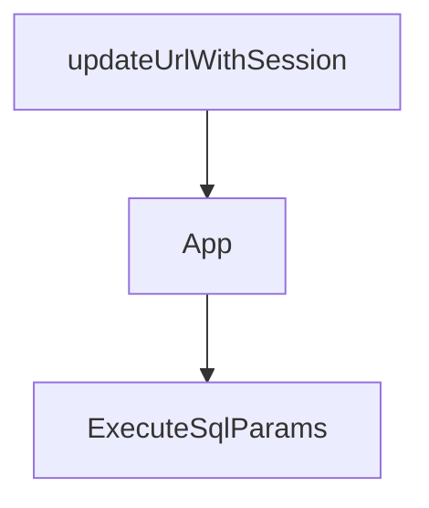

# Chapter 5: ACP and IDE Integrations

Welcome to **Chapter 5: ACP and IDE Integrations**. In this part of **Kimi CLI Tutorial: Multi-Mode Terminal Agent with MCP and ACP**, you will build an intuitive mental model first, then move into concrete implementation details and practical production tradeoffs.


Kimi CLI can run as an ACP server, enabling IDE and client integrations with multi-session agent workflows.

## ACP Entry Point

```bash
kimi acp
```

## Integration Pattern

- authenticate first in CLI (`/login`)
- configure ACP client to launch `kimi acp`
- create and manage sessions from IDE agent panels

## Use Cases

- Zed/JetBrains ACP integrations
- custom ACP clients for internal tooling
- multi-session concurrent agent workflows

## Source References

- [Kimi README: ACP integration](https://github.com/MoonshotAI/kimi-cli/blob/main/README.md)
- [ACP reference](https://github.com/MoonshotAI/kimi-cli/blob/main/docs/en/reference/kimi-acp.md)

## Summary

You now have a pathway to use Kimi beyond standalone terminal sessions.

Next: [Chapter 6: Shell Mode, Print Mode, and Wire Mode](06-shell-mode-print-mode-and-wire-mode.md)

## Depth Expansion Playbook

## Source Code Walkthrough

### `web/src/App.tsx`

The `updateUrlWithSession` function in [`web/src/App.tsx`](https://github.com/MoonshotAI/kimi-cli/blob/HEAD/web/src/App.tsx) handles a key part of this chapter's functionality:

```tsx
 * Update URL with session ID without triggering page reload
 */
function updateUrlWithSession(sessionId: string | null): void {
  const url = new URL(window.location.href);
  if (sessionId) {
    url.searchParams.set("session", sessionId);
  } else {
    url.searchParams.delete("session");
  }
  window.history.replaceState({}, "", url.toString());
}

const SIDEBAR_COLLAPSED_SIZE = 48;
const SIDEBAR_MIN_SIZE = 200;
const SIDEBAR_DEFAULT_SIZE = 260;
const SIDEBAR_ANIMATION_MS = 250;

function App() {
  // Initialize theme on app startup
  useTheme();

  const sidebarElementRef = useRef<HTMLDivElement | null>(null);
  const sidebarPanelRef = useRef<PanelImperativeHandle | null>(null);
  const sessionsHook = useSessions();
  const [isMobileSidebarOpen, setIsMobileSidebarOpen] = useState(false);
  const [isDesktop, setIsDesktop] = useState(() => {
    if (typeof window === "undefined") {
      return true;
    }
    return window.matchMedia("(min-width: 1024px)").matches;
  });

```

This function is important because it defines how Kimi CLI Tutorial: Multi-Mode Terminal Agent with MCP and ACP implements the patterns covered in this chapter.

### `web/src/App.tsx`

The `App` function in [`web/src/App.tsx`](https://github.com/MoonshotAI/kimi-cli/blob/HEAD/web/src/App.tsx) handles a key part of this chapter's functionality:

```tsx
const SIDEBAR_ANIMATION_MS = 250;

function App() {
  // Initialize theme on app startup
  useTheme();

  const sidebarElementRef = useRef<HTMLDivElement | null>(null);
  const sidebarPanelRef = useRef<PanelImperativeHandle | null>(null);
  const sessionsHook = useSessions();
  const [isMobileSidebarOpen, setIsMobileSidebarOpen] = useState(false);
  const [isDesktop, setIsDesktop] = useState(() => {
    if (typeof window === "undefined") {
      return true;
    }
    return window.matchMedia("(min-width: 1024px)").matches;
  });

  const {
    sessions,
    archivedSessions,
    selectedSessionId,
    createSession,
    deleteSession,
    selectSession,
    uploadSessionFile,
    getSessionFile,
    getSessionFileUrl,
    listSessionDirectory,
    refreshSession,
    refreshSessions,
    refreshArchivedSessions,
    loadMoreSessions,
```

This function is important because it defines how Kimi CLI Tutorial: Multi-Mode Terminal Agent with MCP and ACP implements the patterns covered in this chapter.

### `examples/kimi-psql/main.py`

The `ExecuteSqlParams` class in [`examples/kimi-psql/main.py`](https://github.com/MoonshotAI/kimi-cli/blob/HEAD/examples/kimi-psql/main.py) handles a key part of this chapter's functionality:

```py


class ExecuteSqlParams(BaseModel):
    """Parameters for ExecuteSql tool."""

    sql: str = Field(description="The SQL query to execute in the connected PostgreSQL database")


class ExecuteSql(CallableTool2[ExecuteSqlParams]):
    """Execute read-only SQL query in the connected PostgreSQL database."""

    name: str = "ExecuteSql"
    description: str = (
        "Execute a READ-ONLY SQL query in the connected PostgreSQL database. "
        "Use this tool for SELECT queries and database introspection queries. "
        "This tool CANNOT execute write operations (INSERT, UPDATE, DELETE, DROP, etc.). "
        "For write operations, return the SQL in a markdown code block for the user to "
        "execute manually. "
        "Note: psql meta-commands (\\d, \\dt, etc.) are NOT supported - use SQL queries "
        "instead (e.g., SELECT * FROM pg_tables WHERE schemaname = 'public')."
    )
    params: type[ExecuteSqlParams] = ExecuteSqlParams

    def __init__(self, conninfo: str):
        """
        Initialize ExecuteSql tool with database connection info.

        Args:
            conninfo: PostgreSQL connection string
                (e.g., "host=localhost port=5432 dbname=mydb user=postgres")
        """
        super().__init__()
```

This class is important because it defines how Kimi CLI Tutorial: Multi-Mode Terminal Agent with MCP and ACP implements the patterns covered in this chapter.


## How These Components Connect


