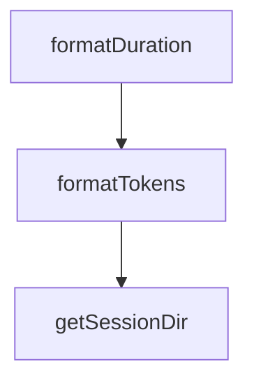

# Chapter 5: ACP and IDE Integrations

Welcome to **Chapter 5: ACP and IDE Integrations**. In this part of **Kimi CLI Tutorial: Multi-Mode Terminal Agent with MCP and ACP**, you will build an intuitive mental model first, then move into concrete implementation details and practical production tradeoffs.


Kimi CLI can run as an ACP server, enabling IDE and client integrations with multi-session agent workflows.

## ACP Entry Point

```bash
kimi acp
```

## Integration Pattern

- authenticate first in CLI (`/login`)
- configure ACP client to launch `kimi acp`
- create and manage sessions from IDE agent panels

## Use Cases

- Zed/JetBrains ACP integrations
- custom ACP clients for internal tooling
- multi-session concurrent agent workflows

## Source References

- [Kimi README: ACP integration](https://github.com/MoonshotAI/kimi-cli/blob/main/README.md)
- [ACP reference](https://github.com/MoonshotAI/kimi-cli/blob/main/docs/en/reference/kimi-acp.md)

## Summary

You now have a pathway to use Kimi beyond standalone terminal sessions.

Next: [Chapter 6: Shell Mode, Print Mode, and Wire Mode](06-shell-mode-print-mode-and-wire-mode.md)

## Source Code Walkthrough

### `vis/src/App.tsx`

The `formatDuration` function in [`vis/src/App.tsx`](https://github.com/MoonshotAI/kimi-cli/blob/HEAD/vis/src/App.tsx) handles a key part of this chapter's functionality:

```tsx
}

function formatDuration(sec: number): string {
  if (sec < 1) return `${(sec * 1000).toFixed(0)}ms`;
  if (sec < 60) return `${sec.toFixed(1)}s`;
  return `${(sec / 60).toFixed(1)}min`;
}

function formatTokens(n: number): string {
  if (n === 0) return "0";
  if (n < 1000) return `${n}`;
  return `${(n / 1000).toFixed(1)}k`;
}

function getSessionDir(session: SessionInfo): string {
  return session.session_dir;
}

function SessionDirectoryActions({
  session,
  openInSupported,
}: {
  session: SessionInfo;
  openInSupported: boolean;
}) {
  const [copied, setCopied] = useState(false);

  const handleOpenSessionDir = useCallback(async () => {
    try {
      await openInPath("finder", session.session_dir);
    } catch (error) {
      console.error("Failed to open session directory:", error);
```

This function is important because it defines how Kimi CLI Tutorial: Multi-Mode Terminal Agent with MCP and ACP implements the patterns covered in this chapter.

### `vis/src/App.tsx`

The `formatTokens` function in [`vis/src/App.tsx`](https://github.com/MoonshotAI/kimi-cli/blob/HEAD/vis/src/App.tsx) handles a key part of this chapter's functionality:

```tsx
}

function formatTokens(n: number): string {
  if (n === 0) return "0";
  if (n < 1000) return `${n}`;
  return `${(n / 1000).toFixed(1)}k`;
}

function getSessionDir(session: SessionInfo): string {
  return session.session_dir;
}

function SessionDirectoryActions({
  session,
  openInSupported,
}: {
  session: SessionInfo;
  openInSupported: boolean;
}) {
  const [copied, setCopied] = useState(false);

  const handleOpenSessionDir = useCallback(async () => {
    try {
      await openInPath("finder", session.session_dir);
    } catch (error) {
      console.error("Failed to open session directory:", error);
      window.alert(
        error instanceof Error
          ? `Failed to open session directory:\n${error.message}`
          : "Failed to open session directory",
      );
    }
```

This function is important because it defines how Kimi CLI Tutorial: Multi-Mode Terminal Agent with MCP and ACP implements the patterns covered in this chapter.

### `vis/src/App.tsx`

The `getSessionDir` function in [`vis/src/App.tsx`](https://github.com/MoonshotAI/kimi-cli/blob/HEAD/vis/src/App.tsx) handles a key part of this chapter's functionality:

```tsx
}

function getSessionDir(session: SessionInfo): string {
  return session.session_dir;
}

function SessionDirectoryActions({
  session,
  openInSupported,
}: {
  session: SessionInfo;
  openInSupported: boolean;
}) {
  const [copied, setCopied] = useState(false);

  const handleOpenSessionDir = useCallback(async () => {
    try {
      await openInPath("finder", session.session_dir);
    } catch (error) {
      console.error("Failed to open session directory:", error);
      window.alert(
        error instanceof Error
          ? `Failed to open session directory:\n${error.message}`
          : "Failed to open session directory",
      );
    }
  }, [session.session_dir]);

  const handleCopyDirInfo = useCallback(async () => {
    try {
      await navigator.clipboard.writeText(getSessionDir(session));
      setCopied(true);
```

This function is important because it defines how Kimi CLI Tutorial: Multi-Mode Terminal Agent with MCP and ACP implements the patterns covered in this chapter.


## How These Components Connect


