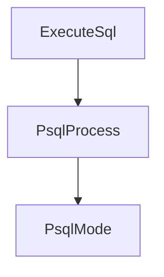

# Chapter 6: Shell Mode, Print Mode, and Wire Mode

Welcome to **Chapter 6: Shell Mode, Print Mode, and Wire Mode**. In this part of **Kimi CLI Tutorial: Multi-Mode Terminal Agent with MCP and ACP**, you will build an intuitive mental model first, then move into concrete implementation details and practical production tradeoffs.


Kimi offers multiple operating modes optimized for interactive coding, automation, or protocol-level integration.

## Mode Matrix

| Mode | Best For |
|:-----|:---------|
| default shell mode | interactive development with approvals |
| `--print` | non-interactive scripting pipelines |
| `--wire` | custom UIs and bidirectional protocol integrations |

## Automation Shortcut

```bash
kimi --quiet -p "Generate a Conventional Commits message for staged diff"
```

## Source References

- [Print mode docs](https://github.com/MoonshotAI/kimi-cli/blob/main/docs/en/customization/print-mode.md)
- [Wire mode docs](https://github.com/MoonshotAI/kimi-cli/blob/main/docs/en/customization/wire-mode.md)

## Summary

You now know when to use interactive mode versus automation/protocol modes.

Next: [Chapter 7: Loop Control, Retries, and Long Tasks](07-loop-control-retries-and-long-tasks.md)

## Depth Expansion Playbook

## Source Code Walkthrough

### `examples/kimi-psql/main.py`

The `ExecuteSql` class in [`examples/kimi-psql/main.py`](https://github.com/MoonshotAI/kimi-cli/blob/HEAD/examples/kimi-psql/main.py) handles a key part of this chapter's functionality:

```py


class ExecuteSqlParams(BaseModel):
    """Parameters for ExecuteSql tool."""

    sql: str = Field(description="The SQL query to execute in the connected PostgreSQL database")


class ExecuteSql(CallableTool2[ExecuteSqlParams]):
    """Execute read-only SQL query in the connected PostgreSQL database."""

    name: str = "ExecuteSql"
    description: str = (
        "Execute a READ-ONLY SQL query in the connected PostgreSQL database. "
        "Use this tool for SELECT queries and database introspection queries. "
        "This tool CANNOT execute write operations (INSERT, UPDATE, DELETE, DROP, etc.). "
        "For write operations, return the SQL in a markdown code block for the user to "
        "execute manually. "
        "Note: psql meta-commands (\\d, \\dt, etc.) are NOT supported - use SQL queries "
        "instead (e.g., SELECT * FROM pg_tables WHERE schemaname = 'public')."
    )
    params: type[ExecuteSqlParams] = ExecuteSqlParams

    def __init__(self, conninfo: str):
        """
        Initialize ExecuteSql tool with database connection info.

        Args:
            conninfo: PostgreSQL connection string
                (e.g., "host=localhost port=5432 dbname=mydb user=postgres")
        """
        super().__init__()
```

This class is important because it defines how Kimi CLI Tutorial: Multi-Mode Terminal Agent with MCP and ACP implements the patterns covered in this chapter.

### `examples/kimi-psql/main.py`

The `PsqlProcess` class in [`examples/kimi-psql/main.py`](https://github.com/MoonshotAI/kimi-cli/blob/HEAD/examples/kimi-psql/main.py) handles a key part of this chapter's functionality:

```py

# ============================================================================
# PsqlProcess: PTY-based psql subprocess management
# ============================================================================


class PsqlProcess:
    """Manages a psql subprocess with PTY support for full interactive experience."""

    def __init__(self, psql_args: list[str]):
        self.psql_args = psql_args
        self._master_fd: int | None = None
        self._pid: int | None = None
        self._running = False
        self._original_termios: list | None = None

    def start(self) -> None:
        """Spawn psql in a pseudo-terminal."""
        # Save original terminal settings
        if sys.stdin.isatty():
            self._original_termios = termios.tcgetattr(sys.stdin)

        pid, master_fd = pty.fork()

        if pid == 0:
            # Child process: exec psql
            os.execvp("psql", self.psql_args)
        else:
            # Parent process
            self._pid = pid
            self._master_fd = master_fd
            self._running = True
```

This class is important because it defines how Kimi CLI Tutorial: Multi-Mode Terminal Agent with MCP and ACP implements the patterns covered in this chapter.

### `examples/kimi-psql/main.py`

The `PsqlMode` class in [`examples/kimi-psql/main.py`](https://github.com/MoonshotAI/kimi-cli/blob/HEAD/examples/kimi-psql/main.py) handles a key part of this chapter's functionality:

```py

# ============================================================================
# PsqlMode: Operation mode enumeration
# ============================================================================


class PsqlMode(Enum):
    AI = "ai"  # AI assistance mode (default)
    PSQL = "psql"  # Direct psql interaction

    def toggle(self) -> "PsqlMode":
        return PsqlMode.PSQL if self == PsqlMode.AI else PsqlMode.AI


# ============================================================================
# PsqlSoul: SQL generation specialized Soul
# ============================================================================


async def create_psql_soul(llm: LLM | None, conninfo: str) -> KimiSoul:
    """Create a KimiSoul configured for PostgreSQL with ExecuteSql tool
    and standard kimi-cli tools."""
    from typing import cast

    from kimi_cli.config import load_config
    from kimi_cli.soul.agent import load_agent
    from kimi_cli.soul.toolset import KimiToolset

    config = load_config()
    kaos_work_dir = KaosPath.cwd()
    session = await Session.create(kaos_work_dir)
    runtime = await Runtime.create(
```

This class is important because it defines how Kimi CLI Tutorial: Multi-Mode Terminal Agent with MCP and ACP implements the patterns covered in this chapter.


## How These Components Connect


