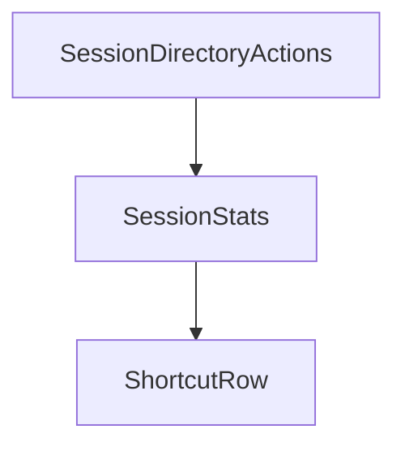

# Chapter 6: Shell Mode, Print Mode, and Wire Mode

Welcome to **Chapter 6: Shell Mode, Print Mode, and Wire Mode**. In this part of **Kimi CLI Tutorial: Multi-Mode Terminal Agent with MCP and ACP**, you will build an intuitive mental model first, then move into concrete implementation details and practical production tradeoffs.


Kimi offers multiple operating modes optimized for interactive coding, automation, or protocol-level integration.

## Mode Matrix

| Mode | Best For |
|:-----|:---------|
| default shell mode | interactive development with approvals |
| `--print` | non-interactive scripting pipelines |
| `--wire` | custom UIs and bidirectional protocol integrations |

## Automation Shortcut

```bash
kimi --quiet -p "Generate a Conventional Commits message for staged diff"
```

## Source References

- [Print mode docs](https://github.com/MoonshotAI/kimi-cli/blob/main/docs/en/customization/print-mode.md)
- [Wire mode docs](https://github.com/MoonshotAI/kimi-cli/blob/main/docs/en/customization/wire-mode.md)

## Summary

You now know when to use interactive mode versus automation/protocol modes.

Next: [Chapter 7: Loop Control, Retries, and Long Tasks](07-loop-control-retries-and-long-tasks.md)

## Source Code Walkthrough

### `vis/src/App.tsx`

The `SessionDirectoryActions` function in [`vis/src/App.tsx`](https://github.com/MoonshotAI/kimi-cli/blob/HEAD/vis/src/App.tsx) handles a key part of this chapter's functionality:

```tsx
}

function SessionDirectoryActions({
  session,
  openInSupported,
}: {
  session: SessionInfo;
  openInSupported: boolean;
}) {
  const [copied, setCopied] = useState(false);

  const handleOpenSessionDir = useCallback(async () => {
    try {
      await openInPath("finder", session.session_dir);
    } catch (error) {
      console.error("Failed to open session directory:", error);
      window.alert(
        error instanceof Error
          ? `Failed to open session directory:\n${error.message}`
          : "Failed to open session directory",
      );
    }
  }, [session.session_dir]);

  const handleCopyDirInfo = useCallback(async () => {
    try {
      await navigator.clipboard.writeText(getSessionDir(session));
      setCopied(true);
      setTimeout(() => setCopied(false), 2000);
    } catch (error) {
      console.error("Failed to copy DIR info:", error);
      window.alert("Failed to copy DIR info");
```

This function is important because it defines how Kimi CLI Tutorial: Multi-Mode Terminal Agent with MCP and ACP implements the patterns covered in this chapter.

### `vis/src/App.tsx`

The `SessionStats` function in [`vis/src/App.tsx`](https://github.com/MoonshotAI/kimi-cli/blob/HEAD/vis/src/App.tsx) handles a key part of this chapter's functionality:

```tsx
type Tab = "wire" | "context" | "state" | "dual" | "agents";

interface SessionStatsData {
  turns: number;
  steps: number;
  toolCalls: number;
  errors: number;
  compactions: number;
  durationSec: number;
  inputTokens: number;
  outputTokens: number;
  cacheRate: number;
}

function computeStats(events: WireEvent[]): SessionStatsData {
  let turns = 0;
  let steps = 0;
  let toolCalls = 0;
  let errors = 0;
  let compactions = 0;
  let inputTokens = 0;
  let outputTokens = 0;
  let totalCacheRead = 0;
  let totalInputOther = 0;
  let totalCacheCreation = 0;

  for (const e of events) {
    if (e.type === "TurnBegin") turns++;
    if (e.type === "StepBegin") steps++;
    if (e.type === "ToolCall") toolCalls++;
    if (e.type === "CompactionBegin") compactions++;
    if (isErrorEvent(e)) errors++;
```

This function is important because it defines how Kimi CLI Tutorial: Multi-Mode Terminal Agent with MCP and ACP implements the patterns covered in this chapter.

### `vis/src/App.tsx`

The `ShortcutRow` function in [`vis/src/App.tsx`](https://github.com/MoonshotAI/kimi-cli/blob/HEAD/vis/src/App.tsx) handles a key part of this chapter's functionality:

```tsx
}

function ShortcutRow({ keys, desc }: { keys: string; desc: string }) {
  return (
    <div className="flex items-center gap-3">
      <kbd className="inline-flex min-w-[2rem] items-center justify-center rounded border bg-muted px-1.5 py-0.5 font-mono text-xs">
        {keys}
      </kbd>
      <span className="text-muted-foreground">{desc}</span>
    </div>
  );
}

export function App() {
  const { theme, toggleTheme } = useTheme();
  const [sessionId, setSessionId] = useState<string | null>(() => {
    const params = new URLSearchParams(window.location.search);
    return params.get("session");
  });
  const [activeTab, setActiveTab] = useState<Tab>("wire");
  const [explorerView, setExplorerView] = useState<"sessions" | "statistics">("sessions");
  const [showShortcutHelp, setShowShortcutHelp] = useState(false);
  const [refreshKey, setRefreshKey] = useState(0);
  const [refreshing, setRefreshing] = useState(false);
  const [openInSupported, setOpenInSupported] = useState(false);
  // Agent scope: null = main agent, string = sub-agent ID
  const [agentScope, setAgentScope] = useState<string | null>(null);
  // Cross-reference navigation targets
  const [contextScrollTarget, setContextScrollTarget] = useState<string | null>(null);
  const [wireScrollTarget, setWireScrollTarget] = useState<string | null>(null);

  const handleNavigateToContext = useCallback((toolCallId: string) => {
```

This function is important because it defines how Kimi CLI Tutorial: Multi-Mode Terminal Agent with MCP and ACP implements the patterns covered in this chapter.


## How These Components Connect


