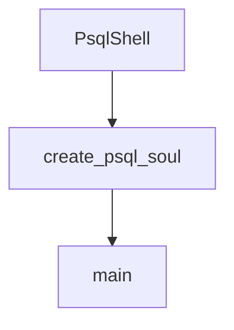

# Chapter 7: Loop Control, Retries, and Long Tasks

Welcome to **Chapter 7: Loop Control, Retries, and Long Tasks**. In this part of **Kimi CLI Tutorial: Multi-Mode Terminal Agent with MCP and ACP**, you will build an intuitive mental model first, then move into concrete implementation details and practical production tradeoffs.


Kimi includes control knobs for multi-step and long-running tasks where bounded execution is critical.

## Key Controls

- `--max-steps-per-turn`
- `--max-retries-per-step`
- `--max-ralph-iterations`

These help teams prevent runaway loops and tune behavior for complex workflows.

## Reliability Pattern

1. start with conservative step/retry limits
2. inspect outcomes and error modes
3. gradually increase limits only where justified

## Source References

- [Kimi command reference: loop control](https://github.com/MoonshotAI/kimi-cli/blob/main/docs/en/reference/kimi-command.md)
- [Sessions and context guide](https://github.com/MoonshotAI/kimi-cli/blob/main/docs/en/guides/sessions.md)

## Summary

You now have an execution-bounding strategy for larger autonomous task loops.

Next: [Chapter 8: Production Operations and Governance](08-production-operations-and-governance.md)

## Depth Expansion Playbook

## Source Code Walkthrough

### `examples/kimi-psql/main.py`

The `PsqlShell` class in [`examples/kimi-psql/main.py`](https://github.com/MoonshotAI/kimi-cli/blob/HEAD/examples/kimi-psql/main.py) handles a key part of this chapter's functionality:

```py

# ============================================================================
# PsqlShell: Main TUI orchestrator
# ============================================================================


class PsqlShell:
    """Main TUI orchestrator for kimi-psql."""

    PROMPT_SYMBOL_AI = "✨"
    PROMPT_SYMBOL_PSQL = "$"

    def __init__(self, soul: KimiSoul, psql_process: PsqlProcess):
        self.soul = soul
        self._psql_process = psql_process
        self._mode = PsqlMode.AI
        self._switch_requested = False
        self._prompt_session: PromptSession[str] | None = None
        self._psql_entered_before = False  # Track if we've entered PSQL mode before

    def _create_prompt_session(self) -> PromptSession[str]:
        """Create a prompt_toolkit session with Ctrl-X binding."""
        kb = KeyBindings()

        @kb.add("c-x", eager=True)
        def _(event) -> None:
            """Switch to PSQL mode on Ctrl-X."""
            self._switch_requested = True
            event.app.exit(result="")

        def get_prompt() -> FormattedText:
            symbol = self.PROMPT_SYMBOL_AI if self._mode == PsqlMode.AI else self.PROMPT_SYMBOL_PSQL
```

This class is important because it defines how Kimi CLI Tutorial: Multi-Mode Terminal Agent with MCP and ACP implements the patterns covered in this chapter.

### `examples/kimi-psql/main.py`

The `create_psql_soul` function in [`examples/kimi-psql/main.py`](https://github.com/MoonshotAI/kimi-cli/blob/HEAD/examples/kimi-psql/main.py) handles a key part of this chapter's functionality:

```py


async def create_psql_soul(llm: LLM | None, conninfo: str) -> KimiSoul:
    """Create a KimiSoul configured for PostgreSQL with ExecuteSql tool
    and standard kimi-cli tools."""
    from typing import cast

    from kimi_cli.config import load_config
    from kimi_cli.soul.agent import load_agent
    from kimi_cli.soul.toolset import KimiToolset

    config = load_config()
    kaos_work_dir = KaosPath.cwd()
    session = await Session.create(kaos_work_dir)
    runtime = await Runtime.create(
        config=config,
        oauth=OAuthManager(config),
        llm=llm,
        session=session,
        yolo=True,  # Auto-approve read-only SQL queries
    )

    # Load agent from configuration
    agent_file = Path(__file__).parent / "agent.yaml"
    agent = await load_agent(agent_file, runtime, mcp_configs=[])

    # Add custom ExecuteSql tool to the loaded agent
    cast(KimiToolset, agent.toolset).add(ExecuteSql(conninfo))

    context = Context(session.context_file)
    return KimiSoul(agent, context=context)

```

This function is important because it defines how Kimi CLI Tutorial: Multi-Mode Terminal Agent with MCP and ACP implements the patterns covered in this chapter.

### `examples/kimi-psql/main.py`

The `main` function in [`examples/kimi-psql/main.py`](https://github.com/MoonshotAI/kimi-cli/blob/HEAD/examples/kimi-psql/main.py) handles a key part of this chapter's functionality:

```py

Usage:
    uv run main.py -h localhost -p 5432 -U postgres -d mydb
"""

import asyncio
import contextlib
import fcntl
import os
import pty
import select
import signal
import sys
import termios
import tty
from enum import Enum
from pathlib import Path
from typing import LiteralString, cast

import psycopg
import typer
from kaos.path import KaosPath
from kosong.tooling import CallableTool2, ToolError, ToolOk, ToolReturnValue
from prompt_toolkit import PromptSession
from prompt_toolkit.formatted_text import FormattedText
from prompt_toolkit.key_binding import KeyBindings
from prompt_toolkit.patch_stdout import patch_stdout
from pydantic import BaseModel, Field, SecretStr
from rich.console import Console
from rich.panel import Panel
from rich.text import Text

```

This function is important because it defines how Kimi CLI Tutorial: Multi-Mode Terminal Agent with MCP and ACP implements the patterns covered in this chapter.


## How These Components Connect


