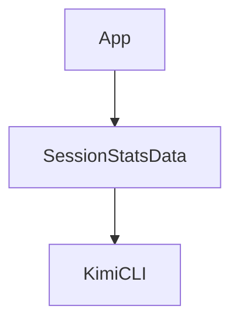

# Chapter 7: Loop Control, Retries, and Long Tasks

Welcome to **Chapter 7: Loop Control, Retries, and Long Tasks**. In this part of **Kimi CLI Tutorial: Multi-Mode Terminal Agent with MCP and ACP**, you will build an intuitive mental model first, then move into concrete implementation details and practical production tradeoffs.


Kimi includes control knobs for multi-step and long-running tasks where bounded execution is critical.

## Key Controls

- `--max-steps-per-turn`
- `--max-retries-per-step`
- `--max-ralph-iterations`

These help teams prevent runaway loops and tune behavior for complex workflows.

## Reliability Pattern

1. start with conservative step/retry limits
2. inspect outcomes and error modes
3. gradually increase limits only where justified

## Source References

- [Kimi command reference: loop control](https://github.com/MoonshotAI/kimi-cli/blob/main/docs/en/reference/kimi-command.md)
- [Sessions and context guide](https://github.com/MoonshotAI/kimi-cli/blob/main/docs/en/guides/sessions.md)

## Summary

You now have an execution-bounding strategy for larger autonomous task loops.

Next: [Chapter 8: Production Operations and Governance](08-production-operations-and-governance.md)

## Source Code Walkthrough

### `vis/src/App.tsx`

The `App` function in [`vis/src/App.tsx`](https://github.com/MoonshotAI/kimi-cli/blob/HEAD/vis/src/App.tsx) handles a key part of this chapter's functionality:

```tsx
}

export function App() {
  const { theme, toggleTheme } = useTheme();
  const [sessionId, setSessionId] = useState<string | null>(() => {
    const params = new URLSearchParams(window.location.search);
    return params.get("session");
  });
  const [activeTab, setActiveTab] = useState<Tab>("wire");
  const [explorerView, setExplorerView] = useState<"sessions" | "statistics">("sessions");
  const [showShortcutHelp, setShowShortcutHelp] = useState(false);
  const [refreshKey, setRefreshKey] = useState(0);
  const [refreshing, setRefreshing] = useState(false);
  const [openInSupported, setOpenInSupported] = useState(false);
  // Agent scope: null = main agent, string = sub-agent ID
  const [agentScope, setAgentScope] = useState<string | null>(null);
  // Cross-reference navigation targets
  const [contextScrollTarget, setContextScrollTarget] = useState<string | null>(null);
  const [wireScrollTarget, setWireScrollTarget] = useState<string | null>(null);

  const handleNavigateToContext = useCallback((toolCallId: string) => {
    setContextScrollTarget(toolCallId);
    setActiveTab("context");
  }, []);

  const handleNavigateToWire = useCallback((toolCallId: string) => {
    setWireScrollTarget(toolCallId);
    setActiveTab("wire");
  }, []);

  const handleSessionChange = useCallback((id: string | null) => {
    setSessionId(id);
```

This function is important because it defines how Kimi CLI Tutorial: Multi-Mode Terminal Agent with MCP and ACP implements the patterns covered in this chapter.

### `vis/src/App.tsx`

The `SessionStatsData` interface in [`vis/src/App.tsx`](https://github.com/MoonshotAI/kimi-cli/blob/HEAD/vis/src/App.tsx) handles a key part of this chapter's functionality:

```tsx
type Tab = "wire" | "context" | "state" | "dual" | "agents";

interface SessionStatsData {
  turns: number;
  steps: number;
  toolCalls: number;
  errors: number;
  compactions: number;
  durationSec: number;
  inputTokens: number;
  outputTokens: number;
  cacheRate: number;
}

function computeStats(events: WireEvent[]): SessionStatsData {
  let turns = 0;
  let steps = 0;
  let toolCalls = 0;
  let errors = 0;
  let compactions = 0;
  let inputTokens = 0;
  let outputTokens = 0;
  let totalCacheRead = 0;
  let totalInputOther = 0;
  let totalCacheCreation = 0;

  for (const e of events) {
    if (e.type === "TurnBegin") turns++;
    if (e.type === "StepBegin") steps++;
    if (e.type === "ToolCall") toolCalls++;
    if (e.type === "CompactionBegin") compactions++;
    if (isErrorEvent(e)) errors++;
```

This interface is important because it defines how Kimi CLI Tutorial: Multi-Mode Terminal Agent with MCP and ACP implements the patterns covered in this chapter.

### `src/kimi_cli/app.py`

The `KimiCLI` class in [`src/kimi_cli/app.py`](https://github.com/MoonshotAI/kimi-cli/blob/HEAD/src/kimi_cli/app.py) handles a key part of this chapter's functionality:

```py


class KimiCLI:
    @staticmethod
    async def create(
        session: Session,
        *,
        # Basic configuration
        config: Config | Path | None = None,
        model_name: str | None = None,
        thinking: bool | None = None,
        # Run mode
        yolo: bool = False,
        plan_mode: bool = False,
        resumed: bool = False,
        # Extensions
        agent_file: Path | None = None,
        mcp_configs: list[MCPConfig] | list[dict[str, Any]] | None = None,
        skills_dirs: list[KaosPath] | None = None,
        # Loop control
        max_steps_per_turn: int | None = None,
        max_retries_per_step: int | None = None,
        max_ralph_iterations: int | None = None,
        startup_progress: Callable[[str], None] | None = None,
        defer_mcp_loading: bool = False,
    ) -> KimiCLI:
        """
        Create a KimiCLI instance.

        Args:
            session (Session): A session created by `Session.create` or `Session.continue_`.
            config (Config | Path | None, optional): Configuration to use, or path to config file.
```

This class is important because it defines how Kimi CLI Tutorial: Multi-Mode Terminal Agent with MCP and ACP implements the patterns covered in this chapter.


## How These Components Connect


