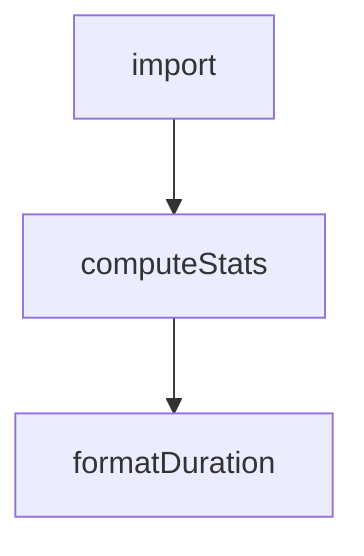

# Chapter 8: Production Operations and Governance

Welcome to **Chapter 8: Production Operations and Governance**. In this part of **Kimi CLI Tutorial: Multi-Mode Terminal Agent with MCP and ACP**, you will build an intuitive mental model first, then move into concrete implementation details and practical production tradeoffs.


Team-scale Kimi usage needs clear policy around approvals, skills, integrations, and update workflows.

## Governance Checklist

1. standardize approved agent/skill directories and naming
2. enforce review for MCP server additions and auth scopes
3. define policy for `--yolo` usage in CI and local development
4. document session retention and context compaction practices
5. pin and test version upgrades before broad rollout

## Ops Baseline

- keep changelog review in upgrade process
- use print mode for deterministic automation cases
- use wire/acp integrations only with known client trust boundaries

## Source References

- [Kimi CLI README](https://github.com/MoonshotAI/kimi-cli/blob/main/README.md)
- [Kimi changelog](https://github.com/MoonshotAI/kimi-cli/blob/main/CHANGELOG.md)
- [Agent skills docs](https://github.com/MoonshotAI/kimi-cli/blob/main/docs/en/customization/skills.md)

## Summary

You now have a production-ready operating framework for Kimi CLI across developer teams.

## Depth Expansion Playbook

## Source Code Walkthrough

### `examples/kimi-psql/main.py`

The `import` interface in [`examples/kimi-psql/main.py`](https://github.com/MoonshotAI/kimi-cli/blob/HEAD/examples/kimi-psql/main.py) handles a key part of this chapter's functionality:

```py
"""

import asyncio
import contextlib
import fcntl
import os
import pty
import select
import signal
import sys
import termios
import tty
from enum import Enum
from pathlib import Path
from typing import LiteralString, cast

import psycopg
import typer
from kaos.path import KaosPath
from kosong.tooling import CallableTool2, ToolError, ToolOk, ToolReturnValue
from prompt_toolkit import PromptSession
from prompt_toolkit.formatted_text import FormattedText
from prompt_toolkit.key_binding import KeyBindings
from prompt_toolkit.patch_stdout import patch_stdout
from pydantic import BaseModel, Field, SecretStr
from rich.console import Console
from rich.panel import Panel
from rich.text import Text

from kimi_cli.auth.oauth import OAuthManager
from kimi_cli.config import LLMModel, LLMProvider
from kimi_cli.llm import LLM, create_llm
```

This interface is important because it defines how Kimi CLI Tutorial: Multi-Mode Terminal Agent with MCP and ACP implements the patterns covered in this chapter.

### `vis/src/App.tsx`

The `computeStats` function in [`vis/src/App.tsx`](https://github.com/MoonshotAI/kimi-cli/blob/HEAD/vis/src/App.tsx) handles a key part of this chapter's functionality:

```tsx
}

function computeStats(events: WireEvent[]): SessionStatsData {
  let turns = 0;
  let steps = 0;
  let toolCalls = 0;
  let errors = 0;
  let compactions = 0;
  let inputTokens = 0;
  let outputTokens = 0;

  for (const e of events) {
    if (e.type === "TurnBegin") turns++;
    if (e.type === "StepBegin") steps++;
    if (e.type === "ToolCall") toolCalls++;
    if (e.type === "CompactionBegin") compactions++;
    if (isErrorEvent(e)) errors++;
    if (e.type === "StatusUpdate") {
      const tu = e.payload.token_usage as Record<string, number> | undefined;
      if (tu) {
        inputTokens += (tu.input_other ?? 0) + (tu.input_cache_read ?? 0) + (tu.input_cache_creation ?? 0);
        outputTokens += tu.output ?? 0;
      }
    }
  }

  const durationSec =
    events.length >= 2
      ? events[events.length - 1].timestamp - events[0].timestamp
      : 0;

  return { turns, steps, toolCalls, errors, compactions, durationSec, inputTokens, outputTokens };
```

This function is important because it defines how Kimi CLI Tutorial: Multi-Mode Terminal Agent with MCP and ACP implements the patterns covered in this chapter.

### `vis/src/App.tsx`

The `formatDuration` function in [`vis/src/App.tsx`](https://github.com/MoonshotAI/kimi-cli/blob/HEAD/vis/src/App.tsx) handles a key part of this chapter's functionality:

```tsx
}

function formatDuration(sec: number): string {
  if (sec < 1) return `${(sec * 1000).toFixed(0)}ms`;
  if (sec < 60) return `${sec.toFixed(1)}s`;
  return `${(sec / 60).toFixed(1)}min`;
}

function formatTokens(n: number): string {
  if (n === 0) return "0";
  if (n < 1000) return `${n}`;
  return `${(n / 1000).toFixed(1)}k`;
}

function getSessionDir(session: SessionInfo): string {
  return session.session_dir;
}

function SessionDirectoryActions({
  session,
  openInSupported,
}: {
  session: SessionInfo;
  openInSupported: boolean;
}) {
  const [copied, setCopied] = useState(false);

  const handleOpenSessionDir = useCallback(async () => {
    try {
      await openInPath("finder", session.session_dir);
    } catch (error) {
      console.error("Failed to open session directory:", error);
```

This function is important because it defines how Kimi CLI Tutorial: Multi-Mode Terminal Agent with MCP and ACP implements the patterns covered in this chapter.


## How These Components Connect


