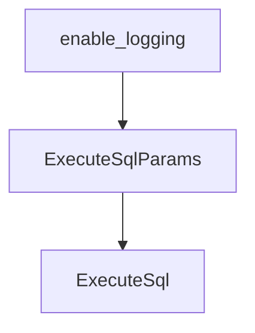

# Chapter 8: Production Operations and Governance

Welcome to **Chapter 8: Production Operations and Governance**. In this part of **Kimi CLI Tutorial: Multi-Mode Terminal Agent with MCP and ACP**, you will build an intuitive mental model first, then move into concrete implementation details and practical production tradeoffs.


Team-scale Kimi usage needs clear policy around approvals, skills, integrations, and update workflows.

## Governance Checklist

1. standardize approved agent/skill directories and naming
2. enforce review for MCP server additions and auth scopes
3. define policy for `--yolo` usage in CI and local development
4. document session retention and context compaction practices
5. pin and test version upgrades before broad rollout

## Ops Baseline

- keep changelog review in upgrade process
- use print mode for deterministic automation cases
- use wire/acp integrations only with known client trust boundaries

## Source References

- [Kimi CLI README](https://github.com/MoonshotAI/kimi-cli/blob/main/README.md)
- [Kimi changelog](https://github.com/MoonshotAI/kimi-cli/blob/main/CHANGELOG.md)
- [Agent skills docs](https://github.com/MoonshotAI/kimi-cli/blob/main/docs/en/customization/skills.md)

## Summary

You now have a production-ready operating framework for Kimi CLI across developer teams.

## Source Code Walkthrough

### `src/kimi_cli/app.py`

The `enable_logging` function in [`src/kimi_cli/app.py`](https://github.com/MoonshotAI/kimi-cli/blob/HEAD/src/kimi_cli/app.py) handles a key part of this chapter's functionality:

```py


def enable_logging(debug: bool = False, *, redirect_stderr: bool = True) -> None:
    # NOTE: stderr redirection is implemented by swapping the process-level fd=2 (dup2).
    # That can hide Click/Typer error output during CLI startup, so some entrypoints delay
    # installing it until after critical initialization succeeds.
    logger.remove()  # Remove default stderr handler
    logger.enable("kimi_cli")
    if debug:
        logger.enable("kosong")
    logger.add(
        get_share_dir() / "logs" / "kimi.log",
        # FIXME: configure level for different modules
        level="TRACE" if debug else "INFO",
        rotation="06:00",
        retention="10 days",
    )
    if redirect_stderr:
        redirect_stderr_to_logger()


def _cleanup_stale_foreground_subagents(runtime: Runtime) -> None:
    subagent_store = getattr(runtime, "subagent_store", None)
    if subagent_store is None:
        return

    stale_agent_ids = [
        record.agent_id
        for record in subagent_store.list_instances()
        if record.status == "running_foreground"
    ]
    for agent_id in stale_agent_ids:
```

This function is important because it defines how Kimi CLI Tutorial: Multi-Mode Terminal Agent with MCP and ACP implements the patterns covered in this chapter.

### `examples/kimi-psql/main.py`

The `ExecuteSqlParams` class in [`examples/kimi-psql/main.py`](https://github.com/MoonshotAI/kimi-cli/blob/HEAD/examples/kimi-psql/main.py) handles a key part of this chapter's functionality:

```py


class ExecuteSqlParams(BaseModel):
    """Parameters for ExecuteSql tool."""

    sql: str = Field(description="The SQL query to execute in the connected PostgreSQL database")


class ExecuteSql(CallableTool2[ExecuteSqlParams]):
    """Execute read-only SQL query in the connected PostgreSQL database."""

    name: str = "ExecuteSql"
    description: str = (
        "Execute a READ-ONLY SQL query in the connected PostgreSQL database. "
        "Use this tool for SELECT queries and database introspection queries. "
        "This tool CANNOT execute write operations (INSERT, UPDATE, DELETE, DROP, etc.). "
        "For write operations, return the SQL in a markdown code block for the user to "
        "execute manually. "
        "Note: psql meta-commands (\\d, \\dt, etc.) are NOT supported - use SQL queries "
        "instead (e.g., SELECT * FROM pg_tables WHERE schemaname = 'public')."
    )
    params: type[ExecuteSqlParams] = ExecuteSqlParams

    def __init__(self, conninfo: str):
        """
        Initialize ExecuteSql tool with database connection info.

        Args:
            conninfo: PostgreSQL connection string
                (e.g., "host=localhost port=5432 dbname=mydb user=postgres")
        """
        super().__init__()
```

This class is important because it defines how Kimi CLI Tutorial: Multi-Mode Terminal Agent with MCP and ACP implements the patterns covered in this chapter.

### `examples/kimi-psql/main.py`

The `ExecuteSql` class in [`examples/kimi-psql/main.py`](https://github.com/MoonshotAI/kimi-cli/blob/HEAD/examples/kimi-psql/main.py) handles a key part of this chapter's functionality:

```py


class ExecuteSqlParams(BaseModel):
    """Parameters for ExecuteSql tool."""

    sql: str = Field(description="The SQL query to execute in the connected PostgreSQL database")


class ExecuteSql(CallableTool2[ExecuteSqlParams]):
    """Execute read-only SQL query in the connected PostgreSQL database."""

    name: str = "ExecuteSql"
    description: str = (
        "Execute a READ-ONLY SQL query in the connected PostgreSQL database. "
        "Use this tool for SELECT queries and database introspection queries. "
        "This tool CANNOT execute write operations (INSERT, UPDATE, DELETE, DROP, etc.). "
        "For write operations, return the SQL in a markdown code block for the user to "
        "execute manually. "
        "Note: psql meta-commands (\\d, \\dt, etc.) are NOT supported - use SQL queries "
        "instead (e.g., SELECT * FROM pg_tables WHERE schemaname = 'public')."
    )
    params: type[ExecuteSqlParams] = ExecuteSqlParams

    def __init__(self, conninfo: str):
        """
        Initialize ExecuteSql tool with database connection info.

        Args:
            conninfo: PostgreSQL connection string
                (e.g., "host=localhost port=5432 dbname=mydb user=postgres")
        """
        super().__init__()
```

This class is important because it defines how Kimi CLI Tutorial: Multi-Mode Terminal Agent with MCP and ACP implements the patterns covered in this chapter.


## How These Components Connect


