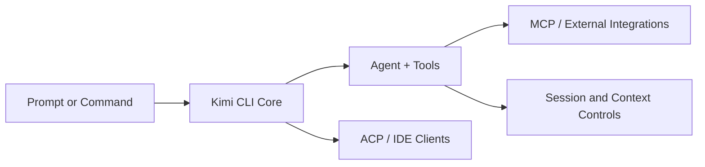

# Kimi CLI Tutorial: Multi-Mode Terminal Agent with MCP and ACP

> Learn how to use `MoonshotAI/kimi-cli` to run an interactive terminal coding agent with configurable modes, MCP integrations, and ACP-based IDE connectivity.

## Why This Track Matters

Kimi CLI combines strong terminal workflows with MCP, ACP, session controls, and automation-oriented modes, making it a high-impact option for agentic development teams.

This track focuses on:

- terminal setup, providers, and first-run flow
- command and mode controls for interactive/non-interactive use
- skills, agents, and MCP extension paths
- IDE connectivity through ACP and production governance

## Current Snapshot (auto-updated)

- repository: [`MoonshotAI/kimi-cli`](https://github.com/MoonshotAI/kimi-cli)
- stars: about **6.3k**
- latest release: [`1.12.0`](https://github.com/MoonshotAI/kimi-cli/releases/tag/1.12.0)
- recent activity: updates on **February 11, 2026**
- project positioning: terminal AI coding agent with MCP + ACP support

## Mental Model

## Chapter Guide

| Chapter | Key Question | Outcome |
|:--------|:-------------|:--------|
| [01 - Getting Started](01-getting-started.md) | How do I install and run Kimi CLI quickly? | Working baseline |
| [02 - Command Surface and Session Controls](02-command-surface-and-session-controls.md) | Which startup flags and session options matter most? | Strong command mental model |
| [03 - Agents, Subagents, and Skills](03-agents-subagents-and-skills.md) | How do I customize behavior for team workflows? | Better task specialization |
| [04 - MCP Tooling and Security Model](04-mcp-tooling-and-security-model.md) | How do I add MCP servers safely? | Extensibility with controls |
| [05 - ACP and IDE Integrations](05-acp-and-ide-integrations.md) | How does Kimi connect to external clients and IDEs? | Multi-client integration strategy |
| [06 - Shell Mode, Print Mode, and Wire Mode](06-shell-mode-print-mode-and-wire-mode.md) | Which mode should I use for interactive work vs automation? | Mode-selection framework |
| [07 - Loop Control, Retries, and Long Tasks](07-loop-control-retries-and-long-tasks.md) | How do I tune long-running autonomous behavior? | Better reliability under complex tasks |
| [08 - Production Operations and Governance](08-production-operations-and-governance.md) | How do teams standardize Kimi CLI usage safely? | Operational baseline |

## What You Will Learn

- how to run Kimi CLI across interactive, print, and protocol modes
- how to customize agents/skills for project-specific workflows
- how to integrate MCP tools and ACP clients with proper controls
- how to operationalize Kimi CLI for team-scale development

## Source References

- [Kimi CLI Repository](https://github.com/MoonshotAI/kimi-cli)
- [Kimi CLI README](https://github.com/MoonshotAI/kimi-cli/blob/main/README.md)
- [Getting Started docs](https://github.com/MoonshotAI/kimi-cli/blob/main/docs/en/guides/getting-started.md)
- [Command reference](https://github.com/MoonshotAI/kimi-cli/blob/main/docs/en/reference/kimi-command.md)
- [MCP customization docs](https://github.com/MoonshotAI/kimi-cli/blob/main/docs/en/customization/mcp.md)

## Related Tutorials

- [GitHub Copilot CLI Tutorial](../copilot-cli-tutorial/)
- [OpenCode Tutorial](../opencode-tutorial/)
- [Cline Tutorial](../cline-tutorial/)
- [OpenSkills Tutorial](../openskills-tutorial/)

---

Start with [Chapter 1: Getting Started](01-getting-started.md).

## Navigation & Backlinks

- [Start Here: Chapter 1: Getting Started](01-getting-started.md)
- [Back to Main Catalog](../../README.md#-tutorial-catalog)
- [Browse A-Z Tutorial Directory](../../discoverability/tutorial-directory.md)
- [Search by Intent](../../discoverability/query-hub.md)
- [Explore Category Hubs](../../README.md#category-hubs)

## Full Chapter Map

1. [Chapter 1: Getting Started](01-getting-started.md)
2. [Chapter 2: Command Surface and Session Controls](02-command-surface-and-session-controls.md)
3. [Chapter 3: Agents, Subagents, and Skills](03-agents-subagents-and-skills.md)
4. [Chapter 4: MCP Tooling and Security Model](04-mcp-tooling-and-security-model.md)
5. [Chapter 5: ACP and IDE Integrations](05-acp-and-ide-integrations.md)
6. [Chapter 6: Shell Mode, Print Mode, and Wire Mode](06-shell-mode-print-mode-and-wire-mode.md)
7. [Chapter 7: Loop Control, Retries, and Long Tasks](07-loop-control-retries-and-long-tasks.md)
8. [Chapter 8: Production Operations and Governance](08-production-operations-and-governance.md)

*Generated by [AI Codebase Knowledge Builder](https://github.com/The-Pocket/Tutorial-Codebase-Knowledge)*
