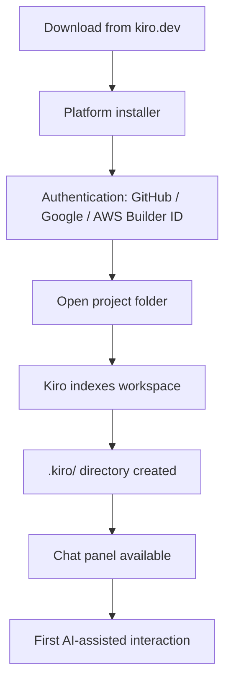

# Chapter 1: Getting Started

Welcome to **Chapter 1: Getting Started**. In this part of **Kiro Tutorial: Spec-Driven Agentic IDE from AWS**, you will build an intuitive mental model first, then move into concrete implementation details and practical production tradeoffs.


This chapter gets you from zero to a running Kiro workspace so you can move into spec-driven workflows without setup drift.

## Learning Goals

- download and install Kiro on Mac, Windows, or Linux
- authenticate using GitHub, Google, or AWS Builder ID
- open or create your first project
- understand the Kiro workspace layout and panel structure
- run your first AI-assisted interaction in the chat panel

## Fast Start Checklist

1. download Kiro from [kiro.dev](https://kiro.dev)
2. launch the installer for your platform
3. authenticate with GitHub, Google, or AWS Builder ID
4. open a local folder or clone a repository
5. open the Kiro chat panel and send a first message

## Installation Paths

| Platform | Method | Notes |
|:---------|:-------|:------|
| macOS | `.dmg` download from kiro.dev | drag to Applications, allow Gatekeeper |
| Windows | `.exe` installer from kiro.dev | run as administrator if needed |
| Linux | `.deb` or `.AppImage` from kiro.dev | mark AppImage executable before launch |

## Authentication Methods

Kiro supports three authentication providers at launch. All grant access to the same base capabilities.

| Method | Best For | Notes |
|:-------|:---------|:------|
| GitHub | developers with existing GitHub accounts | one-click OAuth flow |
| Google | teams using Google Workspace | standard OAuth redirect |
| AWS Builder ID | teams already using AWS services | connects to AWS identity layer |

```bash
# After launch, Kiro presents an authentication screen.
# No manual token setup is required for GitHub or Google.
# For AWS Builder ID, sign in at https://profile.aws.amazon.com
# and complete the device authorization flow shown in Kiro.
```

## First Project Flow

```
1. Launch Kiro
2. Select "Open Folder" or "Clone Repository"
3. For a new project: File > New Folder, then open it in Kiro
4. Kiro indexes the workspace automatically
5. Open the Chat panel (View > Kiro Chat or the sidebar icon)
6. Type: "Summarize this project structure"
```

## Workspace Layout

| Panel | Purpose |
|:------|:--------|
| Explorer | file tree with .kiro/ directory visible |
| Editor | multi-tab code editor (VS Code-compatible) |
| Chat | AI conversation panel with spec and agent controls |
| Terminal | integrated terminal for build and run commands |
| Specs | shortcut panel to requirements, design, and tasks files |

## First Interaction

```
# In the Chat panel, start simple:
> Summarize the top-level directory structure of this project.

# Kiro reads the workspace and responds with a structured overview.
# This confirms authentication and workspace indexing are working.
```

## Early Failure Triage

| Symptom | Likely Cause | First Fix |
|:--------|:-------------|:----------|
| blank chat panel after login | auth token not saved | sign out and re-authenticate |
| project files not indexed | large repo or excluded paths | check .gitignore and Kiro workspace settings |
| model response not appearing | network proxy blocking Kiro endpoints | configure proxy in Kiro settings |
| AWS Builder ID flow hangs | device code expired | restart the sign-in flow in Kiro |

## Source References

- [Kiro Website](https://kiro.dev)
- [Kiro Docs: Getting Started](https://kiro.dev/docs/getting-started)
- [Kiro Docs: Authentication](https://kiro.dev/docs/authentication)
- [Kiro Repository](https://github.com/kirodotdev/Kiro)

## Summary

You now have Kiro installed, authenticated, and connected to a project workspace.

Next: [Chapter 2: Spec-Driven Development Workflow](02-spec-driven-development-workflow.md)

## Depth Expansion Playbook

## Source Code Walkthrough

> **Note:** Kiro is a proprietary AWS IDE; the [`kirodotdev/Kiro`](https://github.com/kirodotdev/Kiro) public repository contains documentation, specs, and GitHub automation scripts rather than the IDE's source code. The authoritative references for this chapter are the official Kiro documentation and the `.kiro/` directory structure created in your projects.

### Kiro workspace layout — `.kiro/` directory

When you open a project in Kiro, it creates a `.kiro/` directory at the project root. This directory contains steering files, spec documents, and hook configurations. The `Explorer` panel in Kiro makes this directory visible — inspecting it confirms that authentication and workspace indexing worked correctly.

### [Kiro Docs: Getting Started](https://kiro.dev/docs/getting-started)

The official Getting Started guide documents the installation flow for each platform (`.dmg`, `.exe`, `.deb`/`.AppImage`), the three authentication paths (GitHub OAuth, Google OAuth, AWS Builder ID device flow), and the workspace panel structure covered in this chapter.

## How These Components Connect


