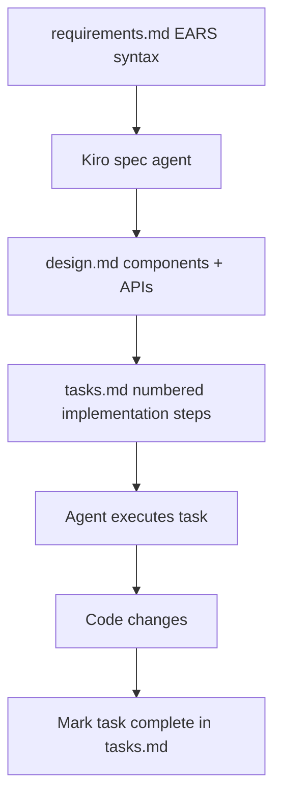

# Chapter 2: Spec-Driven Development Workflow

Welcome to **Chapter 2: Spec-Driven Development Workflow**. In this part of **Kiro Tutorial: Spec-Driven Agentic IDE from AWS**, you will build an intuitive mental model first, then move into concrete implementation details and practical production tradeoffs.


Kiro's defining innovation is that AI assistance is organized around three structured documents rather than freeform chat. This chapter teaches you how to create, iterate, and execute against specs.

## Learning Goals

- understand the three-file spec structure: requirements.md, design.md, tasks.md
- write requirements using EARS (Easy Approach to Requirements Syntax)
- generate a design document from requirements using Kiro's spec agent
- break design into actionable tasks that Kiro agents can execute
- iterate specs as requirements change without losing design traceability

## Fast Start Checklist

1. open the Kiro Specs panel or navigate to `.kiro/specs/`
2. create a new spec with a feature name (e.g., `user-authentication`)
3. write at least three requirements in EARS format in `requirements.md`
4. ask Kiro to generate `design.md` from the requirements
5. ask Kiro to generate `tasks.md` from the design
6. execute the first task

## The Three-File Spec Structure

```
.kiro/
  specs/
    user-authentication/
      requirements.md   ← what the feature must do (EARS syntax)
      design.md         ← how to build it (architecture, data models, APIs)
      tasks.md          ← numbered implementation steps for the agent
```

Each spec lives in its own named folder under `.kiro/specs/`. Committing these files to version control gives your team a living record of AI-assisted design decisions.

## EARS Syntax for Requirements

EARS (Easy Approach to Requirements Syntax) is a structured natural-language format for writing unambiguous requirements. Kiro expects requirements in this format to generate high-quality design and task documents.

| EARS Pattern | Template | Example |
|:-------------|:---------|:--------|
| Ubiquitous | The `<system>` shall `<action>`. | The system shall hash passwords using bcrypt. |
| Event-driven | When `<trigger>`, the `<system>` shall `<action>`. | When a user submits a login form, the system shall validate credentials against the database. |
| Unwanted behavior | If `<condition>`, then the `<system>` shall `<action>`. | If credentials are invalid, then the system shall return a 401 response with an error message. |
| State-driven | While `<state>`, the `<system>` shall `<action>`. | While a session is active, the system shall refresh the JWT token every 15 minutes. |
| Optional feature | Where `<feature>` is supported, the `<system>` shall `<action>`. | Where MFA is enabled, the system shall require a TOTP code at login. |

## Writing requirements.md

```markdown
# Requirements: User Authentication

## Functional Requirements

- The system shall store user credentials with bcrypt-hashed passwords at cost factor 12.
- When a user submits valid credentials, the system shall issue a signed JWT with a 1-hour expiry.
- If credentials are invalid, then the system shall return HTTP 401 with a generic error message.
- While a session is active, the system shall refresh the JWT automatically 5 minutes before expiry.
- When a user requests logout, the system shall invalidate the session token immediately.

## Non-Functional Requirements

- The system shall complete credential validation in under 200ms at p95.
- If the authentication service is unavailable, then the system shall return HTTP 503 within 5 seconds.
```

## Generating design.md

Once requirements are written, ask Kiro to generate the design:

```
# In the Chat panel:
> Generate a design document for the user-authentication spec based on requirements.md

# Kiro reads requirements.md and produces design.md covering:
# - component architecture (auth service, token store, session manager)
# - data models (User, Session, RefreshToken)
# - API contracts (POST /auth/login, POST /auth/logout, POST /auth/refresh)
# - error handling strategy
# - security considerations
```

A sample `design.md` excerpt:

```markdown
# Design: User Authentication

## Architecture

The authentication feature uses a three-layer model:
- API layer: Express routes for /auth/login, /auth/logout, /auth/refresh
- Service layer: AuthService with validateCredentials(), issueToken(), revokeToken()
- Data layer: PostgreSQL users table, Redis session store for token revocation

## Data Models

### User
| Field | Type | Constraints |
|:------|:-----|:-----------|
| id | UUID | primary key |
| email | VARCHAR(255) | unique, not null |
| password_hash | VARCHAR(60) | bcrypt, not null |
| created_at | TIMESTAMP | not null |

## API Contracts

POST /auth/login
  Body: { email: string, password: string }
  Success: 200 { token: string, expires_at: ISO8601 }
  Failure: 401 { error: "invalid_credentials" }
```

## Generating tasks.md

After the design is approved, ask Kiro to generate the task list:

```
> Generate a tasks.md implementation plan from design.md

# Kiro produces a numbered task list such as:
```

```markdown
# Tasks: User Authentication

- [ ] 1. Create PostgreSQL migration for users table with id, email, password_hash, created_at
- [ ] 2. Implement AuthService.validateCredentials() with bcrypt comparison
- [ ] 3. Implement AuthService.issueToken() using jsonwebtoken with 1h expiry
- [ ] 4. Implement AuthService.revokeToken() using Redis SET with TTL
- [ ] 5. Create POST /auth/login route with input validation and AuthService calls
- [ ] 6. Create POST /auth/logout route that calls revokeToken()
- [ ] 7. Create POST /auth/refresh route with automatic token renewal
- [ ] 8. Add middleware to verify JWT on protected routes
- [ ] 9. Write unit tests for AuthService methods
- [ ] 10. Write integration tests for all /auth routes
```

## Executing Tasks

You can execute tasks one by one or delegate them to the autonomous agent:

```
# Execute a single task:
> Complete task 1: create the PostgreSQL migration for the users table

# Delegate all tasks to the agent:
> Execute all tasks in tasks.md for the user-authentication spec
```

## Iterating Specs

When requirements change, update `requirements.md` first, then regenerate downstream documents:

```
> requirements.md has been updated to add MFA support. Regenerate design.md to include TOTP handling.

# After confirming design.md:
> Regenerate tasks.md to include the new MFA tasks from design.md
```

## Source References

- [Kiro Docs: Specs](https://kiro.dev/docs/specs)
- [Kiro Docs: EARS Syntax](https://kiro.dev/docs/specs/ears)
- [Kiro Repository](https://github.com/kirodotdev/Kiro)

## Summary

You now understand how to create, generate, and execute three-file specs in Kiro using EARS requirements syntax.

Next: [Chapter 3: Agent Steering and Rules Configuration](03-agent-steering-and-rules-configuration.md)

## Depth Expansion Playbook

## Source Code Walkthrough

> **Note:** Kiro is a proprietary AWS IDE; the [`kirodotdev/Kiro`](https://github.com/kirodotdev/Kiro) public repository contains documentation and GitHub automation scripts rather than the IDE's source code. The authoritative references for this chapter are the official Kiro documentation and configuration files within your project's `.kiro/` directory.

### [Kiro Docs: Specs](https://kiro.dev/docs/specs)

The official specs guide documents the three-file structure (`requirements.md`, `design.md`, `tasks.md`), EARS syntax patterns, and the iterative spec workflow described in this chapter. The `.kiro/specs/<feature>/` directory layout is the authoritative schema.

### [Kiro Docs: EARS Syntax](https://kiro.dev/docs/specs/ears)

The EARS syntax reference documents the five requirement patterns (Ubiquitous, Event-driven, Unwanted behavior, State-driven, Optional feature) that structure `requirements.md` files and drive Kiro's spec-to-design generation.

## How These Components Connect

