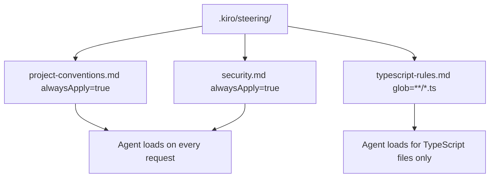

# Chapter 3: Agent Steering and Rules Configuration

Welcome to **Chapter 3: Agent Steering and Rules Configuration**. In this part of **Kiro Tutorial: Spec-Driven Agentic IDE from AWS**, you will build an intuitive mental model first, then move into concrete implementation details and practical production tradeoffs.


Kiro's steering system lets you encode persistent, project-scoped rules that guide AI behavior without repeating them in every prompt. This chapter teaches you how to build and manage the `.kiro/steering/` directory.

## Learning Goals

- understand the purpose and structure of the `.kiro/steering/` directory
- create steering files that encode technology choices, coding conventions, and project context
- use inclusion and exclusion patterns to scope steering rules to specific file types or directories
- combine multiple steering files for layered, composable rule sets
- troubleshoot steering conflicts and priority ordering

## Fast Start Checklist

1. create `.kiro/steering/` in your project root
2. create `project.md` with your stack, conventions, and key decisions
3. create `coding-style.md` with language-specific style rules
4. verify the steering files are loaded by asking Kiro a question that requires the rules
5. commit `.kiro/steering/` to version control for team sharing

## The Steering Directory Structure

```
.kiro/
  steering/
    project.md          ← always-active project context and technology decisions
    coding-style.md     ← language and framework style conventions
    testing.md          ← testing strategy and framework preferences
    security.md         ← security policies and forbidden patterns
    api-contracts.md    ← API design rules and backward compatibility requirements
```

Steering files are plain markdown. Kiro reads all files in `.kiro/steering/` and injects their content as persistent context for every agent interaction in the workspace.

## Steering File Format

```markdown
# Project Context

## Technology Stack
- Runtime: Node.js 20 with TypeScript strict mode
- Framework: Express 4 with class-validator for input validation
- Database: PostgreSQL 15 with Prisma ORM
- Testing: Jest with ts-jest, supertest for integration tests
- Deployment: AWS Lambda with the Serverless Framework

## Key Decisions
- All new API routes must follow RESTful conventions with plural resource names.
- Use async/await throughout; no raw Promise chains.
- All database queries must go through Prisma; no raw SQL.
- Error responses must use the standard { error: string, code: string } shape.

## Forbidden Patterns
- Never use `any` type in TypeScript.
- Never commit secrets or API keys; use AWS Secrets Manager references.
- Never use synchronous file I/O in request handlers.
```

## Scoped Steering with Inclusion Patterns

You can scope a steering file to apply only when working on specific directories or file types:

```markdown
---
applies_to:
  - "src/api/**"
  - "*.route.ts"
---

# API Route Conventions

- All routes must use express-validator for request body validation.
- Route handlers must be thin: delegate business logic to service classes.
- Return 201 for resource creation, 200 for reads and updates, 204 for deletions.
- Never return raw database error messages to clients.
```

## Example: Security Steering File

```markdown
# Security Policy

## Authentication
- All endpoints except /auth/login and /health must require a valid JWT.
- JWTs must be verified using the RS256 algorithm.
- Never log full JWT tokens; log only the token's jti claim.

## Input Handling
- All user inputs must be validated and sanitized before use.
- Use parameterized queries for all database operations.
- Reject requests with payloads over 1MB with HTTP 413.

## Dependency Policy
- Audit new npm packages with `npm audit` before adding to package.json.
- Pin all production dependency versions; use ranges only for devDependencies.
```

## Example: Testing Steering File

```markdown
# Testing Conventions

## Unit Tests
- Use describe/it blocks with descriptive names that read like sentences.
- Mock all external dependencies (database, HTTP calls) in unit tests.
- Target 80% branch coverage for all service classes.

## Integration Tests
- Use a dedicated test database seeded from fixtures.
- Test the full HTTP stack with supertest; do not mock Express.
- Reset the database state between test suites using beforeEach hooks.

## Test Naming
- Unit test files: `<filename>.test.ts` next to the source file.
- Integration test files: `tests/integration/<feature>.integration.test.ts`.
```

## Combining Steering Files

Kiro merges all active steering files into a single context block. The order of injection follows alphabetical filename order. To control priority, prefix files with numbers:

```
.kiro/steering/
  00-project.md       ← highest priority, always active
  01-coding-style.md
  02-testing.md
  03-security.md
  10-api-contracts.md
```

## Verifying Steering is Active

```
# In the Chat panel:
> What testing framework should I use for this project?

# Expected response (with testing.md loaded):
# Based on the project steering, you should use Jest with ts-jest for unit tests
# and supertest for integration tests.

# If Kiro responds with a generic answer, check:
# 1. .kiro/steering/ exists and contains markdown files
# 2. The files have valid markdown content (no syntax errors)
# 3. The workspace was reopened after adding steering files
```

## Steering vs. Chat Prompts

| Aspect | Steering Files | Chat Prompts |
|:-------|:---------------|:-------------|
| Persistence | permanent, loaded every session | session-only |
| Scope | project-wide or file-scoped | per-conversation |
| Version controlled | yes, committed to git | no |
| Shared with team | yes | no |
| Use for | technology decisions, conventions, policies | specific tasks and one-off instructions |

## Source References

- [Kiro Docs: Steering](https://kiro.dev/docs/steering)
- [Kiro Docs: Steering Files](https://kiro.dev/docs/steering/files)
- [Kiro Repository](https://github.com/kirodotdev/Kiro)

## Summary

You now know how to create, scope, and combine steering files that encode persistent project rules for Kiro agents.

Next: [Chapter 4: Autonomous Agent Mode](04-autonomous-agent-mode.md)

## Depth Expansion Playbook

## Source Code Walkthrough

> **Note:** Kiro is a proprietary AWS IDE; the [`kirodotdev/Kiro`](https://github.com/kirodotdev/Kiro) public repository contains documentation and GitHub automation scripts rather than the IDE's source code. The authoritative references for this chapter are the official Kiro documentation and configuration files within your project's `.kiro/` directory.

### [Kiro Docs: Steering](https://kiro.dev/docs/steering)

The steering guide documents the `.kiro/steering/` directory structure, the front-matter fields (`inclusion`, `alwaysApply`), and how multiple steering files are composed. These files are the actual configuration artifacts for the agent behavior described in this chapter.

### [Kiro Repository — example steering files](https://github.com/kirodotdev/Kiro/tree/main/.kiro)

The Kiro repository's own `.kiro/` directory contains real steering file examples used by the project itself — examining these shows practical steering file structure and scope patterns.

## How These Components Connect

