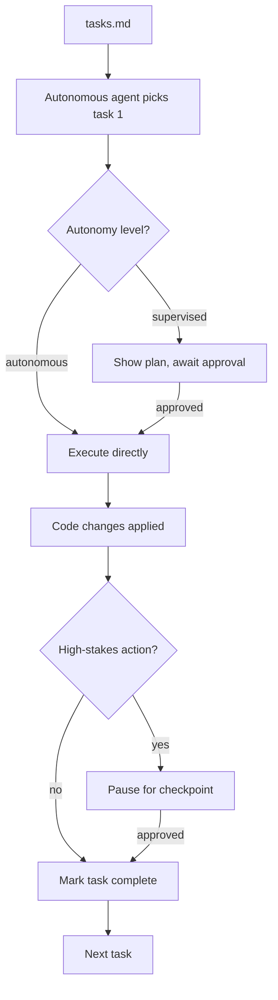

# Chapter 4: Autonomous Agent Mode

Welcome to **Chapter 4: Autonomous Agent Mode**. In this part of **Kiro Tutorial: Spec-Driven Agentic IDE from AWS**, you will build an intuitive mental model first, then move into concrete implementation details and practical production tradeoffs.


Kiro's autonomous agent mode delegates multi-step execution to an AI agent that can read files, write code, run terminal commands, and iterate — all without manual approval of each step. This chapter teaches you how to delegate safely and monitor effectively.

## Learning Goals

- understand the difference between interactive chat and autonomous agent execution
- configure autonomy levels and approval gates for different task types
- delegate complete tasks from tasks.md to the autonomous agent
- monitor agent progress and intervene when needed
- define safe boundaries for autonomous execution in production-adjacent environments

## Fast Start Checklist

1. open a tasks.md with at least one uncompleted task
2. select the task and choose "Execute with Agent" in the Kiro interface
3. observe the agent's step-by-step execution in the Agent Activity panel
4. verify the output files and test results after completion
5. mark the task as complete in tasks.md

## Autonomous vs. Interactive Mode

| Mode | Agent Behavior | Approval Required | Best For |
|:-----|:---------------|:-----------------|:---------|
| Interactive Chat | responds to each message, waits for next | every step | exploratory work, design discussion |
| Supervised Agent | executes steps, pauses at risk boundaries | pre-configured risk points | complex tasks with clear specs |
| Autonomous Agent | executes full task end-to-end | none during execution | well-specified tasks from tasks.md |

## Autonomy Levels

Kiro supports three autonomy levels that control how much the agent does before stopping for human input:

| Level | Description | Stops When |
|:------|:------------|:-----------|
| Cautious | executes one sub-step at a time | after every file write or command |
| Balanced | executes logical task groups | before destructive commands or large rewrites |
| Full | executes the complete task | only on error or completion |

Configure the autonomy level in `.kiro/settings.json`:

```json
{
  "agent": {
    "autonomyLevel": "balanced",
    "allowedCommands": ["npm test", "npm run build", "npx prisma migrate dev"],
    "forbiddenCommands": ["rm -rf", "git push --force", "npm publish"],
    "maxFileEditsPerTask": 20,
    "requireApprovalForNewFiles": false
  }
}
```

## Delegating a Task

```
# In the Chat panel with tasks.md open:
> Execute task 3: implement AuthService.issueToken() using jsonwebtoken with 1h expiry

# The agent will:
# 1. Read design.md for the AuthService interface contract
# 2. Read the current src/auth/auth.service.ts file
# 3. Write the issueToken() implementation
# 4. Run the relevant unit tests
# 5. Report completion or errors
```

## Agent Activity Panel

During autonomous execution, the Agent Activity panel shows the agent's step-by-step reasoning:

```
[Agent] Reading design.md for AuthService interface...
[Agent] Reading src/auth/auth.service.ts...
[Agent] Writing issueToken() implementation...
  + Added import { sign } from 'jsonwebtoken'
  + Added issueToken(userId: string): string method
[Agent] Running: npm test -- --testPathPattern=auth.service
  PASS src/auth/auth.service.test.ts (3 tests passed)
[Agent] Task 3 complete. 1 file modified, 3 tests passing.
```

## Interrupting Agent Execution

You can interrupt the agent at any point:

```
# Press Escape or click "Stop Agent" in the activity panel

# After stopping:
> What did you complete before I interrupted you?
# Agent summarizes completed sub-steps

# Review and decide whether to:
# - Resume from the last checkpoint
# - Discard changes and restart
# - Complete the remaining steps manually
```

## Safe Boundaries for Autonomous Execution

Define boundaries before delegating autonomous tasks, especially in shared or production-adjacent environments:

```markdown
# Safe for autonomous execution:
- Writing new source files in src/
- Modifying test files
- Running unit and integration tests
- Installing dev dependencies
- Running database migrations in test environments

# Requires human approval:
- Modifying .env files or secrets
- Pushing to remote branches
- Running database migrations in staging or production
- Publishing packages
- Deleting files (except test artifacts)
```

## Multi-Step Task Delegation

For complex features, delegate multiple sequential tasks:

```
> Execute tasks 1 through 5 in tasks.md for the user-authentication spec.
  Stop after each task group and show me what was completed before proceeding.

# Agent executes:
# Task 1: database migration → reports completion
# Task 2: AuthService.validateCredentials() → reports completion
# Task 3: AuthService.issueToken() → reports completion
# [pauses for review]
# Task 4: AuthService.revokeToken() → reports completion
# Task 5: POST /auth/login route → reports completion
# [pauses for review]
```

## Error Recovery in Autonomous Mode

When the agent encounters an error, it attempts self-correction:

```
[Agent] Running: npm test -- --testPathPattern=auth.service
  FAIL src/auth/auth.service.test.ts
  ● AuthService › issueToken › should return a valid JWT
    Expected: string matching /^ey/
    Received: undefined

[Agent] Analyzing test failure...
[Agent] Issue found: JWT_SECRET environment variable not set in test environment
[Agent] Fixing: adding JWT_SECRET to jest.config.ts testEnvironment setup...
[Agent] Running tests again...
  PASS src/auth/auth.service.test.ts (3 tests passed)
[Agent] Task 3 complete after one self-correction.
```

## Source References

- [Kiro Docs: Autonomous Agent](https://kiro.dev/docs/agent)
- [Kiro Docs: Autonomy Levels](https://kiro.dev/docs/agent/autonomy)
- [Kiro Docs: Agent Activity](https://kiro.dev/docs/agent/activity)
- [Kiro Repository](https://github.com/kirodotdev/Kiro)

## Summary

You now know how to delegate tasks to Kiro's autonomous agent, configure autonomy levels, monitor execution, and define safe operational boundaries.

Next: [Chapter 5: MCP Integration and External Tools](05-mcp-integration-and-external-tools.md)

## Depth Expansion Playbook

## Source Code Walkthrough

> **Note:** Kiro is a proprietary AWS IDE; the [`kirodotdev/Kiro`](https://github.com/kirodotdev/Kiro) public repository contains documentation and GitHub automation scripts rather than the IDE's source code. The authoritative references for this chapter are the official Kiro documentation and configuration files within your project's `.kiro/` directory.

### [Kiro Docs: Agent Mode](https://kiro.dev/docs/agent)

The agent mode documentation covers autonomy levels (assisted, supervised, autonomous), task delegation patterns, the approval checkpoint system, and rollback mechanisms. These are the runtime behaviors described in this chapter.

### [Kiro Docs: Specs — tasks.md execution](https://kiro.dev/docs/specs)

When autonomous mode executes a `tasks.md` file, it processes numbered tasks sequentially. The spec documentation explains how Kiro's agent tracks task completion, pauses for human review at checkpoints, and resumes execution after approval.

## How These Components Connect

