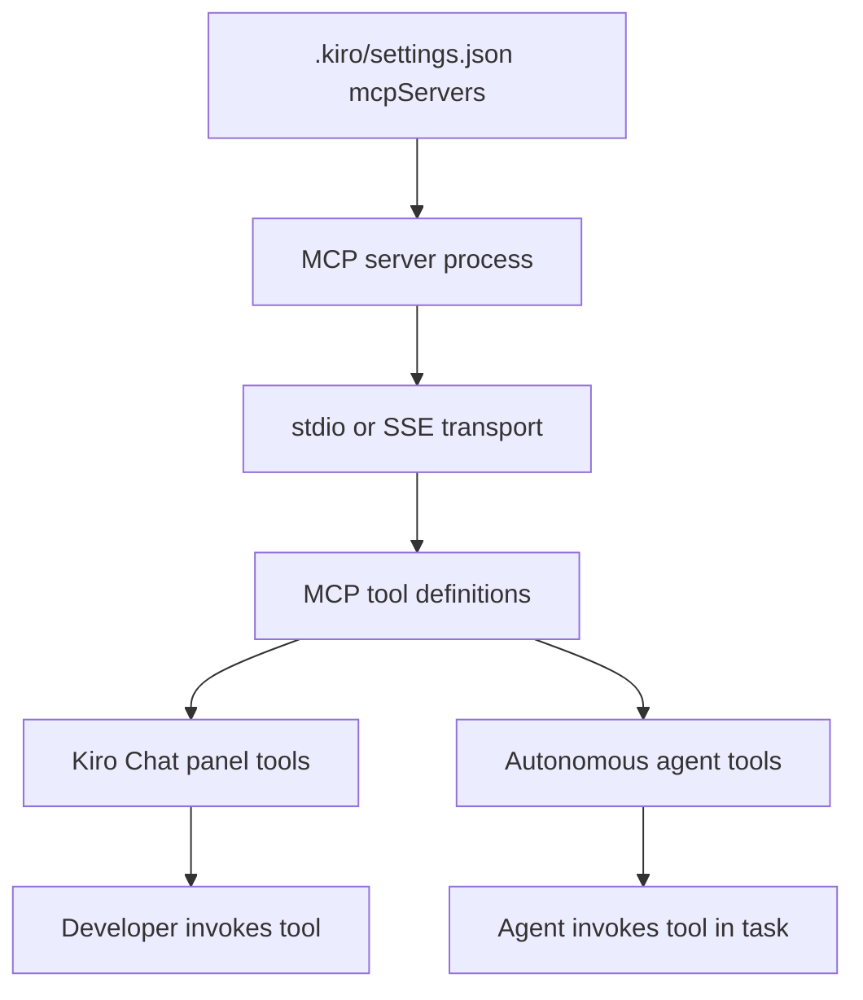

# Chapter 5: MCP Integration and External Tools

Welcome to **Chapter 5: MCP Integration and External Tools**. In this part of **Kiro Tutorial: Spec-Driven Agentic IDE from AWS**, you will build an intuitive mental model first, then move into concrete implementation details and practical production tradeoffs.


Kiro supports the Model Context Protocol (MCP) to connect external data sources, APIs, and tools to the AI agent. This chapter teaches you how to configure MCP servers and use them within specs and autonomous tasks.

## Learning Goals

- understand the MCP protocol and how Kiro uses it to connect external tools
- configure local and remote MCP servers in `.kiro/mcp.json`
- use connected MCP tools within chat and autonomous agent tasks
- build a custom MCP server for project-specific data sources
- manage MCP server authentication and security boundaries

## Fast Start Checklist

1. create `.kiro/mcp.json` with at least one MCP server entry
2. restart the Kiro workspace to load the MCP configuration
3. verify the MCP server is listed as active in Kiro settings
4. invoke a tool from the connected server in the chat panel
5. delegate an agent task that uses the MCP tool

## What is MCP?

MCP (Model Context Protocol) is an open protocol developed by Anthropic that defines how AI models connect to external tools and data sources. Kiro implements MCP as its primary extension mechanism, allowing agents to:

- query external APIs (GitHub, Jira, Confluence, Slack)
- access databases and internal documentation systems
- call custom business logic via local servers
- retrieve real-time data that is not available in the codebase

## MCP Server Configuration

MCP servers are configured in `.kiro/mcp.json`:

```json
{
  "mcpServers": {
    "github": {
      "command": "npx",
      "args": ["-y", "@modelcontextprotocol/server-github"],
      "env": {
        "GITHUB_PERSONAL_ACCESS_TOKEN": "${GITHUB_TOKEN}"
      }
    },
    "postgres": {
      "command": "npx",
      "args": ["-y", "@modelcontextprotocol/server-postgres", "postgresql://localhost/myapp"],
      "env": {}
    },
    "filesystem": {
      "command": "npx",
      "args": ["-y", "@modelcontextprotocol/server-filesystem", "/path/to/docs"],
      "env": {}
    }
  }
}
```

## Commonly Used MCP Servers

| Server | Package | Use Case |
|:-------|:--------|:---------|
| GitHub | `@modelcontextprotocol/server-github` | read issues, PRs, and code across repos |
| PostgreSQL | `@modelcontextprotocol/server-postgres` | query and inspect database schema and data |
| Filesystem | `@modelcontextprotocol/server-filesystem` | access documents outside the workspace |
| Brave Search | `@modelcontextprotocol/server-brave-search` | web search for documentation and APIs |
| Slack | `@modelcontextprotocol/server-slack` | read channel messages and user context |
| AWS Docs | custom or community server | query AWS service documentation |

## Using MCP Tools in Chat

Once configured, MCP tools are available in every chat interaction:

```
# Query GitHub issues:
> List all open issues labeled "bug" in the kirodotdev/Kiro repository

# Query the database:
> Show me the schema of the users table in the PostgreSQL database

# Search documentation:
> Find the Confluence page describing our API versioning policy

# The agent calls the appropriate MCP tool automatically and includes
# the results in its response context.
```

## Using MCP Tools in Autonomous Agent Tasks

MCP tools extend the autonomous agent's capabilities for tasks that require external data:

```markdown
# In tasks.md:
- [ ] 7. Query the GitHub issues API to identify all bugs tagged "auth-related"
         and generate a bug summary section in docs/auth-bugs.md
```

```
# Agent execution:
[Agent] Calling MCP tool: github.listIssues(labels=["bug", "auth-related"])
[Agent] Retrieved 12 issues from kirodotdev/Kiro
[Agent] Generating summary...
[Agent] Writing docs/auth-bugs.md...
[Agent] Task 7 complete.
```

## Remote MCP Servers

For team-shared MCP servers that are not installed locally, use the SSE or HTTP transport:

```json
{
  "mcpServers": {
    "internal-api": {
      "url": "https://mcp.internal.company.com/api",
      "headers": {
        "Authorization": "Bearer ${INTERNAL_API_TOKEN}"
      }
    },
    "confluence": {
      "url": "https://mcp.internal.company.com/confluence",
      "headers": {
        "Authorization": "Bearer ${CONFLUENCE_TOKEN}"
      }
    }
  }
}
```

## Building a Custom MCP Server

For project-specific data sources, build a custom MCP server using the MCP SDK:

```typescript
// custom-mcp-server.ts
import { Server } from "@modelcontextprotocol/sdk/server/index.js";
import { StdioServerTransport } from "@modelcontextprotocol/sdk/server/stdio.js";

const server = new Server({
  name: "project-data",
  version: "1.0.0"
}, {
  capabilities: { tools: {} }
});

server.setRequestHandler("tools/list", async () => ({
  tools: [{
    name: "get_feature_flags",
    description: "Get the current feature flag configuration from the internal config service",
    inputSchema: {
      type: "object",
      properties: {
        environment: { type: "string", enum: ["dev", "staging", "prod"] }
      },
      required: ["environment"]
    }
  }]
}));

server.setRequestHandler("tools/call", async (request) => {
  if (request.params.name === "get_feature_flags") {
    const env = request.params.arguments.environment;
    // fetch from internal config service
    const flags = await fetchFeatureFlags(env);
    return { content: [{ type: "text", text: JSON.stringify(flags) }] };
  }
});

const transport = new StdioServerTransport();
await server.connect(transport);
```

Register the custom server in `.kiro/mcp.json`:

```json
{
  "mcpServers": {
    "project-data": {
      "command": "npx",
      "args": ["ts-node", "./tools/custom-mcp-server.ts"],
      "env": {
        "CONFIG_SERVICE_URL": "${CONFIG_SERVICE_URL}"
      }
    }
  }
}
```

## MCP Security Boundaries

| Security Concern | Recommended Practice |
|:----------------|:---------------------|
| Credential storage | use environment variable references like `${VAR_NAME}` in mcp.json; never hardcode tokens |
| Network access | restrict MCP servers to read-only access for data sources when possible |
| Tool scoping | list only the tools the agent needs; disable unused tools to reduce attack surface |
| Audit logging | log all MCP tool invocations with arguments for security audit trails |
| Server isolation | run untrusted MCP servers in sandboxed environments (Docker, subprocess isolation) |

## Source References

- [Kiro Docs: MCP](https://kiro.dev/docs/mcp)
- [Kiro Docs: MCP Configuration](https://kiro.dev/docs/mcp/configuration)
- [MCP Specification](https://spec.modelcontextprotocol.io)
- [MCP TypeScript SDK](https://github.com/modelcontextprotocol/typescript-sdk)
- [MCP Server Registry](https://github.com/modelcontextprotocol/servers)
- [Kiro Repository](https://github.com/kirodotdev/Kiro)

## Summary

You now know how to configure MCP servers, use external tools in chat and autonomous tasks, and build custom MCP servers for project-specific data sources.

Next: [Chapter 6: Hooks and Automation](06-hooks-and-automation.md)

## Depth Expansion Playbook

## Source Code Walkthrough

> **Note:** Kiro is a proprietary AWS IDE; the [`kirodotdev/Kiro`](https://github.com/kirodotdev/Kiro) public repository contains documentation and GitHub automation scripts rather than the IDE's source code. The authoritative references for this chapter are the official Kiro documentation and configuration files within your project's `.kiro/` directory.

### [Kiro Docs: MCP](https://kiro.dev/docs/mcp)

The MCP guide documents how to configure MCP servers in `.kiro/settings.json`, the supported transport types (stdio, SSE), and how Kiro exposes MCP tools in the Chat panel and autonomous agent task execution.

### [.kiro/settings.json — MCP server configuration](https://kiro.dev/docs/mcp)

MCP server configuration lives in `.kiro/settings.json` under the `mcpServers` key. The schema specifies `command`, `args`, `env`, and `disabled` fields for each server — examining this file in a Kiro project shows the exact configuration format.

## How These Components Connect

