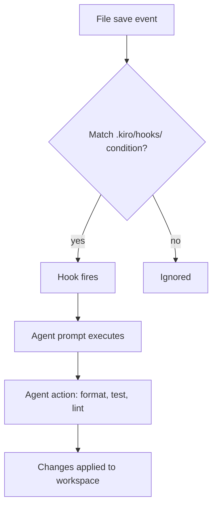

# Chapter 6: Hooks and Automation

Welcome to **Chapter 6: Hooks and Automation**. In this part of **Kiro Tutorial: Spec-Driven Agentic IDE from AWS**, you will build an intuitive mental model first, then move into concrete implementation details and practical production tradeoffs.


Kiro hooks are event-driven triggers that invoke agent actions automatically when specific events occur in the workspace. This chapter teaches you how to build hooks that eliminate repetitive manual workflows.

## Learning Goals

- understand the Kiro hook model: events, conditions, and agent actions
- create hooks for common events: file save, test completion, and spec changes
- configure hook conditions to avoid unnecessary agent activations
- combine hooks with steering files for governed automation
- avoid common hook pitfalls like infinite loops and excessive token consumption

## Fast Start Checklist

1. create `.kiro/hooks/` directory in your project root
2. create your first hook file (e.g., `on-save-lint.md`)
3. define the event trigger, condition, and agent action in the hook
4. save a file to trigger the hook and observe the agent response
5. review the hook's agent activity log and refine the condition

## The Hook Model

Each Kiro hook is a markdown file in `.kiro/hooks/` with three components:

| Component | Purpose | Example |
|:----------|:--------|:--------|
| event | what triggers the hook | `file:save`, `test:complete`, `spec:updated` |
| condition | when to activate (optional filter) | `file matches "src/**/*.ts"` |
| action | what the agent does when triggered | "run the linter on the saved file and fix any warnings" |

## Hook File Format

```markdown
---
event: file:save
condition: file matches "src/**/*.ts"
---

# On TypeScript File Save: Run Lint and Format

When a TypeScript file in `src/` is saved, run ESLint with the `--fix` flag on the saved file
and apply Prettier formatting. Report any errors that cannot be auto-fixed.
```

## Built-in Event Types

| Event | Trigger Condition |
|:------|:-----------------|
| `file:save` | any file is saved in the workspace |
| `file:create` | a new file is created |
| `file:delete` | a file is deleted |
| `test:complete` | a test run finishes (pass or fail) |
| `spec:updated` | a file in `.kiro/specs/` is changed |
| `task:complete` | an autonomous agent task completes |
| `git:commit` | a git commit is made in the workspace |
| `chat:response` | the agent produces a chat response |

## Example Hooks

### Auto-Lint on Save

```markdown
---
event: file:save
condition: file matches "src/**/*.{ts,tsx}"
---

# Auto-Lint TypeScript on Save

Run ESLint with `--fix` on the saved file. If there are unfixable errors, open the Problems
panel and highlight the first error. Do not modify files other than the one that was saved.
```

### Test Failure Analysis

```markdown
---
event: test:complete
condition: test_result == "fail"
---

# Analyze Test Failures

When the test run completes with failures, analyze the failing test output and provide:
1. A one-line root cause summary for each failing test
2. The most likely file to fix
3. A suggested code change (do not apply automatically; show in chat)
```

### Spec Update Propagation

```markdown
---
event: spec:updated
condition: file matches ".kiro/specs/**/requirements.md"
---

# Requirements Changed: Check Design Alignment

When requirements.md is updated, review the current design.md for the same spec and
identify any requirements that are not covered by the existing design. List the gaps
in the chat panel without modifying design.md automatically.
```

### Post-Commit Documentation Update

```markdown
---
event: git:commit
condition: commit_files include "src/api/**"
---

# Update API Documentation After API Commit

When a commit modifies files in `src/api/`, check whether `docs/api.md` needs to be
updated to reflect the changes. If documentation is stale, list the specific sections
that need updating in the chat panel.
```

### Task Completion Summary

```markdown
---
event: task:complete
---

# Task Completion: Generate Summary

When an autonomous agent task completes, generate a two-sentence summary of what was
changed, which files were modified, and whether all tests are passing. Log the summary
in `.kiro/task-log.md`.
```

## Condition Syntax

Hook conditions filter when the hook activates. Supported condition expressions:

```
# File pattern matching
file matches "src/**/*.ts"
file matches "*.test.ts"
file not matches "node_modules/**"

# Test result conditions
test_result == "fail"
test_result == "pass"
test_count > 0

# Git conditions
commit_files include "src/api/**"
commit_message contains "feat:"

# Logical operators
file matches "src/**/*.ts" AND file not matches "**/*.test.ts"
test_result == "fail" OR test_count == 0
```

## Avoiding Hook Pitfalls

| Pitfall | Description | Prevention |
|:--------|:------------|:-----------|
| Infinite loop | hook triggers on a file it modifies | add `file not matches` for agent output files |
| Token waste | hook activates on every keystroke or frequent event | add specific conditions to reduce activation frequency |
| Noisy chat | hook produces chat output on common events | direct output to a log file or suppress low-value notifications |
| Unexpected edits | hook agent modifies files beyond its scope | add explicit scope constraints in the hook action |
| Slow workspace | too many hooks activate simultaneously | use `condition` to serialize activation; avoid overlapping triggers |

## Hook Execution Order

When multiple hooks activate for the same event, Kiro executes them in alphabetical filename order. To control execution order, prefix hook files with numbers:

```
.kiro/hooks/
  00-lint-on-save.md
  01-format-on-save.md
  02-test-on-save.md
```

## Disabling Hooks Temporarily

To disable a hook without deleting it, rename it with a `.disabled` extension:

```bash
mv .kiro/hooks/on-save-lint.md .kiro/hooks/on-save-lint.md.disabled
```

Re-enable by removing the `.disabled` extension and reopening the workspace.

## Source References

- [Kiro Docs: Hooks](https://kiro.dev/docs/hooks)
- [Kiro Docs: Hook Events](https://kiro.dev/docs/hooks/events)
- [Kiro Docs: Hook Conditions](https://kiro.dev/docs/hooks/conditions)
- [Kiro Repository](https://github.com/kirodotdev/Kiro)

## Summary

You now know how to create event-driven hooks that automate repetitive agent actions, configure conditions to avoid noise, and prevent common hook pitfalls.

Next: [Chapter 7: Multi-Model Strategy and Providers](07-multi-model-strategy-and-providers.md)

## Depth Expansion Playbook

## Source Code Walkthrough

> **Note:** Kiro is a proprietary AWS IDE; the [`kirodotdev/Kiro`](https://github.com/kirodotdev/Kiro) public repository contains documentation and GitHub automation scripts rather than the IDE's source code. The authoritative references for this chapter are the official Kiro documentation and configuration files within your project's `.kiro/` directory.

### [Kiro Docs: Hooks](https://kiro.dev/docs/hooks)

The hooks documentation covers hook configuration in `.kiro/hooks/`, the supported trigger events (file save, test complete, task complete, custom), condition syntax, and the agent prompt template that executes when a hook fires.

### [.kiro/hooks/ directory structure](https://kiro.dev/docs/hooks)

Each hook is a Markdown file in `.kiro/hooks/` with YAML front-matter specifying `trigger`, `condition`, and `agent` fields, followed by the prompt body. Inspecting existing hook files shows the schema that drives the event-driven automation described in this chapter.

## How These Components Connect

