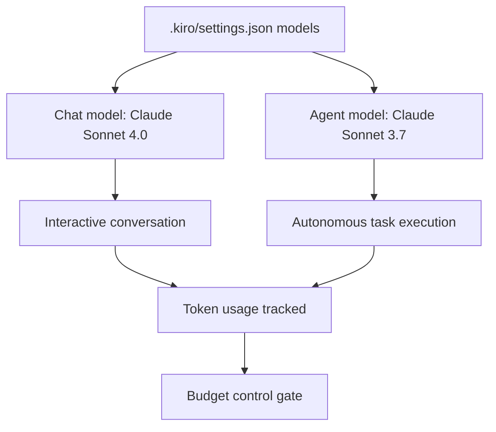

# Chapter 7: Multi-Model Strategy and Providers

Welcome to **Chapter 7: Multi-Model Strategy and Providers**. In this part of **Kiro Tutorial: Spec-Driven Agentic IDE from AWS**, you will build an intuitive mental model first, then move into concrete implementation details and practical production tradeoffs.


Kiro uses Claude Sonnet 4.0 and 3.7 by default and routes different task types to different model configurations. This chapter teaches you how to configure the model strategy for your team's workload profile.

## Learning Goals

- understand Kiro's default model routing between Claude Sonnet 4.0 and 3.7
- configure model preferences for different task categories
- understand the cost and latency tradeoffs between model tiers
- set up budget controls and usage monitoring
- plan model upgrades as new Claude versions become available

## Fast Start Checklist

1. open Kiro settings and navigate to the Model section
2. confirm the default model is Claude Sonnet 4.0
3. optionally override to Claude Sonnet 3.7 for faster or lower-cost interactive chat
4. set a daily token budget for cost control
5. review the model usage dashboard after a full session

## Default Model Configuration

Kiro ships with two default model profiles:

| Profile | Model | Best For |
|:--------|:------|:---------|
| Primary | Claude Sonnet 4.0 | autonomous agent tasks, spec generation, complex code synthesis |
| Fast | Claude Sonnet 3.7 | interactive chat, quick edits, explanation and Q&A |

Kiro automatically selects the appropriate model based on the interaction type. You can override this selection for specific use cases.

## Model Configuration in Settings

```json
{
  "models": {
    "primary": {
      "provider": "anthropic",
      "model": "claude-sonnet-4-0",
      "maxTokens": 8192,
      "temperature": 0.1
    },
    "fast": {
      "provider": "anthropic",
      "model": "claude-sonnet-3-7",
      "maxTokens": 4096,
      "temperature": 0.2
    },
    "routing": {
      "specGeneration": "primary",
      "taskExecution": "primary",
      "interactiveChat": "fast",
      "hookActions": "fast",
      "codeExplanation": "fast"
    }
  }
}
```

## Claude Sonnet 4.0 vs. 3.7

| Capability | Claude Sonnet 4.0 | Claude Sonnet 3.7 |
|:-----------|:-----------------|:-----------------|
| Code synthesis quality | higher | good |
| Multi-step reasoning | stronger | capable |
| Response latency | moderate | faster |
| Cost per token | higher | lower |
| Context window | 200k tokens | 200k tokens |
| Best use case | spec generation, complex tasks | chat, quick edits |

## Task-to-Model Routing

Map task types to model profiles based on your team's cost and quality priorities:

```json
{
  "models": {
    "routing": {
      "specGeneration": "primary",       // requirements → design → tasks: quality matters most
      "taskExecution": "primary",        // autonomous agent: complex multi-step reasoning
      "codeReview": "primary",           // security and correctness review: quality matters
      "interactiveChat": "fast",         // quick Q&A and exploration: speed matters
      "hookActions": "fast",             // frequent event-driven actions: cost matters
      "codeExplanation": "fast",         // explaining existing code: speed and cost
      "documentationUpdate": "fast"      // doc updates: lower complexity
    }
  }
}
```

## Budget Controls

Set daily and monthly token budgets to prevent unexpected cost spikes:

```json
{
  "budget": {
    "daily": {
      "inputTokens": 500000,
      "outputTokens": 200000,
      "alertThreshold": 0.8,
      "action": "notify"
    },
    "monthly": {
      "inputTokens": 10000000,
      "outputTokens": 4000000,
      "alertThreshold": 0.9,
      "action": "restrict"
    }
  }
}
```

Budget actions:
- `notify`: send an alert to the chat panel when the threshold is reached
- `restrict`: switch all routing to the `fast` (lower-cost) model when the threshold is reached
- `pause`: stop all agent activity and require manual reset when the limit is reached

## Usage Monitoring

Track model usage in the Kiro dashboard:

```
# In the Chat panel:
> /usage

# Output:
Session token usage:
  Input: 47,832 tokens (Claude Sonnet 4.0: 31,200 | Claude Sonnet 3.7: 16,632)
  Output: 12,441 tokens (Claude Sonnet 4.0: 9,800 | Claude Sonnet 3.7: 2,641)
  Estimated cost: $0.43

Daily usage: 182,341 input / 48,902 output tokens (36% of daily budget)
```

## Cost Optimization Patterns

| Pattern | Description | Token Savings |
|:--------|:------------|:-------------|
| Route chat to fast model | use Sonnet 3.7 for all interactive chat | 30-50% reduction on chat costs |
| Scope task context | pass only relevant spec sections to agents | 20-40% reduction per task |
| Compress steering files | remove redundant rules from steering files | 5-15% reduction on base context |
| Limit hook frequency | use commit-level hooks instead of save-level | 60-80% reduction on hook costs |
| Batch spec generation | generate all spec documents in one call | 10-20% reduction vs. sequential calls |

## Preparing for Model Upgrades

When AWS releases a new Claude version in Kiro, follow this upgrade protocol:

1. review the release notes for the new model version
2. test spec generation on a sample feature spec with the new model
3. compare output quality against the previous model on the same spec
4. if quality is equal or better, update the `primary` routing to the new model
5. run the full test suite on an autonomous agent task using the new model
6. monitor token usage for the first week on the new model
7. update the model configuration in version control and notify the team

## Source References

- [Kiro Docs: Model Configuration](https://kiro.dev/docs/models)
- [Kiro Docs: Budget Controls](https://kiro.dev/docs/models/budget)
- [Anthropic Models Overview](https://docs.anthropic.com/en/docs/models-overview)
- [Kiro Repository](https://github.com/kirodotdev/Kiro)

## Summary

You now know how to configure Kiro's model routing, set budget controls, monitor usage, and plan for model upgrades.

Next: [Chapter 8: Team Operations and Governance](08-team-operations-and-governance.md)

## Depth Expansion Playbook

## Source Code Walkthrough

> **Note:** Kiro is a proprietary AWS IDE; the [`kirodotdev/Kiro`](https://github.com/kirodotdev/Kiro) public repository contains documentation and GitHub automation scripts rather than the IDE's source code. The authoritative references for this chapter are the official Kiro documentation and configuration files within your project's `.kiro/` directory.

### [Kiro Docs: Model Configuration](https://kiro.dev/docs/models)

The model configuration documentation explains how to set the default model (Claude Sonnet 4.0), configure routing rules for different task profiles (chat vs. autonomous tasks), and manage budget controls in Kiro's settings.

### [.kiro/settings.json — model routing](https://kiro.dev/docs/models)

Model routing configuration lives in `.kiro/settings.json` under the `models` key. The schema allows specifying different models for interactive chat and autonomous agent execution — the primary source for the multi-model strategy described in this chapter.

## How These Components Connect

