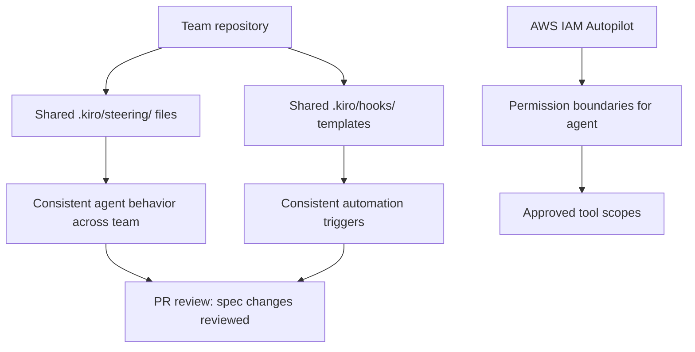

# Chapter 8: Team Operations and Governance

Welcome to **Chapter 8: Team Operations and Governance**. In this part of **Kiro Tutorial: Spec-Driven Agentic IDE from AWS**, you will build an intuitive mental model first, then move into concrete implementation details and practical production tradeoffs.


Running Kiro at team scale requires deliberate governance around spec ownership, steering file reviews, autonomous delegation boundaries, and AWS-native identity integration. This chapter provides the operational playbook for production team deployments.

## Learning Goals

- design a team-scale Kiro configuration repository structure
- establish governance workflows for steering file and spec changes
- configure AWS IAM Autopilot and other Kiro Powers for enterprise environments
- set up shared MCP servers and hook libraries for team consistency
- define escalation and incident response procedures for autonomous agent failures

## Fast Start Checklist

1. create a shared `.kiro/` configuration repository or add governance files to your existing monorepo
2. define ownership rules for steering files (who approves security.md, project.md)
3. configure AWS IAM Autopilot if your team uses AWS services
4. establish a PR review policy for changes to `.kiro/specs/`, `.kiro/steering/`, and `.kiro/hooks/`
5. run a team onboarding session using the governance checklist

## Team Configuration Repository Structure

For large teams, maintain `.kiro/` as a shared configuration source committed to version control:

```
.kiro/
  specs/                    ← feature specs (PR review required for tasks.md changes)
    user-authentication/
      requirements.md
      design.md
      tasks.md
  steering/                 ← AI behavior rules (architect + security review required)
    00-project.md
    01-coding-style.md
    02-testing.md
    03-security.md
  hooks/                    ← automation rules (team lead review required)
    00-lint-on-save.md
    01-test-on-fail.md
  mcp.json                  ← MCP server config (security review required for new servers)
  settings.json             ← model routing and budget config (team lead approval)
  task-log.md               ← auto-updated by hooks; read-only for humans
```

## PR Review Policy for Kiro Configuration

| File/Directory | Required Reviewers | Review Criteria |
|:---------------|:-------------------|:----------------|
| `.kiro/steering/00-project.md` | architecture lead | technology decisions aligned with roadmap |
| `.kiro/steering/03-security.md` | security engineer | no security policy downgrades; OWASP coverage |
| `.kiro/specs/*/requirements.md` | product owner | EARS syntax compliance; acceptance criteria present |
| `.kiro/specs/*/design.md` | senior engineer | architecture coherence; data model correctness |
| `.kiro/specs/*/tasks.md` | tech lead | task scope bounded; order correct; no rogue tasks |
| `.kiro/hooks/` | team lead | no infinite-loop risk; conditions present; token efficiency |
| `.kiro/mcp.json` | security engineer | no hardcoded credentials; read-only scopes verified |
| `.kiro/settings.json` | engineering manager | budget limits set; routing policy documented |

## Kiro Powers: AWS IAM Autopilot

Kiro Powers are extensible capability modules that integrate Kiro with external systems. The first Power is **AWS IAM Autopilot**, which enables Kiro agents to interact with AWS IAM for automated permission analysis and remediation.

### What AWS IAM Autopilot Does

- analyzes IAM policies for over-permissioned roles and unused permissions
- generates least-privilege IAM policy recommendations based on actual CloudTrail usage
- creates GitHub PRs with suggested policy changes for human review and approval
- monitors new IAM policy changes and alerts on permission escalation patterns

### Enabling AWS IAM Autopilot

```json
// .kiro/settings.json
{
  "powers": {
    "awsIamAutopilot": {
      "enabled": true,
      "awsRegion": "us-east-1",
      "awsAccountId": "${AWS_ACCOUNT_ID}",
      "cloudtrailLogGroup": "${CLOUDTRAIL_LOG_GROUP}",
      "prRepository": "org/infrastructure",
      "alertOnEscalation": true,
      "escalationAlertChannel": "#security-alerts"
    }
  }
}
```

### IAM Autopilot Workflow

```
# In the Chat panel:
> Analyze IAM permissions for the ECS task role used by the auth service

[Agent] Querying CloudTrail logs for role: ecs-auth-service-role (last 90 days)
[Agent] Identified 12 permissions used, 31 permissions granted but never used
[Agent] Generating least-privilege policy recommendation...
[Agent] Creating PR in org/infrastructure: "iam: reduce auth-service-role to least privilege"
[Agent] PR #847 created: https://github.com/org/infrastructure/pull/847
```

### IAM Autopilot Safety Controls

| Control | Configuration | Purpose |
|:--------|:--------------|:--------|
| PR-only mode | `"mode": "pr-only"` | agent creates PRs but never applies changes directly |
| CloudTrail lookback window | `"lookbackDays": 90` | controls the analysis window for permission usage |
| Escalation alerts | `"alertOnEscalation": true` | notifies security team when new policy grants exceed baseline |
| Scope restriction | `"targetRoles": ["ecs-*", "lambda-*"]` | limits analysis to specific IAM role name patterns |

## Team Onboarding Workflow

```markdown
# Kiro Team Onboarding Checklist

## Installation (each developer)
- [ ] Download Kiro from kiro.dev for their platform
- [ ] Authenticate with the team's preferred provider (GitHub/AWS Builder ID)
- [ ] Clone the project repository and open in Kiro
- [ ] Verify the .kiro/ directory is loaded and steering files are active

## Environment Setup (each developer)
- [ ] Copy .env.example to .env and fill in MCP server credentials
- [ ] Verify each MCP server is active in Kiro settings
- [ ] Run /usage and confirm the model routing is correct
- [ ] Read all steering files in .kiro/steering/ to understand team conventions

## Spec Workflow Training (each developer)
- [ ] Read an existing completed spec (requirements.md → design.md → tasks.md)
- [ ] Create a practice spec for a small personal task
- [ ] Run one autonomous agent task and review the activity log
- [ ] Participate in one spec review PR as a reviewer

## Governance Training (tech leads and senior engineers)
- [ ] Review the PR review policy for .kiro/ changes
- [ ] Complete the security steering file review checklist
- [ ] Understand the escalation path for autonomous agent incidents
- [ ] Configure budget alerts and test the notification flow
```

## Autonomous Agent Incident Response

When an autonomous agent causes an unexpected outcome in a shared environment:

```markdown
# Kiro Autonomous Agent Incident Runbook

## Immediate Response (< 5 minutes)
1. Interrupt the agent execution (Escape or Stop Agent button)
2. Run `git status` to identify all modified files
3. Run `git stash` or `git checkout -- .` to revert unintended changes
4. Record the task description and agent activity log for investigation

## Investigation (< 30 minutes)
5. Review the agent activity log for the last 20 steps before the incident
6. Identify the specific decision point that led to the unintended outcome
7. Determine whether the root cause is: task underspecification, missing steering rule, or agent reasoning failure

## Remediation (< 2 hours)
8. Update the task description or steering file to prevent recurrence
9. Re-run the task in supervised mode to verify the fix
10. Commit the updated task/steering with a clear incident reference in the commit message

## Communication
11. Notify the team in the incident channel with: what happened, what was reverted, and what was changed
12. Add the incident to the team's Kiro incident log
13. Schedule a 15-minute retrospective if the incident involved production-adjacent changes
```

## Shared Hook Library

Establish a shared hook library that all team members use:

```
.kiro/hooks/
  00-lint-on-save.md          ← maintained by: team (any member)
  01-test-failure-analysis.md ← maintained by: quality lead
  02-spec-freshness-check.md  ← maintained by: architecture lead
  03-security-scan-on-commit.md ← maintained by: security engineer
  04-doc-update-reminder.md   ← maintained by: tech writer
```

Each hook file includes a header comment identifying its owner and last review date:

```markdown
---
event: file:save
condition: file matches "src/**/*.ts"
owner: team
last_reviewed: 2025-10-15
---

# Auto-Lint TypeScript on Save
...
```

## Source References

- [Kiro Docs: Team Setup](https://kiro.dev/docs/team)
- [Kiro Docs: Powers](https://kiro.dev/docs/powers)
- [Kiro Docs: AWS IAM Autopilot](https://kiro.dev/docs/powers/iam-autopilot)
- [Kiro Docs: Governance](https://kiro.dev/docs/governance)
- [Kiro Repository](https://github.com/kirodotdev/Kiro)

## Summary

You now have the operational playbook for team-scale Kiro deployment: governance structure, PR review policies, AWS IAM Autopilot configuration, team onboarding workflow, and autonomous agent incident response.

---

**You have completed the Kiro Tutorial.** Return to the [Tutorial Index](README.md) to explore related tutorials.

## Depth Expansion Playbook

## Source Code Walkthrough

> **Note:** Kiro is a proprietary AWS IDE; the [`kirodotdev/Kiro`](https://github.com/kirodotdev/Kiro) public repository contains documentation and GitHub automation scripts rather than the IDE's source code. The authoritative references for this chapter are the official Kiro documentation and configuration files within your project's `.kiro/` directory.

### [Kiro Docs: Team Features](https://kiro.dev/docs/team)

The team features documentation covers shared steering file repositories, PR review policies for spec changes, AWS IAM Autopilot configuration for enterprise deployments, and team onboarding workflows — the governance patterns described in this chapter.

### [Kiro Docs: AWS Integration](https://kiro.dev/docs/aws)

The AWS integration guide documents IAM Autopilot configuration, AWS Builder ID team provisioning, and the permission model for autonomous agent actions in AWS environments. This is the primary source for the AWS governance controls in this chapter.

## How These Components Connect

