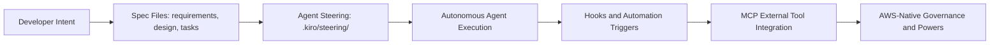

# Kiro Tutorial: Spec-Driven Agentic IDE from AWS

> Learn how to use `kirodotdev/Kiro` for structured AI-powered development with spec-driven workflows, agent steering, event-driven automation, and AWS-native integrations.

## Why This Track Matters

Kiro is AWS's agentic IDE built on VS Code and launched in July 2025. It introduces a structured, spec-driven development model where AI assistance is organized around requirements, design documents, and task lists rather than freeform chat.

This track focuses on:

- setting up Kiro and authenticating with GitHub, Google, or AWS Builder ID
- mastering the spec-driven development workflow using EARS syntax
- configuring agent steering and custom rules for repeatable AI behavior
- running autonomous agents for multi-step task delegation
- connecting external data sources with MCP and managing event-driven hooks
- governing multi-model strategy and team-scale deployment on AWS

## Current Snapshot (auto-updated)

- repository: [`kirodotdev/Kiro`](https://github.com/kirodotdev/Kiro)
- stars: about **1.8k**
- launched: **July 2025** by AWS
- project positioning: AWS-backed spec-driven agentic IDE for structured AI engineering

## Mental Model

## Chapter Guide

| Chapter | Key Question | Outcome |
|:--------|:-------------|:--------|
| [01 - Getting Started](01-getting-started.md) | How do I download, authenticate, and start my first project? | Working Kiro baseline |
| [02 - Spec-Driven Development Workflow](02-spec-driven-development-workflow.md) | How do I use requirements, design, and task files effectively? | Repeatable spec workflow |
| [03 - Agent Steering and Rules Configuration](03-agent-steering-and-rules-configuration.md) | How do I guide AI behavior with steering files and rules? | Consistent agent behavior |
| [04 - Autonomous Agent Mode](04-autonomous-agent-mode.md) | How do I delegate multi-step tasks to autonomous agents? | Safe full-autonomy delegation |
| [05 - MCP Integration and External Tools](05-mcp-integration-and-external-tools.md) | How do I connect external data sources with MCP servers? | Extended tool capabilities |
| [06 - Hooks and Automation](06-hooks-and-automation.md) | How do I trigger automation on file events and task completions? | Event-driven workflow automation |
| [07 - Multi-Model Strategy and Providers](07-multi-model-strategy-and-providers.md) | How do I configure Claude Sonnet and manage model routing? | Reliable model configuration |
| [08 - Team Operations and Governance](08-team-operations-and-governance.md) | How do I deploy Kiro at team scale with AWS governance? | Production-ready team operations |

## What You Will Learn

- how to install and authenticate Kiro on Mac, Windows, or Linux
- how the spec-driven workflow organizes AI assistance into structured documents
- how agent steering files shape repeatable, predictable AI behavior
- how to delegate multi-step tasks to autonomous agents with clear safety boundaries
- how MCP servers connect Kiro to external data sources and APIs
- how hooks enable event-driven automation on file saves, test results, and custom triggers
- how to configure Claude Sonnet 4.0 and 3.7 for different task profiles
- how to govern Kiro deployments at team scale using AWS IAM Autopilot and related powers

## Source References

- [Kiro Repository](https://github.com/kirodotdev/Kiro)
- [Kiro Website](https://kiro.dev)
- [Kiro Docs](https://kiro.dev/docs)
- [Kiro Specs Guide](https://kiro.dev/docs/specs)
- [Kiro Steering Guide](https://kiro.dev/docs/steering)
- [Kiro Hooks Guide](https://kiro.dev/docs/hooks)
- [Kiro MCP Guide](https://kiro.dev/docs/mcp)

## Related Tutorials

- [Cline Tutorial](../cline-tutorial/) — agentic VS Code coding agent with terminal, browser, and MCP
- [Roo Code Tutorial](../roo-code-tutorial/) — multi-mode coding agents with checkpoints and approval flows
- [OpenCode Tutorial](../opencode-tutorial/) — terminal-native coding agent with provider routing and tool safety
- [OpenSpec Tutorial](../openspec-tutorial/) — spec-driven artifact workflow for planning and validation
- [Claude Code Tutorial](../claude-code-tutorial/) — Anthropic's CLI-native AI coding agent
- [HAPI Tutorial](../hapi-tutorial/) — remote control and approval workflows for local coding agents
- [Continue Tutorial](../continue-tutorial/) — IDE-native AI coding assistant with deep context controls

---

Start with [Chapter 1: Getting Started](01-getting-started.md).

## Navigation & Backlinks

- [Start Here: Chapter 1: Getting Started](01-getting-started.md)
- [Back to Main Catalog](../../README.md#-tutorial-catalog)
- [Browse A-Z Tutorial Directory](../../discoverability/tutorial-directory.md)
- [Search by Intent](../../discoverability/query-hub.md)
- [Explore Category Hubs](../../README.md#category-hubs)

## Full Chapter Map

1. [Chapter 1: Getting Started](01-getting-started.md)
2. [Chapter 2: Spec-Driven Development Workflow](02-spec-driven-development-workflow.md)
3. [Chapter 3: Agent Steering and Rules Configuration](03-agent-steering-and-rules-configuration.md)
4. [Chapter 4: Autonomous Agent Mode](04-autonomous-agent-mode.md)
5. [Chapter 5: MCP Integration and External Tools](05-mcp-integration-and-external-tools.md)
6. [Chapter 6: Hooks and Automation](06-hooks-and-automation.md)
7. [Chapter 7: Multi-Model Strategy and Providers](07-multi-model-strategy-and-providers.md)
8. [Chapter 8: Team Operations and Governance](08-team-operations-and-governance.md)

*Generated by [AI Codebase Knowledge Builder](https://github.com/The-Pocket/Tutorial-Codebase-Knowledge)*
