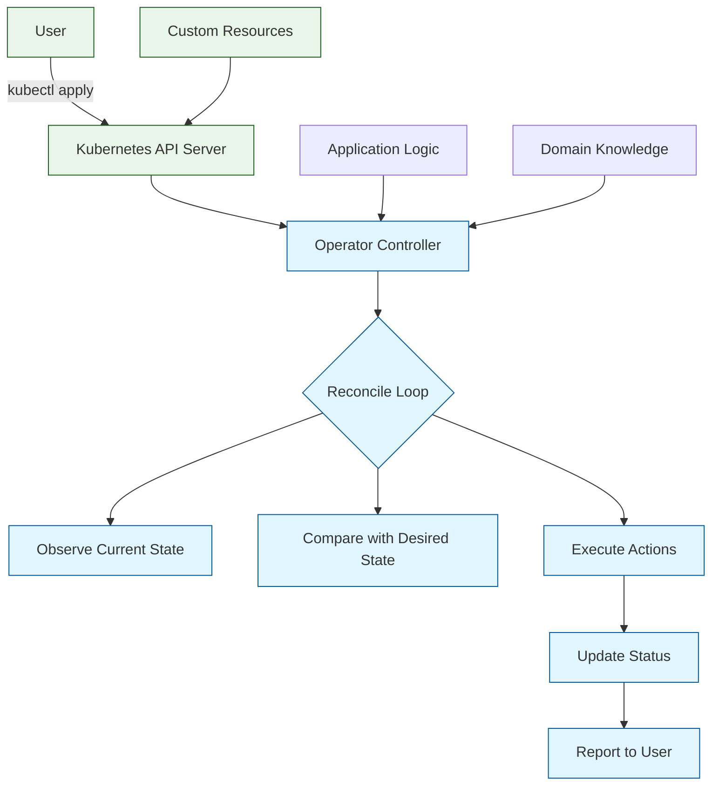

# Kubernetes Operator Patterns: Building Production-Grade Controllers

> Master Kubernetes Operators with hands-on Go implementation using the Operator SDK and controller-runtime library for enterprise application management.

<div align="center">

**🚀 Production-Grade Kubernetes Automation**

[](https://github.com/operator-framework/operator-sdk)

</div>

---

## 🎯 What are Kubernetes Operators?

**Kubernetes Operators** extend the Kubernetes API to create, configure, and manage instances of complex applications. They encode operational knowledge—the kind typically held by human operators—into software that can automate Day 1 (installation, configuration) and Day 2 (upgrades, backups, failover) operations.

### Why Operators Matter

| Traditional Approach | Kubernetes Operators |
|:--------------------|:----------------------|
| **Manual Operations** | Automated workflows |
| **Error-Prone** | Declarative and idempotent |
| **Inconsistent** | Standardized patterns |
| **Scalability Issues** | Native K8s scaling |
| **Documentation Heavy** | Self-documenting APIs |



## Core Operator Concepts

### Custom Resource Definitions (CRDs)

**CRDs** extend the Kubernetes API with custom resources specific to your application:

```yaml
apiVersion: apiextensions.k8s.io/v1
kind: CustomResourceDefinition
metadata:
  name: myapps.example.com
spec:
  group: example.com
  versions:
  - name: v1
    served: true
    storage: true
    schema:
      openAPIV3Schema:
        type: object
        properties:
          spec:
            type: object
            properties:
              replicas:
                type: integer
              image:
                type: string
  scope: Namespaced
  names:
    plural: myapps
    singular: myapp
    kind: MyApp
```

### Controllers and Reconciliation

**Controllers** implement the reconciliation loop that maintains desired state:

```go
// Controller reconciliation logic
func (r *MyAppReconciler) Reconcile(ctx context.Context, req ctrl.Request) (ctrl.Result, error) {
    // Get the custom resource
    myApp := &examplev1.MyApp{}
    if err := r.Get(ctx, req.NamespacedName, myApp); err != nil {
        return ctrl.Result{}, client.IgnoreNotFound(err)
    }

    // Implement reconciliation logic
    // 1. Check current state
    // 2. Compare with desired state
    // 3. Execute necessary actions
    // 4. Update status

    return ctrl.Result{}, nil
}
```

### Operator Patterns

**Operator Patterns** provide reusable solutions for common operational challenges:

- **Lifecycle Management**: Installation, upgrades, backups
- **Configuration Management**: Dynamic configuration updates
- **Scaling**: Horizontal and vertical scaling automation
- **Backup & Recovery**: Automated backup and disaster recovery
- **Monitoring & Observability**: Integrated monitoring and alerting

## Tutorial Chapters

1. **[Chapter 1: Getting Started](01-getting-started.md)** - Operator SDK setup, project scaffolding, and core concepts
2. **[Chapter 2: Custom Resource Definitions](02-custom-resources.md)** - Designing and implementing CRDs with OpenAPI validation
3. **[Chapter 3: The Reconciliation Loop](03-reconciliation-loop.md)** - Controller logic, state management, and idempotency
4. **[Chapter 4: Managing Owned Resources](04-owned-resources.md)** - Creating and managing Pods, Services, and other Kubernetes objects
5. **[Chapter 5: Status and Conditions](05-status-conditions.md)** - Reporting resource status and implementing condition patterns
6. **[Chapter 6: Testing Operators](06-testing.md)** - Unit tests, integration tests, and envtest framework
7. **[Chapter 7: Observability & Debugging](07-observability.md)** - Metrics, logging, tracing, and troubleshooting
8. **[Chapter 8: Production Deployment](08-production-deployment.md)** - OLM, Helm charts, security, and scaling patterns

## What You'll Learn

- **Operator Development**: Build controllers that extend Kubernetes functionality
- **Go Programming**: Advanced Go patterns for concurrent, distributed systems
- **Kubernetes Deep Dive**: Internal workings of controllers, admission webhooks, and API extensions
- **Production Patterns**: Enterprise-grade operator development with testing and observability
- **Domain-Specific Languages**: Create declarative APIs for complex applications

## Prerequisites

- Go 1.19+ and basic Go programming knowledge
- Kubernetes fundamentals (Pods, Services, Deployments)
- Docker and containerization concepts
- Linux/Unix command line proficiency

## Quick Start

```bash
# Install Operator SDK
curl -L https://github.com/operator-framework/operator-sdk/releases/download/v1.32.0/operator-sdk_linux_amd64 -o operator-sdk
chmod +x operator-sdk && sudo mv operator-sdk /usr/local/bin/

# Create a new operator project
operator-sdk init --domain example.com --repo github.com/example/my-operator

# Create a new API
operator-sdk create api --group apps --version v1 --kind MyApp --resource --controller

# Run the operator locally
make run
```

## Example: Complete Operator

```go
// Complete operator example
package controllers

import (
    "context"
    "time"

    appsv1 "k8s.io/api/apps/v1"
    corev1 "k8s.io/api/core/v1"
    "k8s.io/apimachinery/pkg/api/errors"
    metav1 "k8s.io/apimachinery/pkg/apis/meta/v1"
    "k8s.io/apimachinery/pkg/runtime"
    ctrl "sigs.k8s.io/controller-runtime"
    "sigs.k8s.io/controller-runtime/pkg/client"
    "sigs.k8s.io/controller-runtime/pkg/log"

    examplev1 "github.com/example/my-operator/api/v1"
)

type MyAppReconciler struct {
    client.Client
    Scheme *runtime.Scheme
}

// +kubebuilder:rbac:groups=example.com,resources=myapps,verbs=get;list;watch;create;update;patch;delete
// +kubebuilder:rbac:groups=example.com,resources=myapps/status,verbs=get;update;patch
// +kubebuilder:rbac:groups=example.com,resources=myapps/finalizers,verbs=update
// +kubebuilder:rbac:groups=apps,resources=deployments,verbs=get;list;watch;create;update;patch;delete
// +kubebuilder:rbac:groups=core,resources=services,verbs=get;list;watch;create;update;patch;delete

func (r *MyAppReconciler) Reconcile(ctx context.Context, req ctrl.Request) (ctrl.Result, error) {
    logger := log.FromContext(ctx)

    // Get the MyApp resource
    myApp := &examplev1.MyApp{}
    err := r.Get(ctx, req.NamespacedName, myApp)
    if err != nil {
        if errors.IsNotFound(err) {
            return ctrl.Result{}, nil
        }
        return ctrl.Result{}, err
    }

    // Check if the deployment exists, if not create it
    deployment := &appsv1.Deployment{}
    err = r.Get(ctx, client.ObjectKey{Name: myApp.Name, Namespace: myApp.Namespace}, deployment)
    if err != nil && errors.IsNotFound(err) {
        // Create the deployment
        dep := r.deploymentForMyApp(myApp)
        logger.Info("Creating a new Deployment", "Deployment.Namespace", dep.Namespace, "Deployment.Name", dep.Name)
        if err = r.Create(ctx, dep); err != nil {
            logger.Error(err, "Failed to create new Deployment", "Deployment.Namespace", dep.Namespace, "Deployment.Name", dep.Name)
            return ctrl.Result{}, err
        }
        // Deployment created successfully - return and requeue
        return ctrl.Result{Requeue: true}, nil
    } else if err != nil {
        logger.Error(err, "Failed to get Deployment")
        return ctrl.Result{}, err
    }

    // Ensure the deployment size is the same as the spec
    size := myApp.Spec.Replicas
    if *deployment.Spec.Replicas != size {
        deployment.Spec.Replicas = &size
        if err = r.Update(ctx, deployment); err != nil {
            logger.Error(err, "Failed to update Deployment", "Deployment.Namespace", deployment.Namespace, "Deployment.Name", deployment.Name)
            return ctrl.Result{}, err
        }
    }

    return ctrl.Result{}, nil
}

func (r *MyAppReconciler) deploymentForMyApp(m *examplev1.MyApp) *appsv1.Deployment {
    labels := map[string]string{
        "app":     m.Name,
        "version": "v1",
    }

    replicas := m.Spec.Replicas

    dep := &appsv1.Deployment{
        ObjectMeta: metav1.ObjectMeta{
            Name:      m.Name,
            Namespace: m.Namespace,
            Labels:    labels,
        },
        Spec: appsv1.DeploymentSpec{
            Replicas: &replicas,
            Selector: &metav1.LabelSelector{
                MatchLabels: labels,
            },
            Template: corev1.PodTemplateSpec{
                ObjectMeta: metav1.ObjectMeta{
                    Labels: labels,
                },
                Spec: corev1.PodSpec{
                    Containers: []corev1.Container{{
                        Image: m.Spec.Image,
                        Name:  "myapp",
                        Ports: []corev1.ContainerPort{{
                            ContainerPort: 8080,
                            Name:          "http",
                        }},
                    }},
                },
            },
        },
    }

    // Set the owner reference
    ctrl.SetControllerReference(m, dep, r.Scheme)
    return dep
}

func (r *MyAppReconciler) SetupWithManager(mgr ctrl.Manager) error {
    return ctrl.NewControllerManagedBy(mgr).
        For(&examplev1.MyApp{}).
        Owns(&appsv1.Deployment{}).
        Complete(r)
}
```

## Key Features

### Controller-Runtime Framework

**controller-runtime** provides the foundation for building Kubernetes controllers:

- **Manager**: Coordinates controller lifecycle and shared dependencies
- **Reconciler**: Implements the reconciliation logic
- **Client**: Type-safe interaction with the Kubernetes API
- **Cache**: Efficient API server caching and indexing
- **Webhooks**: Admission control and conversion webhooks

### Operator Lifecycle Manager (OLM)

**OLM** manages the lifecycle of operators in Kubernetes clusters:

- **Automatic Updates**: Seamless operator upgrades
- **Dependency Management**: Automatic dependency resolution
- **Security**: Image vulnerability scanning and signature verification
- **Multi-Tenant**: Namespace-scoped operator installations

### Advanced Operator Patterns

- **Sidecar Injection**: Automatic sidecar container injection
- **Webhook Management**: Dynamic admission webhook registration
- **Leader Election**: High availability with leader election
- **Finalizers**: Safe resource cleanup and garbage collection

## Learning Path

### 🟢 Beginner Track
1. Chapters 1-2: Setup and basic CRDs
2. Simple operator that manages a Deployment

### 🟡 Intermediate Track
1. Chapters 3-4: Reconciliation and owned resources
2. Operator that manages complex applications

### 🔴 Advanced Track
1. Chapters 5-8: Status management, testing, observability, production
2. Enterprise-grade operator with monitoring and security

---

**Ready to build Kubernetes operators? Let's begin with [Chapter 1: Getting Started](01-getting-started.md)!**

*Generated for [Awesome Code Docs](https://github.com/johnxie/awesome-code-docs)*

## Navigation & Backlinks

- [Start Here: Chapter 1: Getting Started with Kubernetes Operators](01-getting-started.md)
- [Back to Main Catalog](../../README.md#-tutorial-catalog)
- [Browse A-Z Tutorial Directory](../../discoverability/tutorial-directory.md)
- [Search by Intent](../../discoverability/query-hub.md)
- [Explore Category Hubs](../../README.md#category-hubs)

## Full Chapter Map

1. [Chapter 1: Getting Started with Kubernetes Operators](01-getting-started.md)
2. [Chapter 2: Custom Resource Definitions - Designing Robust APIs](02-custom-resources.md)
3. [Chapter 3: The Reconciliation Loop - Core Operator Logic](03-reconciliation-loop.md)
4. [Chapter 4: Managing Owned Resources - Creating and Managing Kubernetes Objects](04-owned-resources.md)
5. [Chapter 5: Status and Conditions - Reporting Resource Status and Implementing Condition Patterns](05-status-conditions.md)
6. [Chapter 6: Testing Operators - Unit Tests, Integration Tests, and envtest Framework](06-testing.md)
7. [Chapter 7: Observability & Debugging - Metrics, Logging, Tracing, and Troubleshooting](07-observability.md)
8. [Chapter 8: Production Deployment - OLM, Helm Charts, Security, and Scaling](08-production-deployment.md)

## Source References

- [Awesome Code Docs](https://github.com/johnxie/awesome-code-docs)

*Generated by [AI Codebase Knowledge Builder](https://github.com/The-Pocket/Tutorial-Codebase-Knowledge)*
