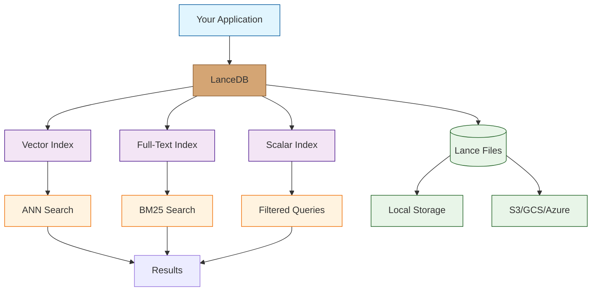

# LanceDB Tutorial: Serverless Vector Database for AI

> Master LanceDB, the open-source serverless vector database designed for AI applications, RAG systems, and semantic search.

<div align="center">

**Build AI-Native Applications with Vector Search**

</div>

---

## What is LanceDB?

**LanceDB** is an open-source, serverless vector database built on the Lance data format. It's designed from the ground up for AI applications, offering fast vector similarity search, filtering, and full-text search without the operational overhead of traditional databases.

### Key Features

| Feature | Description |
|:--------|:------------|
| **Serverless** | No server management, embedded or cloud deployment |
| **Lance Format** | Columnar format optimized for ML workloads |
| **Multi-Modal** | Store vectors, text, images, and metadata together |
| **Hybrid Search** | Combine vector search with SQL filters |
| **Full-Text Search** | BM25-based full-text search built-in |
| **Python/JS Native** | First-class Python and JavaScript SDKs |
| **Zero-Copy** | Memory-mapped access for efficiency |



## Tutorial Chapters

1. **[Chapter 1: Getting Started](01-getting-started.md)** - Installation, setup, and first database
2. **[Chapter 2: Data Modeling](02-data-modeling.md)** - Schemas, tables, and data types
3. **[Chapter 3: Vector Operations](03-vector-operations.md)** - Embeddings, indexing, and similarity search
4. **[Chapter 4: Hybrid Search](04-hybrid-search.md)** - Combining vector, full-text, and filtered search
5. **[Chapter 5: Integrations](05-integrations.md)** - LangChain, LlamaIndex, and embedding providers
6. **[Chapter 6: Performance](06-performance.md)** - Indexing strategies and query optimization
7. **[Chapter 7: Production Deployment](07-production.md)** - Cloud storage, scaling, and monitoring
8. **[Chapter 8: Advanced Patterns](08-advanced-patterns.md)** - Multi-tenancy, versioning, and RAG systems

## What You'll Learn

- **Store Vectors** efficiently with the Lance format
- **Search Semantically** using approximate nearest neighbors
- **Filter Results** with SQL-like predicates
- **Build RAG Systems** with vector + full-text search
- **Integrate** with LangChain, LlamaIndex, and more
- **Optimize Performance** with proper indexing
- **Deploy to Production** with cloud storage backends
- **Scale Applications** for real-world workloads

## Prerequisites

- Python 3.8+ or Node.js 18+
- Basic understanding of vectors/embeddings
- Familiarity with SQL concepts
- An embedding model (OpenAI, Sentence Transformers, etc.)

## Quick Start

```python
# Install LanceDB
pip install lancedb

# Basic usage
import lancedb

# Connect to database
db = lancedb.connect("./my_database")

# Create a table with data
data = [
    {"text": "Hello world", "vector": [0.1, 0.2, 0.3, 0.4]},
    {"text": "Goodbye world", "vector": [0.5, 0.6, 0.7, 0.8]},
]
table = db.create_table("my_table", data)

# Search by vector
results = table.search([0.1, 0.2, 0.3, 0.4]).limit(10).to_pandas()
print(results)
```

```javascript
// JavaScript/TypeScript
import * as lancedb from '@lancedb/lancedb';

const db = await lancedb.connect('./my_database');

const data = [
    { text: "Hello world", vector: [0.1, 0.2, 0.3, 0.4] },
    { text: "Goodbye world", vector: [0.5, 0.6, 0.7, 0.8] },
];

const table = await db.createTable('my_table', data);
const results = await table.search([0.1, 0.2, 0.3, 0.4]).limit(10).toArray();
```

## Use Cases

### Semantic Search
```python
# Find similar documents
results = table.search(query_embedding).limit(10).to_list()
```

### RAG (Retrieval-Augmented Generation)
```python
# Retrieve context for LLM
context = table.search(question_embedding).limit(5).to_list()
response = llm.generate(question, context=context)
```

### Recommendation Systems
```python
# Find similar items
similar_items = items_table.search(item_embedding).limit(20).to_list()
```

### Image Search
```python
# Find similar images
similar_images = images_table.search(image_embedding).limit(10).to_list()
```

## Why LanceDB?

### vs. Pinecone/Weaviate/Milvus
- **Serverless**: No infrastructure to manage
- **Embedded**: Run locally or in your application
- **Open Source**: Full control, no vendor lock-in
- **Cost Effective**: No per-vector pricing

### vs. pgvector/SQLite-VSS
- **Purpose Built**: Optimized for vector workloads
- **Faster**: Better performance on large datasets
- **Multi-Modal**: Native support for mixed data types
- **Cloud Ready**: Built-in S3/GCS support

## Learning Path

### Beginner Track
1. Chapters 1-2: Setup and data modeling
2. Store and query your first vectors

### Intermediate Track
1. Chapters 3-5: Vector operations and integrations
2. Build a complete RAG pipeline

### Advanced Track
1. Chapters 6-8: Performance, production, and advanced patterns
2. Deploy scalable AI applications

---

**Ready to build with LanceDB? Let's begin with [Chapter 1: Getting Started](01-getting-started.md)!**

*Generated for [Awesome Code Docs](https://github.com/johnxie/awesome-code-docs)*
