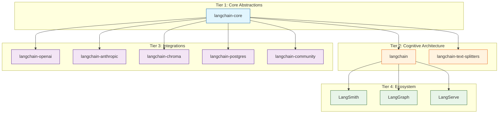
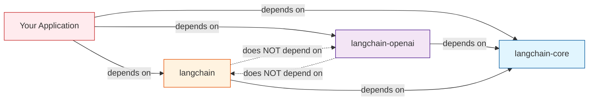
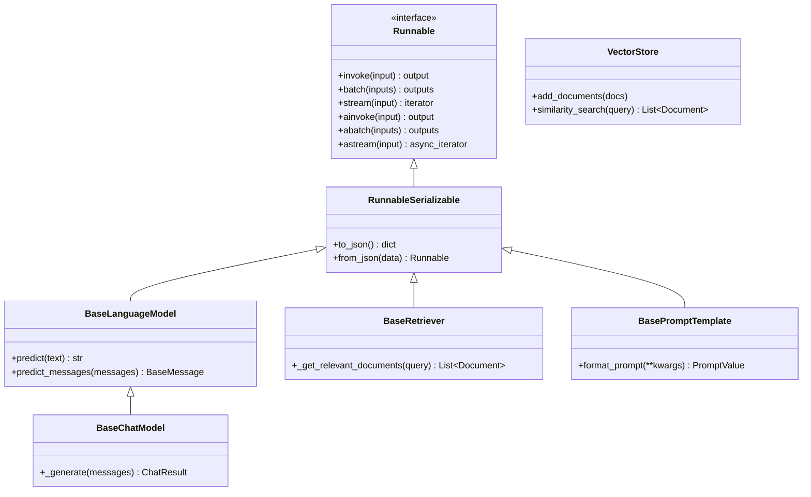
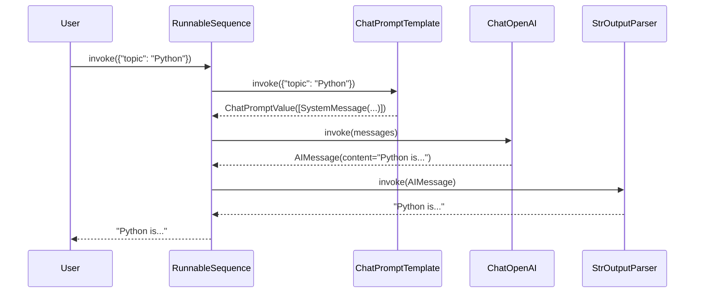

# Chapter 1: Getting Started -- Ecosystem Overview

Welcome to **Chapter 1: Getting Started -- Ecosystem Overview**. In this part of **LangChain Architecture: Internal Design Deep Dive**, you will build an intuitive mental model first, then move into concrete implementation details and practical production tradeoffs.


When you `pip install langchain`, you are pulling in one piece of a carefully partitioned ecosystem. Understanding how the packages fit together is the first step to understanding the architecture itself. This chapter maps the package hierarchy, explains the dependency philosophy, and shows you exactly where every abstraction lives in the source tree.

## The Package Hierarchy

LangChain is not a single monolithic library. It is a family of packages organized into three tiers:



### Tier 1: `langchain-core`

This is the foundation. It contains only abstract base classes, interface definitions, and the `Runnable` protocol. It has **minimal dependencies** (essentially just `pydantic` and `tenacity`) so that every other package in the ecosystem can depend on it without pulling in heavyweight vendor SDKs.

Key contents of `langchain-core`:

| Module | Purpose |
|--------|---------|
| `runnables/` | `Runnable`, `RunnableSequence`, `RunnableParallel`, `RunnableLambda`, `RunnablePassthrough` |
| `language_models/` | `BaseLanguageModel`, `BaseChatModel`, `BaseLLM` |
| `messages/` | `BaseMessage`, `HumanMessage`, `AIMessage`, `SystemMessage`, `ToolMessage` |
| `prompts/` | `BasePromptTemplate`, `ChatPromptTemplate`, `MessagesPlaceholder` |
| `output_parsers/` | `BaseOutputParser`, `StrOutputParser`, `JsonOutputParser` |
| `documents/` | `Document` dataclass |
| `vectorstores/` | `VectorStore`, `VectorStoreRetriever` |
| `callbacks/` | `CallbackManager`, `BaseCallbackHandler`, `AsyncCallbackHandler` |
| `retrievers/` | `BaseRetriever` |

```python
# Everything in langchain-core defines contracts, not implementations.
# For example, BaseChatModel defines what a chat model MUST do:

from langchain_core.language_models.chat_models import BaseChatModel

# You cannot instantiate BaseChatModel directly.
# It mandates that subclasses implement:
#   _generate(messages, stop, run_manager, **kwargs) -> ChatResult
#   _llm_type -> str (property)
```

### Tier 2: `langchain` (the Main Package)

This package provides the "cognitive architecture" -- chains, agents, retrievers, and the glue that connects core abstractions into useful patterns. It depends on `langchain-core` but does **not** depend on any vendor SDK.

Key contents:

```python
# langchain/chains/ -- Pre-built chain patterns
from langchain.chains import LLMChain, RetrievalQA, ConversationalRetrievalChain

# langchain/agents/ -- Agent executors and toolkits
from langchain.agents import AgentExecutor, create_openai_tools_agent

# langchain/retrievers/ -- Concrete retriever implementations
from langchain.retrievers import MultiQueryRetriever, EnsembleRetriever
```

### Tier 3: Integration Packages

Each vendor or technology gets its own package. This is a deliberate design decision: if you only use OpenAI, you should not need to install the Anthropic SDK.

```bash
# Partner packages (maintained by LangChain + partner)
pip install langchain-openai        # OpenAI models
pip install langchain-anthropic     # Anthropic Claude
pip install langchain-google-genai  # Google Gemini
pip install langchain-chroma        # Chroma vector store
pip install langchain-postgres      # PostgreSQL / pgvector

# Community package (catch-all for community contributions)
pip install langchain-community
```

### Tier 4: Ecosystem Tools

These are standalone products that integrate with the LangChain framework:

| Tool | Purpose |
|------|---------|
| **LangSmith** | Observability platform -- tracing, evaluation, datasets, prompt management |
| **LangGraph** | Stateful, multi-actor orchestration framework built on `langchain-core` Runnables |
| **LangServe** | REST API layer that auto-deploys any `Runnable` as a FastAPI endpoint |

## The Dependency Philosophy

The entire architecture revolves around one principle: **depend on abstractions, not implementations**.



Notice that `langchain-openai` and `langchain` are **siblings**, not parent-child. They both depend on `langchain-core` but not on each other. This means:

1. You can use `langchain-openai` directly without installing `langchain` if you only need chat models.
2. You can swap `langchain-openai` for `langchain-anthropic` without changing any code that uses the `BaseChatModel` interface.
3. The `langchain` package itself never imports vendor-specific code.

```python
# This code works regardless of which chat model package is installed,
# because it programs against the BaseChatModel interface:

from langchain_core.language_models import BaseChatModel
from langchain_core.messages import HumanMessage

def ask_question(model: BaseChatModel, question: str) -> str:
    """Works with ANY chat model implementation."""
    response = model.invoke([HumanMessage(content=question)])
    return response.content

# At the application boundary, you choose the concrete implementation:
from langchain_openai import ChatOpenAI
# OR: from langchain_anthropic import ChatAnthropic
# OR: from langchain_google_genai import ChatGoogleGenerativeAI

model = ChatOpenAI(model="gpt-4o")
answer = ask_question(model, "What is dependency inversion?")
```

## Repository Structure

The LangChain GitHub repository is a **monorepo** managed with a workspace-style layout. Understanding the directory structure helps you navigate the source code:

```
langchain/                          # GitHub repository root
├── libs/
│   ├── core/                       # langchain-core package
│   │   ├── langchain_core/
│   │   │   ├── runnables/          # Runnable protocol
│   │   │   ├── language_models/    # Base model classes
│   │   │   ├── messages/           # Message types
│   │   │   ├── prompts/            # Prompt templates
│   │   │   ├── output_parsers/     # Output parsers
│   │   │   ├── vectorstores/       # VectorStore ABC
│   │   │   ├── callbacks/          # Callback system
│   │   │   └── ...
│   │   └── pyproject.toml
│   │
│   ├── langchain/                  # langchain package
│   │   ├── langchain/
│   │   │   ├── chains/             # Chain implementations
│   │   │   ├── agents/             # Agent implementations
│   │   │   ├── retrievers/         # Retriever implementations
│   │   │   └── ...
│   │   └── pyproject.toml
│   │
│   ├── text-splitters/             # langchain-text-splitters
│   ├── community/                  # langchain-community
│   │
│   └── partners/                   # Partner integration packages
│       ├── openai/                 # langchain-openai
│       ├── anthropic/              # langchain-anthropic
│       ├── chroma/                 # langchain-chroma
│       └── ...
│
└── docs/                           # Documentation site
```

## The Pydantic Foundation

Almost every class in LangChain inherits from Pydantic's `BaseModel`. This gives the framework three things for free:

1. **Validation** -- constructor arguments are type-checked at runtime.
2. **Serialization** -- every object can be serialized to JSON and back.
3. **Schema generation** -- JSON schemas can be auto-generated for API documentation.

```python
from langchain_core.prompts import ChatPromptTemplate

# ChatPromptTemplate is a Pydantic model under the hood.
prompt = ChatPromptTemplate.from_messages([
    ("system", "You are a {role}."),
    ("human", "{question}")
])

# Serialization works out of the box:
serialized = prompt.to_json()
print(serialized)
# {
#   "lc": 1,
#   "type": "constructor",
#   "id": ["langchain", "prompts", "chat", "ChatPromptTemplate"],
#   "kwargs": { ... }
# }
```

The serialization format uses an `lc` versioning key plus a fully-qualified class ID. This allows LangChain to reconstruct objects from JSON, which is critical for LangSmith tracing and LangServe deployment.

## Class Hierarchy Overview

The following diagram shows the top-level class hierarchy. Every major class ultimately inherits from `Runnable` and from Pydantic's `BaseModel`:



Every arrow in this diagram represents an `invoke()` call that can be composed with the pipe operator (`|`). This is the defining characteristic of the LangChain architecture, and we will explore it in depth in [Chapter 2](02-runnable-interface.md).

## Versioning and Compatibility

LangChain follows semantic versioning with a twist: `langchain-core` provides the stable API surface, and its version constraints are the primary compatibility mechanism.

```
langchain-core >= 0.2.0, < 0.3.0    # langchain 0.2.x requires
langchain-core >= 0.2.0, < 0.3.0    # langchain-openai 0.1.x requires
langchain-core >= 0.2.0, < 0.3.0    # langchain-anthropic 0.1.x requires
```

Because every integration package pins to the same `langchain-core` range, they are guaranteed to be compatible with each other even though they never directly import one another.

## A Minimal Architecture Walk-Through

Let's trace a simple LCEL chain through the architecture to see which packages and classes are involved:

```python
from langchain_openai import ChatOpenAI                    # Tier 3
from langchain_core.prompts import ChatPromptTemplate      # Tier 1
from langchain_core.output_parsers import StrOutputParser  # Tier 1

# Build the chain using the pipe operator (LCEL)
chain = (
    ChatPromptTemplate.from_template("Tell me about {topic}")  # Tier 1
    | ChatOpenAI(model="gpt-4o")                                # Tier 3
    | StrOutputParser()                                         # Tier 1
)

# When you call invoke(), here is what happens internally:
# 1. ChatPromptTemplate.invoke({"topic": "Python"})
#    -> Returns a ChatPromptValue containing a list of Messages
#
# 2. ChatOpenAI.invoke(messages)
#    -> Calls OpenAI API, returns an AIMessage
#
# 3. StrOutputParser.invoke(ai_message)
#    -> Extracts .content from the AIMessage, returns a plain string

result = chain.invoke({"topic": "Python"})
```



Notice that the `User` never interacts with the individual components directly. The pipe operator creates a `RunnableSequence` that orchestrates the flow.

## Summary

| Concept | Key Takeaway |
|---------|-------------|
| Package tiers | `langchain-core` (abstractions) -> `langchain` (cognitive architecture) -> integrations (vendor code) |
| Dependency direction | Everything points inward toward `langchain-core`; integration packages are siblings |
| Monorepo structure | All packages live under `libs/` in a single GitHub repository |
| Pydantic foundation | Every class inherits from Pydantic `BaseModel` for validation, serialization, and schema generation |
| Runnable protocol | The universal interface that makes every component composable |

## Key Takeaways

1. **LangChain is a family of packages, not a monolith.** The three-tier architecture (core / main / integrations) ensures that you only install what you need.
2. **`langchain-core` is the center of gravity.** If you want to understand how LangChain works, start here. Every other package depends on the abstractions defined in `langchain-core`.
3. **The dependency arrows always point inward.** Integration packages depend on `langchain-core` but never on each other, which makes them freely interchangeable.
4. **Pydantic is not optional.** It is woven into every class definition and enables serialization, validation, and schema generation across the framework.
5. **The `Runnable` interface is the architectural cornerstone.** We will explore it in depth in the next chapter.

## Next Steps

Now that you understand the ecosystem layout, we are ready to dive into the most important abstraction in the entire framework: the `Runnable` interface and the LangChain Expression Language (LCEL). Continue to [Chapter 2: The Runnable Interface (LCEL)](02-runnable-interface.md).

---
*Built with insights from the [LangChain](https://github.com/langchain-ai/langchain) project.*

## What Problem Does This Solve?

Most teams struggle here because the hard part is not writing more code, but deciding clear boundaries for `langchain`, `model`, `invoke` so behavior stays predictable as complexity grows.

In practical terms, this chapter helps you avoid three common failures:

- coupling core logic too tightly to one implementation path
- missing the handoff boundaries between setup, execution, and validation
- shipping changes without clear rollback or observability strategy

After working through this chapter, you should be able to reason about `Chapter 1: Getting Started -- Ecosystem Overview` as an operating subsystem inside **LangChain Architecture: Internal Design Deep Dive**, with explicit contracts for inputs, state transitions, and outputs.

Use the implementation notes around `Tier`, `core`, `ChatPromptTemplate` as your checklist when adapting these patterns to your own repository.

## How it Works Under the Hood

Under the hood, `Chapter 1: Getting Started -- Ecosystem Overview` usually follows a repeatable control path:

1. **Context bootstrap**: initialize runtime config and prerequisites for `langchain`.
2. **Input normalization**: shape incoming data so `model` receives stable contracts.
3. **Core execution**: run the main logic branch and propagate intermediate state through `invoke`.
4. **Policy and safety checks**: enforce limits, auth scopes, and failure boundaries.
5. **Output composition**: return canonical result payloads for downstream consumers.
6. **Operational telemetry**: emit logs/metrics needed for debugging and performance tuning.

When debugging, walk this sequence in order and confirm each stage has explicit success/failure conditions.

## Source Walkthrough

Use the following upstream sources to verify implementation details while reading this chapter:

- [View Repo](https://github.com/langchain-ai/langchain)
  Why it matters: authoritative reference on `View Repo` (github.com).

Suggested trace strategy:
- search upstream code for `langchain` and `model` to map concrete implementation paths
- compare docs claims against actual runtime/config code before reusing patterns in production

## Chapter Connections

- [Tutorial Index](index.md)
- [Next Chapter: Chapter 2: The Runnable Interface (LCEL)](02-runnable-interface.md)
- [Main Catalog](../../README.md#-tutorial-catalog)
- [A-Z Tutorial Directory](../../discoverability/tutorial-directory.md)
