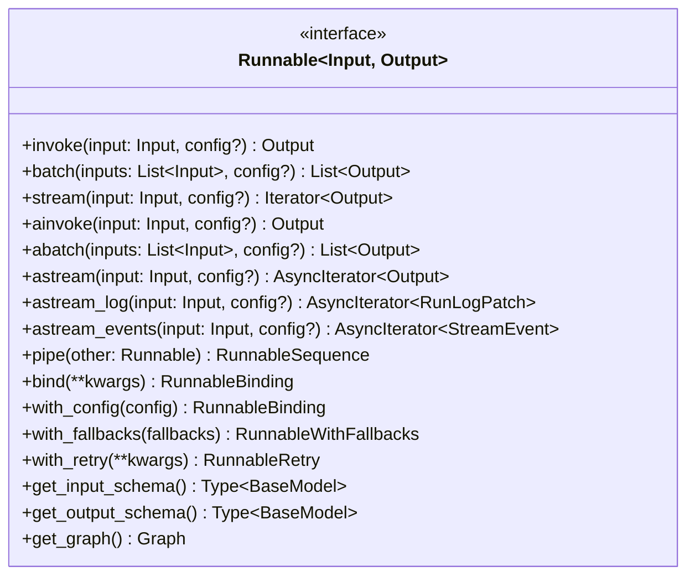
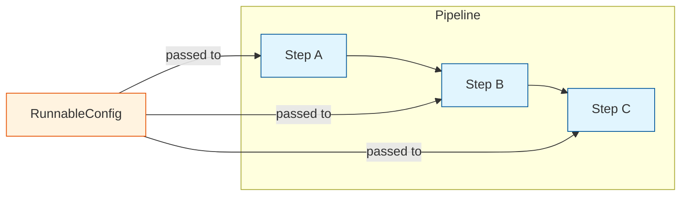
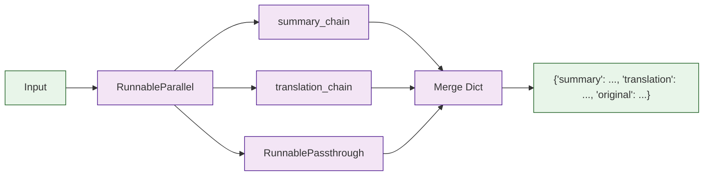
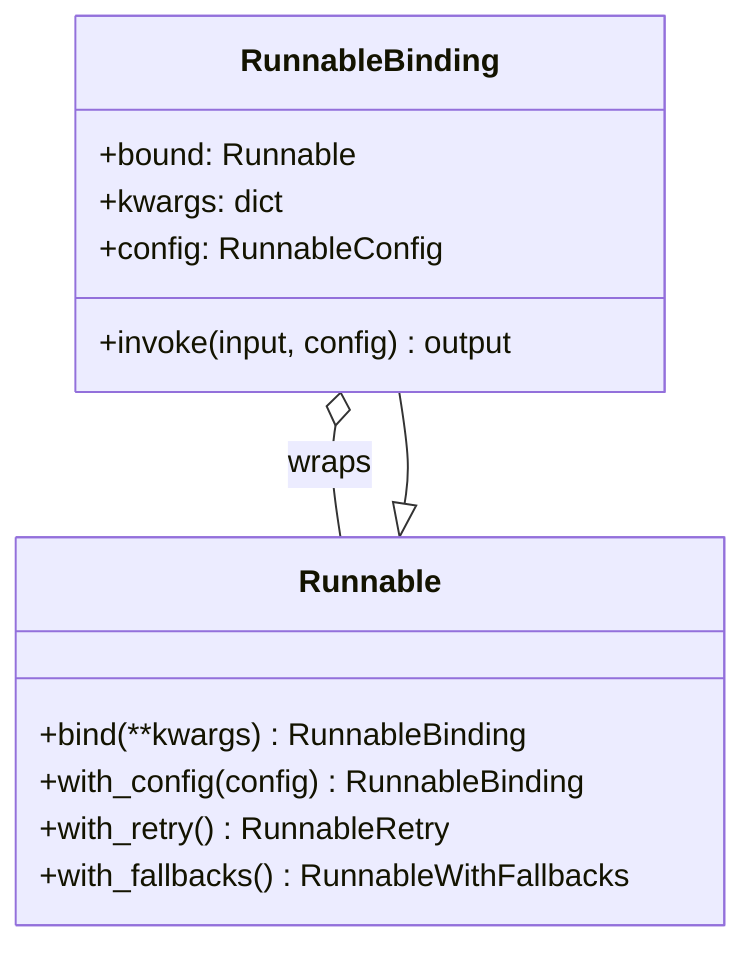
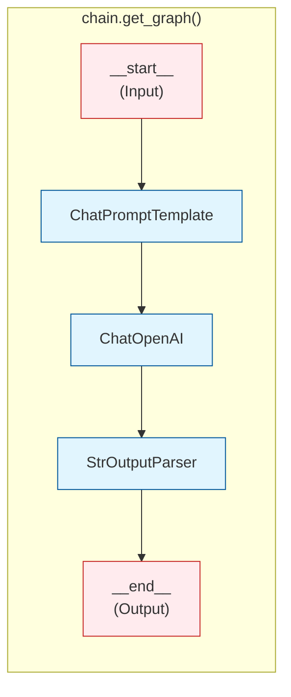

# Chapter 2: The Runnable Interface (LCEL)

The `Runnable` interface is the single most important abstraction in LangChain. Every prompt template, chat model, output parser, retriever, and tool implements it. This chapter dissects the protocol itself, the concrete `Runnable*` classes that compose computation graphs, and the mechanics of the pipe operator that makes the LangChain Expression Language (LCEL) possible.

## The Runnable Protocol

At its core, `Runnable` is a generic interface with a simple contract: take an input, produce an output. But it provides far more than a simple `__call__` method. Here is the complete protocol:



Every `Runnable` implementation is **required** to provide only one method: `invoke`. All the others have default implementations that build on top of it:

```python
# Simplified view of the Runnable base class in langchain-core
class Runnable(Generic[Input, Output], ABC):

    @abstractmethod
    def invoke(self, input: Input, config: Optional[RunnableConfig] = None) -> Output:
        """Transform a single input into an output."""
        ...

    def batch(self, inputs: List[Input], config=None, **kwargs) -> List[Output]:
        """Default: calls invoke() in a thread pool for each input."""
        # Uses ThreadPoolExecutor under the hood
        return [self.invoke(inp, config) for inp in inputs]

    def stream(self, input: Input, config=None, **kwargs) -> Iterator[Output]:
        """Default: calls invoke() and yields the single result."""
        yield self.invoke(input, config)

    async def ainvoke(self, input: Input, config=None, **kwargs) -> Output:
        """Default: runs invoke() in a thread executor."""
        return await asyncio.get_event_loop().run_in_executor(
            None, self.invoke, input, config
        )

    # ... similar defaults for abatch, astream, etc.
```

This design means that any class that implements `invoke` automatically gets batching, streaming, async support, and composition for free. Subclasses can override individual methods for optimized behavior (for example, `BaseChatModel` overrides `stream` to yield individual tokens).

## RunnableConfig: The Configuration Thread

Every `invoke`, `batch`, and `stream` call accepts an optional `RunnableConfig` dictionary. This is the mechanism for threading configuration through an entire pipeline:

```python
from langchain_core.runnables import RunnableConfig

config: RunnableConfig = {
    "tags": ["production", "user-123"],         # For filtering in LangSmith
    "metadata": {"session_id": "abc123"},       # Arbitrary metadata
    "callbacks": [my_callback_handler],         # Callback handlers
    "max_concurrency": 5,                       # Limit parallel execution
    "run_name": "question_answering_chain",     # Human-readable name
    "configurable": {                           # Runtime configuration
        "model_name": "gpt-4o",
        "temperature": 0.0
    }
}

result = chain.invoke({"question": "What is LCEL?"}, config=config)
```

The `RunnableConfig` is passed down through every step of a pipeline. When a `RunnableSequence` calls step A, then step B, it passes the same config to both. This is how callbacks, tags, and metadata propagate without each component needing to know about them.



## The Pipe Operator: Building RunnableSequence

The pipe operator (`|`) is syntactic sugar for creating a `RunnableSequence`. When you write `a | b | c`, Python calls `a.__or__(b)` which returns a new `RunnableSequence([a, b])`, then `(a | b).__or__(c)` which returns `RunnableSequence([a, b, c])`.

```python
# These two are exactly equivalent:
chain1 = prompt | model | parser

chain2 = RunnableSequence(first=prompt, middle=[model], last=parser)
```

Here is what `__or__` looks like internally:

```python
class Runnable(Generic[Input, Output]):

    def __or__(self, other):
        """Supports: self | other"""
        if isinstance(other, RunnableSequence):
            return RunnableSequence(
                first=self,
                middle=list(other.middle),
                last=other.last
            )
        return RunnableSequence(first=self, last=other)

    def __ror__(self, other):
        """Supports: other | self (when other is not a Runnable)"""
        # Allows things like: {"key": value} | runnable
        return RunnableSequence(first=coerce_to_runnable(other), last=self)
```

### RunnableSequence Internals

`RunnableSequence` stores its steps as `first`, `middle` (a list), and `last`. When `invoke` is called, it runs each step sequentially, passing the output of one as the input to the next:

```python
class RunnableSequence(RunnableSerializable[Input, Output]):
    first: Runnable
    middle: List[Runnable]
    last: Runnable

    @property
    def steps(self) -> List[Runnable]:
        return [self.first] + self.middle + [self.last]

    def invoke(self, input: Input, config=None) -> Output:
        # Patch config to include callbacks
        config = ensure_config(config)
        callback_manager = get_callback_manager(config)

        # Run each step, feeding output to next input
        current = input
        for step in self.steps:
            current = step.invoke(current, config)
        return current

    def stream(self, input: Input, config=None):
        """Stream from the last step; invoke all prior steps."""
        # Run all steps except the last
        current = input
        for step in self.steps[:-1]:
            current = step.invoke(current, config)

        # Stream the last step
        yield from self.last.stream(current, config)
```

Notice the streaming optimization: only the **last** step in the sequence actually streams. All prior steps run to completion. This is because intermediate results need to be fully materialized before they can be passed to the next step.

## RunnableParallel: Fan-Out Execution

`RunnableParallel` runs multiple Runnables concurrently and returns a dictionary of results. You create one by passing a dictionary to the pipe operator:

```python
from langchain_core.runnables import RunnableParallel, RunnablePassthrough

# When a dict is piped, it becomes a RunnableParallel
chain = RunnableParallel(
    summary=summary_chain,
    translation=translation_chain,
    original=RunnablePassthrough()
)

# Equivalent shorthand:
chain = {
    "summary": summary_chain,
    "translation": translation_chain,
    "original": RunnablePassthrough()
} | next_step
```



Internally, `RunnableParallel` uses a `ThreadPoolExecutor` for synchronous execution and `asyncio.gather` for async execution:

```python
class RunnableParallel(RunnableSerializable[Input, Dict[str, Any]]):
    steps__: Dict[str, Runnable]

    def invoke(self, input: Input, config=None) -> Dict[str, Any]:
        with ThreadPoolExecutor() as executor:
            futures = {
                key: executor.submit(step.invoke, input, config)
                for key, step in self.steps__.items()
            }
            return {key: f.result() for key, f in futures.items()}

    async def ainvoke(self, input: Input, config=None) -> Dict[str, Any]:
        results = await asyncio.gather(
            *[step.ainvoke(input, config)
              for step in self.steps__.values()]
        )
        return dict(zip(self.steps__.keys(), results))
```

## RunnablePassthrough: Identity and Augmentation

`RunnablePassthrough` passes its input through unchanged. It sounds trivial, but it is essential for building parallel branches where one branch needs the original input:

```python
from langchain_core.runnables import RunnablePassthrough

# Pass through unchanged
passthrough = RunnablePassthrough()
assert passthrough.invoke("hello") == "hello"

# Assign: add new keys to a dict while passing through existing ones
chain = RunnablePassthrough.assign(
    word_count=lambda x: len(x["text"].split())
)

result = chain.invoke({"text": "hello world"})
# {"text": "hello world", "word_count": 2}
```

The `assign` class method is particularly powerful. It creates a `RunnableAssign` that merges the original input dictionary with computed values:

```python
class RunnableAssign(RunnableSerializable[Dict, Dict]):
    mapper: RunnableParallel

    def invoke(self, input: Dict, config=None) -> Dict:
        # Run the mapper on the input
        new_values = self.mapper.invoke(input, config)
        # Merge with original input (new values override)
        return {**input, **new_values}
```

## RunnableLambda: Wrapping Arbitrary Functions

Any Python function can become a `Runnable` using `RunnableLambda`:

```python
from langchain_core.runnables import RunnableLambda

def word_count(text: str) -> int:
    return len(text.split())

# Explicit wrapping
runnable = RunnableLambda(word_count)

# Implicit wrapping -- happens automatically in pipe chains
chain = prompt | model | parser | word_count  # auto-wrapped
```

The auto-wrapping happens inside `Runnable.__or__`:

```python
def coerce_to_runnable(thing):
    if isinstance(thing, Runnable):
        return thing
    elif callable(thing):
        return RunnableLambda(thing)
    elif isinstance(thing, dict):
        return RunnableParallel(thing)
    else:
        raise TypeError(f"Cannot coerce {type(thing)} to Runnable")
```

## RunnableBinding: Configuration Attachment

`RunnableBinding` wraps a `Runnable` with pre-configured parameters. It is created by `.bind()`, `.with_config()`, and other modifier methods:

```python
from langchain_openai import ChatOpenAI

model = ChatOpenAI()

# bind() attaches kwargs that will be passed to every invoke call
model_with_tools = model.bind(tools=[my_tool_schema])

# with_config() attaches RunnableConfig
model_tagged = model.with_config(tags=["production"])

# Under the hood, both create a RunnableBinding:
# RunnableBinding(bound=model, kwargs={"tools": [...]}, config={...})
```



## The Computation Graph

Every LCEL chain is internally represented as a directed acyclic graph (DAG). You can inspect this graph programmatically:

```python
from langchain_openai import ChatOpenAI
from langchain_core.prompts import ChatPromptTemplate
from langchain_core.output_parsers import StrOutputParser

chain = (
    ChatPromptTemplate.from_template("Tell me about {topic}")
    | ChatOpenAI(model="gpt-4o")
    | StrOutputParser()
)

# Inspect the graph
graph = chain.get_graph()
print(graph.draw_ascii())

# Get input/output schemas (auto-generated Pydantic models)
print(chain.get_input_schema().schema())
# {"properties": {"topic": {"type": "string"}}, "required": ["topic"]}

print(chain.get_output_schema().schema())
# {"type": "string"}
```

The graph is also what LangServe uses to auto-generate API documentation and what LangSmith uses to visualize traces.



## Streaming Architecture

LCEL provides three levels of streaming granularity:

| Method | Returns | Use Case |
|--------|---------|----------|
| `stream()` | `Iterator[Output]` | Token-level output chunks |
| `astream_log()` | `AsyncIterator[RunLogPatch]` | JSON Patch diffs of intermediate state |
| `astream_events()` | `AsyncIterator[StreamEvent]` | Structured events from all steps |

```python
# Token-level streaming
for chunk in chain.stream({"topic": "Python"}):
    print(chunk, end="", flush=True)

# Event-level streaming (most detailed)
async for event in chain.astream_events({"topic": "Python"}, version="v2"):
    if event["event"] == "on_chat_model_stream":
        print(event["data"]["chunk"].content, end="")
    elif event["event"] == "on_chain_end":
        print(f"\nChain finished: {event['name']}")
```

The event streaming system uses a recursive visitor pattern. Each `Runnable` emits `on_*_start`, `on_*_stream`, and `on_*_end` events. The `RunnableSequence` collects and re-emits these events from all its children, creating a flat event stream from a nested execution tree.

## Type System

LCEL uses Python generics to propagate type information:

```python
# RunnableSequence infers Input/Output from first/last steps
prompt: Runnable[dict, ChatPromptValue]
model:  Runnable[ChatPromptValue, AIMessage]
parser: Runnable[AIMessage, str]

chain = prompt | model | parser
# chain: Runnable[dict, str]  -- inferred automatically
```

The schemas are also used for runtime validation. `get_input_schema()` and `get_output_schema()` return dynamically-generated Pydantic models that describe the expected input and output shapes.

## Summary

| Concept | Key Takeaway |
|---------|-------------|
| `Runnable` protocol | Universal interface with `invoke`, `batch`, `stream`, and async variants |
| Pipe operator | Creates `RunnableSequence` by chaining steps left to right |
| `RunnableParallel` | Fan-out execution with dictionary merge |
| `RunnablePassthrough` | Identity function; `assign()` adds computed keys |
| `RunnableLambda` | Wraps any Python function as a `Runnable` |
| `RunnableBinding` | Attaches kwargs or config to an existing `Runnable` |
| `RunnableConfig` | Configuration dict that threads through the entire pipeline |

## Key Takeaways

1. **The `Runnable` interface is the universal adapter.** Every component in LangChain implements it, which means any component can be composed with any other.
2. **Only `invoke` is required.** Batching, streaming, and async are provided by default implementations that subclasses can optionally override.
3. **The pipe operator builds a `RunnableSequence` DAG.** This graph can be inspected, serialized, and deployed as an API.
4. **`RunnableConfig` is the invisible thread.** It carries callbacks, tags, metadata, and configuration through every step without any component needing to be aware of it.
5. **Streaming is layered.** `stream()` gives you output chunks, `astream_events()` gives you events from every step, and `astream_log()` gives you JSON Patch diffs.

## Next Steps

With the Runnable protocol understood, we can now examine how chat models implement this interface and add model-specific behavior on top. Continue to [Chapter 3: Chat Model Architecture](03-chat-model-architecture.md).

---
*Built with insights from the [LangChain](https://github.com/langchain-ai/langchain) project.*
