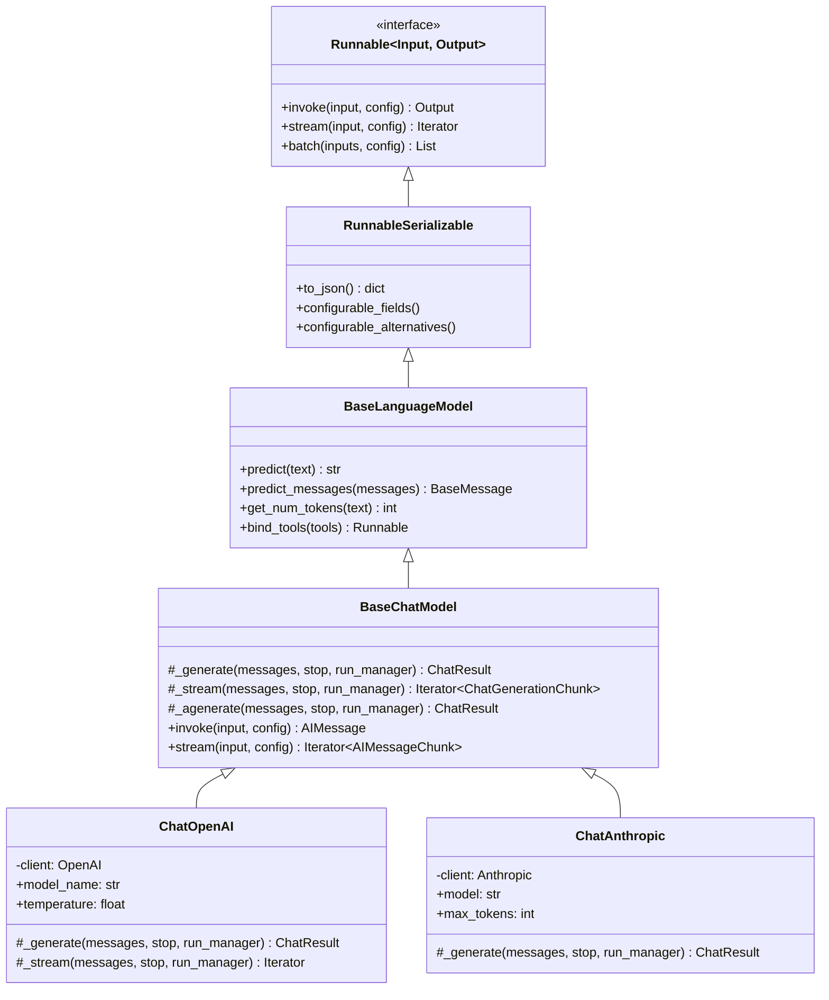
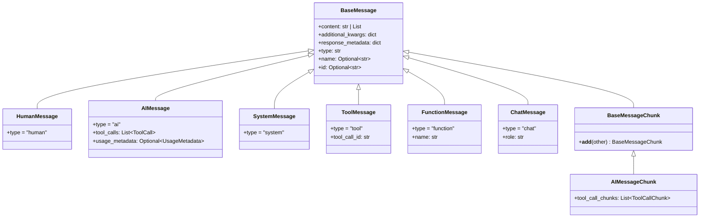
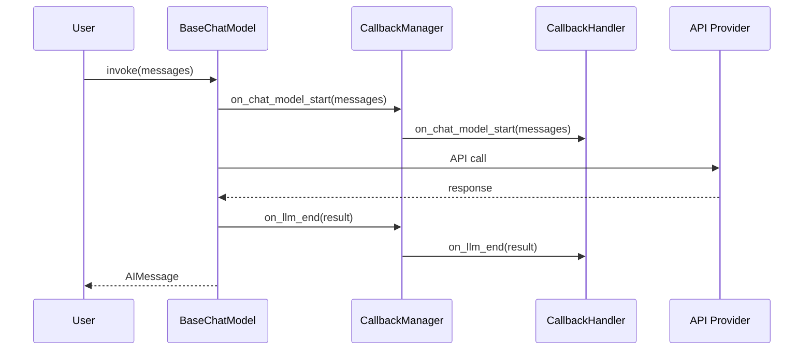

# Chapter 3: Chat Model Architecture

Welcome to **Chapter 3: Chat Model Architecture**. In this part of **LangChain Architecture: Internal Design Deep Dive**, you will build an intuitive mental model first, then move into concrete implementation details and practical production tradeoffs.


Chat models are the computational heart of most LangChain applications. This chapter explores how `BaseChatModel` is designed, how the message type system works, how streaming is implemented at the model layer, and how the callback system weaves through every invocation.

## The BaseChatModel Hierarchy

All chat models in LangChain inherit from a carefully layered hierarchy:



The key insight is the **Template Method** pattern. `BaseChatModel` implements `invoke()` and `stream()` as public methods that handle all the cross-cutting concerns (callbacks, caching, error handling), then delegates to protected methods (`_generate`, `_stream`) that subclasses override:

```python
class BaseChatModel(BaseLanguageModel):

    def invoke(self, input, config=None, **kwargs) -> AIMessage:
        # 1. Coerce input to list of messages
        messages = self._convert_input(input)

        # 2. Set up callback manager
        config = ensure_config(config)
        callback_manager = CallbackManager.configure(
            inheritable_callbacks=config.get("callbacks"),
            tags=config.get("tags"),
        )

        # 3. Fire on_chat_model_start callbacks
        run_manager = callback_manager.on_chat_model_start(
            serialized=self.to_json(),
            messages=[messages],
        )

        try:
            # 4. Delegate to subclass implementation
            result = self._generate(messages, run_manager=run_manager, **kwargs)

            # 5. Fire on_chat_model_end callbacks
            run_manager.on_llm_end(result)

            # 6. Return the first generation as an AIMessage
            return result.generations[0].message

        except Exception as e:
            # 7. Fire on_llm_error callbacks
            run_manager.on_llm_error(e)
            raise
```

## The Message Type System

Messages are the lingua franca of chat models. LangChain defines a rich type hierarchy:



### Message Content Types

The `content` field is not always a simple string. For multimodal models, it can be a list of content blocks:

```python
from langchain_core.messages import HumanMessage

# Simple text message
text_msg = HumanMessage(content="What is in this image?")

# Multimodal message with image
multimodal_msg = HumanMessage(content=[
    {"type": "text", "text": "What is in this image?"},
    {"type": "image_url", "image_url": {"url": "data:image/png;base64,..."}}
])
```

### AIMessage and Tool Calls

When a model decides to call a tool, it returns an `AIMessage` with a populated `tool_calls` field:

```python
from langchain_core.messages import AIMessage, ToolCall

# What a model returns when it wants to call a tool
ai_msg = AIMessage(
    content="",  # Often empty when tool calling
    tool_calls=[
        ToolCall(
            name="get_weather",
            args={"city": "San Francisco"},
            id="call_abc123"
        )
    ]
)

# Access structured tool calls
for tool_call in ai_msg.tool_calls:
    print(f"Tool: {tool_call['name']}, Args: {tool_call['args']}")
```

### ToolMessage: Returning Results

After executing a tool, you return a `ToolMessage` that is linked to the original call by `tool_call_id`:

```python
from langchain_core.messages import ToolMessage

tool_result = ToolMessage(
    content="72 degrees and sunny",
    tool_call_id="call_abc123"  # Must match the AIMessage's tool_call id
)
```

## Streaming Architecture

Streaming is where the chat model architecture becomes interesting. The framework supports streaming at two levels:

### Level 1: Token-Level Streaming via `_stream`

Subclasses override `_stream` to yield `ChatGenerationChunk` objects as tokens arrive from the provider:

```python
class ChatOpenAI(BaseChatModel):

    def _stream(self, messages, stop=None, run_manager=None, **kwargs):
        # Call OpenAI with stream=True
        response = self.client.chat.completions.create(
            model=self.model_name,
            messages=self._convert_messages(messages),
            stream=True,
        )

        for chunk in response:
            delta = chunk.choices[0].delta

            # Convert to LangChain chunk format
            message_chunk = AIMessageChunk(
                content=delta.content or "",
                additional_kwargs={},
            )

            generation_chunk = ChatGenerationChunk(message=message_chunk)

            # Fire callback for this chunk
            if run_manager:
                run_manager.on_llm_new_token(
                    delta.content or "",
                    chunk=generation_chunk
                )

            yield generation_chunk
```

### Level 2: Chunk Accumulation

`AIMessageChunk` objects implement `__add__`, which means they can be accumulated into a complete `AIMessage`:

```python
from langchain_core.messages import AIMessageChunk

# Simulating three streaming chunks
chunk1 = AIMessageChunk(content="Hello")
chunk2 = AIMessageChunk(content=" world")
chunk3 = AIMessageChunk(content="!")

# Chunks can be added together
accumulated = chunk1 + chunk2 + chunk3
print(accumulated.content)  # "Hello world!"

# In practice, BaseChatModel.stream() does this for you:
model = ChatOpenAI(model="gpt-4o")
full_response = None
for chunk in model.stream("Tell me a joke"):
    if full_response is None:
        full_response = chunk
    else:
        full_response += chunk
    print(chunk.content, end="")
```

Tool call chunks are also accumulated. Each chunk may contain a partial JSON string for the tool arguments, and the `__add__` method concatenates them:

```python
# Streaming tool calls arrive as chunks:
chunk1 = AIMessageChunk(content="", tool_call_chunks=[
    ToolCallChunk(name="get_weather", args='{"cit', id="call_1", index=0)
])
chunk2 = AIMessageChunk(content="", tool_call_chunks=[
    ToolCallChunk(name=None, args='y": "SF"}', id=None, index=0)
])

accumulated = chunk1 + chunk2
# accumulated.tool_calls == [ToolCall(name="get_weather", args={"city": "SF"}, id="call_1")]
```

## The Callback System

Callbacks are the observability backbone of LangChain. Every `invoke`, `stream`, and `batch` call fires a sequence of callback events:



### CallbackManager Lifecycle

The `CallbackManager` is created fresh for every `invoke` call. It merges handlers from three sources:

```python
# Handlers can come from:

# 1. Constructor-level (always active for this model instance)
model = ChatOpenAI(callbacks=[MyHandler()])

# 2. Config-level (active for this call and all child calls)
model.invoke(messages, config={"callbacks": [MyHandler()]})

# 3. Runtime-level (active only for this specific call)
model.invoke(messages, config={"callbacks": CallbackManager(handlers=[MyHandler()])})
```

### Built-In Callback Events

| Event | Fired When | Available Data |
|-------|-----------|----------------|
| `on_chat_model_start` | Model invocation begins | Serialized model, input messages |
| `on_llm_new_token` | Each streaming token arrives | Token string, chunk object |
| `on_llm_end` | Model invocation completes | Full `ChatResult` with usage metadata |
| `on_llm_error` | An error occurs | Exception object |
| `on_chain_start` | A chain begins executing | Chain inputs |
| `on_chain_end` | A chain finishes | Chain outputs |
| `on_tool_start` | A tool is called | Tool name, input |
| `on_tool_end` | A tool returns | Tool output |
| `on_retriever_start` | A retriever query begins | Query string |
| `on_retriever_end` | A retriever returns documents | List of Documents |

### Writing a Custom Callback Handler

```python
from langchain_core.callbacks import BaseCallbackHandler
from langchain_core.messages import BaseMessage
from typing import Any, Dict, List

class TokenCounterHandler(BaseCallbackHandler):
    """Counts tokens across all model calls."""

    def __init__(self):
        self.total_tokens = 0
        self.prompt_tokens = 0
        self.completion_tokens = 0

    def on_llm_end(self, response, **kwargs):
        """Called when a model finishes. Extract usage metadata."""
        for generation in response.generations[0]:
            if hasattr(generation, 'message'):
                usage = generation.message.usage_metadata
                if usage:
                    self.total_tokens += usage.get("total_tokens", 0)
                    self.prompt_tokens += usage.get("input_tokens", 0)
                    self.completion_tokens += usage.get("output_tokens", 0)

    def on_llm_new_token(self, token: str, **kwargs):
        """Called on each streaming token."""
        self.completion_tokens += 1  # Approximate

# Usage
counter = TokenCounterHandler()
model = ChatOpenAI(model="gpt-4o", callbacks=[counter])
model.invoke("Write a haiku about Python")
print(f"Total tokens: {counter.total_tokens}")
```

## Input Coercion

`BaseChatModel.invoke()` accepts several input types and normalizes them internally:

```python
model = ChatOpenAI()

# All of these work:
model.invoke("Hello")                                  # str -> [HumanMessage]
model.invoke([HumanMessage(content="Hello")])          # List[BaseMessage]
model.invoke(ChatPromptValue(messages=[...]))          # PromptValue
model.invoke(StringPromptValue(text="Hello"))          # StringPromptValue -> [HumanMessage]
```

The coercion logic lives in `BaseChatModel._convert_input`:

```python
def _convert_input(self, input):
    if isinstance(input, str):
        return [HumanMessage(content=input)]
    elif isinstance(input, PromptValue):
        return input.to_messages()
    elif isinstance(input, list):
        return input
    else:
        raise ValueError(f"Unexpected input type: {type(input)}")
```

## ChatResult and ChatGeneration

The internal return type of `_generate` is `ChatResult`, not `AIMessage`. This is because a model can return multiple generations (e.g., with `n > 1`):

```python
from langchain_core.outputs import ChatResult, ChatGeneration

class ChatResult:
    generations: List[ChatGeneration]    # One or more generated responses
    llm_output: dict                     # Provider-specific metadata

class ChatGeneration:
    message: BaseMessage                 # The generated message
    generation_info: dict                # Per-generation metadata
    text: str                            # Convenience: message.content
```

`BaseChatModel.invoke()` extracts `result.generations[0].message` and returns it as the public-facing `AIMessage`.

## Tool Binding Architecture

The `.bind_tools()` method is how you attach tool schemas to a chat model. It uses the `RunnableBinding` pattern from [Chapter 2](02-runnable-interface.md):

```python
from langchain_core.tools import tool

@tool
def get_weather(city: str) -> str:
    """Get current weather for a city."""
    return f"72F and sunny in {city}"

model = ChatOpenAI(model="gpt-4o")
model_with_tools = model.bind_tools([get_weather])

# Under the hood, bind_tools converts the tool to a JSON schema
# and calls model.bind(tools=[...]):
#
# model_with_tools = model.bind(tools=[{
#     "type": "function",
#     "function": {
#         "name": "get_weather",
#         "description": "Get current weather for a city.",
#         "parameters": {
#             "type": "object",
#             "properties": {"city": {"type": "string"}},
#             "required": ["city"]
#         }
#     }
# }])
```



```mermaid
flowchart LR
    Tool["@tool function"] -->|"convert_to_openai_tool()"| Schema["JSON Schema"]
    Schema -->|"model.bind(tools=[...])"| RB["RunnableBinding"]
    RB -->|"invoke(messages)"| Model["ChatOpenAI._generate()"]
    Model -->|"tools param in API call"| API["OpenAI API"]

    classDef convert fill:#fff3e0,stroke:#e65100
    classDef runtime fill:#e1f5fe,stroke:#01579b

    class Tool,Schema convert
    class RB,Model,API runtime
```

## Structured Output

The `.with_structured_output()` method forces the model to return a Pydantic model or TypedDict:

```python
from pydantic import BaseModel, Field

class WeatherInfo(BaseModel):
    city: str = Field(description="City name")
    temperature: float = Field(description="Temperature in Fahrenheit")
    conditions: str = Field(description="Weather conditions")

model = ChatOpenAI(model="gpt-4o")
structured_model = model.with_structured_output(WeatherInfo)

result = structured_model.invoke("What's the weather in SF?")
# result is a WeatherInfo instance, not an AIMessage
print(result.city)         # "San Francisco"
print(result.temperature)  # 72.0
```

Internally, `with_structured_output` creates a chain that:
1. Binds the Pydantic schema as a tool (or uses JSON mode)
2. Appends an output parser that extracts the tool call arguments
3. Validates the arguments against the Pydantic model

## Summary

| Concept | Key Takeaway |
|---------|-------------|
| `BaseChatModel` | Template Method pattern: public `invoke()` handles cross-cutting concerns, delegates to `_generate()` |
| Message types | Rich hierarchy: `HumanMessage`, `AIMessage`, `ToolMessage`, `SystemMessage`, with multimodal support |
| Streaming | Token chunks (`AIMessageChunk`) implement `__add__` for accumulation |
| Callbacks | Fire at every lifecycle point: start, token, end, error |
| Tool binding | `.bind_tools()` converts Python functions to JSON schemas and uses `RunnableBinding` |
| Structured output | `.with_structured_output()` chains tool binding with output parsing |

## Key Takeaways

1. **`BaseChatModel` uses the Template Method pattern.** The public API (`invoke`, `stream`) handles callbacks, caching, and error handling. Subclasses only implement `_generate` and optionally `_stream`.
2. **Messages are typed, not just strings.** The type system distinguishes human input, AI responses, tool calls, and tool results, which is critical for multi-turn conversations and agent loops.
3. **Streaming is chunk-based with accumulation.** Each `AIMessageChunk` can be added together, allowing both real-time token display and final-result extraction from the same stream.
4. **Callbacks are threaded through every call.** They are the foundation for LangSmith tracing, cost tracking, and custom observability.
5. **Tool binding and structured output are built on `RunnableBinding`.** They do not modify the model -- they wrap it with additional configuration and output parsing.

## Next Steps

Now that you understand how individual models work, let's explore how they are composed into more complex workflows. Continue to [Chapter 4: Chain Composition](04-chain-composition.md).

---
*Built with insights from the [LangChain](https://github.com/langchain-ai/langchain) project.*

## What Problem Does This Solve?

Most teams struggle here because the hard part is not writing more code, but deciding clear boundaries for `model`, `messages`, `self` so behavior stays predictable as complexity grows.

In practical terms, this chapter helps you avoid three common failures:

- coupling core logic too tightly to one implementation path
- missing the handoff boundaries between setup, execution, and validation
- shipping changes without clear rollback or observability strategy

After working through this chapter, you should be able to reason about `Chapter 3: Chat Model Architecture` as an operating subsystem inside **LangChain Architecture: Internal Design Deep Dive**, with explicit contracts for inputs, state transitions, and outputs.

Use the implementation notes around `content`, `input`, `BaseChatModel` as your checklist when adapting these patterns to your own repository.

## How it Works Under the Hood

Under the hood, `Chapter 3: Chat Model Architecture` usually follows a repeatable control path:

1. **Context bootstrap**: initialize runtime config and prerequisites for `model`.
2. **Input normalization**: shape incoming data so `messages` receives stable contracts.
3. **Core execution**: run the main logic branch and propagate intermediate state through `self`.
4. **Policy and safety checks**: enforce limits, auth scopes, and failure boundaries.
5. **Output composition**: return canonical result payloads for downstream consumers.
6. **Operational telemetry**: emit logs/metrics needed for debugging and performance tuning.

When debugging, walk this sequence in order and confirm each stage has explicit success/failure conditions.

## Source Walkthrough

Use the following upstream sources to verify implementation details while reading this chapter:

- [View Repo](https://github.com/langchain-ai/langchain)
  Why it matters: authoritative reference on `View Repo` (github.com).

Suggested trace strategy:
- search upstream code for `model` and `messages` to map concrete implementation paths
- compare docs claims against actual runtime/config code before reusing patterns in production

## Chapter Connections

- [Tutorial Index](index.md)
- [Previous Chapter: Chapter 2: The Runnable Interface (LCEL)](02-runnable-interface.md)
- [Next Chapter: Chapter 4: Chain Composition](04-chain-composition.md)
- [Main Catalog](../../README.md#-tutorial-catalog)
- [A-Z Tutorial Directory](../../discoverability/tutorial-directory.md)
