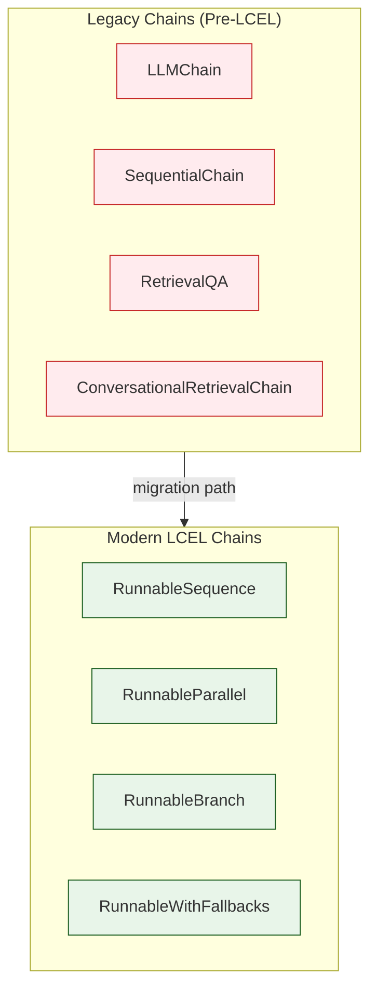
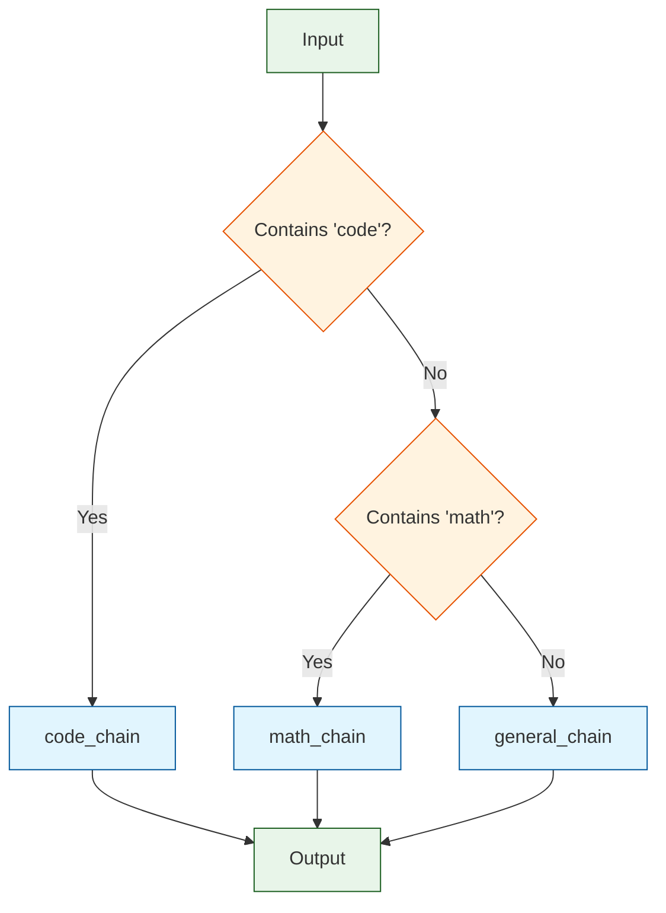
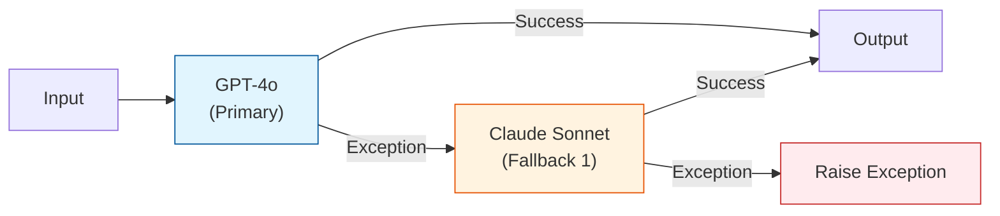
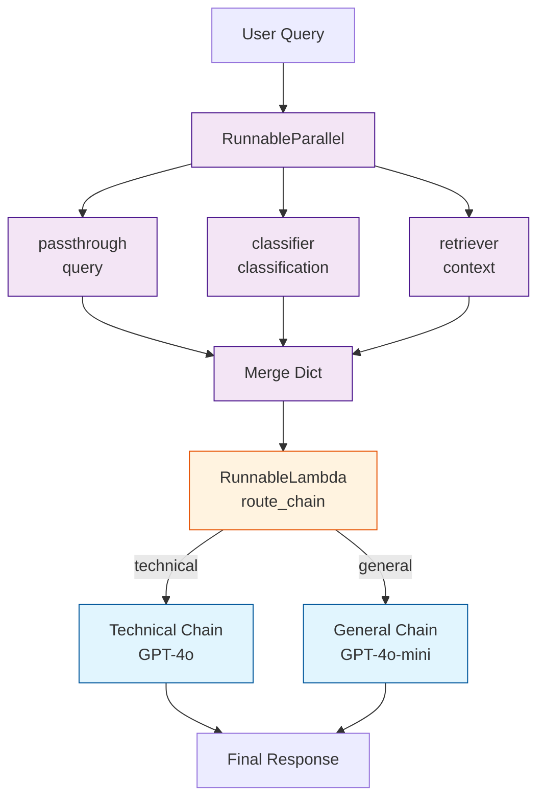

# Chapter 4: Chain Composition

Chains are the bread and butter of LangChain applications. This chapter examines two generations of chain design -- the legacy `Chain` class and the modern LCEL approach -- and explores the internal mechanics of routing, fallbacks, retry logic, and chain compilation.

## Two Generations of Chains

LangChain has undergone a significant architectural shift from imperative `Chain` classes to declarative LCEL pipelines. Understanding both is important because legacy chains still exist in many codebases.



### Legacy Chain Architecture

The legacy `Chain` class is an abstract base class with a rigid interface:

```python
class Chain(RunnableSerializable):
    """Legacy base class for chains."""

    memory: Optional[BaseMemory] = None
    verbose: bool = False
    callbacks: Optional[Callbacks] = None

    @property
    @abstractmethod
    def input_keys(self) -> List[str]:
        """Keys that this chain expects in input dict."""

    @property
    @abstractmethod
    def output_keys(self) -> List[str]:
        """Keys that this chain produces in output dict."""

    @abstractmethod
    def _call(self, inputs: Dict[str, Any], run_manager=None) -> Dict[str, Any]:
        """Core logic of the chain."""

    def invoke(self, input: Dict[str, Any], config=None) -> Dict[str, Any]:
        """Runnable-compatible invoke. Wraps _call with callbacks."""
        # 1. Validate inputs against input_keys
        # 2. Load memory variables
        # 3. Fire on_chain_start
        # 4. Call self._call(inputs)
        # 5. Save to memory
        # 6. Fire on_chain_end
        # 7. Return outputs
```

The problem with legacy chains is their **rigidity**: they require dictionaries with specific keys, they bundle memory management into the chain itself, and they cannot be easily composed with the pipe operator.

### Legacy Chain Example: LLMChain

```python
# Legacy approach -- still works but not recommended
from langchain.chains import LLMChain
from langchain_core.prompts import PromptTemplate
from langchain_openai import ChatOpenAI

chain = LLMChain(
    llm=ChatOpenAI(),
    prompt=PromptTemplate.from_template("Tell me about {topic}"),
    output_key="answer"
)

result = chain.invoke({"topic": "Python"})
# result == {"topic": "Python", "answer": "Python is...", "text": "Python is..."}
```

### LCEL Equivalent

```python
# Modern LCEL approach
from langchain_core.prompts import ChatPromptTemplate
from langchain_core.output_parsers import StrOutputParser
from langchain_openai import ChatOpenAI

chain = (
    ChatPromptTemplate.from_template("Tell me about {topic}")
    | ChatOpenAI()
    | StrOutputParser()
)

result = chain.invoke({"topic": "Python"})
# result == "Python is..."
```

### Comparison Table

| Feature | Legacy Chain | LCEL |
|---------|-------------|------|
| Composition | Nested constructors | Pipe operator (`\|`) |
| Input/Output | Dict with fixed keys | Any type flows through |
| Streaming | Limited or absent | First-class support |
| Async | Separate `_acall` method | Automatic from `ainvoke` |
| Memory | Built into the chain | External, managed by LangGraph |
| Serialization | Custom logic | Automatic via `RunnableSerializable` |
| Type inference | None | Input/output schemas auto-generated |
| Visualization | Manual | `get_graph()` method |

## RunnableBranch: Conditional Routing

`RunnableBranch` implements conditional routing, directing input to different Runnables based on predicate functions:

```python
from langchain_core.runnables import RunnableBranch

# Route based on the input
branch = RunnableBranch(
    # (condition, runnable) pairs -- checked in order
    (lambda x: "code" in x["topic"].lower(), code_chain),
    (lambda x: "math" in x["topic"].lower(), math_chain),
    # Default -- used if no condition matches
    general_chain
)

result = branch.invoke({"topic": "Python code patterns"})
# Routes to code_chain because "code" is in the topic
```



Internally, `RunnableBranch` evaluates each condition sequentially:

```python
class RunnableBranch(RunnableSerializable[Input, Output]):
    branches: List[Tuple[Runnable[Input, bool], Runnable[Input, Output]]]
    default: Runnable[Input, Output]

    def invoke(self, input: Input, config=None) -> Output:
        for condition, branch in self.branches:
            if condition.invoke(input, config):
                return branch.invoke(input, config)
        return self.default.invoke(input, config)
```

### Dynamic Routing with RunnableLambda

For more complex routing, you can use `RunnableLambda` to build a router function:

```python
from langchain_core.runnables import RunnableLambda

def route(input_dict):
    """Route to different chains based on classification."""
    topic = input_dict.get("topic", "").lower()
    if "code" in topic:
        return code_chain
    elif "math" in topic:
        return math_chain
    return general_chain

# Use RunnableLambda to dynamically select and invoke a chain
chain = (
    classify_input
    | RunnableLambda(lambda x: route(x).invoke(x))
)
```

## Fallback Mechanisms

The `.with_fallbacks()` method wraps a Runnable with backup options that are tried if the primary fails:

```python
from langchain_openai import ChatOpenAI
from langchain_anthropic import ChatAnthropic

# Primary model with fallback
model = ChatOpenAI(model="gpt-4o").with_fallbacks(
    [ChatAnthropic(model="claude-sonnet-4-20250514")],
    exceptions_to_handle=(Exception,)   # Which exceptions trigger fallback
)

# If GPT-4o fails (rate limit, outage, etc.), Claude is tried automatically
result = model.invoke("Hello!")
```



The internal implementation:

```python
class RunnableWithFallbacks(RunnableSerializable[Input, Output]):
    runnable: Runnable[Input, Output]
    fallbacks: List[Runnable[Input, Output]]
    exceptions_to_handle: Tuple[Type[BaseException], ...]

    def invoke(self, input: Input, config=None) -> Output:
        first_error = None
        for runnable in [self.runnable] + self.fallbacks:
            try:
                return runnable.invoke(input, config)
            except self.exceptions_to_handle as e:
                if first_error is None:
                    first_error = e
                continue
        raise first_error
```

### Nested Fallbacks

Fallbacks can be composed with other patterns:

```python
# Fallback chain with different prompts for different models
primary = prompt_gpt | ChatOpenAI(model="gpt-4o") | parser
fallback = prompt_claude | ChatAnthropic(model="claude-sonnet-4-20250514") | parser

chain = primary.with_fallbacks([fallback])
```

## Retry Logic

The `.with_retry()` method adds automatic retry behavior with configurable backoff:

```python
model = ChatOpenAI(model="gpt-4o").with_retry(
    retry_if_exception_type=(RateLimitError, APITimeoutError),
    wait_exponential_jitter=True,    # Exponential backoff with jitter
    stop_after_attempt=3,            # Maximum 3 attempts
)
```

Internally, `RunnableRetry` uses the `tenacity` library:

```python
from tenacity import (
    retry, stop_after_attempt, wait_exponential_jitter, retry_if_exception_type
)

class RunnableRetry(RunnableBinding[Input, Output]):
    retry_if_exception_type: Tuple[Type[BaseException], ...]
    wait_exponential_jitter: bool = True
    stop_after_attempt: int = 3

    def invoke(self, input: Input, config=None) -> Output:
        retry_decorator = retry(
            retry=retry_if_exception_type(self.retry_if_exception_type),
            wait=wait_exponential_jitter() if self.wait_exponential_jitter else None,
            stop=stop_after_attempt(self.stop_after_attempt),
        )

        @retry_decorator
        def invoke_with_retry():
            return self.bound.invoke(input, config)

        return invoke_with_retry()
```

## Building Complex Pipelines

Let's put these patterns together to build a production-grade chain:

```python
from langchain_core.prompts import ChatPromptTemplate
from langchain_core.output_parsers import StrOutputParser
from langchain_core.runnables import (
    RunnableParallel,
    RunnablePassthrough,
    RunnableBranch,
    RunnableLambda,
)
from langchain_openai import ChatOpenAI

# Step 1: Classify the query
classifier_prompt = ChatPromptTemplate.from_template(
    "Classify this query as 'technical' or 'general': {query}"
)
classifier = classifier_prompt | ChatOpenAI(model="gpt-4o-mini") | StrOutputParser()

# Step 2: Build specialized chains
technical_prompt = ChatPromptTemplate.from_template(
    "You are a technical expert. Answer: {query}\nContext: {context}"
)
general_prompt = ChatPromptTemplate.from_template(
    "Answer this general question: {query}"
)

# Step 3: Route based on classification
def route_chain(input_dict):
    if "technical" in input_dict["classification"].lower():
        return technical_prompt | ChatOpenAI(model="gpt-4o") | StrOutputParser()
    return general_prompt | ChatOpenAI(model="gpt-4o-mini") | StrOutputParser()

# Step 4: Compose the full pipeline
chain = (
    RunnableParallel(
        query=RunnablePassthrough(),
        classification=classifier,
        context=retriever,
    )
    | RunnableLambda(lambda x: route_chain(x).invoke(x))
)

# Step 5: Add resilience
resilient_chain = chain.with_retry(
    stop_after_attempt=3
).with_fallbacks(
    [simple_fallback_chain]
)
```



## Chain Compilation and the Graph

When you build an LCEL chain, LangChain internally compiles it into a graph. This graph is used for:

1. **Visualization** -- `get_graph()` returns a graph object that can be rendered
2. **Schema inference** -- Input and output Pydantic models are derived from the graph
3. **Streaming optimization** -- The runtime knows which steps can stream
4. **Serialization** -- The graph can be serialized for LangServe deployment

```python
chain = prompt | model | parser

# Inspect the compiled graph
graph = chain.get_graph()
for node in graph.nodes:
    print(f"Node: {node.name}, Type: {type(node.data)}")

# Auto-generated schemas
input_schema = chain.get_input_schema()
output_schema = chain.get_output_schema()

print(input_schema.schema_json(indent=2))
# {
#   "title": "ChatPromptTemplateInput",
#   "type": "object",
#   "properties": {
#     "topic": {"title": "Topic", "type": "string"}
#   },
#   "required": ["topic"]
# }
```

## Configurable Chains

LCEL chains can expose configuration options that can be changed at runtime without rebuilding the chain:

```python
from langchain_core.runnables import ConfigurableField

model = ChatOpenAI(model="gpt-4o-mini").configurable_fields(
    model_name=ConfigurableField(
        id="model_name",
        name="Model Name",
        description="The model to use"
    ),
    temperature=ConfigurableField(
        id="temperature",
        name="Temperature",
        description="Sampling temperature"
    )
)

chain = prompt | model | parser

# Default configuration
result = chain.invoke({"topic": "Python"})

# Override at runtime
result = chain.invoke(
    {"topic": "Python"},
    config={"configurable": {"model_name": "gpt-4o", "temperature": 0.0}}
)
```

### Configurable Alternatives

You can also swap entire components at runtime:

```python
from langchain_core.runnables import ConfigurableField
from langchain_anthropic import ChatAnthropic

model = ChatOpenAI(model="gpt-4o").configurable_alternatives(
    ConfigurableField(id="llm"),
    default_key="openai",
    anthropic=ChatAnthropic(model="claude-sonnet-4-20250514"),
)

chain = prompt | model | parser

# Use OpenAI (default)
result = chain.invoke({"topic": "Python"})

# Switch to Anthropic at runtime
result = chain.invoke(
    {"topic": "Python"},
    config={"configurable": {"llm": "anthropic"}}
)
```

## Batch Processing Internals

LCEL chains support batch processing with automatic parallelism:

```python
inputs = [{"topic": t} for t in ["Python", "Rust", "Go", "Java"]]

# Process all inputs in parallel
results = chain.batch(
    inputs,
    config={"max_concurrency": 3}  # Limit concurrent requests
)
```

The batch implementation in `RunnableSequence` is optimized: instead of running the entire pipeline for each input sequentially, it batches each step across all inputs:

```python
class RunnableSequence:
    def batch(self, inputs, config=None, **kwargs):
        # Step 1: Batch the first step across ALL inputs
        intermediates = self.first.batch(inputs, config)

        # Step 2: Batch each middle step across all intermediates
        for step in self.middle:
            intermediates = step.batch(intermediates, config)

        # Step 3: Batch the last step
        return self.last.batch(intermediates, config)
```

This is called **step-level batching** and it is significantly more efficient than input-level batching because it allows each step to optimize its own batch execution (e.g., a model can send all prompts in a single API call).

## Summary

| Concept | Key Takeaway |
|---------|-------------|
| Legacy chains | Rigid dict-in/dict-out interface with built-in memory |
| LCEL chains | Composable Runnables with streaming, async, and type inference |
| `RunnableBranch` | Conditional routing based on predicate functions |
| Fallbacks | Automatic failover to backup Runnables |
| Retry logic | Exponential backoff via `tenacity` integration |
| Configurable chains | Runtime component swapping without rebuilding |
| Batch processing | Step-level batching for efficiency |

## Key Takeaways

1. **LCEL replaces legacy chains with composable Runnables.** The pipe operator builds a `RunnableSequence` that supports streaming, async, and schema inference out of the box.
2. **Routing is handled by `RunnableBranch` or `RunnableLambda`.** Conditions are evaluated sequentially, and each branch is itself a full Runnable pipeline.
3. **Fallbacks and retries are decorators, not modifications.** They wrap the original Runnable without changing its behavior, following the Decorator pattern.
4. **Batch processing is step-level, not input-level.** This optimization allows each step to batch its own operations efficiently.
5. **Configurable chains enable runtime flexibility.** You can swap models, change parameters, or switch entire components without rebuilding the pipeline.

## Next Steps

With chain composition understood, let's explore how data enters the pipeline in the first place. Continue to [Chapter 5: Document Loading & Splitting](05-document-loading-splitting.md).

---
*Built with insights from the [LangChain](https://github.com/langchain-ai/langchain) project.*
