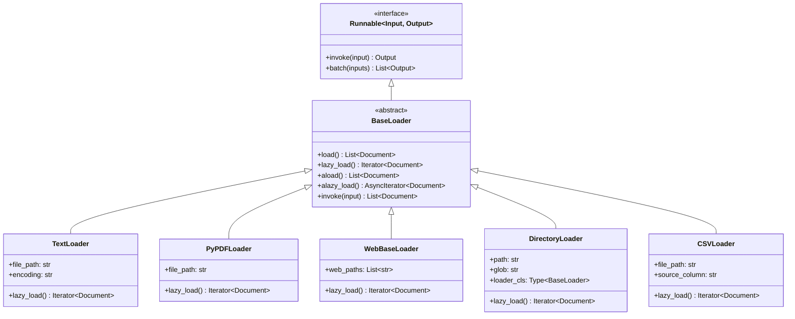
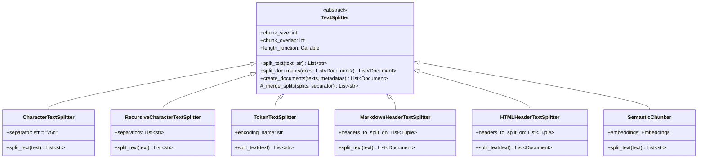
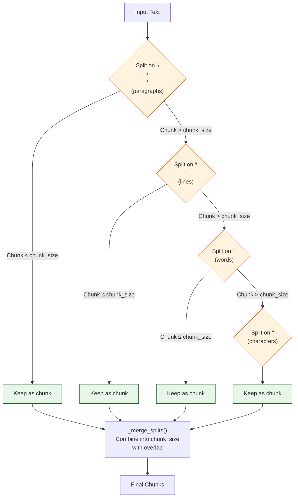
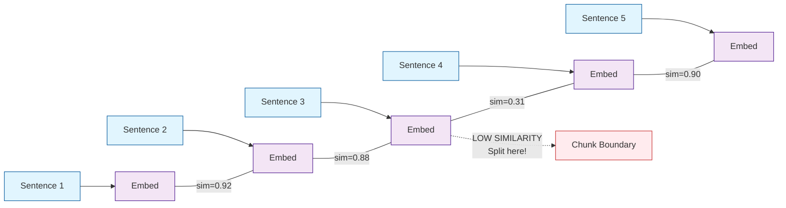
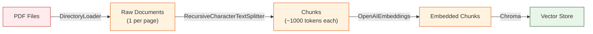

# Chapter 5: Document Loading & Splitting

Before any information can be retrieved or reasoned about, it must be loaded from its source and broken into manageable pieces. This chapter dissects the `BaseLoader` and `TextSplitter` hierarchies, examines how metadata flows through the pipeline, and explores the architectural decisions behind different chunking strategies.

## The Document Data Model

At the center of the loading and splitting pipeline is a remarkably simple data structure:

```python
from langchain_core.documents import Document

class Document(Serializable):
    """A unit of information with content and metadata."""

    page_content: str           # The actual text content
    metadata: dict = {}         # Arbitrary key-value metadata
    type: Literal["Document"] = "Document"
```

The `Document` class carries two things: the text itself and a metadata dictionary. The metadata is critical -- it flows through the entire pipeline (loading, splitting, embedding, retrieval) and provides provenance information that helps downstream components understand where each piece of text came from.

```python
doc = Document(
    page_content="LangChain is a framework for building LLM applications.",
    metadata={
        "source": "docs/intro.md",
        "page": 1,
        "author": "LangChain Team",
        "created_at": "2024-01-15"
    }
)
```

## BaseLoader Architecture

All document loaders inherit from `BaseLoader`, which is itself a `Runnable`:



### The Lazy Loading Pattern

`BaseLoader` uses a lazy loading pattern where `lazy_load()` is the primary method and `load()` is a convenience wrapper:

```python
class BaseLoader(Runnable[str, List[Document]]):

    def lazy_load(self) -> Iterator[Document]:
        """Subclasses MUST implement this. Yields documents one at a time."""
        raise NotImplementedError

    def load(self) -> List[Document]:
        """Convenience method: materializes all documents into a list."""
        return list(self.lazy_load())

    async def alazy_load(self) -> AsyncIterator[Document]:
        """Default async implementation: runs lazy_load in executor."""
        for doc in await asyncio.get_event_loop().run_in_executor(
            None, self.lazy_load
        ):
            yield doc

    async def aload(self) -> List[Document]:
        """Async convenience method."""
        return [doc async for doc in self.alazy_load()]

    def invoke(self, input: str, config=None) -> List[Document]:
        """Runnable interface: ignores input, calls load()."""
        return self.load()
```

The lazy loading approach is essential for large document collections. A `DirectoryLoader` processing thousands of files does not need to hold them all in memory simultaneously:

```python
from langchain_community.document_loaders import DirectoryLoader, TextLoader

loader = DirectoryLoader(
    path="./docs/",
    glob="**/*.md",
    loader_cls=TextLoader,
    show_progress=True
)

# Lazy iteration -- processes one file at a time
for doc in loader.lazy_load():
    process_document(doc)  # Each doc is processed and can be GC'd

# Eager loading -- loads ALL docs into memory
all_docs = loader.load()  # Use only when you need random access
```

### Loader Implementation Pattern

Here is what a typical loader implementation looks like:

```python
class TextLoader(BaseLoader):
    """Load a text file."""

    file_path: str
    encoding: str = "utf-8"
    autodetect_encoding: bool = False

    def lazy_load(self) -> Iterator[Document]:
        text = ""
        try:
            with open(self.file_path, encoding=self.encoding) as f:
                text = f.read()
        except UnicodeDecodeError:
            if self.autodetect_encoding:
                detected = detect_encoding(self.file_path)
                with open(self.file_path, encoding=detected) as f:
                    text = f.read()
            else:
                raise

        # Metadata tracks provenance
        metadata = {"source": self.file_path}
        yield Document(page_content=text, metadata=metadata)
```

Notice that the loader attaches a `source` metadata key. This is a convention followed by most loaders and is used downstream for deduplication and citation.

### Metadata Enrichment

Different loaders attach different metadata:

| Loader | Metadata Keys |
|--------|--------------|
| `TextLoader` | `source` |
| `PyPDFLoader` | `source`, `page` |
| `WebBaseLoader` | `source` (URL), `title`, `description` |
| `CSVLoader` | `source`, `row`, column values |
| `GitLoader` | `source`, `file_path`, `file_name`, `file_type` |
| `NotionDBLoader` | `source`, all Notion properties |

## TextSplitter Architecture

Once documents are loaded, they usually need to be split into smaller chunks for embedding and retrieval. The `TextSplitter` hierarchy handles this:



### The Core Algorithm

The base `TextSplitter` class implements a two-phase algorithm:

1. **Split**: Break the text into small pieces using a separator.
2. **Merge**: Recombine pieces until they reach `chunk_size`, with `chunk_overlap` characters of overlap between consecutive chunks.

```python
class TextSplitter(ABC):
    chunk_size: int = 4000
    chunk_overlap: int = 200
    length_function: Callable[[str], int] = len
    strip_whitespace: bool = True

    @abstractmethod
    def split_text(self, text: str) -> List[str]:
        """Split a single text string into chunks."""

    def split_documents(self, documents: List[Document]) -> List[Document]:
        """Split documents, preserving and enriching metadata."""
        texts, metadatas = [], []
        for doc in documents:
            texts.append(doc.page_content)
            metadatas.append(doc.metadata)
        return self.create_documents(texts, metadatas)

    def create_documents(self, texts, metadatas=None) -> List[Document]:
        """Create Document objects from texts with metadata."""
        documents = []
        for i, text in enumerate(texts):
            metadata = (metadatas[i] if metadatas else {}).copy()
            for chunk in self.split_text(text):
                documents.append(
                    Document(page_content=chunk, metadata=metadata)
                )
        return documents

    def _merge_splits(self, splits: List[str], separator: str) -> List[str]:
        """Merge small splits into chunks of chunk_size with overlap."""
        docs = []
        current_doc: List[str] = []
        total = 0

        for split in splits:
            split_len = self.length_function(split)

            # If adding this split would exceed chunk_size, finalize current doc
            if total + split_len > self.chunk_size and current_doc:
                doc = separator.join(current_doc)
                docs.append(doc)

                # Keep overlap: remove splits from the front until under overlap
                while total > self.chunk_overlap and len(current_doc) > 1:
                    removed = current_doc.pop(0)
                    total -= self.length_function(removed)

            current_doc.append(split)
            total += split_len

        # Don't forget the last chunk
        if current_doc:
            docs.append(separator.join(current_doc))

        return docs
```

### RecursiveCharacterTextSplitter: The Default Choice

`RecursiveCharacterTextSplitter` is the most commonly used splitter. It tries a hierarchy of separators, from most preferred to least:

```python
class RecursiveCharacterTextSplitter(TextSplitter):
    separators: List[str] = ["\n\n", "\n", " ", ""]

    def split_text(self, text: str) -> List[str]:
        final_chunks: List[str] = []
        separator = self.separators[-1]  # Last resort separator

        # Find the most preferred separator that exists in the text
        for sep in self.separators:
            if sep == "":
                separator = sep
                break
            if sep in text:
                separator = sep
                break

        # Split on the chosen separator
        splits = text.split(separator) if separator else list(text)

        good_splits: List[str] = []
        for split in splits:
            if self.length_function(split) < self.chunk_size:
                good_splits.append(split)
            else:
                # This split is too big -- merge what we have and recurse
                if good_splits:
                    merged = self._merge_splits(good_splits, separator)
                    final_chunks.extend(merged)
                    good_splits = []

                # Recursively split with the NEXT separator
                sub_splits = self._split_text_with_next_separator(split)
                final_chunks.extend(sub_splits)

        if good_splits:
            final_chunks.extend(self._merge_splits(good_splits, separator))

        return final_chunks
```

The recursive approach ensures that chunks respect natural text boundaries (paragraphs > lines > words > characters):



### Language-Aware Splitters

`RecursiveCharacterTextSplitter` provides factory methods for programming languages:

```python
# Python-aware splitting
python_splitter = RecursiveCharacterTextSplitter.from_language(
    language=Language.PYTHON,
    chunk_size=2000,
    chunk_overlap=200,
)

# Uses Python-specific separators:
# ["\nclass ", "\ndef ", "\n\tdef ", "\n\n", "\n", " ", ""]
```

| Language | Separators (in order) |
|----------|----------------------|
| Python | `\nclass `, `\ndef `, `\n\tdef `, `\n\n`, `\n`, ` `, `` |
| JavaScript | `\nfunction `, `\nconst `, `\nlet `, `\nclass `, `\n\n`, `\n`, ` `, `` |
| Markdown | `\n#{1,6} `, `\n````, `\n\n`, `\n`, ` `, `` |
| HTML | `<div`, `<p`, `<br`, `<li`, `<h1`...`<h6`, `<span`, `<table`, `<tr` |

### TokenTextSplitter

For applications that need precise token-level control (e.g., staying within model context windows), `TokenTextSplitter` counts tokens instead of characters:

```python
from langchain_text_splitters import TokenTextSplitter

splitter = TokenTextSplitter(
    encoding_name="cl100k_base",  # GPT-4 tokenizer
    chunk_size=1000,              # 1000 tokens per chunk
    chunk_overlap=100,            # 100 tokens overlap
)

chunks = splitter.split_text(long_document)
```

### Semantic Chunking

The `SemanticChunker` uses embeddings to find natural breakpoints in text:

```python
from langchain_experimental.text_splitter import SemanticChunker
from langchain_openai import OpenAIEmbeddings

chunker = SemanticChunker(
    embeddings=OpenAIEmbeddings(),
    breakpoint_threshold_type="percentile",
    breakpoint_threshold_amount=95,
)

# Chunks are split where semantic similarity drops
chunks = chunker.split_text(document_text)
```

The algorithm:
1. Split text into sentences.
2. Compute embeddings for each sentence.
3. Calculate cosine similarity between adjacent sentences.
4. Split at points where similarity drops below the threshold.



## Metadata Propagation

When documents are split, metadata from the parent document is copied to every child chunk. The splitter can also add chunk-specific metadata:

```python
from langchain_text_splitters import RecursiveCharacterTextSplitter

splitter = RecursiveCharacterTextSplitter(
    chunk_size=500,
    chunk_overlap=50,
    add_start_index=True  # Adds start character index to metadata
)

doc = Document(
    page_content="Long document text...",
    metadata={"source": "report.pdf", "page": 3}
)

chunks = splitter.split_documents([doc])
for chunk in chunks:
    print(chunk.metadata)
    # {"source": "report.pdf", "page": 3, "start_index": 0}
    # {"source": "report.pdf", "page": 3, "start_index": 450}
    # {"source": "report.pdf", "page": 3, "start_index": 900}
```

## Putting It All Together: The Loading Pipeline

A typical document processing pipeline chains loaders and splitters together:

```python
from langchain_community.document_loaders import DirectoryLoader, PyPDFLoader
from langchain_text_splitters import RecursiveCharacterTextSplitter
from langchain_openai import OpenAIEmbeddings
from langchain_chroma import Chroma

# Step 1: Load
loader = DirectoryLoader(
    "./documents/",
    glob="**/*.pdf",
    loader_cls=PyPDFLoader,
    show_progress=True
)

# Step 2: Split
splitter = RecursiveCharacterTextSplitter(
    chunk_size=1000,
    chunk_overlap=200,
    add_start_index=True
)

# Step 3: Process
docs = loader.lazy_load()
chunks = splitter.split_documents(list(docs))

# Step 4: Embed and store (covered in Chapter 6)
vectorstore = Chroma.from_documents(
    documents=chunks,
    embedding=OpenAIEmbeddings()
)
```



## Chunking Strategy Comparison

| Strategy | Best For | Pros | Cons |
|----------|----------|------|------|
| Fixed character | Simple text | Fast, predictable size | May split mid-sentence |
| Recursive character | General purpose | Respects text structure | Slight overhead |
| Token-based | LLM context management | Precise token counts | Requires tokenizer |
| Markdown headers | Structured docs | Preserves document hierarchy | Only works with Markdown |
| Semantic | Research, high-quality RAG | Semantically coherent chunks | Requires embedding calls |
| Code-aware | Source code | Respects function boundaries | Language-specific |

## Summary

| Concept | Key Takeaway |
|---------|-------------|
| `Document` | Simple `page_content` + `metadata` data class |
| `BaseLoader` | Lazy-loading pattern with `lazy_load()` as the primary method |
| `TextSplitter` | Two-phase split-then-merge algorithm with configurable overlap |
| `RecursiveCharacterTextSplitter` | Tries separators from most to least preferred recursively |
| Metadata propagation | Parent metadata is copied to every child chunk |
| Semantic chunking | Uses embeddings to find natural breakpoints |

## Key Takeaways

1. **Documents are the universal data carrier.** The `Document(page_content, metadata)` data class flows through every stage of the pipeline.
2. **Lazy loading is the default.** `lazy_load()` is the method that subclasses implement; `load()` is a convenience wrapper that materializes everything into memory.
3. **Splitting is recursive.** `RecursiveCharacterTextSplitter` tries the most natural separator first and falls back to finer-grained separators only when chunks are still too large.
4. **Metadata is preserved and enriched.** Every split inherits the parent document's metadata, and splitters can add chunk-specific keys like `start_index`.
5. **Chunking strategy matters.** The choice of splitter directly impacts retrieval quality. Semantic chunking produces the most coherent chunks but requires embedding calls.

## Next Steps

Now that we understand how documents are loaded and split, let's explore how they are stored and retrieved. Continue to [Chapter 6: Vector Store Abstraction](06-vector-store-abstraction.md).

---
*Built with insights from the [LangChain](https://github.com/langchain-ai/langchain) project.*
