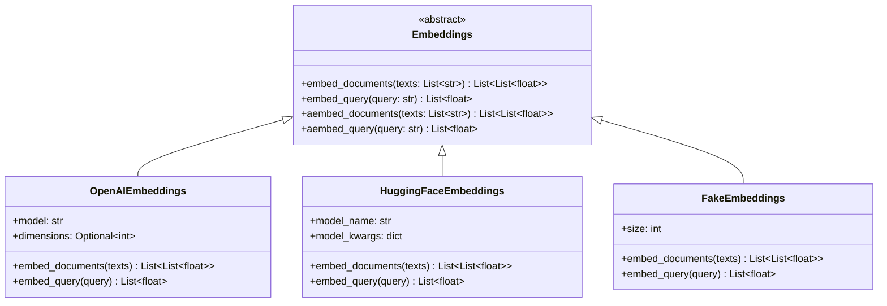
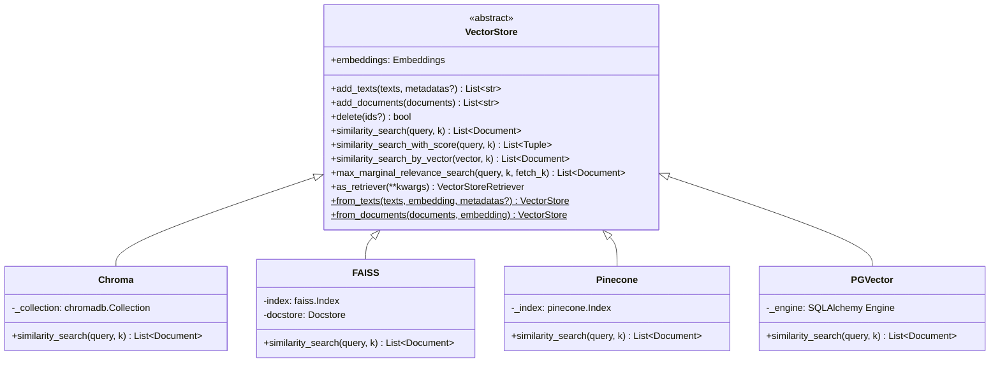
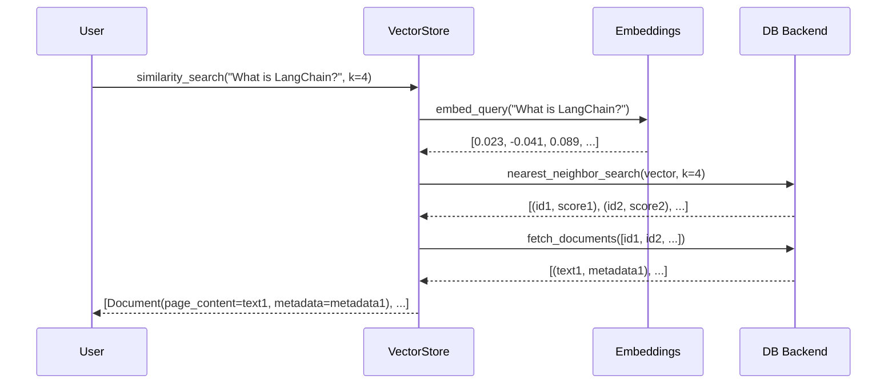
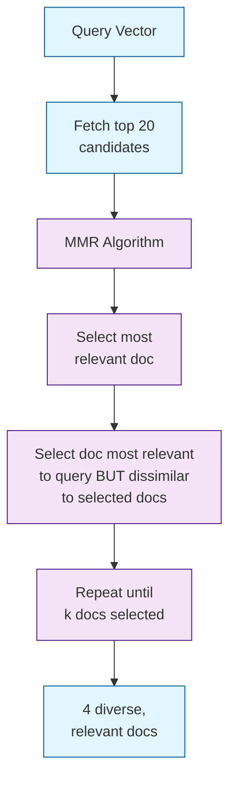
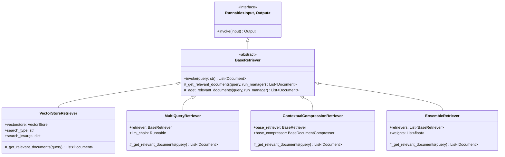
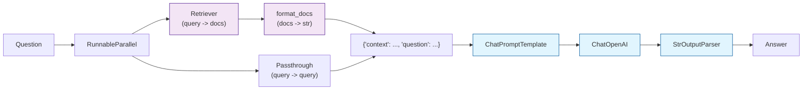

# Chapter 6: Vector Store Abstraction

Welcome to **Chapter 6: Vector Store Abstraction**. In this part of **LangChain Architecture: Internal Design Deep Dive**, you will build an intuitive mental model first, then move into concrete implementation details and practical production tradeoffs.


Vector stores are where semantic search happens. This chapter examines the `VectorStore` interface, how embedding models are abstracted, the `Retriever` pattern that connects vector stores to LCEL chains, and how LangChain achieves backend portability across dozens of vector databases.

## The Embedding Model Contract

Before we can store vectors, we need to produce them. LangChain defines the `Embeddings` abstract base class:



The key design decision here is the separation of `embed_documents` and `embed_query`. While many embedding models treat them identically, some models (e.g., certain asymmetric models) use different encoding strategies for documents vs queries:

```python
from langchain_core.embeddings import Embeddings

class Embeddings(ABC):
    """Abstract base class for embedding models."""

    @abstractmethod
    def embed_documents(self, texts: List[str]) -> List[List[float]]:
        """Embed a list of documents. Optimized for batch processing."""

    @abstractmethod
    def embed_query(self, text: str) -> List[float]:
        """Embed a single query. May use different encoding than documents."""

    async def aembed_documents(self, texts: List[str]) -> List[List[float]]:
        """Default: runs embed_documents in executor."""
        return await asyncio.get_event_loop().run_in_executor(
            None, self.embed_documents, texts
        )

    async def aembed_query(self, text: str) -> List[float]:
        """Default: runs embed_query in executor."""
        return await asyncio.get_event_loop().run_in_executor(
            None, self.embed_query, text
        )
```

### Embedding Model Usage

```python
from langchain_openai import OpenAIEmbeddings

embeddings = OpenAIEmbeddings(model="text-embedding-3-small")

# Embed multiple documents (batched for efficiency)
doc_vectors = embeddings.embed_documents([
    "LangChain is a framework for building LLM apps.",
    "Vector stores enable semantic search.",
    "Embeddings convert text to numbers."
])

# Embed a query (may use different encoding)
query_vector = embeddings.embed_query("What is LangChain?")

print(f"Document vector dimensions: {len(doc_vectors[0])}")  # 1536
print(f"Query vector dimensions: {len(query_vector)}")        # 1536
```

## The VectorStore Interface

`VectorStore` is the abstract base class for all vector databases. It defines a comprehensive interface for storing, searching, and deleting vectors:



### Core Methods

The interface is divided into write and read operations:

```python
class VectorStore(ABC):
    """Abstract interface for vector stores."""

    @abstractmethod
    def add_texts(
        self,
        texts: Iterable[str],
        metadatas: Optional[List[dict]] = None,
        **kwargs
    ) -> List[str]:
        """Add texts to the store. Returns list of IDs."""

    def add_documents(self, documents: List[Document], **kwargs) -> List[str]:
        """Convenience: extracts texts and metadatas from Documents."""
        texts = [doc.page_content for doc in documents]
        metadatas = [doc.metadata for doc in documents]
        return self.add_texts(texts, metadatas, **kwargs)

    @abstractmethod
    def similarity_search(
        self,
        query: str,
        k: int = 4,
        **kwargs
    ) -> List[Document]:
        """Return k most similar documents to query."""

    def similarity_search_with_score(
        self,
        query: str,
        k: int = 4,
        **kwargs
    ) -> List[Tuple[Document, float]]:
        """Return documents with similarity scores."""
        raise NotImplementedError

    def similarity_search_by_vector(
        self,
        embedding: List[float],
        k: int = 4,
        **kwargs
    ) -> List[Document]:
        """Search by pre-computed vector (skips embed_query)."""
        raise NotImplementedError
```

### The Internal Search Flow

When you call `similarity_search(query)`, here is what happens inside a typical implementation:



```python
# Typical implementation pattern (e.g., Chroma)
class Chroma(VectorStore):

    def similarity_search(self, query: str, k: int = 4, **kwargs) -> List[Document]:
        # Step 1: Embed the query
        query_embedding = self._embedding_function.embed_query(query)

        # Step 2: Query the backend
        results = self._collection.query(
            query_embeddings=[query_embedding],
            n_results=k,
            **kwargs
        )

        # Step 3: Convert to Documents
        documents = []
        for i in range(len(results["ids"][0])):
            doc = Document(
                page_content=results["documents"][0][i],
                metadata=results["metadatas"][0][i]
            )
            documents.append(doc)

        return documents
```

### Maximum Marginal Relevance (MMR)

MMR is a search strategy that balances relevance with diversity. Instead of returning the k most similar documents (which may be very similar to each other), MMR iteratively selects documents that are relevant to the query but dissimilar to already-selected documents:

```python
def max_marginal_relevance_search(
    self,
    query: str,
    k: int = 4,
    fetch_k: int = 20,        # Fetch more candidates than needed
    lambda_mult: float = 0.5,  # Balance: 1.0 = pure relevance, 0.0 = pure diversity
    **kwargs
) -> List[Document]:
    """MMR search for diverse results."""

    # Step 1: Get query embedding
    query_embedding = self.embeddings.embed_query(query)

    # Step 2: Fetch more candidates than we need
    candidates = self.similarity_search_by_vector(
        query_embedding, k=fetch_k
    )

    # Step 3: Apply MMR algorithm
    selected = maximal_marginal_relevance(
        query_embedding=query_embedding,
        embedding_list=[embed(c) for c in candidates],
        lambda_mult=lambda_mult,
        k=k
    )

    return [candidates[i] for i in selected]
```



## Factory Methods: from_texts and from_documents

VectorStore provides convenient class methods for creating and populating a store in one step:

```python
from langchain_chroma import Chroma
from langchain_openai import OpenAIEmbeddings

# From raw texts
vectorstore = Chroma.from_texts(
    texts=["Text 1", "Text 2", "Text 3"],
    embedding=OpenAIEmbeddings(),
    metadatas=[{"source": "a"}, {"source": "b"}, {"source": "c"}],
    collection_name="my_collection",
    persist_directory="./chroma_db"
)

# From Document objects (more common in practice)
vectorstore = Chroma.from_documents(
    documents=chunks,    # Output from TextSplitter
    embedding=OpenAIEmbeddings(),
    collection_name="my_collection"
)
```

## The Retriever Pattern

Retrievers are the bridge between vector stores and LCEL chains. The `BaseRetriever` abstract class implements the `Runnable` interface:



### BaseRetriever Internals

`BaseRetriever` follows the same Template Method pattern as `BaseChatModel`:

```python
class BaseRetriever(RunnableSerializable[str, List[Document]]):
    """Abstract base class for retrievers."""

    def invoke(self, input: str, config=None) -> List[Document]:
        """Public API: handles callbacks, delegates to _get_relevant_documents."""
        config = ensure_config(config)
        callback_manager = CallbackManager.configure(config.get("callbacks"))

        # Fire on_retriever_start
        run_manager = callback_manager.on_retriever_start(
            serialized=self.to_json(),
            query=input,
        )

        try:
            # Delegate to subclass
            docs = self._get_relevant_documents(input, run_manager=run_manager)
            # Fire on_retriever_end
            run_manager.on_retriever_end(docs)
            return docs
        except Exception as e:
            run_manager.on_retriever_error(e)
            raise

    @abstractmethod
    def _get_relevant_documents(
        self, query: str, *, run_manager=None
    ) -> List[Document]:
        """Subclasses implement this."""
```

### VectorStoreRetriever

The most common retriever wraps a VectorStore:

```python
class VectorStoreRetriever(BaseRetriever):
    vectorstore: VectorStore
    search_type: str = "similarity"        # "similarity", "mmr", or "similarity_score_threshold"
    search_kwargs: dict = {"k": 4}

    def _get_relevant_documents(self, query: str, **kwargs) -> List[Document]:
        if self.search_type == "similarity":
            return self.vectorstore.similarity_search(query, **self.search_kwargs)
        elif self.search_type == "mmr":
            return self.vectorstore.max_marginal_relevance_search(
                query, **self.search_kwargs
            )
        elif self.search_type == "similarity_score_threshold":
            docs_and_scores = self.vectorstore.similarity_search_with_score(
                query, **self.search_kwargs
            )
            threshold = self.search_kwargs.get("score_threshold", 0.0)
            return [doc for doc, score in docs_and_scores if score >= threshold]
```

You create one from a VectorStore using `.as_retriever()`:

```python
vectorstore = Chroma.from_documents(documents, embeddings)

# Default: similarity search, k=4
retriever = vectorstore.as_retriever()

# MMR with custom k
retriever = vectorstore.as_retriever(
    search_type="mmr",
    search_kwargs={"k": 6, "fetch_k": 20, "lambda_mult": 0.7}
)

# Score threshold
retriever = vectorstore.as_retriever(
    search_type="similarity_score_threshold",
    search_kwargs={"score_threshold": 0.8}
)
```

### Retriever in LCEL Chains

Because `BaseRetriever` is a `Runnable`, it plugs directly into LCEL:

```python
from langchain_core.prompts import ChatPromptTemplate
from langchain_core.output_parsers import StrOutputParser
from langchain_core.runnables import RunnablePassthrough

# Classic RAG chain
template = """Answer the question based on the context:

Context: {context}
Question: {question}

Answer:"""

prompt = ChatPromptTemplate.from_template(template)

# retriever is a Runnable[str, List[Document]]
rag_chain = (
    {
        "context": retriever | format_docs,    # Retrieve and format
        "question": RunnablePassthrough()       # Pass through the query
    }
    | prompt
    | ChatOpenAI(model="gpt-4o")
    | StrOutputParser()
)

answer = rag_chain.invoke("What is LangChain?")
```



### Advanced Retriever Patterns

**MultiQueryRetriever** generates multiple query variations to improve recall:

```python
from langchain.retrievers import MultiQueryRetriever

retriever = MultiQueryRetriever.from_llm(
    retriever=vectorstore.as_retriever(),
    llm=ChatOpenAI(model="gpt-4o-mini"),
)

# Internally:
# 1. LLM generates 3 variations of the query
# 2. Each variation is sent to the base retriever
# 3. Results are deduplicated and returned
```

**EnsembleRetriever** combines results from multiple retrievers with weighted scoring:

```python
from langchain.retrievers import EnsembleRetriever

# Combine semantic search with keyword search
ensemble = EnsembleRetriever(
    retrievers=[vector_retriever, bm25_retriever],
    weights=[0.7, 0.3]  # 70% semantic, 30% keyword
)
```

## Vector Store Backend Comparison

| Backend | Type | Persistence | Scalability | Best For |
|---------|------|-------------|-------------|----------|
| Chroma | In-process / Client-server | Local directory | Moderate | Development, small-medium datasets |
| FAISS | In-process | Serialized file | High (with GPU) | High-performance local search |
| Pinecone | Managed cloud | Fully managed | Very high | Production at scale |
| pgvector | PostgreSQL extension | Database | High | When you already use Postgres |
| Weaviate | Self-hosted / Cloud | Configurable | High | Hybrid search (vector + keyword) |
| Qdrant | Self-hosted / Cloud | Configurable | High | Filtering + payload search |

## Summary

| Concept | Key Takeaway |
|---------|-------------|
| `Embeddings` | Abstract base with separate `embed_documents` and `embed_query` methods |
| `VectorStore` | Interface for add, search, and delete with multiple search strategies |
| MMR | Balances relevance with diversity using iterative selection |
| `BaseRetriever` | Runnable interface that connects vector stores to LCEL chains |
| `VectorStoreRetriever` | Configurable wrapper with similarity, MMR, and threshold modes |
| Factory methods | `from_texts` and `from_documents` for one-step store creation |

## Key Takeaways

1. **`Embeddings` separates document and query encoding.** This enables asymmetric embedding models where documents and queries are encoded differently.
2. **`VectorStore` is a CRUD interface for vectors.** It abstracts the database backend, making it trivial to swap Chroma for Pinecone or FAISS.
3. **Retrievers are Runnables.** `BaseRetriever` implements the `Runnable` interface, so it plugs directly into LCEL chains with the pipe operator.
4. **MMR prevents redundant retrieval.** By balancing relevance and diversity, MMR produces more informative context for the LLM.
5. **Advanced patterns compose basic retrievers.** `MultiQueryRetriever`, `EnsembleRetriever`, and `ContextualCompressionRetriever` all wrap `BaseRetriever` implementations.

## Next Steps

With data loading, splitting, embedding, and retrieval covered, we are ready to explore how agents use these components to take actions. Continue to [Chapter 7: Agent Architecture](07-agent-architecture.md).

---
*Built with insights from the [LangChain](https://github.com/langchain-ai/langchain) project.*

## What Problem Does This Solve?

Most teams struggle here because the hard part is not writing more code, but deciding clear boundaries for `List`, `query`, `self` so behavior stays predictable as complexity grows.

In practical terms, this chapter helps you avoid three common failures:

- coupling core logic too tightly to one implementation path
- missing the handoff boundaries between setup, execution, and validation
- shipping changes without clear rollback or observability strategy

After working through this chapter, you should be able to reason about `Chapter 6: Vector Store Abstraction` as an operating subsystem inside **LangChain Architecture: Internal Design Deep Dive**, with explicit contracts for inputs, state transitions, and outputs.

Use the implementation notes around `Document`, `VectorStore`, `float` as your checklist when adapting these patterns to your own repository.

## How it Works Under the Hood

Under the hood, `Chapter 6: Vector Store Abstraction` usually follows a repeatable control path:

1. **Context bootstrap**: initialize runtime config and prerequisites for `List`.
2. **Input normalization**: shape incoming data so `query` receives stable contracts.
3. **Core execution**: run the main logic branch and propagate intermediate state through `self`.
4. **Policy and safety checks**: enforce limits, auth scopes, and failure boundaries.
5. **Output composition**: return canonical result payloads for downstream consumers.
6. **Operational telemetry**: emit logs/metrics needed for debugging and performance tuning.

When debugging, walk this sequence in order and confirm each stage has explicit success/failure conditions.

## Source Walkthrough

Use the following upstream sources to verify implementation details while reading this chapter:

- [View Repo](https://github.com/langchain-ai/langchain)
  Why it matters: authoritative reference on `View Repo` (github.com).

Suggested trace strategy:
- search upstream code for `List` and `query` to map concrete implementation paths
- compare docs claims against actual runtime/config code before reusing patterns in production

## Chapter Connections

- [Tutorial Index](index.md)
- [Previous Chapter: Chapter 5: Document Loading & Splitting](05-document-loading-splitting.md)
- [Next Chapter: Chapter 7: Agent Architecture](07-agent-architecture.md)
- [Main Catalog](../../README.md#-tutorial-catalog)
- [A-Z Tutorial Directory](../../discoverability/tutorial-directory.md)
