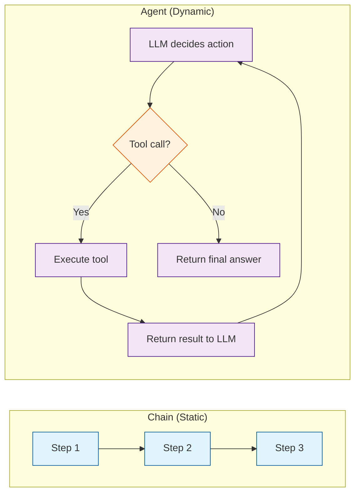
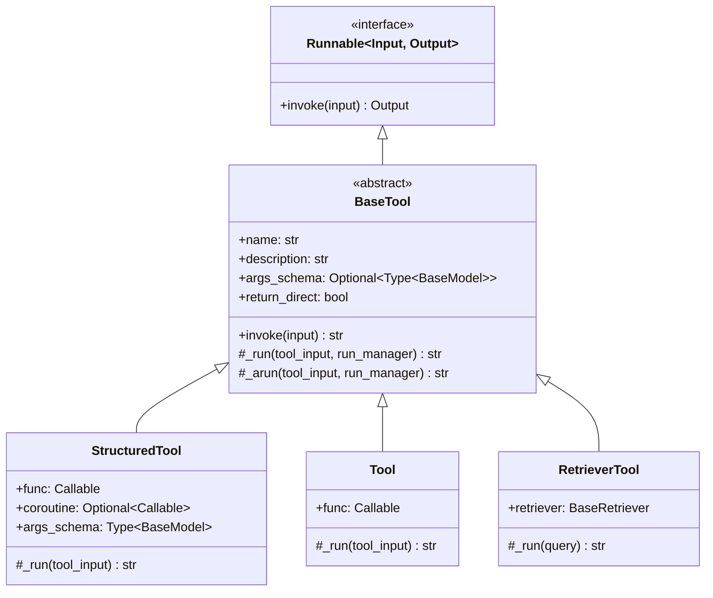
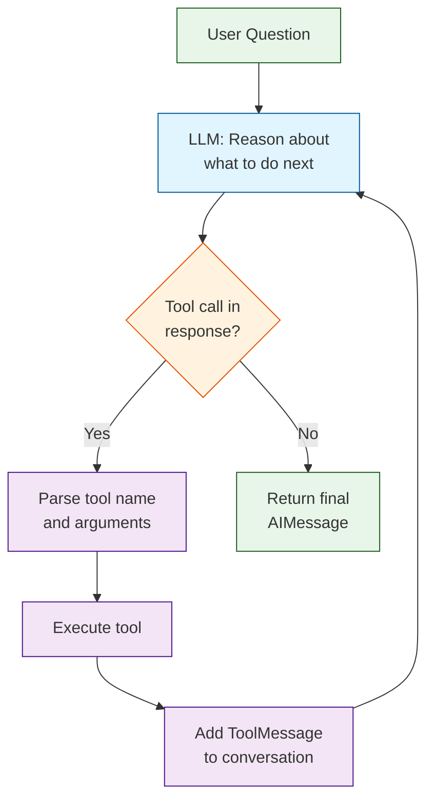
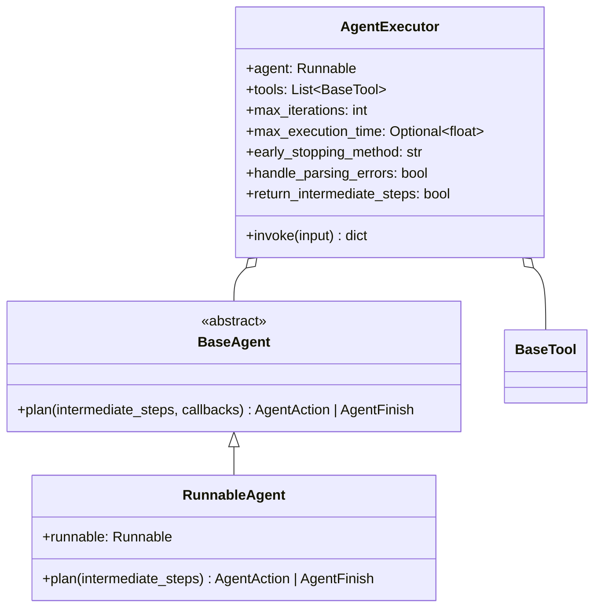
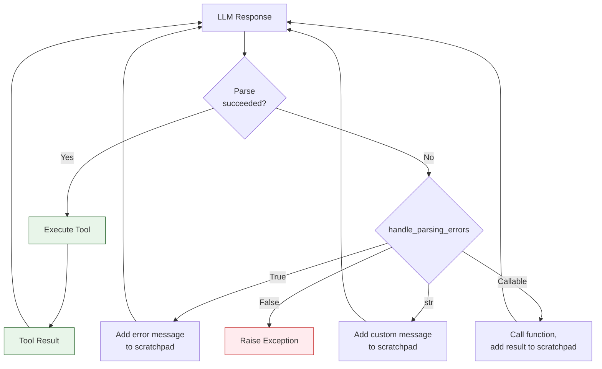
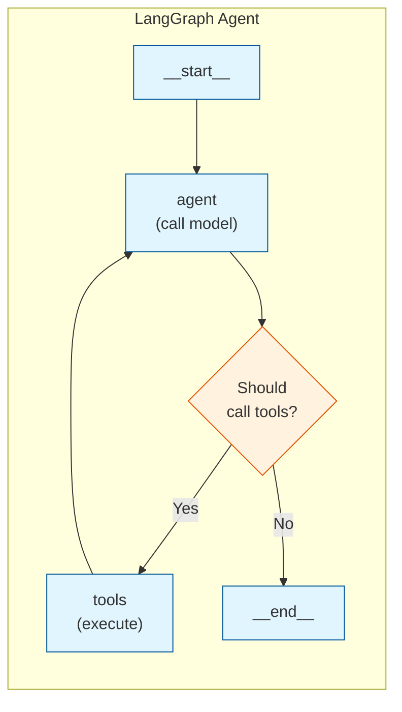

# Chapter 7: Agent Architecture

Welcome to **Chapter 7: Agent Architecture**. In this part of **LangChain Architecture: Internal Design Deep Dive**, you will build an intuitive mental model first, then move into concrete implementation details and practical production tradeoffs.


Agents are LangChain components that use LLMs to decide which actions to take. Unlike chains, where the sequence of operations is hardcoded, agents dynamically choose tools and control flow at runtime. This chapter dissects the `AgentExecutor`, the tool binding protocol, the ReAct loop, structured outputs, and the evolution toward LangGraph-based agents.

## Agent vs Chain: The Core Distinction



In a chain, you (the developer) decide the control flow at build time. In an agent, the LLM decides the control flow at runtime. The agent observes the current state, picks a tool (or decides to stop), observes the result, and repeats.

## The Tool Abstraction

Tools are the actions that agents can take. LangChain provides the `@tool` decorator and `BaseTool` class:



### Defining Tools

There are several ways to define tools:

```python
from langchain_core.tools import tool, BaseTool, StructuredTool
from pydantic import BaseModel, Field

# Method 1: @tool decorator (most common)
@tool
def get_weather(city: str) -> str:
    """Get the current weather for a city."""
    # The docstring becomes the tool description
    # The function signature becomes the args schema
    return f"72F and sunny in {city}"

# Method 2: StructuredTool with explicit schema
class WeatherInput(BaseModel):
    city: str = Field(description="The city to get weather for")
    unit: str = Field(default="fahrenheit", description="Temperature unit")

weather_tool = StructuredTool.from_function(
    func=get_weather_detailed,
    name="get_weather",
    description="Get weather information",
    args_schema=WeatherInput,
)

# Method 3: BaseTool subclass (maximum control)
class CustomTool(BaseTool):
    name = "custom_tool"
    description = "A custom tool with full control"
    args_schema: Type[BaseModel] = CustomInput

    def _run(self, query: str, run_manager=None) -> str:
        return f"Result for: {query}"

    async def _arun(self, query: str, run_manager=None) -> str:
        return await async_process(query)
```

### Tool Schema Generation

When tools are bound to a model, LangChain converts them to JSON Schema. This is the bridge between Python functions and the model's tool calling API:

```python
@tool
def search_database(query: str, max_results: int = 10) -> str:
    """Search the internal database for information."""
    return "results..."

# Inspect the generated schema
print(search_database.args_schema.schema())
# {
#   "title": "search_databaseSchema",
#   "type": "object",
#   "properties": {
#     "query": {"title": "Query", "type": "string"},
#     "max_results": {"title": "Max Results", "default": 10, "type": "integer"}
#   },
#   "required": ["query"]
# }

# Convert to OpenAI tool format
from langchain_core.utils.function_calling import convert_to_openai_tool
openai_schema = convert_to_openai_tool(search_database)
# {
#   "type": "function",
#   "function": {
#     "name": "search_database",
#     "description": "Search the internal database for information.",
#     "parameters": { ... json schema ... }
#   }
# }
```

## The ReAct Loop

ReAct (Reasoning + Acting) is the most common agent pattern. The agent alternates between thinking about what to do and executing actions:



### Message Flow in a ReAct Loop

Here is the complete message sequence for a typical agent interaction:

```python
# Turn 1: User asks a question
messages = [
    SystemMessage(content="You are a helpful assistant with access to tools."),
    HumanMessage(content="What's the weather in SF and NYC?"),
]

# Turn 2: Model decides to call a tool
ai_response = AIMessage(
    content="",
    tool_calls=[
        ToolCall(name="get_weather", args={"city": "San Francisco"}, id="call_1"),
        ToolCall(name="get_weather", args={"city": "New York"}, id="call_2"),
    ]
)
messages.append(ai_response)

# Turn 3: Tool results are added
messages.append(ToolMessage(content="72F and sunny", tool_call_id="call_1"))
messages.append(ToolMessage(content="65F and cloudy", tool_call_id="call_2"))

# Turn 4: Model generates final answer
final_response = AIMessage(
    content="San Francisco is 72F and sunny. New York is 65F and cloudy."
)
messages.append(final_response)
```

## AgentExecutor: The Legacy Orchestrator

`AgentExecutor` is the original agent runtime in LangChain. It wraps an agent (the LLM + prompt + output parser) and manages the ReAct loop:



### AgentExecutor Internal Loop

```python
class AgentExecutor(Chain):

    def _call(self, inputs: Dict, run_manager=None) -> Dict:
        intermediate_steps: List[Tuple[AgentAction, str]] = []
        iterations = 0

        while self._should_continue(iterations):
            # Step 1: Ask the agent what to do
            output = self.agent.plan(
                intermediate_steps=intermediate_steps,
                callbacks=run_manager,
                **inputs
            )

            # Step 2: Check if we're done
            if isinstance(output, AgentFinish):
                return self._return(output, intermediate_steps, run_manager)

            # Step 3: Execute the tool
            actions = output if isinstance(output, list) else [output]
            for action in actions:
                tool = self._get_tool(action.tool)
                observation = tool.run(
                    action.tool_input,
                    callbacks=run_manager,
                )
                intermediate_steps.append((action, observation))

            iterations += 1

        # Max iterations reached
        output = AgentFinish(
            return_values={"output": "Agent stopped due to max iterations."},
            log=""
        )
        return self._return(output, intermediate_steps, run_manager)

    def _should_continue(self, iterations: int) -> bool:
        if self.max_iterations is not None and iterations >= self.max_iterations:
            return False
        if self.max_execution_time is not None:
            elapsed = time.time() - self._start_time
            if elapsed >= self.max_execution_time:
                return False
        return True
```

### Creating an Agent with LCEL

The modern way to create an agent uses `create_tool_calling_agent`, which builds an LCEL pipeline:

```python
from langchain.agents import create_tool_calling_agent, AgentExecutor
from langchain_core.prompts import ChatPromptTemplate, MessagesPlaceholder
from langchain_openai import ChatOpenAI

# Define tools
tools = [get_weather, search_database]

# Define prompt with required placeholders
prompt = ChatPromptTemplate.from_messages([
    ("system", "You are a helpful assistant."),
    MessagesPlaceholder("chat_history", optional=True),
    ("human", "{input}"),
    MessagesPlaceholder("agent_scratchpad"),  # Required: where tool results go
])

# Create the agent (LCEL Runnable)
model = ChatOpenAI(model="gpt-4o")
agent = create_tool_calling_agent(model, tools, prompt)

# Wrap in AgentExecutor for the ReAct loop
agent_executor = AgentExecutor(
    agent=agent,
    tools=tools,
    verbose=True,
    max_iterations=10,
    handle_parsing_errors=True,
)

result = agent_executor.invoke({
    "input": "What's the weather in SF?",
    "chat_history": []
})
```

### The agent_scratchpad

The `agent_scratchpad` is a critical component. It is a `MessagesPlaceholder` that contains the intermediate tool calls and results. Before each LLM call, the agent formats the scratchpad:

```python
def create_tool_calling_agent(llm, tools, prompt):
    """Creates an LCEL agent Runnable."""

    # Bind tools to the model
    llm_with_tools = llm.bind_tools(tools)

    # Build the agent pipeline
    agent = (
        RunnablePassthrough.assign(
            agent_scratchpad=lambda x: format_to_tool_messages(
                x["intermediate_steps"]
            )
        )
        | prompt
        | llm_with_tools
        | ToolsAgentOutputParser()
    )

    return agent

def format_to_tool_messages(intermediate_steps):
    """Convert (AgentAction, observation) tuples to messages."""
    messages = []
    for action, observation in intermediate_steps:
        # The AIMessage with the tool call
        messages.append(AIMessage(
            content="",
            tool_calls=[ToolCall(
                name=action.tool,
                args=action.tool_input,
                id=action.tool_call_id
            )]
        ))
        # The ToolMessage with the result
        messages.append(ToolMessage(
            content=str(observation),
            tool_call_id=action.tool_call_id
        ))
    return messages
```

## Structured Outputs in Agents

Agents can be configured to return structured data using Pydantic models:

```python
from pydantic import BaseModel, Field

class WeatherReport(BaseModel):
    city: str = Field(description="City name")
    temperature: float = Field(description="Temperature")
    conditions: str = Field(description="Weather conditions")
    recommendation: str = Field(description="Activity recommendation")

# Use with_structured_output on the final response
model = ChatOpenAI(model="gpt-4o")
structured_model = model.with_structured_output(WeatherReport)

# In an agent, you'd use this as the final step after tool calls
```

## Tool Error Handling

`AgentExecutor` provides multiple strategies for handling tool errors:

```python
agent_executor = AgentExecutor(
    agent=agent,
    tools=tools,

    # Strategy 1: Return error message to LLM so it can retry
    handle_parsing_errors=True,

    # Strategy 2: Custom error handler
    handle_parsing_errors="I could not parse that. Please try again.",

    # Strategy 3: Callable error handler
    handle_parsing_errors=lambda e: f"Error: {str(e)}. Try a different approach.",
)
```



## Evolution: From AgentExecutor to LangGraph

`AgentExecutor` is being superseded by LangGraph for complex agent workflows. Here is why:

| Feature | AgentExecutor | LangGraph |
|---------|--------------|-----------|
| Control flow | Simple loop | Arbitrary graph |
| State management | Implicit (intermediate_steps) | Explicit state object |
| Human-in-the-loop | Limited | First-class support |
| Multi-agent | Not supported | Native support |
| Persistence | None | Checkpointing built-in |
| Streaming | Basic | Event-level streaming |
| Error recovery | Restart from beginning | Resume from checkpoint |

### LangGraph Agent Example

```python
from langgraph.prebuilt import create_react_agent
from langchain_openai import ChatOpenAI

# LangGraph's create_react_agent replaces AgentExecutor
model = ChatOpenAI(model="gpt-4o")
tools = [get_weather, search_database]

# Creates a LangGraph with the ReAct pattern
graph = create_react_agent(model, tools)

# Invoke like any Runnable
result = graph.invoke({
    "messages": [HumanMessage(content="What's the weather in SF?")]
})
```



### LangGraph State Architecture

Unlike `AgentExecutor`, LangGraph agents have explicit state:

```python
from typing import Annotated, TypedDict
from langgraph.graph import StateGraph
from langgraph.graph.message import add_messages

class AgentState(TypedDict):
    """Explicit state definition for the agent."""
    messages: Annotated[list, add_messages]  # Message history
    # You can add any custom state fields:
    # iteration_count: int
    # retrieved_documents: List[Document]
    # user_approval: Optional[bool]

def call_model(state: AgentState):
    """Node that calls the LLM."""
    messages = state["messages"]
    response = model.invoke(messages)
    return {"messages": [response]}

def call_tools(state: AgentState):
    """Node that executes tools."""
    last_message = state["messages"][-1]
    results = []
    for tool_call in last_message.tool_calls:
        tool = tool_map[tool_call["name"]]
        result = tool.invoke(tool_call["args"])
        results.append(ToolMessage(
            content=str(result),
            tool_call_id=tool_call["id"]
        ))
    return {"messages": results}

# Build the graph
workflow = StateGraph(AgentState)
workflow.add_node("agent", call_model)
workflow.add_node("tools", call_tools)
workflow.add_edge("__start__", "agent")
workflow.add_conditional_edges("agent", should_continue)
workflow.add_edge("tools", "agent")

graph = workflow.compile()
```

## Parallel Tool Execution

Modern chat models support parallel tool calls. When the model returns multiple tool calls in a single response, the agent can execute them concurrently:

```python
# Model returns multiple tool calls
ai_message = AIMessage(
    content="",
    tool_calls=[
        ToolCall(name="get_weather", args={"city": "SF"}, id="call_1"),
        ToolCall(name="get_weather", args={"city": "NYC"}, id="call_2"),
        ToolCall(name="search_database", args={"query": "flights"}, id="call_3"),
    ]
)

# AgentExecutor runs these sequentially
# LangGraph can run them in parallel using asyncio.gather
```

## Summary

| Concept | Key Takeaway |
|---------|-------------|
| Tools | Python functions converted to JSON schemas for model consumption |
| ReAct loop | Think -> Act -> Observe cycle managed by AgentExecutor |
| `agent_scratchpad` | MessagesPlaceholder that accumulates tool calls and results |
| `AgentExecutor` | Legacy orchestrator with simple loop and error handling |
| LangGraph agents | Next-generation agents with explicit state, graphs, and persistence |
| Structured output | Pydantic models constrain agent responses to specific schemas |

## Key Takeaways

1. **Agents are dynamic, chains are static.** The LLM decides the control flow at runtime, choosing which tools to call and when to stop.
2. **Tools are Runnables with JSON Schema.** The `@tool` decorator converts Python functions into objects that LLMs can understand and invoke.
3. **The ReAct loop is a message accumulation pattern.** Each iteration adds tool calls and results to the conversation history, giving the LLM full context for its next decision.
4. **`AgentExecutor` is being superseded by LangGraph.** For new projects, LangGraph provides more control, explicit state management, and support for complex multi-step workflows.
5. **Error handling is critical.** `handle_parsing_errors` prevents the agent from crashing when the LLM produces malformed tool calls.

## Next Steps

With the agent architecture understood, let's explore how to run these systems in production with observability, caching, and deployment. Continue to [Chapter 8: Production Patterns](08-production-patterns.md).

---
*Built with insights from the [LangChain](https://github.com/langchain-ai/langchain) project.*

## What Problem Does This Solve?

Most teams struggle here because the hard part is not writing more code, but deciding clear boundaries for `tool`, `agent`, `tools` so behavior stays predictable as complexity grows.

In practical terms, this chapter helps you avoid three common failures:

- coupling core logic too tightly to one implementation path
- missing the handoff boundaries between setup, execution, and validation
- shipping changes without clear rollback or observability strategy

After working through this chapter, you should be able to reason about `Chapter 7: Agent Architecture` as an operating subsystem inside **LangChain Architecture: Internal Design Deep Dive**, with explicit contracts for inputs, state transitions, and outputs.

Use the implementation notes around `messages`, `self`, `name` as your checklist when adapting these patterns to your own repository.

## How it Works Under the Hood

Under the hood, `Chapter 7: Agent Architecture` usually follows a repeatable control path:

1. **Context bootstrap**: initialize runtime config and prerequisites for `tool`.
2. **Input normalization**: shape incoming data so `agent` receives stable contracts.
3. **Core execution**: run the main logic branch and propagate intermediate state through `tools`.
4. **Policy and safety checks**: enforce limits, auth scopes, and failure boundaries.
5. **Output composition**: return canonical result payloads for downstream consumers.
6. **Operational telemetry**: emit logs/metrics needed for debugging and performance tuning.

When debugging, walk this sequence in order and confirm each stage has explicit success/failure conditions.

## Source Walkthrough

Use the following upstream sources to verify implementation details while reading this chapter:

- [View Repo](https://github.com/langchain-ai/langchain)
  Why it matters: authoritative reference on `View Repo` (github.com).

Suggested trace strategy:
- search upstream code for `tool` and `agent` to map concrete implementation paths
- compare docs claims against actual runtime/config code before reusing patterns in production

## Chapter Connections

- [Tutorial Index](index.md)
- [Previous Chapter: Chapter 6: Vector Store Abstraction](06-vector-store-abstraction.md)
- [Next Chapter: Chapter 8: Production Patterns](08-production-patterns.md)
- [Main Catalog](../../README.md#-tutorial-catalog)
- [A-Z Tutorial Directory](../../discoverability/tutorial-directory.md)
