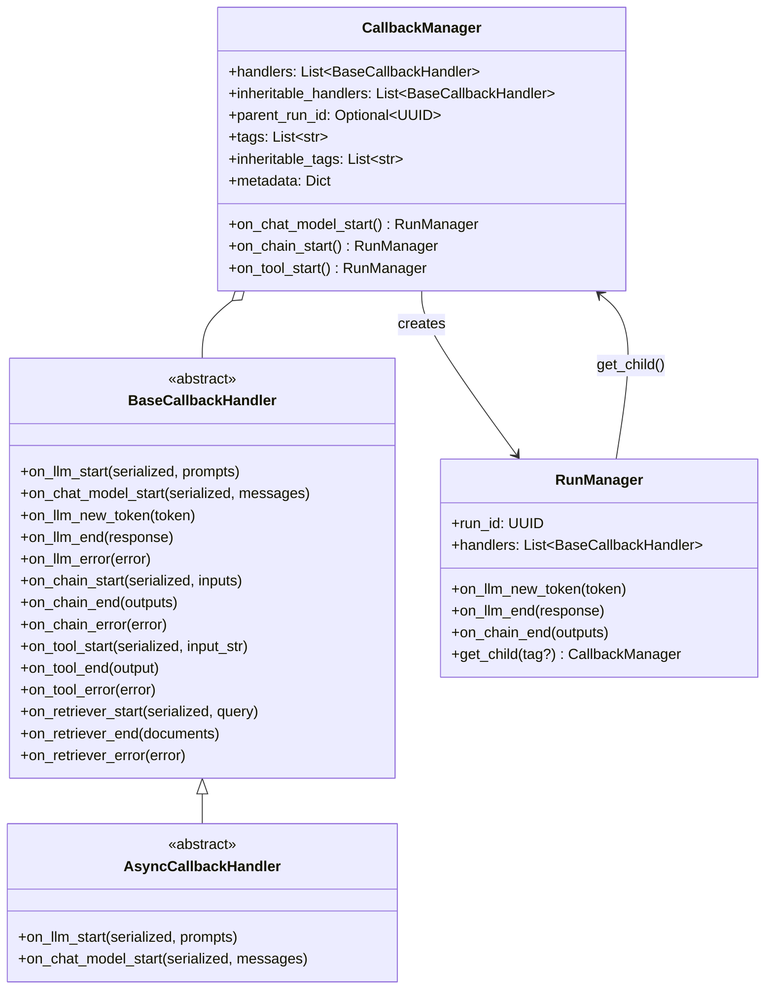
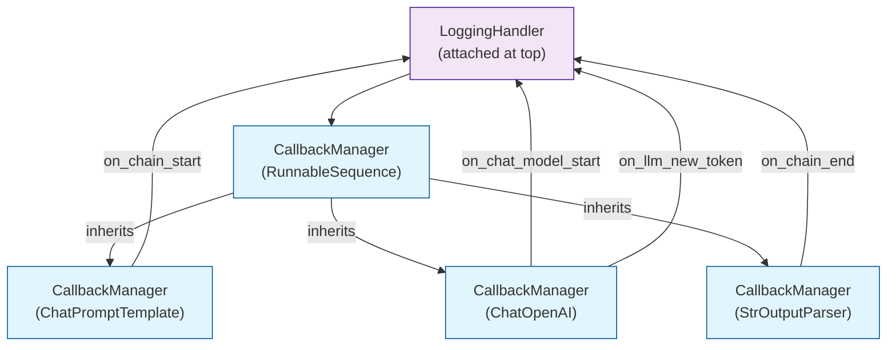
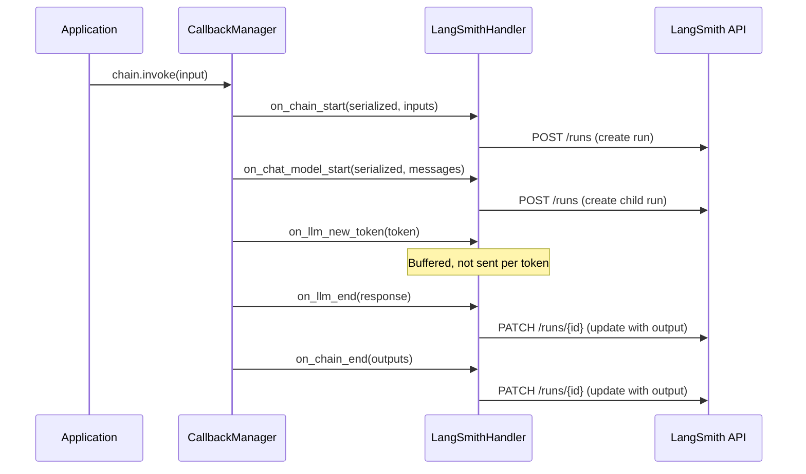
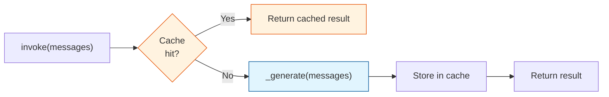
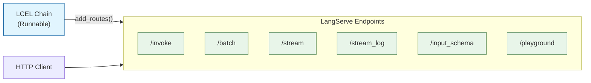
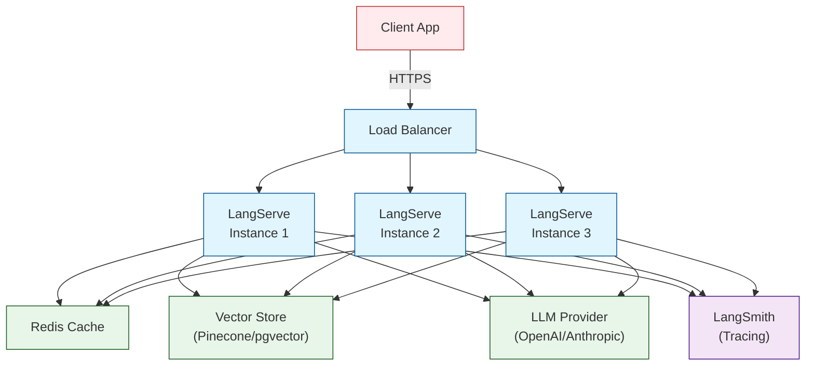

# Chapter 8: Production Patterns

Moving LangChain applications from prototypes to production requires understanding the framework's built-in support for observability, tracing, caching, error handling, and deployment. This chapter explores the callback system in depth, LangSmith integration, caching layers, and deployment strategies.

## The Callback System: Deep Dive

We introduced callbacks in [Chapter 3](03-chat-model-architecture.md). Here we examine the full architecture -- how handlers are registered, how events propagate through nested components, and how the system supports both synchronous and asynchronous execution.

### CallbackManager Architecture



### Handler Inheritance

The key architectural pattern is **handler inheritance**. When a chain calls a sub-component, the sub-component's `CallbackManager` inherits handlers from the parent. This is how a single handler attached at the top level receives events from every nested component:

```python
from langchain_core.callbacks import BaseCallbackHandler

class LoggingHandler(BaseCallbackHandler):
    def on_chain_start(self, serialized, inputs, **kwargs):
        print(f"Chain started: {serialized.get('name', 'unknown')}")

    def on_chat_model_start(self, serialized, messages, **kwargs):
        print(f"Model started: {serialized.get('name', 'unknown')}")

    def on_llm_new_token(self, token, **kwargs):
        print(f"Token: {token}", end="")

    def on_chain_end(self, outputs, **kwargs):
        print(f"Chain ended")

# Attach at the top level -- propagates to ALL nested components
chain = prompt | model | parser
result = chain.invoke(
    {"topic": "Python"},
    config={"callbacks": [LoggingHandler()]}
)
```



### Run Tree and Parent-Child Relationships

Every callback event includes a `run_id` and `parent_run_id`, forming a tree structure that represents the execution hierarchy:

```python
class RunManager:
    run_id: UUID
    parent_run_id: Optional[UUID]

    def get_child(self, tag: Optional[str] = None) -> CallbackManager:
        """Create a child CallbackManager for nested components."""
        return CallbackManager(
            handlers=self.handlers,            # Inherits handlers
            inheritable_handlers=self.inheritable_handlers,
            parent_run_id=self.run_id,          # Links to parent
            tags=self.tags + ([tag] if tag else []),
        )
```

This tree structure is what LangSmith visualizes as a trace:

```
RunnableSequence (run_id=aaa)
├── ChatPromptTemplate (run_id=bbb, parent=aaa)
├── ChatOpenAI (run_id=ccc, parent=aaa)
│   ├── on_chat_model_start
│   ├── on_llm_new_token (x N)
│   └── on_llm_end
└── StrOutputParser (run_id=ddd, parent=aaa)
```

## LangSmith Integration

LangSmith is the observability platform for LangChain. It works by providing a callback handler that sends events to the LangSmith API:

```python
# Enable LangSmith tracing (via environment variables)
import os
os.environ["LANGCHAIN_TRACING_V2"] = "true"
os.environ["LANGCHAIN_API_KEY"] = "ls_..."
os.environ["LANGCHAIN_PROJECT"] = "my-project"

# That's it -- all chain/model/tool calls are now traced automatically
chain = prompt | model | parser
result = chain.invoke({"topic": "Python"})
# A trace appears in the LangSmith dashboard
```

### How LangSmith Tracing Works



The LangSmith handler is registered automatically when `LANGCHAIN_TRACING_V2` is set. It is added as an **inheritable handler** to the root `CallbackManager`, so it propagates to every nested component.

### Programmatic Tracing Control

```python
from langsmith import traceable

# Trace any Python function (not just LangChain components)
@traceable(name="my_custom_function")
def process_data(data):
    result = chain.invoke(data)
    return post_process(result)

# Create named runs for organization
from langchain_core.tracers import LangChainTracer

tracer = LangChainTracer(project_name="experiment-v2")
result = chain.invoke(
    {"topic": "Python"},
    config={"callbacks": [tracer]}
)
```

### LangSmith Evaluation

LangSmith also supports evaluation, which uses the tracing infrastructure to compare outputs against expected results:

```python
from langsmith import Client
from langsmith.evaluation import evaluate

client = Client()

# Create a dataset
dataset = client.create_dataset("qa-pairs")
client.create_examples(
    inputs=[{"question": "What is LangChain?"}],
    outputs=[{"answer": "A framework for building LLM applications."}],
    dataset_id=dataset.id,
)

# Evaluate a chain against the dataset
results = evaluate(
    lambda inputs: chain.invoke(inputs),
    data="qa-pairs",
    evaluators=["qa"],  # Built-in QA evaluator
)
```

## Caching Architecture

LangChain provides a caching layer that prevents redundant API calls. The cache sits between the `BaseChatModel.invoke()` method and the `_generate()` call to the provider:



### Cache Implementations

```python
from langchain_core.globals import set_llm_cache
from langchain_community.cache import (
    InMemoryCache,
    SQLiteCache,
    RedisCache,
    GPTCache,
)

# In-memory cache (for development)
set_llm_cache(InMemoryCache())

# SQLite cache (persistent, single-node)
set_llm_cache(SQLiteCache(database_path=".langchain.db"))

# Redis cache (distributed, multi-node)
set_llm_cache(RedisCache(redis_url="redis://localhost:6379"))
```

### How Caching Works Internally

The cache key is generated from the serialized model configuration and the input messages:

```python
class BaseChatModel:

    def invoke(self, input, config=None, **kwargs):
        messages = self._convert_input(input)

        # Check cache before calling the API
        if self.cache is not None or get_llm_cache() is not None:
            cache = self.cache or get_llm_cache()

            # Generate cache key from model params + messages
            llm_string = self._get_llm_string()  # Model name, temp, etc.
            prompt = dumps(messages)              # Serialized messages

            cache_result = cache.lookup(prompt, llm_string)
            if cache_result is not None:
                return cache_result

        # Cache miss -- call the API
        result = self._generate(messages, **kwargs)

        # Store in cache
        if cache is not None:
            cache.update(prompt, llm_string, result)

        return result
```

### Semantic Caching

For more intelligent caching, `SemanticCache` uses embeddings to find similar (not just identical) queries:

```python
from langchain_community.cache import RedisSemanticCache
from langchain_openai import OpenAIEmbeddings

set_llm_cache(RedisSemanticCache(
    redis_url="redis://localhost:6379",
    embedding=OpenAIEmbeddings(),
    score_threshold=0.95  # Similarity threshold for cache hit
))

# First call -- cache miss, calls API
result1 = model.invoke("What is Python?")

# Second call -- cache hit! "Tell me about Python" is semantically similar
result2 = model.invoke("Tell me about Python")
```

## Rate Limiting and Concurrency

LangChain provides built-in rate limiting through `RunnableConfig`:

```python
# Limit concurrent API calls
results = chain.batch(
    [{"topic": t} for t in topics],
    config={"max_concurrency": 5}   # At most 5 concurrent calls
)

# Per-model rate limiting
from langchain_core.rate_limiters import InMemoryRateLimiter

rate_limiter = InMemoryRateLimiter(
    requests_per_second=10,
    check_every_n_seconds=0.1,
    max_bucket_size=20,
)

model = ChatOpenAI(
    model="gpt-4o",
    rate_limiter=rate_limiter
)
```

## Error Handling Patterns

### Retry with Exponential Backoff

```python
from langchain_openai import ChatOpenAI

# Built-in retry via with_retry
model = ChatOpenAI(model="gpt-4o").with_retry(
    stop_after_attempt=3,
    wait_exponential_jitter=True,
)

# Or use tenacity directly for more control
from tenacity import retry, stop_after_attempt, wait_exponential

@retry(
    stop=stop_after_attempt(3),
    wait=wait_exponential(multiplier=1, min=1, max=60),
)
def call_with_retry(query):
    return chain.invoke({"query": query})
```

### Fallback Chains

```python
# Multi-level fallback with different models and prompts
primary = prompt_v2 | ChatOpenAI(model="gpt-4o") | parser
secondary = prompt_v1 | ChatOpenAI(model="gpt-4o-mini") | parser
emergency = simple_prompt | ChatAnthropic(model="claude-sonnet-4-20250514") | parser

resilient_chain = primary.with_fallbacks(
    [secondary, emergency],
    exceptions_to_handle=(RateLimitError, APIError, TimeoutError)
)
```

### Timeout Configuration

```python
import httpx

# Model-level timeout
model = ChatOpenAI(
    model="gpt-4o",
    timeout=30,        # 30 seconds
    max_retries=2,
)

# Chain-level timeout via RunnableConfig
result = chain.invoke(
    {"topic": "Python"},
    config={"timeout": 60}  # 60 seconds for the entire chain
)
```

## Deployment with LangServe

LangServe deploys any `Runnable` as a REST API with automatic documentation:

```python
# server.py
from fastapi import FastAPI
from langserve import add_routes
from langchain_openai import ChatOpenAI
from langchain_core.prompts import ChatPromptTemplate
from langchain_core.output_parsers import StrOutputParser

app = FastAPI(title="My LangChain API")

chain = (
    ChatPromptTemplate.from_template("Tell me about {topic}")
    | ChatOpenAI(model="gpt-4o")
    | StrOutputParser()
)

# This single line creates multiple endpoints:
add_routes(app, chain, path="/chat")

# Endpoints created:
# POST /chat/invoke          -- synchronous invocation
# POST /chat/batch           -- batch invocation
# POST /chat/stream          -- streaming response
# POST /chat/stream_log      -- streaming with intermediate state
# GET  /chat/input_schema    -- Pydantic input schema
# GET  /chat/output_schema   -- Pydantic output schema
# GET  /chat/playground      -- Interactive web playground
```



### LangServe Client

```python
from langserve import RemoteRunnable

# Client-side: connect to a deployed chain
chain = RemoteRunnable("http://localhost:8000/chat")

# Works exactly like a local Runnable
result = chain.invoke({"topic": "Python"})

# Streaming works too
for chunk in chain.stream({"topic": "Python"}):
    print(chunk, end="")

# Batch processing
results = chain.batch([{"topic": t} for t in ["Python", "Rust"]])
```

## Observability Checklist

| Category | Pattern | Implementation |
|----------|---------|---------------|
| **Tracing** | Full execution traces | LangSmith (`LANGCHAIN_TRACING_V2=true`) |
| **Logging** | Structured log output | Custom `BaseCallbackHandler` |
| **Metrics** | Token counts, latency | `UsageMetadata` in `AIMessage` |
| **Cost tracking** | Dollar cost per call | Custom handler parsing `usage_metadata` |
| **Error alerting** | Exception notifications | `on_llm_error` / `on_chain_error` callbacks |
| **Performance** | Latency per step | `astream_events` with timing |

### Building a Complete Observability Handler

```python
from langchain_core.callbacks import BaseCallbackHandler
from datetime import datetime
import json

class ProductionHandler(BaseCallbackHandler):
    """Production-grade callback handler for observability."""

    def __init__(self, logger):
        self.logger = logger
        self._start_times = {}

    def on_chain_start(self, serialized, inputs, *, run_id, **kwargs):
        self._start_times[run_id] = datetime.now()
        self.logger.info(json.dumps({
            "event": "chain_start",
            "run_id": str(run_id),
            "chain": serialized.get("name", "unknown"),
            "timestamp": datetime.now().isoformat()
        }))

    def on_chain_end(self, outputs, *, run_id, **kwargs):
        duration = (datetime.now() - self._start_times.pop(run_id, datetime.now()))
        self.logger.info(json.dumps({
            "event": "chain_end",
            "run_id": str(run_id),
            "duration_ms": duration.total_seconds() * 1000,
            "timestamp": datetime.now().isoformat()
        }))

    def on_llm_end(self, response, *, run_id, **kwargs):
        for gen in response.generations:
            for g in gen:
                if hasattr(g, "message") and g.message.usage_metadata:
                    usage = g.message.usage_metadata
                    self.logger.info(json.dumps({
                        "event": "llm_usage",
                        "run_id": str(run_id),
                        "input_tokens": usage.get("input_tokens", 0),
                        "output_tokens": usage.get("output_tokens", 0),
                        "total_tokens": usage.get("total_tokens", 0),
                    }))

    def on_llm_error(self, error, *, run_id, **kwargs):
        self.logger.error(json.dumps({
            "event": "llm_error",
            "run_id": str(run_id),
            "error": str(error),
            "error_type": type(error).__name__,
            "timestamp": datetime.now().isoformat()
        }))
```

## Production Architecture Pattern



## Summary

| Concept | Key Takeaway |
|---------|-------------|
| Callback system | Handler inheritance propagates observability through all nested components |
| LangSmith | Automatic tracing via environment variable; uses the callback system |
| Caching | In-memory, SQLite, Redis, or semantic; sits between `invoke()` and `_generate()` |
| Rate limiting | `max_concurrency` in config plus `InMemoryRateLimiter` on models |
| Error handling | `with_retry()` for transient errors, `with_fallbacks()` for provider failover |
| LangServe | Deploys any `Runnable` as a REST API with streaming and playground |

## Key Takeaways

1. **The callback system is the observability backbone.** Handler inheritance ensures that a single handler attached at the top level receives events from every nested component, without any component needing to know about it.
2. **LangSmith tracing is zero-config.** Set two environment variables and every LangChain call is automatically traced with full input/output capture and timing.
3. **Caching prevents redundant API calls.** The cache layer supports exact-match and semantic-match strategies, and it works transparently with any chat model.
4. **Resilience requires layered strategies.** Combine `with_retry()` for transient errors, `with_fallbacks()` for provider failover, and timeouts for hung requests.
5. **LangServe turns any Runnable into an API.** A single `add_routes()` call creates invoke, batch, stream, and playground endpoints with automatic schema documentation.
6. **Production systems need observability by design.** Build custom callback handlers for logging, metrics, cost tracking, and alerting from the start -- they are easy to add and impossible to retrofit.

## Wrapping Up the Guide

This chapter concludes our deep dive into LangChain's internal architecture. Across eight chapters, we have examined:

- **The package hierarchy** and dependency philosophy (Chapter 1)
- **The Runnable protocol** that makes everything composable (Chapter 2)
- **Chat model internals** including streaming and callbacks (Chapter 3)
- **Chain composition** patterns from legacy to LCEL (Chapter 4)
- **Document loading and splitting** strategies (Chapter 5)
- **Vector store abstractions** and retriever patterns (Chapter 6)
- **Agent architecture** from AgentExecutor to LangGraph (Chapter 7)
- **Production patterns** for observability, caching, and deployment (Chapter 8)

The common thread through all of these is the `Runnable` interface. Every component -- from prompts to models to parsers to retrievers to agents -- implements the same protocol, which means they can all be composed, traced, cached, and deployed uniformly. Understanding this architecture gives you the power to extend LangChain for your specific needs, debug issues at any layer, and make informed decisions about when to use the framework's abstractions and when to build your own.

---
*Built with insights from the [LangChain](https://github.com/langchain-ai/langchain) project.*
