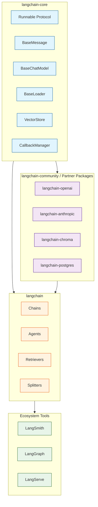

# LangChain Architecture: Internal Design Deep Dive

This guide explores LangChain[View Repo](https://github.com/langchain-ai/langchain) from the inside out. Rather than teaching you how to use LangChain (see the [LangChain Tutorial](../langchain-tutorial/) for that), this deep dive examines **how LangChain is built**, the design patterns it employs, and why its architects made specific decisions. If you have ever wondered what happens behind the scenes when you pipe a prompt through a chain, bind tools to an agent, or stream tokens from a chat model, this is the guide for you.

Think of this as the difference between learning to drive a car and studying how the engine works. Both forms of knowledge are valuable, but understanding the internals gives you the power to extend, debug, and optimize the framework at a level that surface-level usage never can.

## Who This Guide Is For

This guide is designed for developers who already have working experience with LangChain and want to go deeper. You should be comfortable with:

- Writing basic LangChain chains and prompts
- Python class inheritance and abstract base classes
- Asynchronous Python (`async` / `await`)
- General software architecture concepts (interfaces, composition, dependency injection)

## Tutorial Chapters

Each chapter dissects a major subsystem of the LangChain codebase:

1. **[Chapter 1: Getting Started -- Ecosystem Overview](01-getting-started.md)** - The package hierarchy, `langchain-core` vs `langchain` vs integration packages, and the dependency philosophy that drives it all.

2. **[Chapter 2: The Runnable Interface (LCEL)](02-runnable-interface.md)** - The foundational `Runnable` protocol, `RunnableSequence`, `RunnableParallel`, `RunnablePassthrough`, and how the pipe operator builds computation graphs.

3. **[Chapter 3: Chat Model Architecture](03-chat-model-architecture.md)** - `BaseChatModel` internals, the message type system, streaming architecture, and how callbacks weave through every invocation.

4. **[Chapter 4: Chain Composition](04-chain-composition.md)** - Legacy chains vs LCEL, internal routing with `RunnableBranch`, fallback mechanisms, retry logic, and how chains are compiled.

5. **[Chapter 5: Document Loading & Splitting](05-document-loading-splitting.md)** - `BaseLoader`, the `TextSplitter` hierarchy, chunking strategies, and how metadata flows through the pipeline.

6. **[Chapter 6: Vector Store Abstraction](06-vector-store-abstraction.md)** - The `VectorStore` interface, embedding model contracts, retriever patterns, and how similarity search is abstracted across backends.

7. **[Chapter 7: Agent Architecture](07-agent-architecture.md)** - `AgentExecutor`, tool binding, the ReAct loop, structured outputs, and the evolution toward LangGraph-based agents.

8. **[Chapter 8: Production Patterns](08-production-patterns.md)** - The callback system, tracing with LangSmith, caching layers, deployment strategies, and observability hooks.

## Architectural Principles

Before diving into individual subsystems, it helps to understand the guiding principles behind LangChain's design:

| Principle | Description |
|-----------|-------------|
| **Composability** | Every component implements the `Runnable` interface so that it can be piped, parallelized, and nested with any other component. |
| **Separation of Concerns** | Core abstractions live in `langchain-core`, concrete implementations in `langchain`, and vendor-specific logic in partner packages. |
| **Streaming First** | The architecture supports token-level streaming at every layer -- from the model provider all the way to the end user. |
| **Provider Agnosticism** | Abstract base classes define contracts; swapping OpenAI for Anthropic or Chroma for Pinecone requires zero changes to business logic. |
| **Observability by Default** | The callback system threads through every component, providing hooks for logging, tracing, cost tracking, and debugging. |

## How to Read This Guide

Each chapter is self-contained but builds on concepts from earlier chapters. The recommended path is to read them in order, but if you are looking for a specific topic, feel free to jump directly to the relevant chapter. Every chapter includes architecture diagrams, annotated source-level code examples, comparison tables, and a summary with key takeaways.

Let's begin with [Chapter 1: Getting Started -- Ecosystem Overview](01-getting-started.md).

---
*Built with insights from the [LangChain](https://github.com/langchain-ai/langchain) project.*
