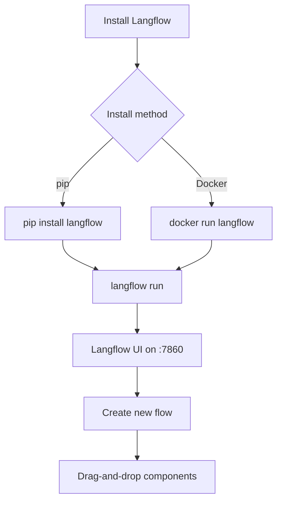

# Chapter 1: Getting Started

Welcome to **Chapter 1: Getting Started**. In this part of **Langflow Tutorial: Visual AI Agent and Workflow Platform**, you will build an intuitive mental model first, then move into concrete implementation details and practical production tradeoffs.


This chapter gets Langflow running locally so you can build and test flows immediately.

## Learning Goals

- install Langflow using the recommended package path
- run the local UI and create first flow
- validate basic node execution and output correctness
- understand key runtime prerequisites

## Quick Start

```bash
uv pip install langflow -U
uv run langflow run
```

Langflow starts at `http://127.0.0.1:7860` by default.

## First Validation Checklist

1. UI loads and you can create a new flow
2. at least one model node executes successfully
3. flow output is visible in playground
4. save/export path works

## Source References

- [Langflow Installation Docs](https://docs.langflow.org/get-started-installation)
- [Langflow README](https://github.com/langflow-ai/langflow)

## Summary

You now have a working Langflow environment ready for architecture and workflow design.

Next: [Chapter 2: Platform Architecture](02-platform-architecture.md)

## How These Components Connect


