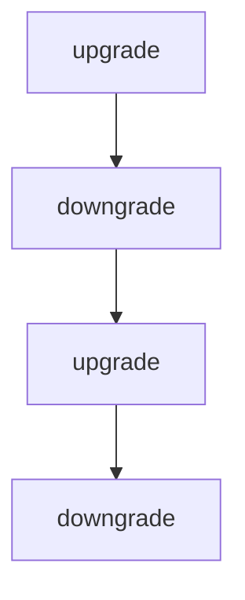

# Chapter 1: Getting Started

Welcome to **Chapter 1: Getting Started**. In this part of **Langflow Tutorial: Visual AI Agent and Workflow Platform**, you will build an intuitive mental model first, then move into concrete implementation details and practical production tradeoffs.


This chapter gets Langflow running locally so you can build and test flows immediately.

## Learning Goals

- install Langflow using the recommended package path
- run the local UI and create first flow
- validate basic node execution and output correctness
- understand key runtime prerequisites

## Quick Start

```bash
uv pip install langflow -U
uv run langflow run
```

Langflow starts at `http://127.0.0.1:7860` by default.

## First Validation Checklist

1. UI loads and you can create a new flow
2. at least one model node executes successfully
3. flow output is visible in playground
4. save/export path works

## Source References

- [Langflow Installation Docs](https://docs.langflow.org/get-started-installation)
- [Langflow README](https://github.com/langflow-ai/langflow)

## Summary

You now have a working Langflow environment ready for architecture and workflow design.

Next: [Chapter 2: Platform Architecture](02-platform-architecture.md)

## Depth Expansion Playbook

## Source Code Walkthrough

### `scripts/generate_migration.py`

The `upgrade` function in [`scripts/generate_migration.py`](https://github.com/langflow-ai/langflow/blob/HEAD/scripts/generate_migration.py) handles a key part of this chapter's functionality:

```py


def upgrade() -> None:
    """
    EXPAND PHASE: Add new schema elements (backward compatible)
    - All new columns must be nullable or have defaults
    - No breaking changes to existing schema
    - Services using old schema continue to work
    """
    bind = op.get_bind()
    inspector = inspect(bind)

    # Get existing columns for idempotency
        columns = [col['name'] for col in inspector.get_columns('{table_name}')]
    }

    # Add new nullable column (always check existence first)
    if '{column_name}' not in columns:
        op.add_column('{table_name}',
            sa.Column('{column_name}', sa.{column_type}(), nullable=True{default_value})
        )

        print(f"✅ Added column '{column_name}' to table '{table_name}'")

        # Optional: Add index for performance
        # op.create_index('ix_{table_name}_{column_name}', '{table_name}', ['{column_name}'])
    else:
        print(f"⏭️  Column '{column_name}' already exists in table '{table_name}'")

    # Verify the change
    result = bind.execute(text(
        "SELECT COUNT(*) as cnt FROM {table_name}"
```

This function is important because it defines how Langflow Tutorial: Visual AI Agent and Workflow Platform implements the patterns covered in this chapter.

### `scripts/generate_migration.py`

The `downgrade` function in [`scripts/generate_migration.py`](https://github.com/langflow-ai/langflow/blob/HEAD/scripts/generate_migration.py) handles a key part of this chapter's functionality:

```py


def downgrade() -> None:
    """
    Rollback EXPAND phase
    - Safe to rollback as it only removes additions
    - Check for data loss before dropping
    """
    bind = op.get_bind()
    inspector = inspect(bind)
    columns = [col['name'] for col in inspector.get_columns('{table_name}')]

    if '{column_name}' in columns:
        # Check if column has data
        result = bind.execute(text("""
            SELECT COUNT(*) as cnt FROM {table_name}
            WHERE {column_name} IS NOT NULL
        """)).first()

        if result and result.cnt > 0:
            print(f"⚠️  Warning: Dropping column '{column_name}' with {{result.cnt}} non-null values")

            # Optional: Create backup table
            backup_table = '_{table_name}_{column_name}_backup_' + datetime.now().strftime('%Y%m%d_%H%M%S')
            bind.execute(text(f"""
                CREATE TABLE {{backup_table}} AS
                SELECT id, {column_name}, NOW() as backed_up_at
                FROM {table_name}
                WHERE {column_name} IS NOT NULL
            """))
            print(f"💾 Created backup table: {{backup_table}}")

```

This function is important because it defines how Langflow Tutorial: Visual AI Agent and Workflow Platform implements the patterns covered in this chapter.

### `scripts/generate_migration.py`

The `upgrade` function in [`scripts/generate_migration.py`](https://github.com/langflow-ai/langflow/blob/HEAD/scripts/generate_migration.py) handles a key part of this chapter's functionality:

```py


def upgrade() -> None:
    """
    EXPAND PHASE: Add new schema elements (backward compatible)
    - All new columns must be nullable or have defaults
    - No breaking changes to existing schema
    - Services using old schema continue to work
    """
    bind = op.get_bind()
    inspector = inspect(bind)

    # Get existing columns for idempotency
        columns = [col['name'] for col in inspector.get_columns('{table_name}')]
    }

    # Add new nullable column (always check existence first)
    if '{column_name}' not in columns:
        op.add_column('{table_name}',
            sa.Column('{column_name}', sa.{column_type}(), nullable=True{default_value})
        )

        print(f"✅ Added column '{column_name}' to table '{table_name}'")

        # Optional: Add index for performance
        # op.create_index('ix_{table_name}_{column_name}', '{table_name}', ['{column_name}'])
    else:
        print(f"⏭️  Column '{column_name}' already exists in table '{table_name}'")

    # Verify the change
    result = bind.execute(text(
        "SELECT COUNT(*) as cnt FROM {table_name}"
```

This function is important because it defines how Langflow Tutorial: Visual AI Agent and Workflow Platform implements the patterns covered in this chapter.

### `scripts/generate_migration.py`

The `downgrade` function in [`scripts/generate_migration.py`](https://github.com/langflow-ai/langflow/blob/HEAD/scripts/generate_migration.py) handles a key part of this chapter's functionality:

```py


def downgrade() -> None:
    """
    Rollback EXPAND phase
    - Safe to rollback as it only removes additions
    - Check for data loss before dropping
    """
    bind = op.get_bind()
    inspector = inspect(bind)
    columns = [col['name'] for col in inspector.get_columns('{table_name}')]

    if '{column_name}' in columns:
        # Check if column has data
        result = bind.execute(text("""
            SELECT COUNT(*) as cnt FROM {table_name}
            WHERE {column_name} IS NOT NULL
        """)).first()

        if result and result.cnt > 0:
            print(f"⚠️  Warning: Dropping column '{column_name}' with {{result.cnt}} non-null values")

            # Optional: Create backup table
            backup_table = '_{table_name}_{column_name}_backup_' + datetime.now().strftime('%Y%m%d_%H%M%S')
            bind.execute(text(f"""
                CREATE TABLE {{backup_table}} AS
                SELECT id, {column_name}, NOW() as backed_up_at
                FROM {table_name}
                WHERE {column_name} IS NOT NULL
            """))
            print(f"💾 Created backup table: {{backup_table}}")

```

This function is important because it defines how Langflow Tutorial: Visual AI Agent and Workflow Platform implements the patterns covered in this chapter.


## How These Components Connect


