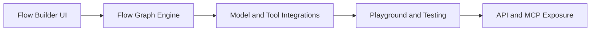

# Chapter 2: Platform Architecture

Langflow combines a visual editor, execution runtime, and deployment surfaces in one platform.

## Architecture View

## Core Layers

| Layer | Purpose |
|:------|:--------|
| visual authoring | rapid flow composition and iteration |
| flow runtime | executes node graph with state |
| integrations | models, vector stores, tool connectors |
| deployment surfaces | API endpoints and MCP server exposure |

## Source References

- [Langflow Docs](https://docs.langflow.org/)
- [Langflow Repository](https://github.com/langflow-ai/langflow)

## Summary

You now understand where to place design, logic, and deployment concerns in Langflow.

Next: [Chapter 3: Visual Flow Builder](03-visual-flow-builder.md)
